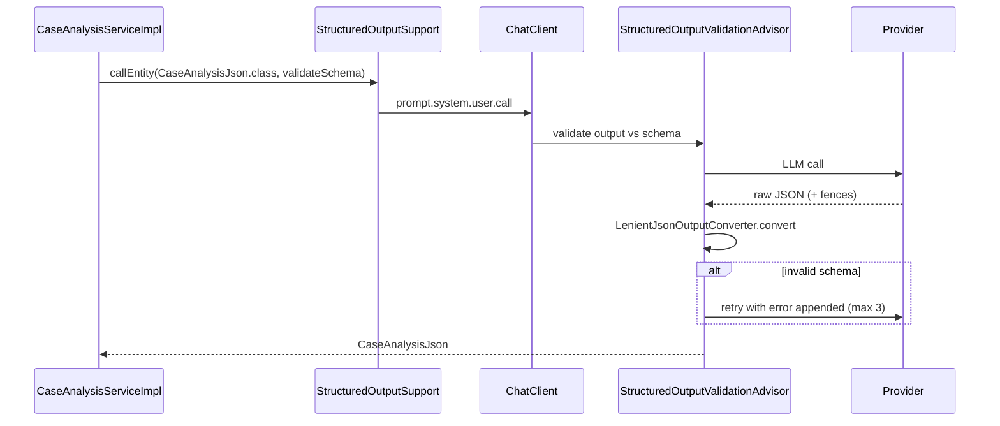

# M140 — Self-Correcting Structured Output (Spring AI 2.0 Phase 2)

- **Milestone:** M140
- **REQ:** REQ-133 (extends M136)
- **Status:** Planned (after M139)
- **Date:** 2026-07-05
- **Follows:** M136 (LenientJsonOutputConverter), M139 (schema-retry metrics)
- **Reference:** [Spring AI blog — Self-Correcting Structured Output (2026-06-23)](https://spring.io/blog/2026/06/23/spring-ai-self-correcting-structured-output)

## Problem Statement

M136 introduced `LenientJsonOutputConverter` and typed records (`CaseAnalysisJson`, `GoalClassificationJson`), but call sites still use the **manual path**:

```java
.call().content() → converter.convert(text)
```

This misses the Spring AI 2.0 self-correction loop. There is **zero** usage of:

- `.entity(Type, spec -> spec.validateSchema())`
- `StructuredOutputValidationAdvisor` (auto-retry with validation error feedback, default 3 attempts)
- `useProviderStructuredOutput()` (API-level JSON schema enforcement)

Three of five structured call sites in `CaseAnalysisServiceImpl` still parse raw text manually (`parseJsonArray`, enum string match). Malformed LLM JSON fails silently (empty result) or throws without retry.

## Blog Summary (what Spring AI 2.0 adds)

| Switch | Layer | Behavior |
|--------|-------|----------|
| *(default)* | Prompt | `.entity()` / converter — best effort, no retry |
| `validateSchema()` | Response | Validates output against Java type schema; on failure appends error to prompt and **re-issues call** (default 3 attempts). Powered by `StructuredOutputValidationAdvisor`. |
| `useProviderStructuredOutput()` | Request | Sends JSON Schema to provider API; model runtime enforces shape. Silently ignored if provider/model lacks support. |
| Both combined | Request + response | Upstream constraint + downstream self-correction for residual drift (reasoning models, partial native support). |

Key quote from the blog: existing `.entity(...)` code keeps working; new switches are **opt-in per call**.

## MedExpertMatch Gap Analysis

| Call site | Current | Target |
|-----------|---------|--------|
| `CaseAnalysisServiceImpl.analyzeCase()` | `.content()` + `LenientJsonOutputConverter` | `.entity(CaseAnalysisJson.class, spec -> spec.validateSchema())` |
| `CaseAnalysisServiceImpl.extractICD10Codes()` | `.content()` + `parseJsonArray()` | `.entity(StringListJson.class, spec -> spec.validateSchema())` |
| `CaseAnalysisServiceImpl.determineRequiredSpecialty()` | `.content()` + `parseJsonArray()` | same wrapper |
| `CaseAnalysisServiceImpl.classifyUrgency()` | `.content()` + `UrgencyLevel.valueOf(text)` | `.entity(UrgencyClassificationJson.class, spec -> spec.validateSchema())` |
| `GoalClassifier.classifyByLlm()` | `.content()` + converter; fallback to `general()` | `.entity(GoalClassificationJson.class, spec -> spec.validateSchema())` |

**Not in scope:** prose paths (`MedicalAgentLlmSupportServiceImpl`), streaming (`.entity()` is call-only), line-based reranking (`RerankingServiceImpl`).

## Proposed Improvements

### 1. Standard helper — `StructuredOutputSupport` (core)

Centralize the repeated pattern so every structured call gets usage context + limiter + self-correction:

```java
public final class StructuredOutputSupport {
    public static <T> T callEntity(
            ChatClient client,
            LlmUsageContext usageContext,
            LlmCallLimiter limiter,
            Consumer<ChatClient.PromptSpec> promptSpec,
            Class<T> type,
            Consumer<EntityParamSpec> entitySpec) { ... }
}
```

Default entity spec for clinical paths:

```java
spec -> spec.validateSchema()
```

Utility path (`GoalClassifier`): same; optionally tune `maxRepeatAttempts` via custom advisor if 3 is insufficient.

### 2. Provider-native output — gated by config

MedExpertMatch uses OpenAI-compatible endpoints (local Ollama, cloud). Native structured output support is **model-dependent** (Ollama/MedGemma often partial or buggy).

```yaml
medexpertmatch:
  llm:
    structured-output:
      provider-native-enabled: ${MEDEXPERTMATCH_LLM_PROVIDER_NATIVE_STRUCTURED:false}
```

When `true` **and** endpoint is not local Ollama profile:

```java
spec -> spec.useProviderStructuredOutput().validateSchema()
```

When `false` (default): `validateSchema()` only — matches M136 risk decision and blog guidance for unreliable native support.

### 3. LenientJsonOutputConverter + validateSchema together

Register converter on `.entity()` so fence-stripping survives inside the validation advisor loop:

```java
.entity(new LenientJsonOutputConverter<>(CaseAnalysisJson.class),
        spec -> spec.validateSchema())
```

Verify Spring AI M8 API accepts `StructuredOutputConverter` as first arg with `EntityParamSpec` — if not, wrap via custom `StructuredOutputValidationAdvisor.builder().outputType(...)` with lenient pre-processor.

### 4. Typed wrappers for list/enum outputs

| New record | Module | Fields |
|------------|--------|--------|
| `StringListJson` | `caseanalysis/domain` | `List<String> items` (JSON key `items` or `@JsonProperty("codes")`) |
| `UrgencyClassificationJson` | `caseanalysis/domain` | `UrgencyLevel level` or `String level` + validator |

Align prompt templates with schema field names (M131 ultra-compact keys if already deployed).

### 5. Prompt template cleanup

Remove redundant “respond with JSON only” blocks from:

- `prompts/case-analysis-system.st`
- `prompts/icd10-extraction-system.st` (or equivalent)
- `prompts/urgency-classification-system.st`
- `prompts/specialty-determination-system.st`
- `prompts/goal-classification.st`

Keep medical disclaimer and domain instructions; schema comes from converter/advisor.

### 6. Observability (coordinates with M139)

When `validateSchema()` retries fire, record:

| Metric | Tags |
|--------|------|
| `llm.structured-output.validation.retry` | `operation`, `client_type`, `attempt` |
| `llm.structured-output.validation.failure` | `operation`, `client_type` |

Wire in `LlmUsageTelemetryService` or dedicated listener on advisor completion. M139 task 4 covers RISK-137 — implement metric there or split: M139 defines counters, M140 emits from call sites.

### 7. Failure policy per call site

| Site | On exhaustion of retries |
|------|--------------------------|
| `analyzeCase` | Keep current soft-fail (empty `CaseAnalysisResult`) — log metric |
| `extractICD10Codes`, `determineRequiredSpecialty` | Throw `CaseAnalysisException` (already throws on error) |
| `classifyUrgency` | Throw with explicit message |
| `classifyByLlm` | Fallback `GoalClassification.general()` — log metric |

Document in service javadoc; do not change harness contracts silently.

## Architecture



## Phases

| Phase | Task | Effort |
|-------|------|--------|
| 1 | Spike: confirm `.entity(LenientJsonOutputConverter, spec.validateSchema)` on Spring AI 2.0-M8 with `TestAIConfig` | 2h |
| 2 | `StructuredOutputSupport` + config property | 3h |
| 3 | Migrate 5 call sites | 4h |
| 4 | New records `StringListJson`, `UrgencyClassificationJson` + tests | 2h |
| 5 | Prompt template cleanup | 1h |
| 6 | Retry/failure Micrometer metrics | 2h |
| 7 | IT/unit tests + `mvn verify` | 3h |
| 8 | Docs: `docs/HARNESS.md` or `docs/MODEL_SELECTION_GUIDE.md` structured-output section | 1h |

**Total: ~18h (~2.5 days)**

## Files to Change

| File | Change |
|------|--------|
| `core/util/StructuredOutputSupport.java` | **New** — entity + usage + limiter wrapper |
| `core/config/LlmStructuredOutputProperties.java` | **New** — `provider-native-enabled` flag |
| `caseanalysis/domain/StringListJson.java` | **New** |
| `caseanalysis/domain/UrgencyClassificationJson.java` | **New** |
| `caseanalysis/service/impl/CaseAnalysisServiceImpl.java` | Migrate 4 methods to `.entity()` |
| `llm/chat/GoalClassifier.java` | Migrate `classifyByLlm()` |
| `llm/monitoring/LlmRoutingMetrics.java` or telemetry service | Schema retry counters |
| `src/main/resources/application.yml` | Structured output config block |
| `src/main/resources/prompts/*.st` | Remove redundant JSON format blocks |
| `src/test/java/.../StructuredOutputSupportTest.java` | **New** |
| `src/test/java/.../CaseAnalysisServiceImplTest.java` | Mock validateSchema retry path |

## Acceptance Criteria

- [ ] All 5 structured call sites use `.entity(..., spec -> spec.validateSchema())` (not `.content()` + manual convert)
- [ ] `LenientJsonOutputConverter` still handles markdown fences inside validation loop
- [ ] `provider-native-enabled=false` by default; when true, `useProviderStructuredOutput()` applied on non-Ollama profiles only
- [ ] Schema validation retry count visible in Prometheus (`llm.structured-output.validation.retry`)
- [ ] Prompt templates no longer duplicate JSON schema prose where advisor supplies it
- [ ] `mvn verify` green; new unit tests for converter + retry exhaustion paths
- [ ] Security review: no PHI in validation error feedback appended to prompts (Spring AI uses schema errors only)

## Testing Strategy (TDD)

1. **`StructuredOutputSupportTest`** — mock `ChatClient` returns invalid JSON twice, valid on third attempt; assert 3 provider calls.
2. **`LenientJsonOutputConverterTest`** — extend with schema validation integration if advisor tested in isolation.
3. **`CaseAnalysisServiceImplTest`** — wire mock client; verify `analyzeCase` uses entity path and records retry metric on failure.
4. **`GoalClassifierTest`** — malformed then valid response; assert not falling back to `general()` prematurely.

## Risks

| ID | Risk | Mitigation |
|----|------|------------|
| RISK-137 | Retry loop increases token cost | Metrics + default max 3; monitor via M71/M139 telemetry |
| RISK-143 | `useProviderStructuredOutput()` breaks local MedGemma | Default off; profile-gated |
| RISK-144 | Ultra-compact JSON keys (M131) conflict with Java record schema | Align `@JsonProperty` on records; golden fixture tests |
| RISK-145 | Validation error text leaked into logs | Log attempt count only, not appended prompt at INFO |

## Traceability

- REQ-133 — Self-Correcting Structured Output (Phase 2 completion)
- Extends M136 progress record
- M139 — schema retry metrics (shared RISK-137)
- DEC-004 — external `.st` prompts (format instruction removal)
- DEC-007 — role-separated endpoints (clinical vs utility entity calls)

## Follow-up (out of scope)

- Apply `validateSchema()` to eval runners (`ToolSelectionLiveEvalService`) if structured tool args parsed manually
- Global default advisor on `ChatClient.builder()` — prefer per-call explicit opt-in for cost control
- Streaming structured output when Spring AI adds stream + entity aggregation
