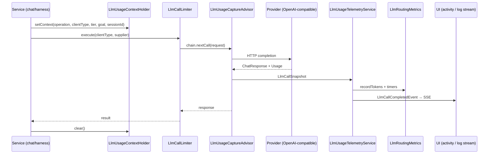

# M71: LLM Usage Telemetry and Agent Panel Summary

**Status:** **Next** — ready to implement (2026-06-08)  
**Created:** 2026-06-07  
**Depends on:** M64 (tier metrics API), M40/M42 (inline agent activity panel), M67 (client types)

## Problem Statement

LLM calls are scattered across harness, chat, case analysis, and utility paths. Today we log coarse messages (`"LLM Call — Calling model: …"`) and increment Prometheus counters, but:

- `LlmRoutingMetrics.recordTokens()` exists but is **never wired** from provider responses (`docs/eval/cost-model.md` notes this gap).
- No unified capture of **input/output tokens**, **provider prompt-cache reuse**, **latency**, **model**, or **prompt size**.
- The inline **agent activity panel** (chat) and **execution trace** (match/analyze/routing) do not show a compact per-call or per-turn LLM summary.
- `@Cacheable(LLM_RESPONSES_CACHE)` hits skip the provider entirely — operators cannot distinguish a cache hit from a live call.

Operators need real usage metadata to tune tiers (M64), validate M68 summarizer savings, and debug cost/latency without reading raw logs.

## Goal

Collect all **available and useful** metadata on every real LLM invocation (and explicit cache hits), record it for observability, and surface a **brief summary** in the agent work block for LLM requests.

## Non-Goals

- Billing/chargeback integration
- Storing full prompts or responses (PHI risk)
- Token estimation when the provider returns no usage (optional fallback only; not required for MVP)
- Grafana dashboard work (metrics only; dashboards out of scope)

## Metadata Contract

### Provider metadata (Spring AI `Usage` + `ChatResponseMetadata`)

Spring AI 2.0-M8 exposes:

| Field | Source | Notes |
|-------|--------|-------|
| `promptTokens` | `Usage.getPromptTokens()` | Billable input |
| `completionTokens` | `Usage.getCompletionTokens()` | Billable output |
| `totalTokens` | `Usage.getTotalTokens()` | Default sum |
| `cacheReadInputTokens` | `Usage.getCacheReadInputTokens()` | Provider prompt cache read (OpenAI-compatible) |
| `cacheWriteInputTokens` | `Usage.getCacheWriteInputTokens()` | Provider prompt cache write |
| `model` | `ChatResponseMetadata.getModel()` | Resolved model id |
| `finishReason` | `Generation.getMetadata().getFinishReason()` | stop / length / tool_calls |
| `latencyMs` | Measured in advisor | Wall-clock per call |
| `nativeUsage` | `Usage.getNativeUsage()` | Logged at DEBUG only; never sent to UI |

### Request-side metadata (computed, no content)

| Field | Source | Notes |
|-------|--------|-------|
| `promptChars` | Sum of system + user message text lengths | Proxy when tokens missing |
| `messageCount` | Prompt message list size | Includes history |
| `toolDefinitionCount` | Chat options tool callbacks size | Tool-calling paths |
| `maxTokensBudget` | Tier config / chat options | From `LlmTierProperties` or options |
| `clientType` | `LlmClientType` | CLINICAL, UTILITY, TOOL_CALLING, … |
| `routingTier` | `RoutingTier` | LIGHT / STANDARD / FULL (chat paths) |
| `goalType` | `GoalType` | When session context available |
| `operation` | `LlmOperation` enum | Bounded tag for Prometheus — see enum below |
| `sessionId` | `LogStreamService` thread-local or explicit | Correlates UI events |
| `cacheSource` | `NONE` / `LLM_RESPONSES_CACHE` | App-level Caffeine hit |

### Turn-level rollup (per chat stream or harness run)

| Field | Meaning |
|-------|---------|
| `llmCallCount` | Number of provider calls + cache hits |
| `totalPromptTokens` | Sum of prompt tokens |
| `totalCompletionTokens` | Sum of completion tokens |
| `totalCacheReadTokens` | Sum of provider cache reads |
| `totalLatencyMs` | Sum of per-call latency |
| `cacheHitCount` | App-level cache hits |

## Architecture



### D1: `LlmCallSnapshot` record (llm module)

Immutable record holding the metadata contract. Factory:

- `fromProvider(ChatClientResponse, LlmUsageContext, long latencyMs)`
- `fromCacheHit(LlmUsageContext, String cacheKey)` — zero tokens, `cacheSource=LLM_RESPONSES_CACHE`

### D2: `LlmUsageContext` + `LlmUsageContextHolder` (core)

Thread-local context set **immediately before** each `llmCallLimiter.execute()` (or advisor-only paths). Cleared in `finally`.

```java
public record LlmUsageContext(
    String sessionId,
    LlmClientType clientType,
    LlmOperation operation,
    @Nullable RoutingTier routingTier,
    @Nullable GoalType goalType,
    @Nullable Integer maxTokensBudget) {}
```

**`LlmOperation` enum** (bounded cardinality for metrics + UI):

`CHAT_TURN`, `CHAT_STREAM`, `GOAL_CLASSIFY`, `CASE_ANALYSIS`, `MATCH_INTERPRET`, `CASE_INTERPRET`, `ROUTING_SUMMARIZE`, `NETWORK_SUMMARIZE`, `TRANSLATE`, `RERANK`, `STRUCTURED_ANALYSIS`, `OTHER`

### D3: `LlmUsageCaptureAdvisor` (core)

`CallAdvisor` + `StreamAdvisor` (same pattern as `DateTimeContextAdvisor`):

1. Record `start = nanoTime()`
2. `response = chain.nextCall(request)` / aggregate stream terminus
3. Build snapshot from `response.chatResponse().getMetadata()`
4. Attach `promptChars` from request prompt messages (length only)
5. Delegate to `LlmUsageTelemetryService`
6. Return response unchanged

Register on **all** `ChatClient` beans in `SpringAIConfig.chatClientBuilder()` via `.defaultAdvisors(dateTimeContextAdvisor, llmUsageCaptureAdvisor)`.

Order: `DateTimeContextAdvisor` (HIGHEST) → `LlmUsageCaptureAdvisor` (LOWEST — runs closest to provider).

### D4: `LlmUsageTelemetryService` (llm module)

Single entry point:

```java
void record(LlmCallSnapshot snapshot);
```

Responsibilities:

- `LlmRoutingMetrics.recordTokens(...)` when tokens > 0
- New timer: `llm.call.latency{client_type,operation}` (Micrometer)
- New counter: `llm.cache.hits.total{cache_source}`
- Publish `LlmCallCompletedEvent` (sessionId, snapshot summary fields)
- Append to per-session `LlmUsageSessionAccumulator` for turn rollup

**No prompt text, no response text** in events or metrics labels.

### D5: App-level cache hit visibility

`MedicalAgentLlmSupportServiceImpl` methods use `@Cacheable(LLM_RESPONSES_CACHE)`. Options (pick one in implementation):

| Option | Pros | Cons |
|--------|------|------|
| **A. Cacheable wrapper service** | Clean separation | Extra bean |
| **B. `@Cacheable(sync=true)` + custom `CacheResolver` logging hits** | Minimal call-site change | Harder to test |
| **C. Manual check in support service before call** | Explicit | Duplicates cache logic |

**Recommended: A** — thin `CachingMedicalAgentLlmSupportService` decorator or aspect `LlmResponseCacheAspect` that emits `fromCacheHit` snapshot when cache returns without invoking delegate.

### D6: UI — chat agent activity panel

Extend `ChatStreamActivityPublisher` with `publishLlmUsage(sessionId, LlmCallSummary summary)`:

SSE `activity` payload:

```json
{
  "type": "llm_call",
  "operation": "case analysis",
  "model": "medgemma:1.5-4b",
  "clientType": "CLINICAL",
  "promptTokens": 1240,
  "completionTokens": 312,
  "cacheReadTokens": 800,
  "latencyMs": 1840,
  "cacheHit": false,
  "message": "LLM · CLINICAL · 1.2k→312 tok · cache 800 · 1.8s"
}
```

**`chat.js`:**

- Handle `act.type === 'llm_call'` in activity SSE handler
- `addActivityEntryToPanel(panelWrap, 'llm', act.message, act.clientType || 'llm')`
- New CSS: `.agent-activity-entry.llm { border-left-color: #20c997; }`
- **Collapsed summary bar** — extend `collapseAgentPanel()` to append token rollup when `panelWrap._llmRollup` present:
  - `▸ 2 agent(s) · 8 steps · 12s · LLM 3 calls · 4.1k in / 890 out`

On stream `done`, emit final `llm_turn_summary` activity event from `ChatAssistantServiceImpl` using session accumulator.

### D7: UI — harness execution trace (match / analyze / routing)

Keep backward-compatible `LogStreamService.sendLog` lines; enrich **details** on existing `"LLM Call"` / completion logs:

```
Calling model: medgemma:1.5-4b for case analysis
in=1240 out=312 cache_read=800 latency=1840ms prompt_chars=4821
```

Optional structured SSE event `llm_usage` (same JSON as chat) for future log panel parsing — Phase 2 if timeboxed.

### D8: Context propagation at call sites

Add `LlmUsageContextHolder.set(...)` before each `llmCallLimiter.execute()` in:

| File | Operations |
|------|------------|
| `ChatAssistantServiceImpl` | sync + stream chat, harness classify |
| `MedicalAgentLlmSupportServiceImpl` | analyze, interpret, summarize |
| `ChatLanguageServiceImpl` | translate in/out |
| `CaseAnalysisServiceImpl` | structured analysis |
| `GoalClassifier` | LLM classify fallback |
| `RerankingServiceImpl` | rerank (if ChatClient) |
| Agent tool classes | only if they call ChatClient directly |

Use try/finally to clear holder. Session id from `logStreamService.getCurrentSessionId()` or chat `ctx.sessionId()`.

### D9: Streaming token usage

For `.stream().content()` paths, usage arrives on the **final** aggregated `ChatClientResponse` in `StreamAdvisor`. `LlmUsageCaptureAdvisor.adviseStream` must subscribe to terminal signal (same pattern Spring AI `MessageAggregator` uses) — **one** snapshot per stream, not per token chunk.

### D10: Limiter hardening (Phase 9 — optional)

Today `LlmCallLimiter` uses fair semaphores with **indefinite** `acquire()` and no wait observability. Phase 9 hardens without replacing the limiter API.

| Enhancement | Config | Metric |
|-------------|--------|--------|
| Acquire timeout | `medexpertmatch.llm.<client>.acquire-timeout-seconds` (default 120) | `llm.limiter.timeout.total{client_type}` |
| Wait time | Measured from acquire start to permit | `llm.limiter.wait.time{client_type}` (Timer) |
| Queue saturation | Timeout exhausted | `llm.limiter.queue.hits{client_type}` |
| Provider throttle | HTTP 429 / rate-limit message in `LlmCallExecutor` wrapper | `llm.calls.provider-throttle{client_type}` |
| Retry with backoff | `medexpertmatch.llm.max-retries`, `initial-retry-delay-ms`, `max-retry-delay-ms` | Reuse existing error counters |

Implementation sketch:

1. Replace `semaphore.acquire()` with `tryAcquire(timeout, SECONDS)` in `LlmCallLimiter`.
2. Add `LlmCallExecutor` (or extend `execute`) for throttle-aware retry — keeps advisor telemetry on each attempt.
3. **Do not** add TPM token-bucket in Phase 9 unless prod metrics show provider TPM throttling; semaphore + timeout is sufficient for MVP.

Config additions in `application.yml` under `medexpertmatch.llm.*`:

```yaml
medexpertmatch:
  llm:
    acquire-timeout-seconds: ${MEDEXPERTMATCH_LLM_ACQUIRE_TIMEOUT_SECONDS:120}
    max-retries: ${MEDEXPERTMATCH_LLM_MAX_RETRIES:3}
    initial-retry-delay-ms: ${MEDEXPERTMATCH_LLM_INITIAL_RETRY_DELAY_MS:1000}
    max-retry-delay-ms: ${MEDEXPERTMATCH_LLM_MAX_RETRY_DELAY_MS:30000}
```

Phase 9 tests: `LlmCallLimiterTest` — timeout throws/translates to clear exception; wait timer recorded.

### D11: Security and PHI

Per `security-check` skill:

- Never include message text, tool args, or patient identifiers in snapshots, logs, SSE, or metric tags.
- `nativeUsage` may contain provider internals — DEBUG logs only, sanitized.
- Unit tests assert snapshot `toString()` contains no sample PHI fixtures.

## Phases

| Phase | Task | Deliverable | Effort |
|-------|------|-------------|--------|
| 1 | Metadata model + telemetry service | `LlmCallSnapshot`, `LlmUsageTelemetryService`, tests | 4h |
| 2 | Capture advisor + ChatClient wiring | `LlmUsageCaptureAdvisor` on all clients, advisor IT | 4h |
| 3 | Context holder at call sites | Harness + chat paths set operation/client/tier | 3h |
| 4 | Wire `recordTokens` + latency metrics | Prometheus counters/timers; update `cost-model.md` | 2h |
| 5 | Cache hit events | Aspect or decorator for `LLM_RESPONSES_CACHE` | 3h |
| 6 | Chat UI | `llm_call` SSE + panel row + turn rollup in summary | 4h |
| 7 | Harness log enrichment | Structured details on match/analyze trace | 2h |
| 8 | Docs | `docs/HARNESS.md` observability section; ADR snippet in M64 doc | 1h |
| 9 | Limiter hardening (optional) | Acquire timeout, wait metrics, provider-throttle counter | 4h |

**Total: ~23h core (~3 days); +4h if Phase 9 included**

## Files to Change

| File | Change |
|------|--------|
| `core/advisor/LlmUsageCaptureAdvisor.java` | **New** — capture Usage + latency |
| `core/util/LlmUsageContextHolder.java` | **New** — thread-local context |
| `core/util/LlmOperation.java` | **New** — bounded operation enum |
| `core/util/LlmCallLimiter.java` | Phase 9: acquire timeout + wait timer |
| `core/util/LlmCallExecutor.java` | Phase 9: throttle retry wrapper (optional) |
| `llm/monitoring/LlmUsageTelemetryService.java` | **New** — metrics + events |
| `llm/monitoring/LlmCallSnapshot.java` | **New** — metadata record |
| `llm/event/LlmCallCompletedEvent.java` | **New** — Spring event for UI |
| `core/config/SpringAIConfig.java` | Register advisor on all ChatClients |
| `llm/monitoring/LlmRoutingMetrics.java` | Add `recordLatency`, `recordCacheHit` |
| `llm/service/ChatStreamActivityPublisher.java` | `publishLlmUsage`, `publishTurnSummary` |
| `llm/service/impl/ChatStreamActivityPublisherImpl.java` | Listen for `LlmCallCompletedEvent` |
| `llm/service/impl/ChatAssistantServiceImpl.java` | Set context; emit turn summary on done |
| `llm/service/impl/MedicalAgentLlmSupportServiceImpl.java` | Set context per operation |
| `core/service/LogStreamService.java` | `logLlmUsage(sessionId, snapshot)` helper |
| `src/main/resources/static/js/chat.js` | Handle `llm_call`, rollup in summary |
| `src/main/resources/static/css/chat.css` | `.agent-activity-entry.llm` style |
| `docs/eval/cost-model.md` | Mark `llm.tokens.total` as wired |

## Acceptance Criteria

- [ ] Every `ChatClient` call through default advisors produces a `LlmCallSnapshot` with latency; tokens when provider returns `Usage`
- [ ] `llm.tokens.total` increments in Prometheus for chat and harness paths
- [ ] Provider cache fields (`cacheReadInputTokens`) shown when present; omitted when null (no fake zeros)
- [ ] App-level `LLM_RESPONSES_CACHE` hits emit snapshot with `cacheHit=true` and **no** provider call
- [ ] Chat agent panel shows one compact row per LLM call during streaming
- [ ] Collapsed summary includes turn-level token totals when ≥1 LLM call occurred
- [ ] Harness pages show enriched `LLM Call` log lines (tokens + latency); no prompt content
- [ ] `mvn test` covers advisor extraction, telemetry recording, and event payload shape
- [ ] Security review: no PHI in metrics tags, SSE payloads, or info logs
- [ ] Phase 9 (optional): limiter acquire timeout prevents indefinite chat-thread blocking; wait/throttle metrics visible in Prometheus

## UI Copy Examples (English)

Per-call row:

```text
LLM · TOOL_CALLING · function-gemma · 890→204 tok · 0.9s
LLM · CLINICAL · medgemma:1.5-4b · 1.2k→312 tok · cache 800 · 1.8s
LLM · CLINICAL · (cached) · analyze:case-abc · 0 tok · 0ms
```

Collapsed summary extension:

```text
▸ 2 agent(s) · 8 steps · 12s · LLM 3× · 4.1k in / 890 out
```

## Testing Strategy (TDD)

1. **`LlmUsageCaptureAdvisorTest`** — mock `CallAdvisorChain` returning `ChatClientResponse` with `DefaultUsage(100, 50, 150, null, 40L, 0L)`; assert telemetry invoked, promptChars computed.
2. **`LlmUsageTelemetryServiceTest`** — verify `LlmRoutingMetrics.recordTokens` and event publication; assert no message content in event.
3. **`ChatStreamActivityPublisherImplTest`** — `LlmCallCompletedEvent` → SSE payload type `llm_call`.
4. **`LlmResponseCacheAspectTest`** (or decorator test) — cache hit → snapshot with `cacheHit=true`, delegate not called.
5. **Integration** — extend existing `ChatAssistantServiceImplTest` or harness IT with mocked `Usage` in `TestAIConfig` response metadata.

## Risks and Mitigations

| Risk | Mitigation |
|------|------------|
| Provider omits `Usage` (local Ollama) | Show `promptChars` + latency; tokens as `—` in UI |
| Double-counting on advisor + manual logs | Deprecate duplicate `"LLM Call"` strings; single telemetry path |
| Stream usage only on last chunk | Use StreamAdvisor terminal aggregation; test with Flux |
| Metric cardinality explosion | Bound tags: `client_type`, `operation` enum — no sessionId in Prometheus |

## References

- M64 `LlmRoutingMetrics` — `llm.tokens.total` API
- M40 inline agent panel — `chat.js` `addActivityEntryToPanel`
- M42 pipeline SSE — pattern for new event types
- `DateTimeContextAdvisor` — advisor implementation template
- Spring AI `org.springframework.ai.chat.metadata.Usage` (2.0.0-M8)
- `docs/eval/cost-model.md`

## Follow-up (out of scope)

- Grafana dashboard for `llm.tokens.total` by tier
- Cost USD estimation using model price table
- Eval flywheel: export per-turn usage into `EvalRecording*` services (M69 family)
- TPM token-bucket rate limiting (Bucket4j) — only if `llm.calls.provider-throttle` shows sustained pressure
