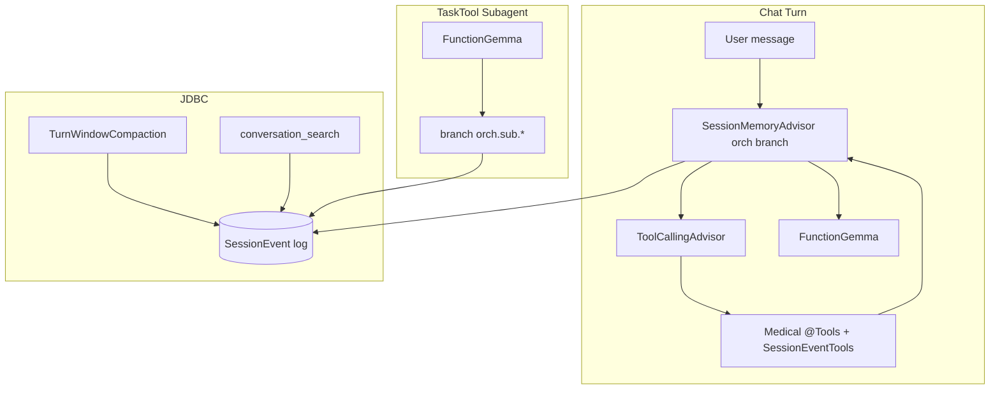

# M141 — Spring AI Session Hardening (0.5 Upgrade + Recall + Branches)

- **Milestone:** M141
- **REQ:** REQ-134 (extends M137 session/tool-loop wiring)
- **Status:** Done (2026-07-05)
- **Date:** 2026-07-05
- **Follows:** M137 (advisor inside tool loop), M41/M35 (turn continuity), M92 (compaction wiring)
- **References:**
  - [Spring AI Session docs](https://spring-ai-community.github.io/spring-ai-session/latest-snapshot/)
  - [spring-ai-session GitHub](https://github.com/spring-ai-community/spring-ai-session)

## Problem Statement

MedExpertMatch already uses **Spring AI Session JDBC** with turn-safe compaction:

| Already wired | Location |
|---------------|----------|
| `spring-ai-starter-session-jdbc` | `pom.xml` (BOM **0.3.0**) |
| `SessionMemoryAdvisor` + composite trigger | `MedicalAgentConfiguration` |
| `TurnCountTrigger` OR `TokenCountTrigger` | `agent.session.max-turns` / `max-tokens` |
| `TurnWindowCompactionStrategy` (non-LLM) | PHI-safe; no summarization LLM call |
| `ObservingCompactionStrategy` + health indicator | `SessionCompactionObservability` |
| Branch filter `orch` on orchestrator | `SessionAdvisorSupport` |
| `sessionService.appendMessage()` | `ChatAssistantServiceImpl` (sync + stream) |
| Advisor inside tool loop (order + 1) | M137 |

Gaps vs **Spring AI Session 0.5.0** ([release notes](https://github.com/spring-ai-community/spring-ai-session/releases)):

1. **Library version lag** — BOM pinned at `0.3.0`; latest stable is **0.5.0** (optimistic concurrency on compaction, API polish, `SessionEventTools`).
2. **No post-compaction recall** — After `TurnWindowCompactionStrategy` drops old turns, the model cannot search verbatim history. Long chat sessions lose "what did I say earlier about…?" context.
3. **Incomplete branch isolation** — Only `AgentSessionBranches.ORCHESTRATOR` exists; `TaskTool` subagents share the same branch, polluting orchestrator memory with subagent tool noise.
4. **Weak session metrics** — Compaction logged + health check only; no Prometheus gauges for event count, storage growth (RISK-140).
5. **No session retention alignment** — Chat retention purges `chat_message` but `spring_ai_session_*` tables may grow unbounded.
6. **Harness paths** — Not all harness completions append structured summary events to `SessionService` for follow-up turns.

## Goal

Upgrade to Spring AI Session **0.5.x**, add **recall search** after compaction, complete **multi-agent branch isolation**, and expose **operational metrics** — without introducing PHI into LLM-generated summaries.

## Non-Goals

- `RecursiveSummarizationCompactionStrategy` on clinical paths (PHI risk; extra LLM cost)
- Replacing `AutoMemoryTools` (cross-session filesystem memory) — complementary, not duplicate
- Redis session backend (JDBC/PostgreSQL is sufficient for MVP)
- Changing chat UI session model

## Spring AI Session — Feature Map for MedExpertMatch

| Library feature | MedExpert today | M141 action |
|-----------------|-----------------|-------------|
| Event-sourced `SessionEvent` log | JDBC repo | Keep |
| Turn-aware compaction | `TurnWindowCompactionStrategy` | Keep (default) |
| `TokenCountCompactionStrategy` | Trigger only; strategy is turn-window | Evaluate as optional strategy behind flag |
| `SlidingWindowCompactionStrategy` | Not used | Skip (turn-window is safer for tools) |
| `RecursiveSummarizationCompactionStrategy` | Not used | **Out of scope** (PHI) |
| `SessionEventTools.conversation_search` | Not wired | **Add** to orchestrator tool set |
| Multi-agent `EventFilter.forBranch()` | Orchestrator only | **Extend** for subagents |
| Optimistic concurrency (`compactEvents` CAS) | Unknown on 0.3.0 | Verify after upgrade |
| `SessionMemoryAdvisor` in tool loop | M137 done | Document + test |

## Proposed Improvements

### 1. Upgrade `spring-ai-session-bom` 0.3.0 → 0.5.0

```xml
<dependency>
    <groupId>org.springaicommunity</groupId>
    <artifactId>spring-ai-session-bom</artifactId>
    <version>0.5.0</version>
</dependency>
```

**Verification spike (2026-07-05):**

- `pom.xml`: `spring-ai-session.version=0.5.0` resolves `spring-ai-session-management:0.5.0` + `spring-ai-session-jdbc:0.5.0`
- `mvn compile test-compile` — green, no API breaks in existing session code
- Session unit tests green: `SessionCompactionConfigTest`, `SessionTurnWindowSafetyTest`, `SessionCompactionHealthIndicatorTest`, `MedicalAgentMemoryWiringTest`, `SessionBranchIsolationTest`, `MedicalAgentRecommendationWorkflowSessionTest`
- `SessionTurnSafetyIT` — requires Docker (environment blocked locally)
- `SessionEventTools` confirmed at `org.springframework.ai.session.tool.SessionEventTools` in 0.5.0

### 2. Post-compaction recall — `SessionEventTools`

From [Recall Storage](https://spring-ai-community.github.io/spring-ai-session/latest-snapshot/session-management/recall-storage/): after compaction, register `SessionEventTools` so the model can keyword-search **full verbatim history** stored in JDBC.

```java
@Bean
SessionEventTools sessionEventTools(SessionService sessionService) {
    return SessionEventTools.builder(sessionService).build();
}
```

Wire into `medicalAgentChatClient` via `.defaultTools(sessionEventTools)` — **not** via `AugmentedToolCallbackProvider` (tool already exposes `innerThought`).

**Medical compliance:**

- Search is session-scoped (same `SESSION_ID_CONTEXT_KEY`)
- Tool description must state: research/operator context only; do not quote patient identifiers in replies
- `PhiGuard` already on chat export — add note in tool prompt that recall results are subject to same policy

**UX win:** User asks follow-up about an earlier symptom or case detail dropped by compaction → agent calls `conversation_search` instead of hallucinating.

### 3. Multi-agent branch isolation

Extend `AgentSessionBranches`:

```java
public static final String ORCHESTRATOR = "orch";
public static final String SUBAGENT_PREFIX = "orch.sub.";  // e.g. orch.sub.case-analyzer
```

| Agent surface | Branch | Event filter |
|---------------|--------|--------------|
| Chat orchestrator | `orch` | `EventFilter.forBranch(ORCHESTRATOR)` (existing) |
| TaskTool subagent | `orch.sub.{agentId}` | Set via subagent ChatClient advisor param |
| Harness-only LLM (clinical) | No session advisor | Unchanged |

Subagent `ChatClient` builder in `taskTool()` adds branch param per subagent definition filename.

Orchestrator **does not see** subagent tool transcripts; recall tool can still search all branches if configured (verify 0.5 API — may need unfiltered search tool for ops/debug only).

### 4. Session metrics (RISK-140)

Extend `SessionCompactionObservability` → Micrometer:

| Metric | Type | Tags |
|--------|------|------|
| `session.compaction.total` | Counter | — |
| `session.compaction.events_removed` | Counter | — |
| `session.compaction.failure.total` | Counter | — |
| `session.events.count` | Gauge | `session_hash` (hashed id, sampled) |
| `session.storage.bytes` | Gauge | optional JDBC row-size estimate |

Alert when compaction failures > 0 or p95 event count per active session exceeds threshold.

Coordinates with M139 task 5 (RISK-137..140 monitoring docs).

### 5. Session retention aligned with chat retention

Add `SessionRetentionService` (or extend `ChatRetentionServiceImpl`):

- Purge `spring_ai_session_*` rows for chats deleted by M21 retention
- Config: `agent.session.retention-days` aligned with `chat.retention.idle-days`
- FK-safe: purge by session id linked from `chat.session_id`

Prevents unbounded PostgreSQL growth from abandoned sessions.

### 6. Harness → session continuity

After harness completes in `ChatAssistantServiceImpl`, append a **compact non-PHI summary event** to `SessionService`:

```text
[Harness] MATCH_DOCTORS completed · caseId=… · 3 matches · policy=ANSWER
```

Uses existing harness metadata keys — no raw case narrative. Enables follow-up chat turns to reference harness outcome without re-running engine.

### 7. Documentation

Update:

- `docs/HARNESS_AND_AGENT_USAGE.md` — session architecture diagram + branch model
- `docs/MODEL_SELECTION_GUIDE.md` — `agent.session.*` tuning (turns vs tokens vs window)
- `llm/AGENTS.md` — when to use recall tool vs AutoMemory

## Architecture (target)



## Phases

| Phase | Task | Effort | Status |
|-------|------|--------|--------|
| 1 | Upgrade BOM 0.3 → 0.5; fix compile/test breaks | 3h | **Done** (2026-07-05 spike: compile + 6 session unit tests green; IT needs Docker) |
| 2 | Register `SessionEventTools` on orchestrator ChatClient | 2h | **Done** (2026-07-05: bean + `.defaultTools(sessionEventTools)` without augment; `SessionEventToolsWiringTest`) |
| 3 | Subagent branch isolation in `TaskTool` ChatClient | 4h | **Done** (2026-07-05: per-agent ChatClient map + `SubagentSessionContextAdvisor`; `OrchestratorBranchSessionService` post-filter) |
| 4 | Prometheus session metrics | 3h | **Done** (2026-07-05: Micrometer counters + sampled `session.events.count` gauge in `SessionCompactionObservability`) |
| 5 | Session retention purge job | 3h | **Done** (2026-07-05: `ChatRetentionPurgeListener` + `SessionRetentionPurgeListener`) |
| 6 | Harness summary append to `SessionService` | 2h | **Done** (2026-07-05: `HarnessSessionSummary` in harness paths) |
| 7 | IT: recall after compaction; branch filter IT | 4h | **Done** (2026-07-05: `SessionRecallIT`; requires Docker for `mvn verify`) |
| 8 | Docs + security review | 2h | **Done** (2026-07-05: HARNESS_AND_AGENT_USAGE §2.3, MODEL_SELECTION_GUIDE, llm/AGENTS.md) |

**Total: ~23h (~3 days)**

## Files to Change

| File | Change |
|------|--------|
| `pom.xml` | `spring-ai-session-bom` → 0.5.0 |
| `llm/config/MedicalAgentConfiguration.java` | `SessionEventTools` bean; subagent branch advisors |
| `llm/agent/AgentSessionBranches.java` | Subagent branch constants + helper |
| `llm/agent/SessionAdvisorSupport.java` | `applySubagentContext(spec, sessionId, agentId)` |
| `llm/config/SessionCompactionObservability.java` | Micrometer integration |
| `chat/service/ChatRetentionServiceImpl.java` or new | Purge orphaned session rows |
| `llm/service/impl/ChatAssistantServiceImpl.java` | Harness summary append |
| `application.yml` | `agent.session.retention-days` |
| `docs/HARNESS_AND_AGENT_USAGE.md` | Session 0.5 architecture |
| `src/test/java/.../SessionRecallIT.java` | **New** — compact then search |
| `src/test/java/.../SubagentBranchIsolationTest.java` | **New** |

## Acceptance Criteria

- [ ] `spring-ai-session-bom` at 0.5.0; `mvn verify` green
- [ ] Orchestrator can invoke `conversation_search` after compaction recovers dropped turn text (IT)
- [ ] Subagent tool events stored under `orch.sub.*`; orchestrator branch excludes them
- [ ] Prometheus exposes `session.compaction.*` counters
- [ ] Session rows purged when parent chat is retention-deleted
- [ ] Harness completion writes non-PHI summary to session for follow-up turns
- [ ] Security review: recall tool cannot exfiltrate data cross-session; no PHI in harness summary blob
- [ ] `RecursiveSummarizationCompactionStrategy` **not** enabled on clinical ChatClients

## Testing Strategy (TDD)

1. **`SessionRecallIT`** — append 25 turns → compaction fires → `conversation_search` finds keyword from turn 1.
2. **`SubagentBranchIsolationTest`** — events on `orch.sub.test` not returned by `EventFilter.forBranch(ORCHESTRATOR)`.
3. **`SessionCompactionMetricsTest`** — compaction increments Micrometer counter.
4. **`SessionRetentionServiceTest`** — deleting chat removes linked session events.
5. Re-run existing `SessionTurnSafetyIT` after BOM upgrade.

## Risks

| ID | Risk | Mitigation |
|----|------|------------|
| RISK-140 | Session JDBC storage growth | Retention job + metrics (this milestone) |
| RISK-146 | 0.3 → 0.5 API breakage | Spike phase; pin 0.4 intermediate if needed |
| RISK-147 | Recall tool surfaces PHI in long sessions | Session-scoped only; PhiGuard on export; tool prompt guardrails |
| RISK-148 | Branch isolation breaks subagent context | Subagent still sees own branch; integration test per subagent |

## Explicitly Rejected Alternatives

| Alternative | Why not |
|-------------|---------|
| `RecursiveSummarizationCompactionStrategy` | LLM-generated summary of clinical turns = PHI processing + cost |
| Replace JDBC with Redis | Ops complexity; PostgreSQL already deployed |
| Global `SlidingWindowCompactionStrategy` | Breaks tool-call turn boundaries vs `TurnWindow` |

## Traceability

- REQ-134 — Composable tool calling / session integration
- RISK-140 — Session storage growth (M137 acceptance)
- DEC-015 — traceability (session IT annotations)
- M41 — stream path session append
- M137 — advisor ordering inside tool loop

## Follow-up (out of scope)

- Admin UI: session event inspector for operators
- `TokenCountCompactionStrategy` as alternative strategy (config toggle)
- Cross-session recall (never — HIPAA)
