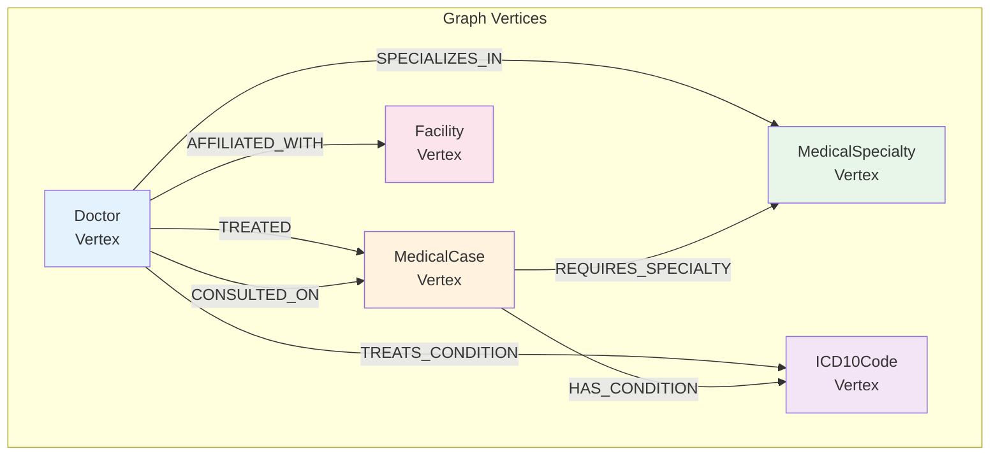
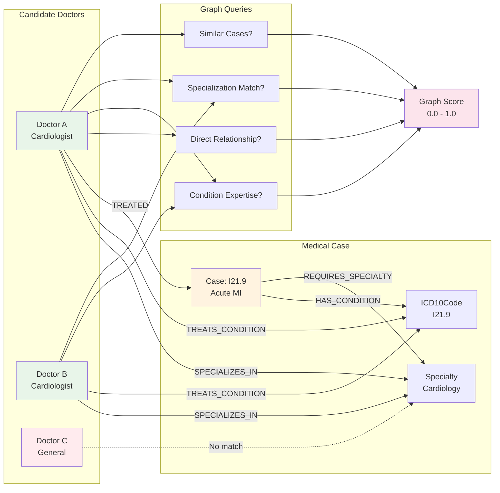
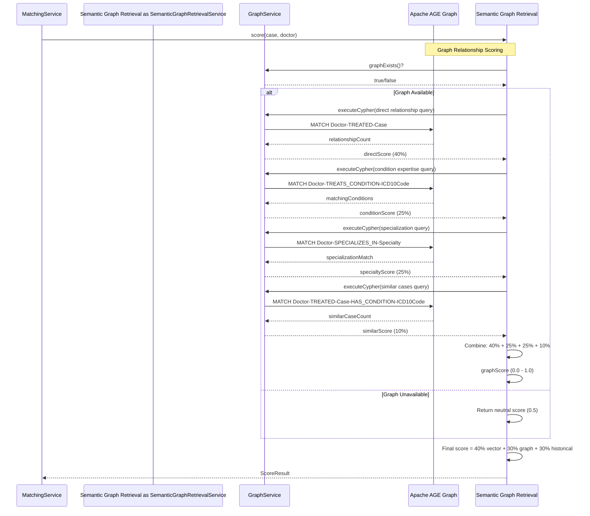

# Apache AGE Graph Creation and Usage Analysis

## Overview

This document analyzes how Apache AGE graphs are created and used in the MedExpertMatch application. Apache AGE (Apache
Graph Extension) is a PostgreSQL extension that enables graph database capabilities using Cypher queries.

## Graph Creation

### 1. Database Migration (V1__initial_schema.sql)

The graph is created during database migration:

```sql
-- Create graph for medical relationships (if AGE is available)
DO $$
BEGIN
    SELECT create_graph('medexpertmatch_graph');
EXCEPTION
    WHEN OTHERS THEN
        -- AGE not available or graph already exists, continue
        NULL;
END $$;
```

**Key Points:**

- Graph name: `medexpertmatch_graph`
- Created conditionally (only if AGE extension is available)
- Uses `DO $$` block to handle errors gracefully
- If AGE is not available, the application continues without graph functionality

### 2. Extension Loading

The migration also attempts to load the AGE extension:

```sql
-- Try to enable AGE extension (optional - may not be available in all environments)
DO $$
BEGIN
    CREATE EXTENSION IF NOT EXISTS age;
EXCEPTION
    WHEN OTHERS THEN
        -- AGE extension not available, continue without it
        NULL;
END $$;

-- Try to load and configure Apache AGE (if available)
DO $$
BEGIN
    LOAD 'age';
    SET search_path = ag_catalog, "$user", public, medexpertmatch;
EXCEPTION
    WHEN OTHERS THEN
        -- AGE not available, continue with medexpertmatch schema
        SET search_path = medexpertmatch, public;
END $$;
```

### 3. Test Setup

In integration tests, the graph is created explicitly:

```java
// From GraphServiceIT.java
try{
String createGraphSql = "SELECT ag_catalog.create_graph('medexpertmatch_graph')";
    namedJdbcTemplate.

getJdbcTemplate().

execute(createGraphSql);
}catch(
Exception e){
        // Graph might already exist, ignore
        }
```

## Graph Service Implementation

### GraphService Interface

The `GraphService` interface provides three main methods:

```java
public interface GraphService {
    // Execute Cypher query and return results
    List<Map<String, Object>> executeCypher(String cypherQuery, Map<String, Object> parameters);

    // Execute Cypher query and extract specific field
    List<String> executeCypherAndExtract(String cypherQuery, Map<String, Object> parameters, String resultField);

    // Check if graph exists
    boolean graphExists();
}
```

### GraphServiceImpl Implementation

#### Key Features:

1. **Graph Name**: Hardcoded as `medexpertmatch_graph`

2. **Extension Loading**:
    - Attempts to load AGE extension on each connection
    - Handles cases where AGE is preloaded via `shared_preload_libraries`
    - Sets search path to include `ag_catalog`

3. **Cypher Query Execution**:
    - Uses `ag_catalog.cypher()` function
    - Parameters are embedded directly into Cypher query string using `$paramName` syntax
    - Uses dollar-quoted strings to handle special characters
    - Executes in `REQUIRES_NEW` transaction to isolate from parent transactions

4. **Error Handling**:
    - Gracefully handles transaction aborted errors (25P02)
    - Handles Apache AGE compatibility issues (operator does not exist errors)
    - Returns empty results instead of throwing exceptions for compatibility issues
    - Logs warnings for graph-related errors

5. **Parameter Embedding**:
    - Replaces `$paramName` placeholders with properly escaped values
    - Handles strings, numbers, booleans, and null values
    - Escapes special characters (quotes, newlines, tabs, backslashes)

#### Example Cypher Query Execution:

```java
String cypherQuery = """
        MATCH (d:Doctor {id: $doctorId})-[:TREATED|CONSULTED_ON]->(c:MedicalCase {id: $caseId})
        RETURN count(*) as relationshipCount
        """;

Map<String, Object> params = new HashMap<>();
params.

put("doctorId",doctor.id());
        params.

put("caseId",medicalCase.id());

List<Map<String, Object>> results = graphService.executeCypher(cypherQuery, params);
```

## Graph Structure

According to the migration file and architecture documentation, the graph structure includes:

**Graph Structure Diagram:**



**Example Graph Pattern (Find Specialist Flow):**



### Vertices:

- **Doctor** - From `doctors` table
- **MedicalCase** - From `medical_cases` table
- **ICD10Code** - From `icd10_codes` table
- **MedicalSpecialty** - From `medical_specialties` table
- **Facility** - From `facilities` table

### Relationships:

- `(Doctor)-[:TREATED]->(MedicalCase)` - Doctor treated a medical case
- `(Doctor)-[:CONSULTED_ON]->(MedicalCase)` - Doctor consulted on a medical case
- `(Doctor)-[:SPECIALIZES_IN]->(MedicalSpecialty)` - Doctor specializes in a medical specialty
- `(Doctor)-[:TREATS_CONDITION]->(ICD10Code)` - Doctor treats a specific condition
- `(MedicalCase)-[:HAS_CONDITION]->(ICD10Code)` - Medical case has a condition
- `(MedicalCase)-[:REQUIRES_SPECIALTY]->(MedicalSpecialty)` - Medical case requires a specialty
- `(MedicalCase)-[:AT_FACILITY]->(Facility)` - Medical case is at a facility
- `(Doctor)-[:AFFILIATED_WITH]->(Facility)` - Doctor is affiliated with a facility

## Graph Usage

### Graph Usage in Find Specialist Flow

**Graph Integration Flow:**



### 1. SemanticGraphRetrievalService (Semantic Graph Retrieval)

The `SemanticGraphRetrievalService` uses the graph to calculate relationship scores:

```java
private double calculateGraphRelationshipScore(MedicalCase medicalCase, Doctor doctor) {
    if (!graphService.graphExists()) {
        return 0.5; // Neutral score if graph doesn't exist
    }

    String cypherQuery = """
            MATCH (d:Doctor {id: $doctorId})-[:TREATED|CONSULTED_ON]->(c:MedicalCase {id: $caseId})
            RETURN count(*) as relationshipCount
            """;

    Map<String, Object> params = new HashMap<>();
    params.put("doctorId", doctor.id());
    params.put("caseId", medicalCase.id());

    List<Map<String, Object>> results = graphService.executeCypher(cypherQuery, params);

    if (results.isEmpty()) {
        return 0.0; // No relationship found
    }

    int count = Integer.parseInt(results.get(0).get("relationshipCount").toString());
    return Math.min(1.0, count); // Normalize to 0-1
}
```

**Usage Context:**

- Part of hybrid scoring system (40% vector, 30% graph, 30% historical)
- Checks if graph exists before querying
- Returns neutral score (0.5) if graph is unavailable
- Handles errors gracefully without propagating exceptions

### 2. Graph Query Pattern

The application uses Cypher queries to:

- Find doctor-case relationships
- Count relationship occurrences
- Traverse graph paths for expert discovery

**Example Query:**

```cypher
MATCH (d:Doctor {id: $doctorId})-[:TREATED|CONSULTED_ON]->(c:MedicalCase {id: $caseId})
RETURN count(*) as relationshipCount
```

## Current State and Limitations

### What's Implemented:

1. ✅ Graph creation in migration
2. ✅ GraphService with Cypher query execution
3. ✅ Graph existence checking
4. ✅ Error handling and graceful degradation
5. ✅ Graph queries in SemanticGraphRetrievalService for relationship scoring

### What's Implemented (Updated):

1. ✅ **MedicalGraphBuilderService** - Service to populate the graph with vertices and edges
2. ✅ **Automatic graph building** - Graph is automatically built after synthetic data generation
3. ✅ **Graph synchronization** - Graph is populated from relational database data

### MedicalGraphBuilderService:

MedExpertMatch now has a `MedicalGraphBuilderService` (similar to ExpertMatch's `GraphBuilderService`) that:

- Creates vertices for doctors, medical cases, ICD-10 codes, specialties, and facilities
- Creates edges based on relationships (TREATED, SPECIALIZES_IN, HAS_CONDITION, etc.)
- Maintains graph synchronization with relational data
- Automatically builds graph after synthetic data generation completes

**Integration with SyntheticDataGenerator:**

- Graph building is automatically triggered at the end of `generateTestData()` method
- Progress tracking at 95% shows "Graph Building" status
- Descriptions are generated at 55% progress (before embeddings at 70-90%)
- Graph building errors are logged but don't fail data generation (optional step)
- Graph can be rebuilt safely using MERGE operations (idempotent)

**Graph Building Process:**

1. Creates graph structure if it doesn't exist
2. Creates all vertices (doctors, cases, ICD-10 codes, specialties, facilities)
3. Creates graph indexes for performance (GIN indexes on properties JSONB columns)
4. Creates all relationships in batches (1000 relationships per batch):
    - TREATED relationships from ClinicalExperience
    - SPECIALIZES_IN relationships from Doctor.specialties
    - HAS_CONDITION relationships from MedicalCase.icd10Codes
    - TREATS_CONDITION relationships from ClinicalExperience + MedicalCase
    - REQUIRES_SPECIALTY relationships from MedicalCase.requiredSpecialty
    - AFFILIATED_WITH relationships from Doctor.facilityIds

## Graph Builder Service Implementation

### MedicalGraphBuilderService

The `MedicalGraphBuilderService` is fully implemented and provides:

**Interface Methods:**

- `buildGraph()` - Builds complete graph from database data
- Individual vertex creation: `createDoctorVertex()`, `createMedicalCaseVertex()`, `createIcd10CodeVertex()`, etc.
- Individual relationship creation: `createTreatedRelationship()`, `createSpecializesInRelationship()`, etc.
- Batch relationship creation: `createTreatedRelationshipsBatch()`, `createSpecializesInRelationshipsBatch()`, etc.

**Implementation Details:**

- Uses `GraphService` for Cypher query execution
- Processes relationships in batches of 1000 for performance
- Uses MERGE operations for idempotency (safe to re-run)
- Creates GIN indexes on properties JSONB columns for efficient queries
- Handles errors gracefully (logs but continues)

**Integration:**

- Automatically called by `SyntheticDataGenerator.generateTestData()` at 95% progress
- Runs after description generation (55%) and embedding generation (70-90%)
- Can be called manually via `SyntheticDataGenerator.buildGraph()` method
- Graph building is optional - failures don't break data generation

### Graph Synchronization

The graph is synchronized with relational data:

- Vertices are created from existing database records
- Relationships are created from foreign key relationships and array fields
- Graph can be rebuilt safely (idempotent operations)
- Graph indexes are created for query performance

### Future Enhancements

Once vertices/edges are created, enhance graph queries:

- Find doctors who treated similar cases
- Find doctors with expertise in specific ICD-10 codes
- Traverse graph paths for expert discovery
- Calculate graph-based similarity scores

## Technical Details

### Transaction Management

- Graph queries use `REQUIRES_NEW` propagation to isolate from parent transactions
- Prevents graph query failures from rolling back main transactions
- Allows graceful degradation when graph is unavailable

### Error Handling

The implementation handles multiple error scenarios:

- Transaction aborted errors (25P02)
- Apache AGE compatibility issues (operator does not exist)
- Graph not available
- Query syntax errors

All errors are logged and handled gracefully, returning neutral scores or empty results instead of throwing exceptions.

### Parameter Embedding

Parameters are embedded directly into Cypher queries:

- Uses `$paramName` syntax
- Properly escapes special characters
- Supports strings, numbers, booleans, and null values
- Uses word boundaries to avoid partial matches

## Conclusion

Apache AGE graph infrastructure is fully implemented in MedExpertMatch. The `GraphService` provides the foundation for
graph queries, `MedicalGraphBuilderService` populates the graph with vertices and edges, and
`SemanticGraphRetrievalService` uses graph relationships for scoring.

**Current Status:**

1. ✅ Graph builder service (`MedicalGraphBuilderService`) implemented
2. ✅ Automatic graph synchronization after synthetic data generation
3. ✅ Graph queries in `SemanticGraphRetrievalService` return meaningful results
4. ✅ Graph relationship scoring contributes to doctor-case matching

**Graph Building Flow:**

```mermaid
graph TB
    subgraph Trigger["Trigger"]
        DataGen[Synthetic Data Generation<br/>Completes]
    end
    
    subgraph Build["Graph Building"]
        Step1[1. Create Graph<br/>medexpertmatch_graph]
        Step2[2. Create Vertices<br/>Doctors, Cases, ICD-10,<br/>Specialties, Facilities]
        Step3[3. Create Indexes<br/>GIN indexes on properties]
        Step4[4. Create Relationships<br/>Batched: 1000 per batch]
    end
    
    subgraph Relationships["Relationship Types"]
        R1[TREATED]
        R2[CONSULTED_ON]
        R3[SPECIALIZES_IN]
        R4[TREATS_CONDITION]
        R5[HAS_CONDITION]
        R6[REQUIRES_SPECIALTY]
        R7[AFFILIATED_WITH]
    end
    
    subgraph Usage["Graph Usage"]
        Semantic Graph Retrieval[SemanticGraphRetrievalService<br/>Graph Scoring]
        Tools[MedicalAgentTools<br/>Graph Queries]
    end
    
    DataGen --> Step1
    Step1 --> Step2
    Step2 --> Step3
    Step3 --> Step4
    
    Step4 --> R1
    Step4 --> R2
    Step4 --> R3
    Step4 --> R4
    Step4 --> R5
    Step4 --> R6
    Step4 --> R7
    
    R1 --> Semantic Graph Retrieval
    R2 --> Semantic Graph Retrieval
    R3 --> Semantic Graph Retrieval
    R4 --> Semantic Graph Retrieval
    R5 --> Semantic Graph Retrieval
    R6 --> Semantic Graph Retrieval
    R7 --> Tools
    
    style Step1 fill:#e3f2fd
    style Step4 fill:#fff3e0
    style Semantic Graph Retrieval fill:#e8f5e9
    style Tools fill:#f3e5f5
```

**Graph Building Steps:**

1. Synthetic data is generated (doctors, cases, clinical experiences, etc.)
2. At 95% progress, `MedicalGraphBuilderService.buildGraph()` is called
3. Graph is populated with all vertices and relationships
4. Graph queries in `SemanticGraphRetrievalService` can now find relationships and calculate scores

The graph is now actively used for:

- Finding doctor-case relationships (TREATED, CONSULTED_ON)
- Calculating graph-based similarity scores
- Discovering expert paths through graph traversal
- Enhancing doctor matching with relationship signals
