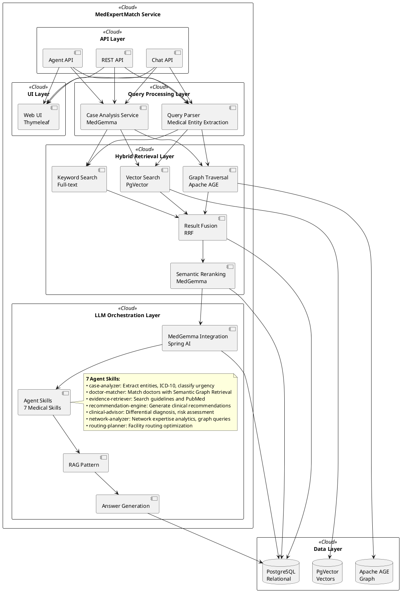
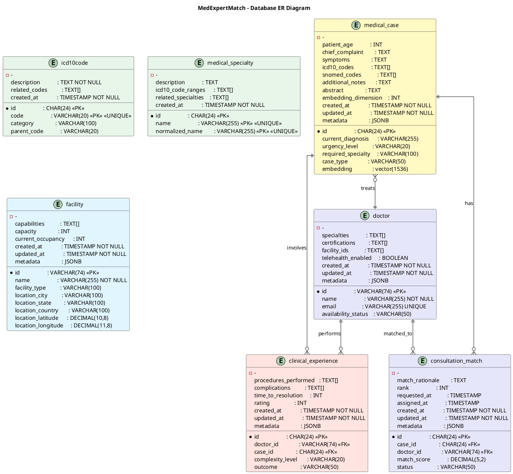
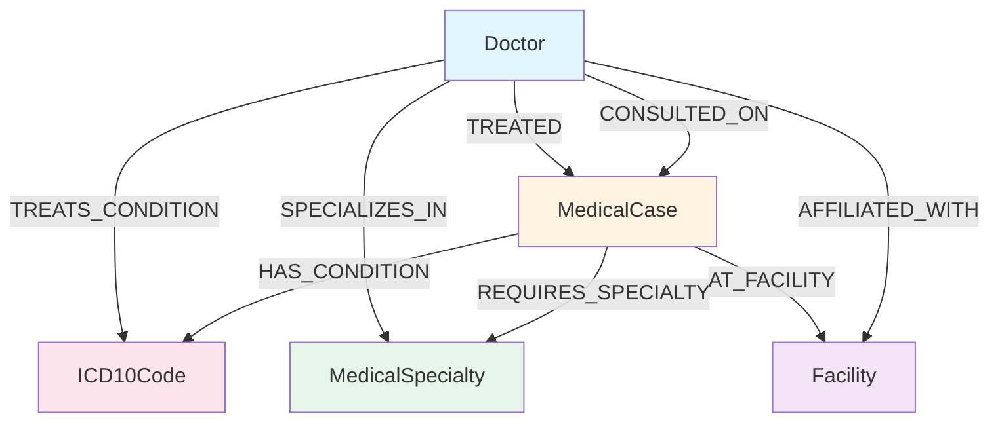

# MedExpertMatch Architecture

**Last Updated:** 2026-02-03  
**Version:** 1.2  
**Status:** MVP Complete

## Overview

MedExpertMatch uses a modular, domain-driven architecture designed for medical use cases. The system follows modern
software engineering principles with clear separation of concerns.

## High-Level Architecture



## Module Structure

MedExpertMatch uses a modular structure organized by domain:

### Core Modules

**core** - Shared infrastructure and utilities

- Configuration (`SpringAIConfig`, `MedicalAgentConfiguration`, `PromptTemplateConfig`)
- Exception handling (`MedExpertMatchException`, `RetrievalException`)
- Monitoring (`MedGemmaToolCallingMonitor`)
- Utilities (`IdGenerator`)
- SQL injection utilities (`InjectSql`, `SqlInjectBeanPostProcessor`)

**doctor** - Doctor/expert data management

- Domain: `Doctor`, `MedicalSpecialty`
- Repository: `DoctorRepository` with JDBC implementation
- Repository: `MedicalSpecialtyRepository` with JDBC implementation
    - Methods: `findById()`, `findByName()`, `findAll()`, `insert()`, `update()`, `deleteAll()`
- REST: `DoctorController` (web UI)

**medicalcase** - Medical case data management

- Domain: `MedicalCase`, `CaseType`, `UrgencyLevel`
- Repository: `MedicalCaseRepository` with JDBC implementation

**medicalcoding** - ICD-10 codes and medical coding

- Domain: `ICD10Code`
- Repository: `ICD10CodeRepository` with JDBC implementation
    - Methods: `findById()`, `findByCode()`, `findByCodes()`, `findByCategory()`, `findByParentCode()`, `findAll()`,
      `insert()`, `update()`, `deleteAll()`

**clinicalexperience** - Clinical experience data

- Domain: `ClinicalExperience`
- Repository: `ClinicalExperienceRepository` with JDBC implementation

**facility** - Medical facility data

- Domain: `Facility`

### Processing Modules

**caseanalysis** - Medical case analysis using MedGemma

- Domain: `CaseAnalysisResult`
- Service: `CaseAnalysisService` (uses MedGemma for case analysis)

**embedding** - Vector embedding generation and management

- Service: `EmbeddingService` (generates embeddings using Spring AI EmbeddingModel)
- Supports single and batch embedding generation
- Integrates with test data generation flow

**retrieval** - Hybrid GraphRAG retrieval (vector + graph + keyword + reranking)

- Domain: `DoctorMatch`, `FacilityMatch`, `MatchOptions`, `RoutingOptions`, `ScoreResult`, `RouteScoreResult`,
  `PriorityScore`
- Service: `MatchingService`, `SemanticGraphRetrievalService` (Semantic Graph Retrieval)
- **Scoring Components**:
    - Vector similarity (40% weight) - PgVector embeddings comparison using cosine distance
    - Graph relationships (30% weight) - Apache AGE graph traversal for relationship-based scoring
    - Historical performance (30% weight) - Past outcomes, ratings, and success rates
- **Used in Find Specialist Flow**: Graph relationships are actively used via
  `SemanticGraphRetrievalService.calculateGraphRelationshipScore()` for doctor-case matching

**llm** - LLM orchestration, Agent Skills integration

- Service: `MedicalAgentService` (orchestrates agent skills and tools)
- Tools: `MedicalAgentTools` (Java @Tool methods) - **All tools implemented**:
    - Case Analyzer: `analyze_case_text`, `extract_icd10_codes`, `classify_urgency`, `determine_required_specialty`
    - Doctor Matcher: `query_candidate_doctors`, `score_doctor_match`, `match_doctors_to_case` (uses Semantic Graph
      Retrieval with graph scoring)
    - Evidence Retriever: `search_clinical_guidelines`, `query_pubmed`
    - Recommendation Engine: `generate_recommendations`
    - Clinical Advisor: `differential_diagnosis`, `risk_assessment`
    - Network Analyzer: `graph_query_top_experts`, `aggregate_metrics` (uses Apache AGE graph)
    - Routing Planner: `graph_query_candidate_centers`, `semantic_graph_retrieval_route_score` (uses Apache AGE graph)
- REST: `MedicalAgentController` (agent API endpoints)

**graph** - Graph relationship management using Apache AGE

- Service: `GraphService` (Cypher queries on Apache AGE)
- Service: `MedicalGraphBuilderService` (populates graph with vertices and edges from database data)
- Automatically builds graph after synthetic data generation

### Integration Modules

**ingestion** - Data ingestion (medical cases, doctor profiles)

- Adapters: FHIR adapters (`FhirBundleAdapter`, `FhirPatientAdapter`, `FhirConditionAdapter`, `FhirEncounterAdapter`,
  `FhirObservationAdapter`)
- Service: `SyntheticDataGenerator` (includes automatic embedding generation and graph building)
- REST: `SyntheticDataController` (ingestion API), `SyntheticDataWebController` (web UI)

**web** - Web UI with Thymeleaf templates (server-side rendering)

- Controllers: `HomeController`, `MatchController`, `QueueController`, `AnalyticsController`, `CaseAnalysisController`,
  `RoutingController`, `DoctorController`, `TestDataWebController`, `LogStreamController`
- Service: `LogStreamService` (for log streaming)

## Data Model

### Core Entities

**Doctor** (adapted from Employee)

- Medical specialties
- Board certifications
- Clinical experience
- Facility affiliations

**MedicalCase** (adapted from Project)

- Patient case (anonymized)
- ICD-10 codes
- SNOMED codes
- Urgency level
- Required specialty
- Vector embedding (1536 dimensions, stored in PostgreSQL pgvector)
- Embedding dimension metadata

**ClinicalExperience** (adapted from WorkExperience)

- Doctor-case relationships
- Case outcomes
- Procedures performed
- Complexity levels

**ICD10Code** (new)

- ICD-10 code hierarchy
- Descriptions
- Related codes

**MedicalSpecialty** (adapted from Technology)

- Specialty names
- ICD-10 code ranges
- Related specialties

## Database ER Diagram



**Database Schema Description:**

The database schema consists of 7 main tables:

- **doctors** (external system IDs: VARCHAR(74)): Primary entity for doctor/expert information. Supports UUID strings,
  19-digit numeric strings, or other external system formats. Includes medical specialties (TEXT[] array), board
  certifications (TEXT[] array), facility IDs (TEXT[] array), telehealth enabled flag, and availability status. Indexed
  on email, specialties (GIN), telehealth_enabled, and availability_status.

- **medical_cases** (internal IDs: CHAR(24)): Patient medical case with vector embeddings for semantic similarity
  search. Includes patient age, chief complaint, symptoms, diagnosis, ICD-10 codes (TEXT[] array, NOT foreign keys),
  SNOMED codes (TEXT[] array), urgency level, required specialty (TEXT, NOT foreign key), case type, abstract for
  semantic search, and 1536-dimensional vector embedding for PgVector similarity search. Maintains strict HIPAA
  compliance with anonymized patient data. Indexed on urgency_level, case_type, required_specialty, icd10_codes (GIN),
  and embedding (HNSW).

- **clinical_experiences** (internal IDs: CHAR(24)): Junction table tracking doctor-case associations with outcomes,
  procedures performed, complexity levels, ratings, and time to resolution. Links to doctors via doctor_id (VARCHAR(74)
  external ID) and medical_cases via case_id (CHAR(24) internal ID). Foreign keys with CASCADE delete. Used for
  historical performance scoring in Semantic Graph Retrieval.

- **icd10_codes** (internal IDs: CHAR(24)): Reference table for ICD-10 medical codes with hierarchical structure. No
  foreign key relationships - parent_code and related_codes are stored as TEXT fields (not FKs). Used as standalone
  reference data for diagnostic classification and graph relationships only. Indexed on code, category, and parent_code.

- **medical_specialties** (internal IDs: CHAR(24)): Reference table for medical specialties with ICD-10 code ranges. No
  foreign key relationships - icd10_code_ranges and related_specialties are stored as TEXT arrays (not FKs). Used as
  standalone reference data only. Specialties stored as TEXT in medical_cases.required_specialty.

- **facilities** (external system IDs: VARCHAR(74)): Medical facility/hospital information. Supports UUID strings,
  19-digit numeric strings, or other external system formats. Includes name, facility_type, location (city, state,
  country, GPS coordinates), capabilities (TEXT[] array), capacity, and current occupancy. Indexed on name,
  facility_type, location_city, and capabilities (GIN). Used for graph relationships only - facility IDs stored as
  TEXT[] array in doctors table.

- **consultation_matches** (internal IDs: CHAR(24)): Stores consultation matching results. Links to medical_cases via
  case_id (CHAR(24) internal ID) and doctors via doctor_id (VARCHAR(74) external ID). Includes match score (0-100),
  ranking, match rationale, timestamps, and status (PENDING, ACCEPTED, REJECTED, COMPLETED). Foreign keys with CASCADE
  delete.

## Graph Structure



## Agent Skills

7 medical-specific Agent Skills:

1. **case-analyzer**: Analyze cases, extract entities, ICD-10 codes, classify urgency and complexity
2. **doctor-matcher**: Match doctors to cases, scoring and ranking using multiple signals
3. **evidence-retriever**: Search guidelines, PubMed, GRADE evidence summaries
4. **recommendation-engine**: Generate clinical recommendations, diagnostic workup, treatment options
5. **clinical-advisor**: Differential diagnosis, risk assessment
6. **network-analyzer**: Network expertise analytics, graph-based expert discovery, aggregate metrics
7. **routing-planner**: Facility routing optimization, multi-facility scoring, geographic routing

### Agent Skills Architecture

Agent Skills are Markdown files stored in `.claude/skills/{skill-name}/SKILL.md` that provide:

- Domain knowledge and instructions for the LLM
- Tool invocation guidance
- Output format specifications

Skills integrate with Java `@Tool` methods that execute:

- Database queries (via repositories)
- Service calls (SemanticGraphRetrievalService, GraphService, CaseAnalysisService)
- External API calls (PubMed, guidelines)

The `MedicalAgentService` orchestrates skills:

1. Receives requests via REST API
2. Selects appropriate skills based on intent
3. Invokes skills with context
4. Skills invoke Java tools
5. Tools call services/repositories
6. Results flow back through the chain

## Technology Stack

- **Backend**: Spring Boot 4.0.2, Java 21
- **Database**: PostgreSQL 17, PgVector 0.1.4 (client), Apache AGE 1.6.0
- **AI Framework**: Spring AI 2.0.0-M2
- **Medical AI**: MedGemma 1.5 4B, MedGemma 27B
- **Testing**: JUnit 5, Testcontainers 2.0.3

## Service Layer

### Core Services

**MatchingService**: Core matching logic combining multiple signals (vector, graph, historical data)

- Matches doctors to medical cases
- Matches facilities for regional routing
- Orchestrates matching logic across multiple services

**SemanticGraphRetrievalService**: Semantic Graph Retrieval scoring combining embeddings, graph relationships, and
historical performance

- Scores doctor-case matches using multiple signals:
    - Vector similarity (40% weight) - Uses pgvector cosine distance to compare case embeddings
    - Graph relationships (30% weight) - Apache AGE graph traversal
    - Historical performance (30% weight) - Clinical experience outcomes
- Scores facility-case routing matches
- Computes priority scores for consultation queues

**EmbeddingService**: Vector embedding generation and management

- Generates embeddings using Spring AI `EmbeddingModel`
- Supports single and batch embedding generation
- Normalizes embeddings to 1536 dimensions (MedGemma/OpenAI standard)
- Formats embeddings for PostgreSQL pgvector storage

**GraphService**: Apache AGE graph queries for relationship traversal and analytics

- Executes Cypher queries on Apache AGE graph

**MedicalGraphBuilderService**: Populates Apache AGE graph with vertices and edges

- Creates vertices from database entities (doctors, cases, ICD-10 codes, specialties, facilities)
- Creates relationships in batches (TREATED, SPECIALIZES_IN, HAS_CONDITION, etc.)
- Automatically called after synthetic data generation
- Uses MERGE operations for idempotency (safe to re-run)
- Queries top experts for conditions
- Queries candidate facilities for routing
- Queries doctor-case relationships

**CaseAnalysisService**: MedGemma-powered case analysis and entity extraction

- Uses dedicated `caseAnalysisChatClient` (always uses MedGemma)
- Analyzes medical cases
- Extracts entities, ICD-10 codes
- Classifies urgency and complexity

**MedicalAgentService**: LLM orchestration with Agent Skills integration

- Uses `toolCallingChatModel` (FunctionGemma) for tool invocations
- Orchestrates agent skills and Java tools
- Handles agent API requests

**FHIR Adapters**: Convert FHIR Bundles to internal `MedicalCase` entities

- `FhirBundleAdapter`: Convert FHIR Bundle → MedicalCase
- `FhirPatientAdapter`: Extract patient data (anonymized)
- `FhirConditionAdapter`: Extract conditions, ICD-10 codes
- `FhirEncounterAdapter`: Extract encounter data
- `FhirObservationAdapter`: Extract observation data

**TestDataGenerator**: Synthetic test data generation

- Generates doctors, medical cases, and clinical experiences
- Generates medical case descriptions using LLM (separate step before embeddings)
- Automatically generates vector embeddings for medical cases (uses stored descriptions)
- Progress logging and error handling for description and embedding generation
- Supports multiple data sizes (tiny, small, medium, large, huge)

### Service Responsibilities

#### SemanticGraphRetrievalService (Semantic Graph Retrieval)

**Responsibilities:**

- Score doctor-case matches using multiple signals
- Score facility-case routing matches
- Compute priority scores for consultation queues
- Combines vector similarity, graph relationships, and historical performance

**Note:** SGR has two meanings in this context:

1. **Semantic Graph Retrieval** (this service) - Combines vector embeddings, graph relationships, and historical
   performance
2. **Schema-Guided Reasoning (SGR)** - A pattern for structuring LLM outputs using schemas (see Schema-Guided Reasoning
   section below)

#### GraphService

- Execute Cypher queries on Apache AGE graph
- Check if graph exists
- Handle errors gracefully (returns empty results if graph unavailable)

#### MedicalGraphBuilderService

- Build complete graph from database data
- Create vertices (doctors, medical cases, ICD-10 codes, specialties, facilities)
- Create relationships in batches (1000 per batch for performance)
- Create graph indexes for query performance (GIN indexes on properties JSONB columns)
- Automatically called by `SyntheticDataGenerator` after data generation completes
- Uses MERGE operations for idempotency (safe to rebuild graph)
- Query top experts for conditions
- Query candidate facilities for routing
- Query doctor-case relationships

#### MatchingService

- Orchestrate matching logic across multiple services
- Match doctors to medical cases
- Match facilities for regional routing

#### FHIR Adapters

- `FhirBundleAdapter`: Convert FHIR Bundle → MedicalCase
- `FhirPatientAdapter`: Extract patient data (anonymized)
- `FhirConditionAdapter`: Extract conditions, ICD-10 codes
- `FhirEncounterAdapter`: Extract encounter data

## UI Layer

### Thymeleaf Server-Side Rendering

The initial UI is implemented using Thymeleaf for server-side rendering:

- **Templates**: `src/main/resources/templates/*.html`
- **Fragments**: `src/main/resources/templates/fragments/*.html` (layout, header, footer)
- **Static Resources**: `src/main/resources/static/` (CSS, JavaScript, images)
- **Controllers**: Use `@Controller` annotation (not `@RestController`) for Thymeleaf views
- **Pattern**: Controllers return template names (e.g., `return "index"`) and use `Model` to pass data
- **Development**: Templates automatically reload with Spring Boot DevTools
- **Reference**: See `/home/berdachuk/projects-ai/expert-match-root/expert-match` for implementation patterns

### UI Pages

The system includes 8 main UI pages:

1. **Home Page** (`/`) - Dashboard with navigation and system overview
2. **Find Specialist** (`/match`) - Specialist matching interface (Use Cases 1 & 2)
3. **Consultation Queue** (`/queue`) - Queue prioritization and management (Use Case 3)
4. **Network Analytics** (`/analytics`) - Expertise network analysis (Use Case 4)
5. **Case Analysis** (`/analyze/{caseId}`) - AI-powered case analysis (Use Case 5)
6. **Regional Routing** (`/routing`) - Multi-facility routing (Use Case 6)
7. **Doctor Profile** (`/doctors/{doctorId}`) - Doctor details and history
8. **Synthetic Data** (`/admin/synthetic-data`) - Admin synthetic data generation (Administrator only)
9. **Graph Visualization** (`/admin/graph-visualization`) - Admin graph view (Administrator only)

**Role-based simulated security:** The header includes a user selector (Regular User, Administrator). Synthetic Data and
Graph Visualization menu items and pages are visible only when Administrator is selected (`?user=admin`). Non-admin
direct access to `/admin/synthetic-data` and `/admin/graph-visualization` redirects to home.
See [Simulated Security](#role-based-simulated-security) below.

**Wireframe Mockups**: All UI pages have detailed wireframe mockups using PlantUML Salt format.
See [UI Flows and Mockups](UI_FLOWS_AND_MOCKUPS.md) for visual layouts, user flows, and UI/UX guidelines.

### Role-based Simulated Security

The UI uses simulated roles for demo and development (no real authentication):

- **User selector:** Header dropdown with sample users (Regular User, Administrator). Selection is stored in
  localStorage (`medexpertmatch-selected-user`) and synced with the URL (`?user=admin` for Administrator).
- **isAdmin:** `SimulatedUserControllerAdvice` adds `@ModelAttribute("isAdmin")` for all Thymeleaf views; `isAdmin` is
  true when request has `?user=admin`.
- **Admin-only menu:** Synthetic Data and Graph Visualization links render only when `isAdmin` is true.
- **Admin page access:** `SyntheticDataWebController` and `GraphVisualizationWebController` redirect to `/` when `user`
  is not `admin`.
- **Implementation:** `src/main/resources/static/js/main.js` (user list, getCurrentUser, setCurrentUser,
  initializeUserSelector), `src/main/resources/templates/fragments/header.html` (inline sync script, dropdown,
  conditional links), `core.config.SimulatedUserControllerAdvice`.

### Benefits

- Server-side rendering, no separate frontend build process
- Integrated with Spring Boot backend
- Fast development iteration with template hot-reload
- Consistent with backend architecture
- Visual wireframes guide implementation

## API Layer

### Agent API Endpoints

All agent endpoints follow a consistent pattern under `/api/v1/agent`:

`POST /api/v1/agent/match/{caseId}` - Specialist matching (case-analyzer, doctor-matcher)

- **Use Cases**: Use Case 1 (Specialist Matching), Use Case 2 (Second Opinion)
- **Skills**: case-analyzer, doctor-matcher
- **UI Page**: `/match`

`POST /api/v1/agent/prioritize-consults` - Queue prioritization (case-analyzer)

- **Use Case**: Use Case 3 (Queue Prioritization)
- **Skills**: case-analyzer
- **UI Page**: `/queue`

`POST /api/v1/agent/network-analytics` - Network analytics (network-analyzer)

- **Use Case**: Use Case 4 (Network Analytics)
- **Skills**: network-analyzer
- **UI Page**: `/analytics`

`POST /api/v1/agent/analyze-case/{caseId}` - Case analysis (case-analyzer, evidence-retriever, recommendation-engine)

- **Use Case**: Use Case 5 (Decision Support)
- **Skills**: case-analyzer, evidence-retriever, recommendation-engine
- **UI Page**: `/analyze/{caseId}`

`POST /api/v1/agent/recommendations/{matchId}` - Expert recommendations (doctor-matcher)

- **Use Case**: Use Case 5 (Decision Support)
- **Skills**: doctor-matcher
- **UI Page**: `/analyze/{caseId}`

`POST /api/v1/agent/route-case/{caseId}` - Regional routing (case-analyzer, routing-planner)

- **Use Case**: Use Case 6 (Regional Routing)
- **Skills**: case-analyzer, routing-planner
- **UI Page**: `/routing`

**Reference**: See [Use Cases](USE_CASES.md) for detailed sequence diagrams and workflows for each endpoint.

### Schema-Guided Reasoning (SGR)

**Schema-Guided Reasoning** (SGR) is a pattern for structuring LLM outputs using Pydantic schemas to constrain and guide
generation. MedExpertMatch may use Semantic Graph Retrieval patterns if they improve results.

### Schema-Guided Reasoning Patterns

Based on [Schema-Guided Reasoning patterns](https://abdullin.com/schema-guided-reasoning/patterns), the following
patterns may be applied:

#### 1. Cascade Pattern

Enforces predefined reasoning steps. For example, in case analysis:

1. First summarize case details
2. Then extract ICD-10 codes and urgency
3. Finally recommend specialty requirements

#### 2. Routing Pattern

Forces LLM to explicitly choose a reasoning path. For example, in triage:

- Choose between "critical", "urgent", "routine" paths
- Each path has specific required details

#### 3. Cycle Pattern

Forces repetition of reasoning steps. For example, in risk assessment:

- Generate multiple risk factors (2-4 factors)
- Each factor with explanation and severity

### Implementation Considerations

- **When to Use**: Schema-Guided Reasoning patterns may be used if they improve LLM output quality, consistency, or
  structure
- **Integration**: Can be integrated with Spring AI's structured output capabilities
- **Evaluation**: Patterns will be evaluated against baseline performance to determine if they provide improvements
- **Reference**: See [Semantic Graph Retrieval Patterns](https://abdullin.com/schema-guided-reasoning/patterns) for
  detailed examples

## Agent Orchestration Flow

```
User Request → REST API Endpoint → MedicalAgentService
    ↓
ChatClient (MedGemma) + SkillsTool
    ↓
Agent selects skill(s) based on intent
    ↓
Skill instructions loaded from .claude/skills/{skill}/SKILL.md
    ↓
Agent invokes Java @Tool methods
    ↓
Tools call services/repositories
    ↓
Results flow back → Agent formats response → REST API returns JSON
```

**Optional Semantic Graph Retrieval Enhancement:**

If Schema-Guided Reasoning patterns are applied, the flow may include:

- Structured output schemas (Pydantic/JSON Schema) to constrain LLM generation
- Cascade, Routing, or Cycle patterns to guide reasoning steps
- Validation and parsing of structured responses

## Architecture Highlights

- **Infrastructure**: Modern database, vector search, graph traversal, and LLM integration
- **Domain Models**: Medical-specific entities (Doctor, MedicalCase, ClinicalExperience, ICD10Code, MedicalSpecialty,
  Facility)
- **Services**: Retrieval, fusion, reranking with medical-specific logic (MatchingService,
  SemanticGraphRetrievalService, GraphService, MedicalGraphBuilderService, CaseAnalysisService, EmbeddingService)
- **Repositories**: Efficient data access patterns with batch loading and vector embedding support
- **Agent Skills**: 7 medical-specific skills for modular knowledge management
- **Hybrid Retrieval**: Vector (40%) + Graph (30%) + Historical (30%) provides comprehensive matching
- **Vector Embeddings**: Automatic embedding generation for medical cases using Spring AI EmbeddingModel
- **PgVector Integration**: PostgreSQL pgvector extension with HNSW indexing for fast similarity search
- **FHIR Compatibility**: Supports healthcare interoperability standards (FHIR R4)
- **UI Layer**: Thymeleaf-based server-side rendering with 8 main pages and wireframe mockups
- **Use Cases**: Supports 6 core use cases covering inpatient, outpatient, telehealth, analytics, decision support, and
  regional routing
- **Schema-Guided Reasoning**: May use Semantic Graph Retrieval patterns (Cascade, Routing, Cycle) if they improve LLM
  output quality
- **Privacy-First**: HIPAA-compliant data handling, anonymized patient data, local deployment capability

## Implementation Patterns

### ID Normalization Pattern

Case IDs are normalized to lowercase for case-insensitive lookups:

- `MedicalCaseRepository`: Normalizes case IDs in `insert()`, `findById()`, and batch operations
- `ClinicalExperienceRepository`: Normalizes case IDs in `insert()` and `update()` for foreign key references
- Prevents foreign key constraint violations and ensures consistent data storage

### Graph Query Pattern

Apache AGE queries use parameter embedding:

- Parameters embedded directly in Cypher query string using `$paramName` syntax
- `GraphServiceImpl.embedParameters()` handles null values, string escaping, number formatting
- MERGE operations include all properties in MERGE clause (not SET after MERGE)
- Transaction isolation: `REQUIRES_NEW` propagation prevents graph failures from rolling back parent transactions

### Batch Loading Pattern

Repositories provide batch loading methods to prevent N+1 queries:

- `ClinicalExperienceRepository.findByDoctorIds()`: Returns `Map<String, List<ClinicalExperience>>`
- `ClinicalExperienceRepository.findByCaseIds()`: Returns `Map<String, List<ClinicalExperience>>`
- Service layer orchestrates batch loading before mapping to entities

### Prompt Template Pattern

LLM prompts stored in external `.st` (StringTemplate) files:

- Templates in `src/main/resources/prompts/`
- `PromptTemplateConfig` defines `@Bean` methods with `@Qualifier` annotations
- Services inject `PromptTemplate` via constructor with `@Qualifier`

### Array-Based References Pattern

Uses TEXT[] arrays instead of foreign keys for reference relationships (ICD-10 codes, specialties, facilities).

**Design Rationale:**

This read-heavy medical matching system uses TEXT[] arrays (with GIN indexes) instead of foreign key constraints for the
following reasons:

**Performance Advantages:**

- **Fast read queries**: GIN indexes optimize array containment queries (e.g., `icd10_codes @> ARRAY['I21.9']`)
- **No JOIN overhead**: Direct array lookups without junction table joins
- **Low write overhead**: No FK constraint checking on INSERT/UPDATE
- **Compact storage**: One row per entity, no junction tables required

**Simplicity Benefits:**

- **Simple application code**: No junction table management required
- **Flexible**: Can reference codes/specialties from any source without constraint validation
- **Clear data model**: Arrays provide intuitive multi-value semantics (one doctor can have multiple specialties)

**Data Validation Strategy:**

- **Validation at ingestion**: Reference data validated during synthetic data generation or FHIR import
- **Idempotent operations**: GIN array operations are safe for concurrent writes
- **Application-level integrity**: Business logic ensures code/specialty existence

**Trade-offs:**

- No database-enforced referential integrity
- No automatic CASCADE delete (manual cleanup required)
- Application must handle validation of reference existence

**When This Pattern is Appropriate:**

- Read-heavy workloads with frequent containment queries
- Reference data is relatively static (ICD-10 codes, specialties)
- Performance is critical over strict referential integrity
- Graph layer (Apache AGE) handles semantic relationships

**Alternative Considered:**

Foreign keys with junction tables would provide referential integrity and CASCADE delete, but would require JOIN
operations through junction tables for common queries, increasing storage overhead and query complexity. For this
medical matching use case, the TEXT[] array approach provides better read performance with acceptable data integrity
trade-offs.

## Code Quality Standards

### Comment Style

- **Maximum 3 lines**: Code comments must not exceed 3 lines
- **Concise**: Comments explain "why" not "what"
- **JavaDoc**: Class-level JavaDoc should be concise (max 3 lines for description)

### Design Principles

- **Interface-Based Design**: All services and repositories use interfaces
- **Repository Pattern**: Single entity focus, batch loading for related data
- **Service Layer**: Business logic orchestration, transaction management
- **Domain-Driven Design**: Clear domain boundaries, ubiquitous language

## Related Documentation

- Implementation status and metrics (see codebase and test coverage)
- [Use Cases](USE_CASES.md) - Detailed use case workflows with sequence diagrams
- [Product Requirements](PRD.md) - Complete product requirements and specifications
- [UI Flows and Mockups](UI_FLOWS_AND_MOCKUPS.md) - User interface wireframes, flows, and UI/UX guidelines
- [Vision](VISION.md) - Project vision and long-term goals

---

*Last updated: 2026-01-22*
