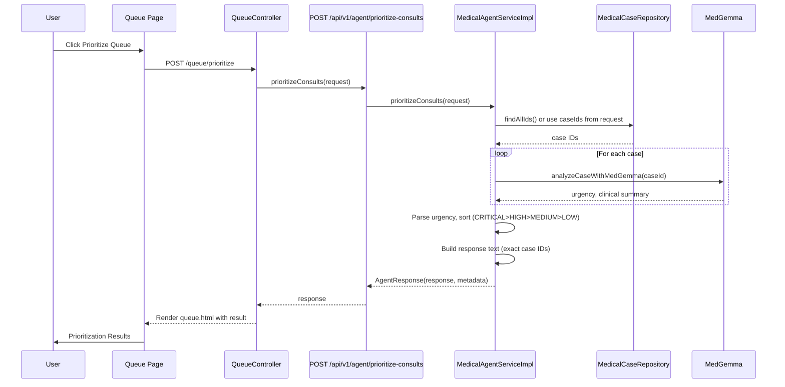
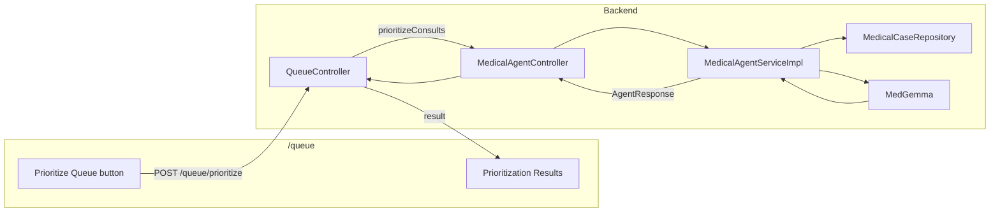

# Consultation Queue

## Purpose

The Consultation Queue (Use Case 3) lets coordinators and department heads prioritize consult requests by clinical
urgency so the sickest patients are seen first. The system uses the case-analyzer skill and MedGemma to analyze each
case, then sorts cases in the backend (CRITICAL, HIGH, MEDIUM, LOW) and returns a deterministic list with exact case
IDs. The UI at `/queue` offers a single "Prioritize Queue" action and shows the results.

## Benefits

- **Urgency-based ordering** – Cases are ordered by clinical urgency and complexity so specialists see the most urgent
  first.
- **Deterministic list** – Prioritization is computed in the backend from MedGemma urgency (parse + sort); the response
  lists all analyzed cases with exact case IDs, no LLM-generated list.
- **Real queue data** – When no case IDs are sent, the backend loads cases from the database and prioritizes over real
  data (or explains when there are no cases).
- **Web UI and API** – Queue page at `/queue` with "Prioritize Queue" and `POST /api/v1/agent/prioritize-consults` for
  headless or automated use.

## How It Works

### User flow

1. User opens **Consultation Queue** (`/queue`).
2. User clicks **Prioritize Queue**.
3. The form POSTs to `/queue/prioritize`; the server calls the agent and returns the result on the same page.
4. **Prioritization Results** shows the ordered list (one line per case with case ID, specialty, urgency).

### Sequence diagram

### Component flow

### API

| Item     | Value                                                                                                |
|----------|------------------------------------------------------------------------------------------------------|
| Endpoint | `POST /api/v1/agent/prioritize-consults`                                                             |
| Request  | Optional JSON: `{ "caseIds": ["id1", "id2"] }` for specific cases; omit to use cases loaded from DB. |
| Response | `AgentResponse`: `response` (prioritization text), `metadata` (e.g. `deterministicOrder`, `skills`). |

## Related

- [Use Cases](USE_CASES.md) – Use Case 3: Prioritizing the Consultation Queue
- [Medical Agent Tools](MEDICAL_AGENT_TOOLS.md) – prioritize-consults and case-analyzer
- [Architecture](ARCHITECTURE.md) – API and pages
