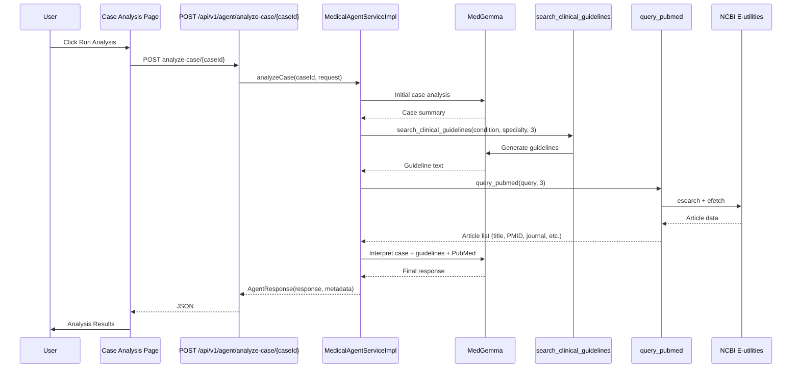
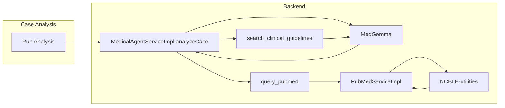

# Evidence Retrieval

## Purpose

Evidence Retrieval provides clinical guidelines and PubMed search so case analysis (Use Case 5: Decision Support) can
include evidence-based recommendations. It is not a standalone screen: the medical agent calls evidence tools during *
*Case Analysis**. The case analysis flow calls `search_clinical_guidelines` and `query_pubmed` directly every time, so
the final response includes guideline-style content and/or literature references (e.g. PMID, journal, title).

## Benefits

- **Clinical guidelines** – Structured recommendations (diagnostic workup, treatment, monitoring) with citations to
  major bodies (e.g. NICE, AHA, ACC, WHO); generated by MedGemma from condition/specialty.
- **PubMed** – Search of the PubMed medical literature database; returns article titles, abstracts, authors, journal,
  year, PMID via NCBI E-utilities.
- **Guaranteed in Case Analysis** – Both evidence tools run on every case analysis; the tool-calling LLM is not used for
  this step.
- **Single entry point** – Users run Case Analysis (`/analyze/{caseId}` or `POST /api/v1/agent/analyze-case/{caseId}`);
  evidence is part of the analysis result.

## How It Works

### User flow

1. User opens **Case Analysis** for a case (`/analyze` or `/analyze/{caseId}`).
2. User clicks **Run Analysis** (POST to `/analyze/{caseId}`).
3. Backend runs MedGemma case analysis, then calls `search_clinical_guidelines` and `query_pubmed` directly with data
   from the case (condition, specialty, chief complaint/diagnosis).
4. MedGemma interprets case analysis + guidelines + PubMed and produces the response.
5. **Analysis Results** shows the response; guideline-style content and/or PMIDs/journals indicate evidence retrieval
   ran.

### Sequence diagram

### Component flow

### Evidence tools

| Tool                         | Parameters                                               | Behavior                                                                                    |
|------------------------------|----------------------------------------------------------|---------------------------------------------------------------------------------------------|
| `search_clinical_guidelines` | condition (required), specialty, maxResults (default 10) | MedGemma generates guideline text with citations; no external API.                          |
| `query_pubmed`               | query (required), maxResults (default 10)                | NCBI E-utilities (esearch + efetch); returns title, abstract, authors, journal, year, PMID. |

### API

| Item                  | Value                                                                                                     |
|-----------------------|-----------------------------------------------------------------------------------------------------------|
| Entry (Case Analysis) | `POST /api/v1/agent/analyze-case/{caseId}`                                                                |
| Request               | Optional JSON body (e.g. `{}`)                                                                            |
| Response              | `AgentResponse`: `response` (analysis text with evidence), `metadata` (map).                              |
| Verify PubMed         | `GET /api/v1/evidence/verify-pubmed?query=GERD&maxResults=3` – confirms PubMed reachable from app server. |

## Related

- [Use Cases](USE_CASES.md) – Use Case 5: Decision Support
- [Medical Agent Tools](MEDICAL_AGENT_TOOLS.md) – evidence tools and agent API
- [Architecture](ARCHITECTURE.md) – Case Analysis and evidence flow

Evidence retrieval is for research and educational purposes only. Review all evidence with qualified medical
professionals before clinical use. This system is not certified for clinical use.
