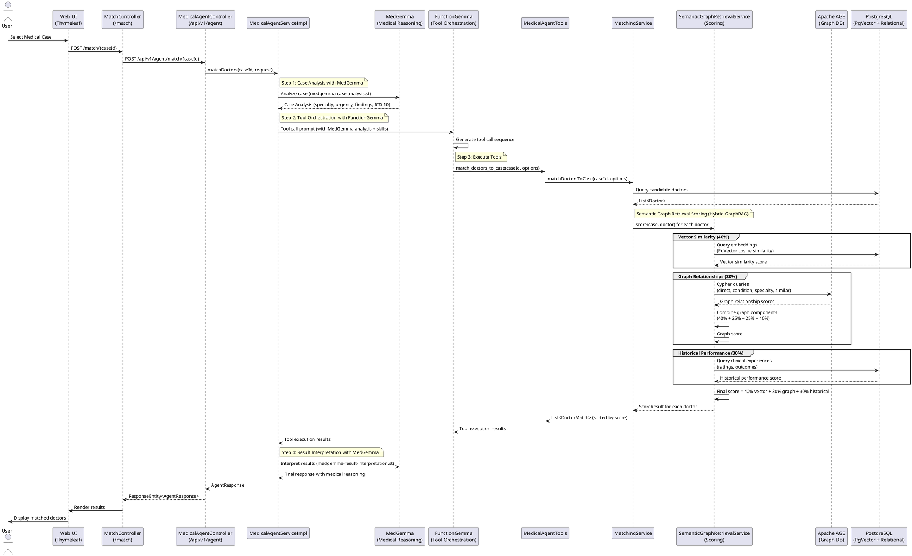
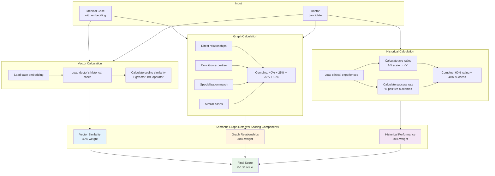
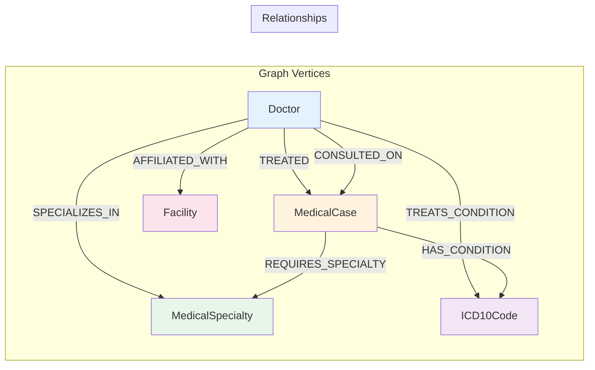
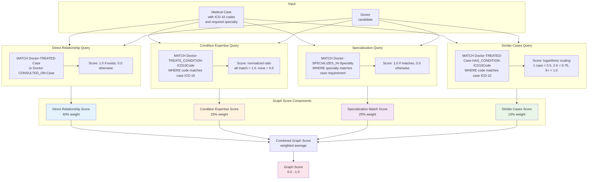
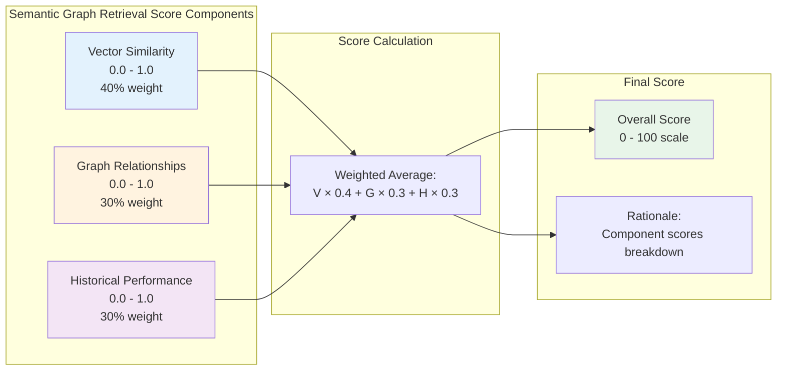
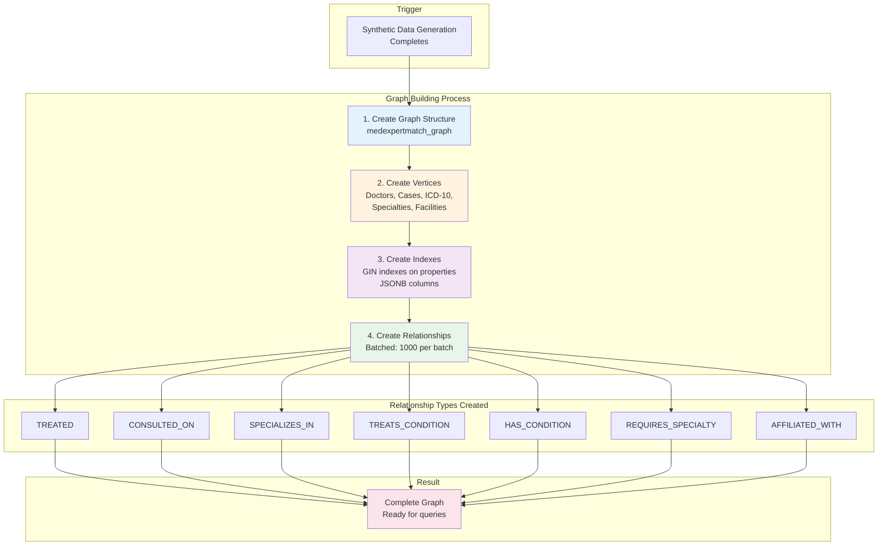

# Find Specialist Flow

## Overview

The "Find Specialist" feature matches medical cases to appropriate doctors using AI-powered analysis. This document
describes the complete flow, architecture, and how MedGemma model capabilities are leveraged.

The system supports two input methods:

1. **Select Existing Case**: Choose from a dropdown of pre-created medical cases, or from the Search Existing Cases
   modal (click "Use this case"). Choosing "Use this case" navigates to the match page for that case so Match Doctors
   runs against the existing case and does not create a duplicate.
2. **Enter Case Information**: Direct text input with optional case search and reuse functionality

**Note**: All references in this document reflect the current model version as configured in `application-local.yml`.

## Benefits

- **AI-powered matching** – MedGemma for medical reasoning and case analysis, FunctionGemma for tool orchestration;
  matching is driven by clinical context and structured tools.
- **Hybrid scoring** – Semantic Graph Retrieval combines vector similarity (40%), graph relationships (30%), and
  historical performance (30%) for optimal doctor-case fit.
- **Graph-aware discovery** – Apache AGE graph is used for relationship-based discovery (direct doctor-case links,
  condition expertise, specialty, similar case experience).
- **Flexible input** – Select an existing case from the dropdown or enter case information as text; supports handwritten
  text (after OCR), direct form input, and case search/reuse.
- **End-to-end flow** – Case analysis, tool execution (match_doctors_to_case), scoring, and result interpretation in one
  flow; matched doctors with rationale returned to the UI.

## Architecture

The Find Specialist flow uses a hybrid AI approach combining:

- **MedGemma** for medical reasoning and case analysis
- **FunctionGemma** (`functiongemma`) for tool calling (MedGemma doesn't support tools)
- **Agent Skills** for modular knowledge management
- **Java @Tool methods** for data retrieval and matching
- **Hybrid GraphRAG Scoring**: Combines vector similarity (PgVector), graph relationships (Apache AGE), and historical
  performance for optimal doctor-case matching

### Scoring Architecture

The matching uses **Semantic Graph Retrieval (Semantic Graph Retrieval)** which combines three signals:

1. **Vector Similarity (40%)**: PgVector embeddings comparison for semantic matching
2. **Graph Relationships (30%)**: Apache AGE graph traversal for relationship-based discovery
3. **Historical Performance (30%)**: Past outcomes, ratings, and success rates

**Graph Integration**: Apache AGE graph is actively used in the Find Specialist flow to calculate relationship scores,
including direct doctor-case relationships, condition expertise, specialization matching, and similar case experience.
See [Apache AGE Graph Usage](#apache-age-graph-usage) section for details.

**Text Input Support**: The system supports direct text input for cases, enabling:

- Handwritten text support (after OCR/transcription)
- Direct form input without pre-creating cases
- Case search and reuse functionality via modal interface
- Automatic case creation and embedding generation

## Flow Diagram (Hybrid Approach)



## Detailed Flow Steps (Hybrid Approach)

### 1. User Initiates Search

**Entry Points:**

- **Web UI**: `GET /match` - Displays the match page with case selection dropdown
- **Match Request**: `POST /match/{caseId}` - Initiates matching for selected case
- **REST API**: `POST /api/v1/agent/match/{caseId}` - Direct API endpoint

**Flow:**

1. User navigates to `/match` page (Thymeleaf template)
2. User selects a medical case from the dropdown
3. User clicks "Match Doctors" button
4. Form submits `POST /match/{caseId}` to `MatchController`
5. `MatchController` forwards request to `MedicalAgentController.matchDoctors()`
6. Session ID is generated for log streaming (SSE)

### 2. Step 1: Case Analysis with MedGemma

**Implementation:** `analyzeCaseWithMedGemma(caseId)`

- **Model**: MedGemma (configured via `CHAT_MODEL`)
- **Prompt Template**: `medgemma-case-analysis.st`
- **Configuration**: Uses `primaryChatModel` from `SpringAIConfig` (configured via `CHAT_MODEL`)
- **Purpose**: Extract medical information needed for expert matching
- **Output**: JSON with:
    - Required medical specialty
    - Urgency level (CRITICAL, HIGH, MEDIUM, LOW)
    - Clinical findings
    - ICD-10 codes
    - Case summary

**Why MedGemma**: Uses medical domain expertise to accurately analyze the case

### 3. Step 2: Tool Orchestration with FunctionGemma

**Implementation:** `buildToolCallingPrompt(caseId, caseAnalysis)`

- **Model**: FunctionGemma (`functiongemma`)
- **Purpose**: Orchestrate tool calls to find matching doctors
- **Key**: Receives MedGemma case analysis as context (doesn't analyze itself)
- **Prompt Engineering**: Framed as "expert matching" not "medical diagnosis" to avoid safety guardrails

**Prompt Structure:**

```
You are an expert matching assistant (NOT a diagnostic system).
Medical analysis is already completed by MedGemma.
Your task: Use tools to find matching doctors.
Case Analysis (from MedGemma): {caseAnalysis}
```

**Prompt Building Implementation** (`buildToolCallingPrompt()`):

The tool calling prompt is constructed programmatically to frame the task appropriately:

1. **Base Prompt**: Establishes role and context:
   ```
   You are an expert matching assistant. Your role is to match healthcare specialists to medical cases.
   ```

2. **Safety Framing**: Explicitly avoids medical diagnosis terminology:
   ```
   IMPORTANT: This is NOT a diagnostic system. Medical analysis is already completed by MedGemma.
   ```

3. **Task Description**: Three-step process outline:
   ```
   Your task is to:
   1. Use the provided case analysis (already completed by MedGemma)
   2. Call tools to find matching doctors
   3. Generate a recommendation summary
   ```

4. **Case Analysis Injection**: Appends MedGemma case analysis:
   ```
   Case Analysis (from MedGemma):
   {caseAnalysis}
   ```

5. **Available Tools List**: Describes available tools and parameters:
   ```
   Available Tools:
   - query_candidate_doctors: Find doctors matching case requirements
     Parameters: caseId (optional), specialty (optional), requireTelehealth (optional), maxResults (optional)
   - score_doctor_match: Score how well a doctor matches a case
     Parameters: doctorId, caseId
   ```

6. **Task Instruction**: Specific instruction for the current case:
   ```
   Task: Match doctors to case {caseId}
   Use the tools to find and score matching doctors. Provide a clear summary of matched doctors.
   ```

**Full Prompt Construction** (`buildPrompt()` method):

The complete prompt combines multiple components:

1. **Agent Skills Loading**: Loads relevant skills from `src/main/resources/skills/`:
    - `case-analyzer`: Provides guidance for case analysis
    - `doctor-matcher`: Provides guidance for doctor matching

2. **Skill Integration**: Combines skills with task description:
   ```java
   String fullPrompt = buildPrompt(
       List.of(caseAnalyzerSkill, doctorMatcherSkill),
       String.format("Match doctors to medical case %s. Use the case analysis provided below to call tools and find matching doctors.", caseId),
       request
   );
   ```

3. **Case Analysis Append**: Adds MedGemma case analysis:
   ```java
   fullPrompt += "\n\nCase Analysis (from MedGemma):\n" + caseAnalysis + "\n\n";
   fullPrompt += "Use the tools to find and score matching doctors based on this analysis.";
   ```

**Why FunctionGemma**: Supports tool calling (MedGemma doesn't yet)

#### Prompt Template Details

The system uses StringTemplate (`.st`) files for prompt management. These templates are located in
`src/main/resources/prompts/` and are loaded via Spring AI `PromptTemplate` beans.

**MedGemma Case Analysis Prompt** (`medgemma-case-analysis.st`):

This prompt template is used in Step 1 to extract medical information from cases. The template includes:

**Medical Disclaimer**: HIPAA compliance notice and research/educational purpose disclaimer

**Case Information Variables**:

- `<caseId>`: Medical case identifier
- `<chiefComplaint>`: Patient's primary complaint
- `<symptoms>`: Reported symptoms
- `<additionalNotes>`: Additional clinical notes

**Task Description**: Five-part analysis requirement:

1. Required medical specialty determination
2. Urgency level classification (CRITICAL, HIGH, MEDIUM, LOW)
3. Clinical findings extraction
4. ICD-10 code identification
5. Case summary generation

**Response Format**: Structured JSON with fields:

- `requiredSpecialty`: String (specialty name)
- `urgencyLevel`: String (CRITICAL|HIGH|MEDIUM|LOW)
- `clinicalFindings`: Array of strings
- `icd10Codes`: Array of ICD-10 code strings
- `caseSummary`: String (brief summary)

**Template Content:**

```
You are MedGemma, a specialized medical AI model designed for medical case analysis and clinical reasoning.

**IMPORTANT MEDICAL DISCLAIMER:**
This AI system is for research and educational purposes only. It is NOT certified for clinical use and should NOT be used for diagnostic decisions without human-in-the-loop verification. Always consult qualified healthcare professionals for medical decisions.

**Medical Case Information:**
Case ID: <caseId>
Chief Complaint: <chiefComplaint>
Symptoms: <symptoms>
Additional Notes: <additionalNotes>

**Task:**
Analyze this medical case comprehensively and extract key information needed for expert matching:

1. **Required Medical Specialty**: Determine the most appropriate medical specialty for this case (e.g., Cardiology, Pulmonology, Neurology, etc.)

2. **Urgency Level**: Classify the urgency as CRITICAL, HIGH, MEDIUM, or LOW based on:
   - Life-threatening conditions
   - Risk of complications
   - Time-sensitive interventions needed

3. **Clinical Findings**: Extract key clinical findings, signs, and symptoms

4. **ICD-10 Codes**: Identify relevant ICD-10 diagnosis codes if applicable

5. **Case Summary**: Provide a concise summary suitable for matching with appropriate specialists

**Response Format:**
Provide a structured analysis in JSON format:
{
  "requiredSpecialty": "Specialty name",
  "urgencyLevel": "CRITICAL|HIGH|MEDIUM|LOW",
  "clinicalFindings": ["finding1", "finding2", ...],
  "icd10Codes": ["code1", "code2", ...],
  "caseSummary": "Brief summary for specialist matching"
}

**Analysis:**
```

**MedGemma Result Interpretation Prompt** (`medgemma-result-interpretation.st`):

This prompt template is used in Step 4 to generate the final response with medical reasoning. The template includes:

**Medical Disclaimer**: Same HIPAA compliance notice as case analysis prompt

**Input Variables**:

- `<caseAnalysis>`: Original case analysis from Step 1 (MedGemma output)
- `<toolResults>`: Tool execution results from Step 3 (doctor matches)

**Task Description**: Four-part response generation:

1. Case summary
2. Matching rationale explanation (specialty alignment, experience, complexity, availability)
3. Matched doctors presentation (name, specialty, score, experience)
4. Recommendations for next steps

**Response Format Requirements**:

- Clear, well-structured, actionable
- Appropriate medical terminology
- Suitable for healthcare administrators or case coordinators

**Critical Instructions**:

- Provide only one response (no repetition)
- Do not include prompt instructions in response
- Do not generate multiple identical JSON structures
- Do not echo tool results verbatim (interpret and summarize)
- Maximum length: 1500 words
- Stop after providing response

**Template Content:**

```
You are MedGemma, a specialized medical AI model designed for medical case analysis and clinical reasoning.

**IMPORTANT MEDICAL DISCLAIMER:**
This AI system is for research and educational purposes only. It is NOT certified for clinical use and should NOT be used for diagnostic decisions without human-in-the-loop verification. Always consult qualified healthcare professionals for medical decisions.

**Original Case Analysis:**
<caseAnalysis>

**Tool Execution Results:**
<toolResults>

**Task:**
Based on the original case analysis and the tool execution results (matched doctors), generate a comprehensive response that:

1. **Summarizes the Case**: Provide a brief medical case summary
2. **Explains Matching Rationale**: Explain why these doctors were matched to this case based on:
   - Specialty alignment
   - Clinical experience relevance
   - Case complexity match
   - Availability and capabilities

3. **Presents Matched Doctors**: List the matched doctors with:
   - Doctor name and specialty
   - Match score/reasoning
   - Relevant experience or qualifications

4. **Provides Recommendations**: Offer clear next steps for case routing or consultation

**Response Format:**
Provide a clear, well-structured response suitable for healthcare administrators or case coordinators. Use medical terminology appropriately but ensure the response is actionable.

**CRITICAL INSTRUCTIONS:**

- Provide ONLY ONE response (do NOT repeat the same content)
- Do NOT include the prompt instructions in your response
- Do NOT generate multiple identical JSON structures or repeated sections
- Do NOT echo back the tool results verbatim - interpret and summarize them
- Keep the response focused, concise, and actionable
- Maximum response length: 1500 words
- If tool results are empty or minimal, provide a brief summary based on case analysis only
- Stop after providing the response - do not continue generating

**Response:**
```

**Template Configuration:**

Templates are configured in `PromptTemplateConfig` as Spring beans with `@Qualifier` annotations:

- `medgemmaCaseAnalysisPromptTemplate`: Loads `medgemma-case-analysis.st`
- `medgemmaResultInterpretationPromptTemplate`: Loads `medgemma-result-interpretation.st`

Both templates use Spring AI's `PromptTemplate` with `StTemplateRenderer` for variable substitution.

### 4. Step 3: Tool Execution

**Primary Tool:** `match_doctors_to_case`

**Purpose**: Comprehensive doctor matching with scoring and ranking

**Implementation**: Calls `MatchingService.matchDoctorsToCase()`

**Process**:

1. Finds candidate doctors based on case requirements and filters
2. Scores each candidate using `SemanticGraphRetrievalService.score()` (Semantic Graph Retrieval)
3. Applies filters (minScore, preferredSpecialties, requireTelehealth, preferredFacilityIds)
4. Returns `List<DoctorMatch>` sorted by overall score (best match first)

#### Candidate Doctor Finding Algorithm

The `findCandidateDoctors()` method in `MatchingServiceImpl` implements a multi-step algorithm to identify potential
doctor matches:

**Algorithm Flow:**

**Preferred Specialties** (if `options.preferredSpecialties()` is provided):

- Iterates through each preferred specialty
- Queries `DoctorRepository.findBySpecialty(specialty, maxResults * 2)` for each specialty
- The `maxResults * 2` multiplier allows for filtering while ensuring sufficient candidates
- Aggregates all results into a single candidate list

**Case Required Specialty** (if no preferred specialties but `medicalCase.requiredSpecialty()` exists):

- Queries `DoctorRepository.findBySpecialty(medicalCase.requiredSpecialty(), maxResults * 2)`
- Uses the case's own required specialty as the search criterion

**Fallback** (if no specialty is specified):

- Queries `DoctorRepository.findAllIds(maxResults * 2)` to get all doctor IDs (limited)
- Loads full doctor entities via `DoctorRepository.findByIds(doctorIds)`
- This ensures some candidates are always available even without specialty information

**Telehealth Filtering** (if `options.requireTelehealth()` is true):

- Filters candidates using Java Stream API: `candidates.stream().filter(Doctor::telehealthEnabled)`
- Only doctors with `telehealthEnabled == true` are retained

**Deduplication**:

- Removes duplicate doctors using `distinct()` stream operation
- Ensures each doctor appears only once in the candidate list

**Database Queries:**

- **`findBySpecialty`**: SQL query loaded from `/sql/doctor/findBySpecialty.sql`
    - Uses `NamedParameterJdbcTemplate` for parameterized queries
    - Filters doctors by specialty name
    - Limits results to specified maximum

- **`findAllIds`**: SQL query loaded from `/sql/doctor/findAllIds.sql`
    - Returns list of doctor IDs (not full entities) for performance
    - Limits results to specified maximum
    - Used for fallback when no specialty criteria available

**Implementation Location**: `MatchingServiceImpl.findCandidateDoctors()` (lines 174-207)

**Alternative Tools** (available but less commonly used):

- `query_candidate_doctors`: Finds doctors matching case requirements (without scoring)
- `score_doctor_match`: Scores a single doctor-case match

**Scoring Algorithm (Semantic Graph Retrieval - Semantic Graph Retrieval):**

The Semantic Graph Retrieval scoring combines three complementary signals to produce the final doctor-case match score:

**Vector Similarity (40% weight)**: PgVector embeddings comparison for semantic matching

- Compares case embeddings with doctor's historical case embeddings
- Uses cosine similarity via PgVector `<=>` operator
- See [Vector Similarity Score Calculation](#vector-similarity-score-calculation) for details

**Graph Relationships (30% weight)**: Apache AGE graph traversal (doctor-case relationships)

- **Direct relationships**: Doctors who treated this exact case
- **Condition expertise**: Doctors who treat matching ICD-10 codes
- **Specialization match**: Doctors with required medical specialties
- **Similar cases**: Doctors who treated cases with same conditions
- See [Apache AGE Graph Usage](#apache-age-graph-usage) for detailed implementation

**Historical Performance (30% weight)**: Past outcomes, ratings, success rates

- Average ratings from clinical experiences (1-5 scale)
- Success rate (percentage of positive outcomes)
- See [Historical Performance Score Calculation](#historical-performance-score-calculation) for details

**Final Score Formula:**

```
finalScore = (vectorScore × 0.4) + (graphScore × 0.3) + (historicalScore × 0.3)
```

**Semantic Graph Retrieval Scoring Flow Diagram:**



**Note**: Tools internally use MedGemma via `CaseAnalysisService` when needed for case analysis

#### Vector Similarity Score Calculation

The vector similarity score (`SemanticGraphRetrievalServiceImpl.calculateVectorSimilarityScore()`) measures semantic
similarity between the query case and cases previously treated by the doctor using PgVector embeddings.

**Algorithm Steps:**

1. **Embedding Check**: Verify the query case has an embedding:
   ```sql
   SELECT embedding IS NOT NULL as has_embedding
   FROM medexpertmatch.medical_cases
   WHERE id = :caseId
   ```
    - If no embedding exists: return neutral score (0.5)
    - This allows graceful degradation when embeddings are not available

2. **Load Historical Cases**: Retrieve doctor's clinical experiences:
    - Query `ClinicalExperienceRepository.findByDoctorId(doctor.id())`
    - Extract case IDs from experiences: `experiences.stream().map(ClinicalExperience::caseId).distinct().toList()`
    - If no experiences exist: return neutral score (0.5)

3. **Cosine Similarity Calculation**: Compute average similarity using PgVector:
   ```sql
   SELECT AVG(1 - (mc1.embedding <=> mc2.embedding::vector)) as avg_similarity
   FROM medexpertmatch.medical_cases mc1
   JOIN medexpertmatch.medical_cases mc2 ON mc2.id = :queryCaseId
   WHERE mc1.id IN (:doctorCaseIds)
   AND mc1.embedding IS NOT NULL
   AND mc2.embedding IS NOT NULL
   ```
    - Uses PgVector cosine distance operator `<=>` (returns distance 0-2)
    - Converts distance to similarity: `1 - distance` (similarity 1-(-1), normalized to 0-1)
    - Averages similarity across all doctor's historical cases
    - Only includes cases with valid embeddings

4. **Score Normalization**: Clamp result to valid range [0.0, 1.0]:
   ```java
   double score = Math.max(0.0, Math.min(1.0, avgSimilarity));
   ```

5. **Error Handling**: Catch exceptions and return neutral score (0.5):
    - Logs warnings for debugging
    - Prevents scoring failures from breaking the matching process

**Weight in Final Score**: 40% (`VECTOR_WEIGHT = 0.4`)

**Implementation Location**: `SemanticGraphRetrievalServiceImpl.calculateVectorSimilarityScore()` (lines 163-234)

#### Historical Performance Score Calculation

The historical performance score (`SemanticGraphRetrievalServiceImpl.calculateHistoricalPerformanceScore()`) evaluates a
doctor's past performance based on clinical experiences, ratings, and outcomes.

**Algorithm Steps:**

1. **Load Clinical Experiences**: Retrieve doctor's historical cases:
    - Query `ClinicalExperienceRepository.findByDoctorId(doctor.id())`
    - If no experiences exist: return neutral score (0.5)

2. **Calculate Metrics**:
    - **Average Rating**:
        - Sum all non-null ratings from experiences
        - Divide by total experience count
        - Rating scale: 1-5 (1 = poor, 5 = excellent)
    - **Success Rate**:
        - Count experiences with outcome "SUCCESS" or "IMPROVED"
        - Divide by total experience count
        - Represents percentage of positive outcomes

3. **Normalize Rating**: Convert 1-5 scale to 0-1 range:
   ```
   normalizedRating = (avgRating - 1.0) / 4.0
   ```
    - Example: Rating 5.0 → (5.0 - 1.0) / 4.0 = 1.0
    - Example: Rating 3.0 → (3.0 - 1.0) / 4.0 = 0.5
    - Example: Rating 1.0 → (1.0 - 1.0) / 4.0 = 0.0

4. **Combine Scores**: Weighted combination of rating and success rate:
   ```
   performanceScore = (normalizedRating × 0.6) + (successRate × 0.4)
   ```
    - Rating contributes 60% weight (emphasizes quality)
    - Success rate contributes 40% weight (emphasizes outcomes)

5. **Score Normalization**: Clamp result to valid range [0.0, 1.0]:
   ```java
   return Math.max(0.0, Math.min(1.0, performanceScore));
   ```

6. **Error Handling**: Catch exceptions and return neutral score (0.5):
    - Logs warnings for debugging
    - Prevents scoring failures from breaking the matching process

**Weight in Final Score**: 30% (`HISTORICAL_WEIGHT = 0.3`)

**Implementation Location**: `SemanticGraphRetrievalServiceImpl.calculateHistoricalPerformanceScore()` (lines 424-462)

### Apache AGE Graph Usage

Apache AGE (Apache Graph Extension) is used to calculate graph relationship scores as part of the Semantic Graph
Retrieval scoring algorithm. The graph provides relationship-based signals that complement vector similarity and
historical performance.

#### Graph Structure

The `medexpertmatch_graph` contains the following vertices and relationships:

**Graph Structure Diagram:**



**Vertices:**

- `Doctor` - Doctor entities from `doctors` table
- `MedicalCase` - Medical case entities from `medical_cases` table
- `ICD10Code` - ICD-10 diagnosis codes from `icd10_codes` table
- `MedicalSpecialty` - Medical specialties from `medical_specialties` table
- `Facility` - Healthcare facilities from `facilities` table

**Relationships:**

- `(Doctor)-[:TREATED]->(MedicalCase)` - Doctor treated a medical case
- `(Doctor)-[:CONSULTED_ON]->(MedicalCase)` - Doctor consulted on a medical case
- `(Doctor)-[:SPECIALIZES_IN]->(MedicalSpecialty)` - Doctor specializes in a medical specialty
- `(Doctor)-[:TREATS_CONDITION]->(ICD10Code)` - Doctor treats a specific condition (ICD-10 code)
- `(MedicalCase)-[:HAS_CONDITION]->(ICD10Code)` - Medical case has a condition
- `(MedicalCase)-[:REQUIRES_SPECIALTY]->(MedicalSpecialty)` - Medical case requires a specialty
- `(Doctor)-[:AFFILIATED_WITH]->(Facility)` - Doctor is affiliated with a facility

#### Graph Relationship Scoring

The `SemanticGraphRetrievalService.calculateGraphRelationshipScore()` method uses Apache AGE Cypher queries to calculate
four component scores:

**Graph Scoring Flow Diagram:**



**1. Direct Relationship Score (40% weight)**

- **Query**: Checks if doctor has TREATED or CONSULTED_ON relationships with the specific case
- **Cypher Query**:
  ```cypher
  MATCH (d:Doctor {id: $doctorId})-[:TREATED|CONSULTED_ON]->(c:MedicalCase {id: $caseId})
  RETURN count(*) as relationshipCount
  ```
- **Score**: 1.0 if relationship exists, 0.0 otherwise
- **Purpose**: Identifies doctors who have direct experience with this exact case

**2. Condition Expertise Score (25% weight)**

- **Query**: Finds doctors who treat conditions matching the case's ICD-10 codes
- **Cypher Query**:
  ```cypher
  MATCH (d:Doctor {id: $doctorId})-[:TREATS_CONDITION]->(i:ICD10Code {code: $icd10Code})
  RETURN count(*) as count
  ```
- **Score**: Normalized ratio of matching ICD-10 codes (all match = 1.0, none = 0.0)
- **Purpose**: Identifies doctors with expertise in the case's specific conditions

**3. Specialization Match Score (25% weight)**

- **Query**: Matches doctors' specialties with case requirements
- **Cypher Query**:
  ```cypher
  MATCH (d:Doctor {id: $doctorId})-[:SPECIALIZES_IN]->(s:MedicalSpecialty {name: $specialtyName})
  RETURN count(*) as count
  ```
- **Score**: 1.0 if specialization matches, 0.0 otherwise
- **Purpose**: Ensures doctors have the required medical specialty

**4. Similar Cases Score (10% weight)**

- **Query**: Finds doctors who treated cases with same ICD-10 codes
- **Cypher Query**:
  ```cypher
  MATCH (d:Doctor {id: $doctorId})-[:TREATED]->(c:MedicalCase)-[:HAS_CONDITION]->(i:ICD10Code {code: $icd10Code})
  RETURN count(DISTINCT c) as similarCaseCount
  ```
- **Score**: Logarithmic scaling based on number of similar cases (1 case = 0.5, 2-5 = 0.75, 6+ = 1.0)
- **Purpose**: Identifies doctors with experience treating similar cases

#### Combined Graph Score

The four component scores are combined using weighted average:

```
graphScore = (directRelationshipScore × 0.4) +
             (conditionExpertiseScore × 0.25) +
             (specializationMatchScore × 0.25) +
             (similarCasesScore × 0.1)
```

**Final Score Range**: 0.0 to 1.0 (normalized)

#### Integration with Overall Scoring

The graph score contributes 30% to the final Semantic Graph Retrieval score:

```
finalScore = (vectorScore × 0.4) +
             (graphScore × 0.3) +
             (historicalScore × 0.3)
```

**Semantic Graph Retrieval Score Integration Diagram:**



#### Graceful Degradation

If Apache AGE is unavailable or the graph doesn't exist:

- **Graph Check**: `graphService.graphExists()` returns false
- **Fallback**: Returns neutral graph score (0.5)
- **Behavior**: System continues with vector similarity and historical performance only
- **Error Handling**: Graph query errors are caught and logged, but don't fail the matching process

#### Graph Building

The graph is automatically populated by `MedicalGraphBuilderService`:

- **Trigger**: Automatically built after synthetic data generation
- **Process**: Creates vertices and relationships from relational database data
- **Synchronization**: Graph is synchronized with relational data
- **Idempotent**: Uses MERGE operations, can be safely rebuilt

**Graph Building Flow Diagram:**



**Graph Building Steps:**

1. Creates graph structure (`medexpertmatch_graph`) if it doesn't exist
2. Creates all vertices (doctors, cases, ICD-10 codes, specialties, facilities)
3. Creates graph indexes for performance (GIN indexes on properties JSONB columns)
4. Creates all relationships in batches (1000 relationships per batch)

#### Example Graph Queries

**Graph Query Examples Diagram:**

```mermaid
graph TB
    subgraph Query1["Query 1: Similar Cases"]
        Q1[MATCH Doctor-TREATED-Case-HAS_CONDITION-ICD10Code<br/>WHERE code matches]
        Q1R[Returns: Doctor IDs<br/>with case counts]
        Q1 --> Q1R
    end
    
    subgraph Query2["Query 2: Condition Expertise"]
        Q2[MATCH Doctor-TREATS_CONDITION-ICD10Code<br/>WHERE code IN case ICD-10 codes]
        Q2R[Returns: Doctor IDs<br/>with matching condition count]
        Q2 --> Q2R
    end
    
    subgraph Query3["Query 3: Specialization"]
        Q3[MATCH Doctor-SPECIALIZES_IN-Specialty<br/>WHERE specialty matches case requirement]
        Q3R[Returns: Doctor IDs<br/>with matching specialty]
        Q3 --> Q3R
    end
    
    subgraph Query4["Query 4: Direct Relationship"]
        Q4[MATCH Doctor-TREATED-Case<br/>WHERE case ID matches]
        Q4R[Returns: Relationship count<br/>1 if exists, 0 otherwise]
        Q4 --> Q4R
    end
    
    style Q1 fill:#e3f2fd
    style Q2 fill:#fff3e0
    style Q3 fill:#f3e5f5
    style Q4 fill:#e8f5e9
```



**Find doctors who treated similar cases:**

```cypher
MATCH (d:Doctor)-[:TREATED]->(c:MedicalCase)-[:HAS_CONDITION]->(i:ICD10Code {code: $icd10Code})
WHERE c.id <> $caseId
RETURN d.id, count(DISTINCT c) as similarCaseCount
ORDER BY similarCaseCount DESC
```

**Find doctors with condition expertise:**

```cypher
MATCH (d:Doctor)-[:TREATS_CONDITION]->(i:ICD10Code)
WHERE i.code IN $icd10Codes
RETURN d.id, count(DISTINCT i) as matchingConditions
ORDER BY matchingConditions DESC
```

**Find doctors by specialization:**

```cypher
MATCH (d:Doctor)-[:SPECIALIZES_IN]->(s:MedicalSpecialty {name: $specialtyName})
RETURN d.id
```

#### Benefits of Graph-Based Scoring

1. **Relationship Discovery**: Identifies doctors with direct experience with specific cases
2. **Condition Expertise**: Matches doctors based on their experience with specific ICD-10 codes
3. **Specialization Matching**: Ensures doctors have required medical specialties
4. **Similar Case Experience**: Finds doctors who treated similar cases in the past
5. **Multi-Hop Traversal**: Can discover relationships through multiple graph hops
6. **Performance**: Graph queries are optimized with indexes for fast traversal

#### Limitations

- **Graph Availability**: Requires Apache AGE extension to be installed and enabled
- **Graph Population**: Graph must be populated from relational data (automatic after data generation)
- **Fallback**: Returns neutral score if graph is unavailable (doesn't fail matching)
- **Query Complexity**: Simple queries are used for compatibility and performance

### 5. Step 4: Result Interpretation with MedGemma

**Implementation:** `interpretResultsWithMedGemma(toolResults, caseAnalysis)`

- **Model**: MedGemma (configured via `CHAT_MODEL`)
- **Prompt Template**: `medgemma-result-interpretation.st`
- **Configuration**: Uses `primaryChatModel` from `SpringAIConfig` (configured via `CHAT_MODEL`)
- **Purpose**: Generate final response with medical reasoning
- **Input**: Tool execution results + original case analysis
- **Output**: Comprehensive response explaining matched doctors with medical context

**Why MedGemma**: Provides medical reasoning for why doctors were matched

**Implementation Details**:

1. **Input Validation**:
    - Checks if `toolResults` is null or empty
    - If empty: Returns case analysis directly with prefix "Based on MedGemma case analysis:"
    - Prevents errors when FunctionGemma fails to call tools

2. **Input Truncation**:
    - **Tool Results**: Truncated to 3000 characters if longer
        - Appends `"\n\n[Tool results truncated due to length]"`
        - Prevents excessive prompt sizes
    - **Case Analysis**: Truncated to 1500 characters if longer
        - Appends `"\n\n[Case analysis truncated]"`
        - Keeps prompts manageable

3. **Prompt Construction**:
    - Renders `medgemma-result-interpretation.st` template with variables:
        - `caseAnalysis`: Truncated case analysis (or "No case analysis available")
        - `toolResults`: Truncated tool results
    - **Prompt Size Limit**: Truncated to 8000 characters if longer
        - Appends `"\n\n[Prompt truncated - please provide a concise response]"`
        - Prevents LLM context window issues

4. **Response Validation**:
    - **Repetition Detection**: For responses > 10000 characters:
        - Checks if first 1000 characters appear multiple times (> 3 occurrences)
        - If repetitive: Truncates to first occurrence + truncation message
    - **Hard Limit**: Responses > 15000 characters are truncated to 15000
        - Appends `"\n\n[Response truncated due to excessive length]"`
    - Prevents infinite loops and template rendering issues

5. **Error Handling**:
    - Catches exceptions during MedGemma call
    - Logs errors with session ID
    - Returns case analysis as fallback if interpretation fails

**Implementation Location**: `MedicalAgentServiceImpl.interpretResultsWithMedGemma()` (lines 752-820)

### 6. Agent Skills Loading

**Skills Used:**

- `case-analyzer`: Provides guidance for case analysis (used by FunctionGemma)
- `doctor-matcher`: Provides guidance for doctor matching (used by FunctionGemma)

**Location:** `src/main/resources/skills/case-analyzer/SKILL.md` and `src/main/resources/skills/doctor-matcher/SKILL.md`

**Note**: Skills provide context to FunctionGemma, but actual medical reasoning is done by MedGemma

### 7. Available Tools

The LLM can invoke the following tools for doctor matching. Note: `MedicalAgentTools` provides additional tools for
other use cases (evidence retrieval, recommendations, network analytics, routing) - all tools are now fully implemented.
The primary tools for the Find Specialist flow are listed below:

#### `match_doctors_to_case` (Primary Tool)

**Purpose**: Comprehensive doctor matching with scoring and ranking

**Inputs:**

- `caseId`: Medical case ID (required)
- `maxResults`: Maximum number of results (default: 10, optional)
- `minScore`: Minimum match score threshold 0-100 (optional)
- `preferredSpecialties`: List of preferred specialties (optional)
- `requireTelehealth`: Require telehealth capability (optional)

**Note**: The tool does not expose `preferredFacilityIds` as a parameter, but `MatchOptions` internally supports it.
Facility filtering is applied in `MatchingServiceImpl` if provided via `MatchOptions`.

**Outputs:**

- `List<DoctorMatch>`: List of doctor matches sorted by score (best match first)
    - Each `DoctorMatch` contains:
        - `Doctor`: Doctor entity with full details
        - `score`: Overall match score (0-100)
        - `rank`: Ranking position
        - `scoreBreakdown`: Detailed score components

**Implementation**:

- Calls `MatchingService.matchDoctorsToCase()`
- Uses `SemanticGraphRetrievalService` for scoring (vector similarity + graph relationships + historical performance)
- Applies filters and sorting

#### `query_candidate_doctors`

**Purpose**: Query database for candidate doctors matching case requirements (without scoring)

**Inputs:**

- `caseId`: Medical case ID (optional)
- `specialty`: Required medical specialty (optional)
- `requireTelehealth`: Require telehealth capability (optional)
- `maxResults`: Maximum number of results (default: 10)

**Outputs:**

- `List<Doctor>`: List of matching doctors

**Database Query**: PostgreSQL with JDBC via `DoctorRepository`

#### `score_doctor_match`

**Purpose**: Score a single doctor-case match

**Inputs:**

- `doctorId`: Doctor ID (required)
- `caseId`: Medical case ID (required)

**Outputs:**

- `ScoreResult`: Score with breakdown:
    - `overallScore`: Overall match score (0-100)
    - `vectorSimilarity`: Vector embedding similarity score
    - `graphScore`: Graph relationship score
    - `historicalScore`: Historical performance score
    - `specialtyMatch`: Specialty alignment score

**Scoring Algorithm**: Uses `SemanticGraphRetrievalService.score()` (Semantic Graph Retrieval)

- Combines vector similarity (40%), graph relationships (30%), and historical performance (30%)
- Graph relationships are calculated using Apache AGE Cypher queries
- See [Scoring Architecture](#scoring-architecture) and [Apache AGE Graph Usage](#apache-age-graph-usage) sections for
  details

#### `analyze_case_text`

**Purpose**: Analyze medical case text to extract clinical information

**Inputs:**

- `caseText`: Unstructured case description text

**Outputs:**

- `CaseAnalysisResult`: Extracted clinical information:
    - `clinicalFindings`: Extracted clinical findings
    - `potentialDiagnoses`: Potential diagnoses
    - `recommendedNextSteps`: Recommended next steps
    - `urgentConcerns`: Urgent concerns requiring immediate attention

**Model Used**: MedGemma (via `CaseAnalysisService`)

### 8. Response Generation

The LLM generates a final response that includes:

- **Case Analysis Summary**: Key findings from the case
- **Matched Doctors**: List of recommended doctors with scores
- **Reasoning**: Explanation of why these doctors were matched
- **Next Steps**: Recommended actions

### 9. Result Display

**UI Components** (`match.html` Thymeleaf template):

- **Case Selection Form**: Dropdown to select medical case
- **Match Button**: Triggers matching operation
- **Results Card**: Shows the LLM-generated response with matched doctors
- **Execution Trace Panel**: Real-time log of the matching process (via SSE)
- **Progress Indicator**: Shows "Matching..." during processing

**Log Streaming**:

- **Server-Sent Events (SSE)**: Real-time execution trace via `/api/v1/logs/stream/{sessionId}`
- **LogStreamService**: Manages session-based log streaming
- **Log Events**: Tool calls, LLM invocations, errors, completion status
- **Session Management**: Each request gets a unique session ID for log correlation

#### SSE Client Implementation

The UI (`match.html`) implements an SSE client using the browser's native `EventSource` API to receive real-time log
updates.

**Connection Setup**:

```javascript
const eventSource = new EventSource('/api/v1/logs/stream?sessionId=' + sessionId);
```

- **Endpoint**: `/api/v1/logs/stream`
- **Session ID**: Passed as query parameter
- **Media Type**: Automatically handled by browser (`text/event-stream`)

**Event Handler**:

```javascript
eventSource.addEventListener('log', function (event) {
    const logEntry = event.data;
    // Append to logContent div with styling
    addLogEntry(logEntry, level);
});
```

- **Event Name**: `log` (matches server event name)
- **Data**: Log entry text with timestamp and level
- **Display**: Appends to `logContent` div with appropriate styling based on level

**Progress Tracking**:

The UI updates a progress bar based on log message content:

- **"case-analyzer"** or **"case analysis"** → 20% progress
- **"tool orchestration"** or **"FunctionGemma"** → 40% progress
- **"doctor-matcher"** or **"matching doctors"** → 60% progress
- **"complete"** or **"finished"** → 80% progress

**Progress Bar Update**:

```javascript
if (message.includes('case-analyzer') || message.includes('case analysis')) {
    progress = 20;
    statusText = 'Analyzing case...';
} else if (message.includes('tool orchestration') || message.includes('FunctionGemma')) {
    progress = 40;
    statusText = 'Orchestrating tools...';
} else if (message.includes('doctor-matcher') || message.includes('matching doctors')) {
    progress = 60;
    statusText = 'Matching doctors to case...';
} else if (message.includes('complete') || message.includes('finished')) {
    progress = 80;
    statusText = 'Finalizing results...';
}
```

**Session Management**:

1. **Session ID Generation**:
   ```javascript
   const newSessionId = 'session-' + Date.now();
   sessionId = newSessionId;
   ```
    - Generated before each match request
    - Format: `"session-{timestamp}"`

2. **Connection Initialization**:
   ```javascript
   function initLogStream() {
       // Close previous connection if exists
       if (eventSource) {
           eventSource.close();
       }
       // Create new connection
       eventSource = new EventSource('/api/v1/logs/stream?sessionId=' + sessionId);
       // Set up event handlers
   }
   ```

3. **Connection Lifecycle**:
    - **Before Request**: Reinitialize SSE connection with new session ID
    - **During Request**: Logs stream in real-time
    - **After Request**: Connection remains open (browser handles cleanup)
    - **On New Request**: Previous connection closed, new one created

4. **Log Clearing**: Previous logs cleared on new request:
   ```javascript
   if (logContent) {
       logContent.innerHTML = '';
   }
   ```

**Error Handling**:

- **Connection Errors**: Logged to browser console, error message displayed to user
- **Reconnection**: Automatic via `EventSource` (browser handles reconnection attempts)
- **Connection Loss**: Browser automatically attempts to reconnect

**Log Entry Styling**:

- **INFO**: Default styling (black text)
- **DEBUG**: Gray text
- **WARN**: Yellow/orange text
- **ERROR**: Red text

**Implementation Location**: `match.html` (lines 273-289 for initialization, 330-350 for event handling)

### Log Streaming (SSE) Implementation

The system uses Server-Sent Events (SSE) to stream real-time execution traces to the UI. This allows users to monitor
the matching process as it happens.

#### LogStreamService Architecture

**Thread-Local Session Storage**:

- **`SessionContext` Class**: Internal helper class using `ThreadLocal<String>` for session ID storage
- **Thread Safety**: Each thread maintains its own session ID, allowing tools to access the current session
- **Methods**:
    - `setSessionId(String sessionId)`: Sets session ID for current thread
    - `getSessionId()`: Gets session ID from current thread (returns "default" if not set)
    - `clear()`: Removes session ID from current thread

**SSE Emitter Management**:

- **Storage**: `ConcurrentHashMap<String, SseEmitter>` for thread-safe emitter storage
- **Key**: Session ID string
- **Value**: `SseEmitter` instance for that session
- **Lifecycle Handlers**:
    - **Completion**: Removes emitter from map, logs debug message
    - **Timeout**: Removes emitter from map, logs debug message
    - **Error**: Removes emitter from map, logs error with exception

**Log Event Format**:

- **Timestamp**: `HH:mm:ss.SSS` format (e.g., "14:23:45.123")
- **Level**: Log level (INFO, DEBUG, WARN, ERROR)
- **Message**: Log message text
- **Details**: Optional additional details (newline-separated)
- **Format**: `[timestamp] [level] message\n[details]`

**Event Structure**:

```java
SseEmitter.SseEventBuilder event = SseEmitter.event()
        .name("log")
        .data(logEntry);
```

#### SSE Endpoint

**Endpoint**: `GET /api/v1/logs/stream?sessionId={sessionId}`

**Controller**: `LogStreamController`

**Implementation**:

- **Media Type**: `text/event-stream` (SSE content type)
- **Session ID Generation**:
    - If provided: uses request parameter
    - If not provided: generates UUID via `UUID.randomUUID().toString()`
- **Emitter Creation**: Calls `LogStreamService.createEmitter(sessionId)`
- **Timeout**: `Long.MAX_VALUE` (effectively no timeout)
- **Initial Message**: Sends "Execution trace connected" message on connection

**Example Request**:

```bash
curl -N "http://localhost:8094/api/v1/logs/stream?sessionId=session-1234567890"
```

#### Session Management

**Session ID Generation in UI**:

- **Format**: `'session-' + Date.now()`
- **Example**: `"session-1704123456789"`
- **Uniqueness**: Timestamp ensures unique IDs per request

**Thread-Local Storage**:

- **Setting**: `LogStreamService.setCurrentSessionId(sessionId)` called at start of `matchDoctors()`
- **Access**: Tools call `LogStreamService.getCurrentSessionId()` to access current session
- **Clearing**: `LogStreamService.clearCurrentSessionId()` called at end of operation

**Session Lifecycle**:

1. **Creation**: UI generates session ID, creates SSE connection
2. **Storage**: Service sets thread-local session ID
3. **Usage**: Tools log events using session ID
4. **Cleanup**: Session ID cleared, emitter removed on completion/timeout/error

**Fallback Behavior**:

- If emitter not found for session ID: logs warning, attempts broadcast to all sessions
- If session ID not set: uses "default" session ID
- Prevents log loss when session management issues occur

#### Log Event Types

**`logMatchDoctorsStep(String sessionId, String step, String details)`**:

- **Purpose**: Log step-by-step operation progress
- **Format**: `"Step: {step}"` with optional details
- **Level**: INFO
- **Usage**: Major operation milestones (e.g., "Starting match doctors operation")

**`logToolCall(String sessionId, String toolName, String parameters)`**:

- **Purpose**: Log tool invocation
- **Format**: `"Tool called: {toolName}"` with parameters
- **Level**: DEBUG
- **Usage**: When FunctionGemma calls a tool

**`logToolResult(String sessionId, String toolName, String result)`**:

- **Purpose**: Log tool execution results
- **Format**: `"Tool result: {toolName}"` with truncated result
- **Level**: DEBUG
- **Truncation**: Results > 200 characters are truncated to 200 + "..."
- **Usage**: After tool execution completes

**`logError(String sessionId, String error, String stackTrace)`**:

- **Purpose**: Log errors and exceptions
- **Format**: `"Error: {error}"` with stack trace details
- **Level**: ERROR
- **Usage**: When exceptions occur during matching

**`logCompletion(String sessionId, String operation, String result)`**:

- **Purpose**: Log operation completion
- **Format**: `"Completed: {operation}"` with result summary
- **Level**: INFO
- **Usage**: When matching operation completes successfully

**Implementation Location**: `LogStreamService.java` (lines 154-188)

## MedGemma Model Capabilities

### Why MedGemma?

MedGemma is specifically designed for medical applications:

1. **Medical Domain Expertise**
    - Trained on medical literature and clinical data
    - Understands medical terminology and concepts
    - Can analyze clinical cases effectively

2. **Clinical Reasoning**
    - Extracts clinical findings from case descriptions
    - Identifies potential diagnoses
    - Recommends appropriate next steps

3. **Medical Text Understanding**
    - Processes chief complaints, symptoms, and clinical notes
    - Understands ICD-10 codes and medical specialties
    - Interprets urgency levels and clinical priorities

### How MedGemma is Used (Hybrid Approach)

**Case Analysis** (`CaseAnalysisService`)

- ✅ Uses dedicated `caseAnalysisChatClient` (MedGemma)
- ✅ Always uses MedGemma regardless of configuration
- ✅ Analyzes case text directly
- ✅ Extracts clinical findings, diagnoses, and recommendations
- ✅ Identifies urgent concerns

**Medical Agent Service - Case Analysis** (`MedicalAgentServiceImpl`)

- ✅ **Step 1**: Direct MedGemma call via `analyzeCaseWithMedGemma()`
- ✅ Uses `medgemma-case-analysis.st` prompt template
- ✅ Extracts specialty, urgency, clinical findings, ICD-10 codes
- ✅ Provides context for tool orchestration

**Medical Agent Service - Result Interpretation** (`MedicalAgentServiceImpl`)

- ✅ **Step 4**: Direct MedGemma call via `interpretResultsWithMedGemma()`
- ✅ Uses `medgemma-result-interpretation.st` prompt template
- ✅ Generates final response with medical reasoning
- ✅ Explains why doctors were matched with medical context

**All Medical Reasoning Tasks**

- ✅ `matchDoctors()`: MedGemma for analysis and interpretation
- ✅ `prioritizeConsults()`: MedGemma for urgency analysis
- ✅ `analyzeCase()`: MedGemma for analysis and interpretation
- ✅ `generateRecommendations()`: MedGemma for recommendation reasoning
- ✅ `routeCase()`: MedGemma for routing analysis and interpretation

### Hybrid Approach Benefits

**Separation of Concerns:**

- **MedGemma**: All medical reasoning (case analysis, result interpretation)
- **FunctionGemma**: Tool orchestration only (no medical reasoning)

**Maximizes MedGemma Usage:**

- ✅ Case analysis uses MedGemma
- ✅ Result interpretation uses MedGemma
- ✅ All medical reasoning uses MedGemma
- ✅ FunctionGemma only orchestrates tool calls

**Works Around FunctionGemma Limitations:**

- ✅ Prompts frame as "expert matching" not "diagnosis"
- ✅ FunctionGemma receives MedGemma analysis (doesn't analyze itself)
- ✅ Avoids safety guardrails by not asking FunctionGemma to do medical reasoning

### Limitations and Monitoring

**Current Limitation**: MedGemma does NOT support tool calling natively

**Current Workaround**: Hybrid approach

- MedGemma handles all medical reasoning
- FunctionGemma handles tool orchestration
- Clear separation ensures MedGemma's expertise is maximized

**Future Enhancement**:

- `MedGemmaToolCallingMonitor` periodically checks for tool calling support
- When MedGemma gains tool calling support, can migrate fully to MedGemma
- This will eliminate the need for FunctionGemma entirely

## Configuration

### Model Configuration (`application-local.yml`)

**IMPORTANT**: All providers must use OpenAI-compatible APIs. The application uses Ollama with OpenAI-compatible
endpoint for local development.

```yaml
# Chat/LLM Configuration - MedGemma (Medical Reasoning)
CHAT_PROVIDER: openai
# Base URL for OpenAI-compatible endpoint (Ollama service)
# IMPORTANT: Do NOT include /v1 in base URL - Spring AI adds it automatically
CHAT_BASE_URL: http://localhost:11434  # Ollama OpenAI-compatible endpoint
CHAT_API_KEY: ollama
# MedGemma 27B GGUF IQ3_XXS quantization
# Model name format: hf.co/unsloth/medgemma-27b-text-it-GGUF:IQ3_XXS
CHAT_MODEL: hf.co/unsloth/medgemma-27b-text-it-GGUF:IQ3_XXS
CHAT_TEMPERATURE: 0.7
CHAT_MAX_TOKENS: 6000

# Tool Calling Configuration - FunctionGemma (Tool Orchestration)
# IMPORTANT: medgemma:27b does NOT support tools/function calling
# FunctionGemma supports tools, so it's used for all tool invocations
TOOL_CALLING_PROVIDER: openai
TOOL_CALLING_BASE_URL: http://localhost:11434  # Ollama OpenAI-compatible endpoint
TOOL_CALLING_API_KEY: ollama
TOOL_CALLING_MODEL: functiongemma
TOOL_CALLING_TEMPERATURE: 0.7
TOOL_CALLING_MAX_TOKENS: 4096

# Reranking Configuration - MedGemma
RERANKING_PROVIDER: openai
RERANKING_BASE_URL: http://localhost:11434  # Ollama OpenAI-compatible endpoint
RERANKING_API_KEY: ollama
# Reranking uses MedGemma chat model for semantic reranking
RERANKING_MODEL: hf.co/unsloth/medgemma-27b-text-it-GGUF:IQ3_XXS
RERANKING_TEMPERATURE: 0.1
```

### Model Information

**MedGemma Configuration:**

- **Model**: Configured via `CHAT_MODEL` environment variable
- **Use cases**: Medical text comprehension, clinical reasoning, medical document understanding

**FunctionGemma Configuration:**

- **Model**: `functiongemma`
- **Purpose**: Tool/function calling (MedGemma doesn't support tools)
- **Pull command**: `ollama pull functiongemma`

### Base URL Format

**IMPORTANT**: For OpenAI-compatible APIs, do NOT include `/v1` in the base URL. Spring AI's `OpenAiApi` automatically
adds `/v1/chat/completions` or `/v1/embeddings`.

**Valid Examples:**

- `http://localhost:11434` (Ollama OpenAI-compatible endpoint)
- `http://localhost:8000` (LiteLLM proxy)
- `https://api.openai.com` (OpenAI)
- `https://YOUR_RESOURCE.openai.azure.com` (Azure OpenAI)

**Invalid Examples:**

- `http://localhost:11434/v1` (includes /v1)
- `https://api.openai.com/v1` (includes /v1)

### Alternative Configurations

**Using LiteLLM Proxy (Recommended for Full Compatibility):**

```yaml
CHAT_BASE_URL: http://localhost:8000  # LiteLLM proxy (different port)
TOOL_CALLING_BASE_URL: http://localhost:8000
RERANKING_BASE_URL: http://localhost:8000
```

**Using Cloud Providers (Vertex AI Model Garden, Azure OpenAI, etc.):**

```yaml
CHAT_BASE_URL: https://YOUR_REGION-aiplatform.googleapis.com/v1  # Vertex AI
CHAT_API_KEY: YOUR_API_KEY
CHAT_MODEL: medgemma:27b  # Or provider-specific model name
```

### Agent Skills Configuration

```yaml
medexpertmatch:
  skills:
    enabled: ${MEDEXPERTMATCH_SKILLS_ENABLED:true}
    directory: ${MEDEXPERTMATCH_SKILLS_DIRECTORY:skills}
```

**Configuration Notes:**

- Skills are enabled by default (`enabled: true`)
- Skills directory: `skills` (classpath, default)
- Can be overridden via environment variables:
    - `MEDEXPERTMATCH_SKILLS_ENABLED=true`
    - `MEDEXPERTMATCH_SKILLS_DIRECTORY=skills`

## Error Handling

### Tool Call Errors

If a tool call fails:

- Error is logged to execution trace via `LogStreamService`
- Error details are captured in the session log
- If FunctionGemma returns empty response or null toolName:

    - System logs warning
    - Falls back to using MedGemma case analysis directly
    - Returns response with case analysis and error note

- If tool execution throws exception:

    - Exception is caught and logged
    - Error message is included in response
    - System attempts to provide partial results if available

#### Tool Call Detection

The system includes logic to detect which tools were called by FunctionGemma for logging and debugging purposes.

**Extraction Method** (`MedicalAgentServiceImpl.extractToolCalls()`):

The method uses multiple strategies to identify tool calls from FunctionGemma's response:

**Method 1: ChatResponse Metadata**:

- Uses Java reflection to access `chatResponse()` method on the response object
- Checks metadata keys containing "tool" or "function" (case-insensitive)
- Extracts tool names from metadata values
- Handles cases where metadata structure varies

**Method 2: Content Pattern Matching**:

The method searches the response content for tool call patterns:

- **Known Tools List**:
    - `query_candidate_doctors`
    - `score_doctor_match`
    - `analyze_case_text`
    - `get_medical_case_details`
    - `query_facilities`
    - `route_case_to_facility`

- **Pattern 1: Direct Tool Name Mentions**:
    - Case-insensitive matching
    - Handles underscores, spaces, and hyphens: `tool.replace("_", "[_\\s-]")`
    - Regex: `(?i)\\b{toolPattern}\\b`

- **Pattern 2: Function Call Patterns**:
    - Matches: `(called|invoked|executed|using) + tool_name`
    - Regex: `(?i)(?:called|invoked|executed|using)[\\s]+([a-z_]+)(?:\\s|\\()`

- **Pattern 3: JSON-Like Structures**:
    - Matches: `"name": "tool_name"` or `"function": "tool_name"`
    - Regex: `` `(?i)["'](?:name|function|tool)["']\s*[:=]\s*["']([a-z_]+)["']` ``

- **Pattern 4: Tool Result Mentions**:
    - Checks if content mentions tool results (indicates tool was called)
    - Converts tool names to display format: `tool.replace("_", " ")`
    - Case-insensitive matching

**Return Value**:

- **Success**: Comma-separated list of detected tools (e.g., "query_candidate_doctors, score_doctor_match")
- **No Detection**: "none detected"
- **Error**: "error - no response"

**Purpose**:

- **Logging**: Records which tools were invoked for debugging
- **Monitoring**: Tracks tool usage patterns
- **Debugging**: Helps identify when FunctionGemma fails to call tools

**Implementation Location**: `MedicalAgentServiceImpl.extractToolCalls()` (lines 876-1004)

### Model Refusal

If FunctionGemma refuses to perform tasks:

1. Prompt is adjusted to frame as "expert matching" not "medical diagnosis"
2. Agent skills provide context about non-diagnostic use case
3. System emphasizes expert matching, not medical advice
4. MedGemma analysis is provided as context (not asking FunctionGemma to analyze)

### Response Size Limits

To prevent template rendering issues:

- **Response truncation**: Responses > 50KB are truncated
- **Tool results truncation**: Tool results > 3000 chars are truncated
- **Case analysis truncation**: Case analysis > 1500 chars is truncated
- **Prompt size limit**: Prompts > 8000 chars are truncated
- **Repetition detection**: Detects and truncates repetitive response patterns

#### Response Size Management

The system implements multiple truncation points to prevent memory issues, template rendering problems, and ensure UI
responsiveness.

**Truncation Limits**:

1. **Response Text** (`MatchController.matchDoctors()`):
    - **Limit**: 50KB (50,000 characters)
    - **Location**: After receiving `AgentResponse` from API
    - **Implementation**:
      ```java
      if (responseText.length() > 50000) {
          log.warn("Response too long ({} chars), truncating to 50KB", responseText.length());
          responseText = responseText.substring(0, 50000) + "\n\n[Response truncated due to size limit]";
      }
      ```
    - **Purpose**: Prevents Thymeleaf template parsing issues with very large responses

2. **Error Messages** (`MatchController.matchDoctors()`):
    - **Limit**: 500 characters
    - **Location**: In catch blocks when exceptions occur
    - **Implementation**:
      ```java
      if (errorMessage != null && errorMessage.length() > 500) {
          errorMessage = errorMessage.substring(0, 500) + "...";
      }
      ```
    - **Purpose**: Prevents error display issues in UI

3. **Tool Results** (in `MedicalAgentServiceImpl`):
    - **Limit**: 3000 characters
    - **Location**: Before passing tool results to MedGemma for interpretation
    - **Purpose**: Prevents prompt size issues when tool results are very large

4. **Case Analysis** (in `MedicalAgentServiceImpl`):
    - **Limit**: 1500 characters
    - **Location**: Before including in tool calling prompt
    - **Purpose**: Keeps prompts manageable for FunctionGemma

5. **Prompt Size** (in `MedicalAgentServiceImpl`):
    - **Limit**: 8000 characters
    - **Location**: Before sending to LLM
    - **Purpose**: Prevents LLM context window issues

6. **Tool Result Logging** (`LogStreamService.logToolResult()`):
    - **Limit**: 200 characters
    - **Location**: When logging tool results to SSE stream
    - **Implementation**:
      ```java
      sendLog(sessionId, "DEBUG", "Tool result: " + toolName, 
          result != null && result.length() > 200 
              ? result.substring(0, 200) + "..." 
              : result);
      ```
    - **Purpose**: Keeps log streams manageable, prevents UI log panel overflow

**Truncation Strategy**:

- **Append Indicator**: All truncations append a message indicating truncation occurred
- **Logging**: Warnings logged when truncation happens (for monitoring)
- **Graceful Degradation**: System continues to function even with truncated data
- **User Notification**: Truncation messages inform users that content was cut

**Purpose**:

- **Template Rendering**: Prevents Thymeleaf template parsing failures
- **Memory Management**: Avoids excessive memory usage
- **UI Responsiveness**: Ensures UI remains responsive with large responses
- **LLM Context**: Keeps prompts within model context windows
- **Log Performance**: Prevents log streams from becoming too large

**Implementation Locations**:

- `MatchController.matchDoctors()` (lines 84-89, 108-111)
- `LogStreamService.logToolResult()` (lines 171-174)
- `MedicalAgentServiceImpl` (various locations for prompt/result truncation)

### Fallback Behavior

If FunctionGemma tool orchestration fails:

1. System uses MedGemma case analysis directly
2. Returns response with analysis and error note
3. Logs warning for monitoring
4. Does not silently fail - always provides some response

## Performance Considerations

- **Response Time**: Typically 5-15 seconds depending on:

    - Number of tool calls
    - Database query complexity
    - LLM processing time

- **Optimization**:

    - Batch database queries when possible
    - Cache case analysis results
    - Use connection pooling for database

## Testing

### Manual Testing

**Via REST API:**

```bash
# Test match doctors endpoint
curl -X POST "http://localhost:8094/api/v1/agent/match/{caseId}" \
  -H "Content-Type: application/json" \
  -d '{"sessionId":"test-session"}'

# Example with actual case ID
curl -X POST "http://localhost:8094/api/v1/agent/match/696d4041ee50c1cfdb2e27ae" \
  -H "Content-Type: application/json" \
  -d '{"sessionId":"test-session-123"}'
```

**Via Web UI:**

**Method 1: Select Existing Case**

1. Navigate to `http://localhost:8094/match`
2. Select a medical case from the dropdown
3. Click "Match Doctors" button
4. View results and execution trace

**Method 2: Enter Case Information (Text Input)**

1. Navigate to `http://localhost:8094/match`
2. Scroll to "Enter Case Information" section
3. Fill in the form:
    - Chief Complaint (required)
    - Symptoms (optional)
    - Additional Notes (optional)
    - Patient Age (optional)
    - Case Type (optional, default: Inpatient)
4. Optionally click "Search Existing Cases" to find and reuse an existing case
5. Click "Match Doctors" button
6. View results and execution trace

**Case Search Modal:**

- Click "Search Existing Cases" button to open the search modal
- Enter search criteria (text query, specialty, urgency level)
- Click "Search" to find matching cases
- Click on a case result to populate the form fields
- The modal closes automatically after selection

**Text Input Endpoint:**

```bash
# Match doctors from text input
curl -X POST "http://localhost:8094/api/v1/agent/match-from-text" \
  -H "Content-Type: application/json" \
  -d '{
    "caseText": "Patient presents with severe chest pain and shortness of breath",
    "patientAge": 65,
    "caseType": "INPATIENT",
    "symptoms": "Chest pain, Shortness of breath",
    "additionalNotes": "History of hypertension",
    "sessionId": "test-session-123"
  }'

# Response: AgentResponse with matched doctors
```

**Case Search Endpoint:**

```bash
# Search existing cases
curl "http://localhost:8094/api/cases/search?query=chest&specialty=Cardiology&urgencyLevel=HIGH&maxResults=20"

# Response: JSON array of MedicalCase objects
```

**Log Streaming (SSE):**

```bash
# Stream execution logs for a session
curl -N "http://localhost:8094/api/v1/logs/stream/{sessionId}"

# Example
curl -N "http://localhost:8094/api/v1/logs/stream/test-session-123"
```

### Integration Testing

**Test Classes:**

- `MedicalAgentServiceHybridApproachIT`: Tests hybrid approach with MedGemma + FunctionGemma
- `MedicalAgentControllerIT`: Tests REST API endpoints including `matchFromText`
- `MatchControllerIT`: Tests case search endpoint (`GET /api/cases/search`)
- `MedicalCaseRepositoryIT`: Tests repository search method
- `MatchingServiceIT`: Tests doctor matching logic and scoring
- `UseCase1IT`: End-to-end test for Use Case 1 (Specialist Matching)
- `UseCase2IT`: End-to-end test for Use Case 2 (Second Opinion)

**Test Coverage:**

- ✅ Case analysis with MedGemma
- ✅ Tool orchestration with FunctionGemma
- ✅ Doctor querying and filtering
- ✅ Match scoring with Semantic Graph Retrieval service
- ✅ Error handling and fallbacks
- ✅ End-to-end flow from API to database
- ✅ Log streaming functionality
- ✅ Text input endpoint (`matchFromText`) with validation
- ✅ Case creation from text input
- ✅ Embedding generation for text-created cases
- ✅ Case search functionality (text search, filters, ordering)
- ✅ Case search REST endpoint

## Implementation Details

### Key Classes

**Controllers:**

- `MatchController` (`/match`): Web UI controller for match page
- `MedicalAgentController` (`/api/v1/agent`): REST API controller for agent endpoints

**Services:**

- `MedicalAgentServiceImpl`: Main service orchestrating the hybrid flow
- `MatchingService`: Orchestrates doctor matching logic
- `SemanticGraphRetrievalService`: Semantic Graph Retrieval scoring service
- `CaseAnalysisService`: MedGemma-based case analysis
- `LogStreamService`: Session-based log streaming

**Tools:**

- `MedicalAgentTools`: Spring AI `@Tool` methods for LLM invocation
- Tools registered with FunctionGemma via Spring AI ChatClient

**Repositories:**

- `MedicalCaseRepository`: Medical case data access
- `DoctorRepository`: Doctor data access

### API Endpoints

**REST API:**

- `POST /api/v1/agent/match/{caseId}`: Match doctors to case
    - Request body: `{"sessionId": "optional-session-id"}`
    - Response: `AgentResponse` with matched doctors and metadata
- `POST /api/v1/agent/match-from-text`: Match doctors from raw text input
    - Request body:
      ```json
      {
        "caseText": "Patient presents with chest pain...",  // Required
        "patientAge": 65,                                    // Optional
        "caseType": "INPATIENT",                            // Optional: INPATIENT, SECOND_OPINION, CONSULT_REQUEST
        "symptoms": "Chest pain, shortness of breath",     // Optional
        "additionalNotes": "History of hypertension",       // Optional
        "sessionId": "optional-session-id"                  // Optional
      }
      ```
    - Response: `AgentResponse` with matched doctors and metadata
    - Creates a medical case, generates embeddings, and matches doctors in a single call
    - Supports handwritten text (after OCR/transcription) and direct text input
- `GET /api/cases/search`: Search existing medical cases
    - Query parameters:
        - `query` (optional): Text to search in chiefComplaint, symptoms, additionalNotes
        - `specialty` (optional): Filter by required specialty
        - `urgencyLevel` (optional): Filter by urgency level (CRITICAL, HIGH, MEDIUM, LOW)
        - `maxResults` (optional, default: 20): Maximum number of results
    - Response: JSON array of `MedicalCase` objects

**Web UI:**

- `GET /match`: Display match page with case selection and text input form
- `POST /match/{caseId}`: Submit match request (forwards to REST API)

**Log Streaming:**

- `GET /api/v1/logs/stream/{sessionId}`: Server-Sent Events stream for execution trace

### Data Flow

**Method 1: Match from Existing Case (`POST /api/v1/agent/match/{caseId}`)**

1. **Case Loading**: `MedicalCaseRepository.findById()` loads case from PostgreSQL
2. **Case Analysis**: MedGemma analyzes case text and extracts requirements
3. **Tool Invocation**: FunctionGemma calls `match_doctors_to_case` tool
4. **Doctor Matching**: `MatchingService` finds candidates and scores them
5. **Scoring**: `SemanticGraphRetrievalService` calculates scores using:

    - Vector embeddings (PgVector)
    - Graph relationships (Apache AGE)
    - Historical performance (PostgreSQL)
6. **Result Interpretation**: MedGemma interprets results with medical reasoning
7. **Response**: Final response returned to UI with matched doctors

**Method 2: Match from Text Input (`POST /api/v1/agent/match-from-text`)**

1. **Case Creation**: Service creates new `MedicalCase` entity from text input
    - Generates unique case ID using `IdGenerator.generateId()`
    - Sets `chiefComplaint` from required `caseText` parameter
    - Sets optional fields (`symptoms`, `additionalNotes`, `patientAge`, `caseType`)
2. **Case Persistence**: `MedicalCaseRepository.insert()` saves case to PostgreSQL
3. **Embedding Generation**:
    - Builds embedding text from case fields (chiefComplaint + symptoms + notes)
    - Calls `EmbeddingService.generateEmbedding()` to create vector embedding
    - Updates case with embedding using `MedicalCaseRepository.updateEmbedding()`
4. **Case Analysis**: MedGemma analyzes case text and extracts requirements
5. **Tool Invocation**: FunctionGemma calls `match_doctors_to_case` tool
6. **Doctor Matching**: `MatchingService` finds candidates and scores them
7. **Scoring**: `SemanticGraphRetrievalService` calculates scores (same as Method 1)
8. **Result Interpretation**: MedGemma interprets results with medical reasoning
9. **Response**: Final response returned to UI with matched doctors

**Case Search Flow (`GET /api/cases/search`)**

1. **Query Processing**: `MatchController.searchCases()` receives search parameters
2. **Repository Search**: `MedicalCaseRepository.search()` executes SQL query with:
    - Case-insensitive text search (`ILIKE`) in `chiefComplaint`, `symptoms`, `additionalNotes`
    - Optional filters for `specialty` and `urgencyLevel`
    - Result limiting via `LIMIT` clause
    - Ordering by `created_at DESC` (most recent first)
3. **Response**: Returns JSON array of matching `MedicalCase` objects

## Text Input and Case Search Features

### Text Input Endpoint

The `POST /api/v1/agent/match-from-text` endpoint enables direct text input for medical cases, supporting:

- **Handwritten Text**: After OCR/transcription, text can be submitted directly
- **Direct Form Input**: Users can enter case information without pre-creating cases
- **Automatic Processing**: Case creation, embedding generation, and doctor matching in a single call
- **Optional Parameters**: Supports symptoms, additional notes, patient age, and case type

### Case Search Functionality

The `GET /api/cases/search` endpoint provides flexible case search capabilities:

- **Text Search**: Case-insensitive search in chief complaint, symptoms, and additional notes
- **Filtering**: Filter by specialty and urgency level
- **Result Limiting**: Configurable maximum results (default: 20)
- **Ordering**: Results ordered by creation date (most recent first)

### UI Integration

The web UI (`/match` page) includes:

- **Text Input Form**: Direct case entry with all optional fields
- **Case Search Modal**: Search and select existing cases to populate the form
- **Form Auto-Population**: Selected cases automatically fill form fields
- **Dual Input Methods**: Both dropdown selection and text input are available

### Benefits

- **Workflow Simplification**: No need to pre-create cases before matching
- **Case Reuse**: Search and reuse existing cases via modal interface
- **Handwritten Support**: Enables OCR/transcription workflows
- **Time Savings**: Form auto-population reduces manual data entry

## Related Documentation

- [Architecture Overview](ARCHITECTURE.md)
- [MedGemma Configuration](MEDGEMMA_CONFIGURATION.md)
- [AI Provider Configuration](AI_PROVIDER_CONFIGURATION.md)
- [Use Cases](USE_CASES.md)
- [Development Guide](DEVELOPMENT_GUIDE.md)
- [Testing Guide](TESTING.md) - Text input and case search testing
