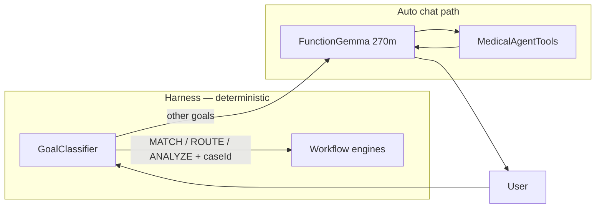

# FunctionGemma Tool Calling

**Last updated:** 2026-05-31 (fine-tuning section expanded)  
**Audience:** Developers configuring AI Chat Auto mode and agent tool invocation.

## Role in MedExpertMatch

MedExpertMatch uses **two LLM roles** in AI Chat:

| Role | Model (typical local) | Bean / client | Used for |
|------|----------------------|-------------|----------|
| **Medical reasoning** | `medgemma1.5:4b` | `clinicalChatModel` / `LlmClientType.CLINICAL` | Case analysis, interpretation, goal classification, translation |
| **Tool calling** | `functiongemma:270m` | `toolCallingChatModel` / `LlmClientType.TOOL_CALLING` | Auto orchestrator: choose and invoke `@Tool` methods |

**Why separate models?** MedGemma is strong at clinical text but does not reliably emit structured function calls.
[FunctionGemma](https://blog.google/innovation-and-ai/technology/developers-tools/functiongemma/) is a Gemma 3 270M
variant fine-tuned for **function calling** — translating natural language into executable tool actions.



When `GoalClassifier` routes to a **harness workflow** (match, route, analyze with case ID), FunctionGemma is **not**
used for that turn. It handles general Auto chat, evidence queries, and edge cases that stay on the LLM path.

**User-facing packaging (M66):** In AI Chat, **Quick question** keeps turns on the FunctionGemma path (LIGHT tier) even
when a case ID is present; **Expert match (harness)** opts into workflow engines and FULL-tier GraphRAG. See
[Harness Architecture](HARNESS.md) and the
[synthetic case study](presentations/agent-vs-chat-case-study-template.md).

## Configuration

FunctionGemma is configured via `TOOL_CALLING_*` environment variables, mapped to `spring.ai.custom.tool-calling.*`
in [application.yml](../src/main/resources/application.yml).

### Local profile example (`application-local.yml`)

```yaml
TOOL_CALLING_PROVIDER: openai
TOOL_CALLING_BASE_URL: http://192.168.0.73:11434/v1
TOOL_CALLING_API_KEY: none
TOOL_CALLING_MODEL: functiongemma:270m
TOOL_CALLING_TEMPERATURE: 0.7
TOOL_CALLING_MAX_TOKENS: 4096
```

### Spring bean wiring

- `SpringAIConfig.toolCallingChatModel()` — dedicated `ChatModel` bean
- `MedicalAgentConfiguration` — `medicalAgentChatClient` uses tool-calling model
- `ChatAssistantServiceImpl` — streams and sync chat via `LlmClientType.TOOL_CALLING`

Concurrency: `medexpertmatch.llm.tool-calling.max-concurrent-calls` (default `1` in base `application.yml`).

### Pull model (Ollama OpenAI-compatible)

```bash
ollama pull functiongemma:270m
```

Ensure the Ollama OpenAI API is enabled and the base URL matches `TOOL_CALLING_BASE_URL` (typically `http://host:11434/v1`).

## Tools exposed to FunctionGemma

Auto orchestrator registers domain tools (see [Medical Agent Tools](MEDICAL_AGENT_TOOLS.md)):

| Category | Tools |
|----------|-------|
| Matching | `match_doctors_to_case`, `match_doctors_from_text` |
| Analysis | `analyze_case`, `analyze_case_text` |
| Routing | `match_facilities_for_case` |
| Evidence | `search_clinical_guidelines`, `query_pubmed` |

Orchestrator instructions: `src/main/resources/prompts/chat-agent-orchestrator-instructions.st`

**Critical rules encoded in prompts:**

- If a **24-character case ID** is in hints → call `match_doctors_to_case` / `analyze_case` with that ID
- Do **not** ask the user to paste case text when case ID is already provided
- Do **not** delegate single-domain requests via `Task` / `TodoWrite`

Tool scope enforcement: `ToolScopeEnforcingResolver` + `ChatToolContextHolder` (goal type from `GoalClassifier`).

## Known ambiguity pairs

Base FunctionGemma may choose the wrong tool or reply with text instead of calling a function. Common pairs:

| User intent | Wrong choice | Correct choice |
|-------------|--------------|----------------|
| Detail case (case ID in hints) | `analyze_case_text` or text reply | `analyze_case(caseId)` |
| Match specialists (case ID in hints) | `match_doctors_from_text` | `match_doctors_to_case(caseId)` |
| General question | unnecessary tool call | natural language only |

**Mitigation in production:**

1. **Harness routing** — match, route, and analyze-with-case-ID bypass FunctionGemma tool choice
2. **GoalClassifier + session context** — correct goal before chat path runs
3. **Case ID hints** — `ChatCasePromptSupport` injects ID into every Auto turn when session has a case

## Multilingual chat

Non-English user messages are translated to **English** before goal classification and processing (`ChatLanguageService`,
MedGemma). FunctionGemma receives **English** user prompts; replies are translated back to the user's language.

FunctionGemma's vocabulary supports multilingual inputs, but the project standardizes on English for tool-calling
consistency.

## Monitoring

- Health: `ComprehensiveHealthIndicator` reports tool-calling model connectivity
- Periodic check: `MedGemmaToolCallingMonitor` (misnamed historically — checks primary/tool models)
- Chat logs: `Chat LLM turn — agent: auto, model: functiongemma:270m`

## Fine-tuning FunctionGemma (optional)

Fine-tuning teaches FunctionGemma **your** tool schemas and disambiguation rules. It does **not** replace the harness
([Harness Architecture](HARNESS.md)): hybrid goal routing and workflow engines should land first. Pursue fine-tuning only when
residual tool-selection errors remain on the Auto chat path.

**Implementation plan:** [.agents/plans/M58-functiongemma-tool-calling-finetune.md](../.agents/plans/M58-functiongemma-tool-calling-finetune.md)

### What fine-tuning improves

| Area | Base `functiongemma:270m` | After domain fine-tune (expected) |
|------|---------------------------|-----------------------------------|
| Tool selection accuracy | ~58% on held-out tasks (Google Mobile Actions baseline) | **80–88%** on similar ambiguity pairs |
| «Discuss instead of call» | Model replies with text («please provide case description») | **−60–70%** on policy-like prompts |
| Case ID vs free-text tools | Often picks `analyze_case_text` / `match_doctors_from_text` when ID is in hints | **≥ 90%** correct case-ID variant |
| Russian + English prompts | Variable; depends on phrasing | Improved via balanced RU examples (256k vocab) |
| Inference latency | ~270M, fast | **Unchanged** — same architecture |
| Runtime cost | Baseline | **+0** at inference; one-time training cost only |

**Conservative MedExpertMatch targets** (measure on your own eval set before/after):

| KPI | Baseline (estimate) | Post fine-tune target |
|-----|---------------------|----------------------|
| `analyze_case` when caseId in hint | ~40–60% | **≥ 90%** |
| `match_doctors_to_case` when caseId in hint | ~70–80% | **≥ 95%** |
| Spurious text-only replies (actionable turn + hints) | ~15–25% | **≤ 5%** |

### What fine-tuning does **not** improve

- Goal classification (`MATCH_DOCTORS` vs `ANALYZE_CASE`) — use MedGemma + hybrid `GoalClassifier`
- GraphRAG match quality, routing scores, or case analysis content
- Case ID extraction from chat history — harness / `ChatCasePromptSupport`
- Harness verify logic, retries, or critic review

### Pros and cons

| Pros | Cons |
|------|------|
| Fixes **tool disambiguation** where prompts already contain case ID hints | Does not fix wrong **goal** routing — harness goal routing is mandatory first |
| Small model (270M) — cheap inference, runs on modest GPU or Ollama | **Maintenance**: re-train when tool schemas or orchestrator prompts change |
| One-time training; no per-request cost increase | Risk of **over-calling** tools if dataset lacks negative (no-tool) examples |
| Reproducible eval loop (JSONL + `ToolSelectionEvalTest`) | Risk of **overfitting** to «always use caseId tool» without balanced no-ID examples |
| RU+EN coverage in one adapter | Ollama / local serve naming and weight versioning must be documented |
| Complements harness: catches edge cases that still reach FunctionGemma | **4.5–5.5 days** effort for dataset, train, integrate, smoke (see implementation plan) |
| Google Tuning Lab or TRL path — no `pom.xml` changes | Training data must stay **synthetic / anonymized** — no PHI in datasets |

**When to fine-tune vs defer**

| Condition | Recommendation |
|-----------|----------------|
| Harness routes analyze/match with caseId reliably | **Defer fine-tuning** — monitor 2 weeks |
| Residual wrong-tool rate **> 10%** after goal routing on eval set | **Proceed** with Option A (Tuning Lab) |
| Need reproducible CI-friendly pipeline | **Option B** (TRL `SFTTrainer`) |
| Tool schemas change frequently | Prefer harness guards + prompt updates over repeated fine-tunes |

### Dataset preparation — step by step

Follow [Google's FunctionGemma fine-tuning format](https://ai.google.dev/gemma/docs/functiongemma/finetuning-with-functiongemma).
Each training row is a **multi-turn conversation**: stable system prefix → rendered user turn (hints + message) →
assistant **function call** (not free text).

#### Step 1 — Gate and baseline

1. Confirm hybrid goal classifier is deployed (harness analyze, session continuation, multilingual EN pipeline).
2. Run a **baseline eval** on stock `functiongemma:270m` (target: 100 scripted prompts).
3. Record metrics before generating training data — e.g. `docs/eval/functiongemma-baseline-{date}.md`.
4. Proceed only if wrong-tool or text-only rates exceed documented thresholds (see plan).

#### Step 2 — Define scenarios and tool pairs

Prioritize **highest-ROI ambiguity pairs** (minimum **20 examples per scenario**):

| Scenario ID | User intent | Correct tool | Common wrong choice |
|-------------|-------------|--------------|---------------------|
| `analyze_with_case_id_en` | Detail / analyze case (EN) | `analyze_case` | `analyze_case_text`, text reply |
| `analyze_with_case_id_ru` | «детализируй случай» (RU) | `analyze_case` | `analyze_case_text`, text reply |
| `match_with_case_id_en` | Find specialists (EN) | `match_doctors_to_case` | `match_doctors_from_text` |
| `match_follow_up_ru` | «найди еще докторов» | `match_doctors_to_case` (+ exclude flags) | `match_doctors_from_text` |
| `match_from_text_no_id` | New case, no ID in hints | `match_doctors_from_text` | `match_doctors_to_case` |
| `analyze_from_text_no_id` | Paste case narrative, no ID | `analyze_case_text` | `analyze_case` |
| `evidence_pubmed` | Literature / guidelines | `query_pubmed` / `search_clinical_guidelines` | wrong evidence tool |
| `negative_text_only` | General medical Q, no case | **no tool** | spurious tool call |

Secondary pairs: `match_facilities_for_case` vs `match_doctors_to_case` (route vs match).

#### Step 3 — Mirror production prompts

Training inputs must match what Auto chat sends to FunctionGemma:

1. **System** — truncated stable prefix from `chat-agent-orchestrator-instructions.st`.
2. **User** — concatenate in the same order as production:
   - Case ID block from `ChatCasePromptSupport` / `chat-case-id-hint.st` (when applicable)
   - Goal hint from `GoalClassifier` (when applicable)
   - User message (EN after `ChatLanguageService`, or RU if testing multilingual FG directly)

Example assistant target (FunctionGemma call syntax):

```
<start_function_call>call:analyze_case{caseId:<escape>6a23f05200155d711484cf69<escape>}<end_function_call>
```

Use **synthetic case IDs only** (24-char hex placeholders). Never copy real patient or production case text.

#### Step 4 — Generate synthetic examples

**Primary source (recommended):** `scripts/generate-tool-selection-eval-dataset.py` — large balanced eval/training JSONL and CSV (see `--size`, `--split` in `docs/ai/functiongemma-finetune.md`).

**Unsloth Colab export:** after generating JSONL, run `scripts/export-unsloth-functiongemma-dataset.py` to produce `messages` + `tools` rows for [Unsloth FunctionGemma (270M)](https://colab.research.google.com/github/unslothai/notebooks/blob/main/nb/FunctionGemma_(270M).ipynb). Tool schemas: `scripts/medexpertmatch_tool_schemas.json`.

Template inputs:

- Message variants per scenario (10–30 phrasings each for EN and RU)
- Placeholder case IDs (`6a23f05200155d711484cf69`, `a1b2c3d4e5f6789012345678`, …)
- Optional: `excludePreviouslyMatched`, `topK` args for follow-up match scenarios

**Secondary sources:**

- **Failure replay** — rows from goal-classifier / tool-selection eval JSONL where base model chose wrong tool (re-label correct answer)
- **Log mining** — only after anonymization review; prefer synthetic generation for HIPAA safety

#### Step 5 — Add negative (no-tool) examples

Include **~5%** of rows where the correct assistant action is **natural language only** (no function call).
This prevents the model from calling tools on every turn.

Examples: «What is GraphRAG?», «How does specialist matching work?» — no case ID, no actionable medical workflow.

#### Step 6 — Balance, locale mix, and shuffle

| Rule | Value |
|------|-------|
| Total train size | **400–600** examples |
| Russian share | **~40%** of train set |
| Negative (no-tool) | **~5%** |
| Categories | Balanced across pairs A–D before split |
| Shuffle | **`shuffle=True`** — never split sorted-by-scenario data ([Google warning](https://developers.googleblog.com/a-guide-to-fine-tuning-functiongemma/)) |
| Stratify | By `scenario` column when splitting train / val / test |

#### Step 7 — Train / validation / test split

| Split | Size | Purpose |
|-------|------|---------|
| Train | 400–600 | SFT |
| Validation | 80–100 | Loss / early stopping during training |
| Test | 80–100 | Held-out scenarios — **never** used during training |

Ensure test set includes unseen phrasing combinations (not just held-out case IDs).

#### Step 8 — Export format

**CSV** (FunctionGemma Tuning Lab):

| Column | Description |
|--------|-------------|
| `user_prompt` | Full rendered user message (hints + goal + message) |
| `tool_name` | e.g. `analyze_case`, or empty for negative examples |
| `tool_args_json` | `{"caseId":"6a23f05200155d711484cf69"}` |
| `locale` | `en` / `ru` |
| `scenario` | `analyze_with_case_id_ru`, etc. |

**JSONL** (repo eval + regression):

```json
{"system":"...","user":"IMPORTANT — medical case ID: 6a23f052...","expectedTool":"analyze_case","expectedArgs":{"caseId":"6a23f05200155d711484cf69"},"locale":"ru","scenario":"analyze_with_case_id_ru"}
```

| Eval set | File | Test | Purpose |
|----------|------|------|---------|
| Policy regression | `tool-selection-cases.jsonl` (53) | `ToolSelectionEvalTest` | CI — deterministic policy |
| Golden live benchmark | `tool-selection-golden.jsonl` (24) | `ToolSelectionLiveEvalIT` | Before/after fine-tune on real FunctionGemma |

Live eval: `./scripts/run-tool-selection-live-eval.sh baseline` then `finetuned`; compare with `./scripts/compare-tool-selection-eval-reports.sh`.

#### Step 9 — Pre-upload checklist

- [ ] No PHI — synthetic IDs and anonymized narratives only
- [ ] Tool schemas in dataset match live `@Tool` definitions (`MedicalAgentTools`, agent-specific tools)
- [ ] Balanced case-ID vs no-ID examples (avoid «always `analyze_case`» bias)
- [ ] ~5% no-tool negatives present
- [ ] RU + EN represented per high-priority scenario
- [ ] Data shuffled and stratified before split
- [ ] Baseline eval recorded for same test set

### Training and serving (summary)

| Option | Best for | Effort |
|--------|----------|--------|
| **A — FunctionGemma Tuning Lab** | First iteration, upload CSV, quick experiment | ~2–3 days |
| **B — TRL `SFTTrainer`** | Reproducible pipeline, versioned weights | ~4–5 days |

After training, serve via Ollama or LM Studio OpenAI-compatible API and point local profile at the new tag:

```yaml
TOOL_CALLING_MODEL: functiongemma-medexpertmatch:270m
```

Keep base `functiongemma:270m` as rollback via env var. Do **not** commit model weights to git.

### References

- [A Guide to Fine-Tuning FunctionGemma](https://developers.googleblog.com/a-guide-to-fine-tuning-functiongemma/)
- [Fine-tuning with FunctionGemma (Google AI)](https://ai.google.dev/gemma/docs/functiongemma/finetuning-with-functiongemma)
- [FunctionGemma announcement](https://blog.google/innovation-and-ai/technology/developers-tools/functiongemma/)
- [FunctionGemma Tuning Lab](https://huggingface.co/spaces/google/functiongemma-tuning-lab) (Hugging Face)

## Troubleshooting

| Symptom | Likely cause | Fix |
|---------|--------------|-----|
| «Provide case description» despite case ID in chat | Tool path without harness; FG chose `analyze_case_text` | Confirm hybrid goal classifier deployed; check `Goal classified: ANALYZE_CASE`; enable analyze harness |
| No tool calls, only text | Model not tool-capable or wrong `TOOL_CALLING_MODEL` | Use `functiongemma:270m`; verify Ollama model list |
| Wrong doctor match tool | Missing case ID in `GoalClassification` | Check `ConversationGoalContext` + `GoalClassifier` logs |
| Timeouts | `tool-calling.max-concurrent-calls: 1` | Increase pool or reduce parallel chat load |
| Empty stream | FunctionGemma stream flake | Sync retry in `resolveReplyAfterStream()` |

## Related documentation

- [Harness Architecture](HARNESS.md) — when FunctionGemma is bypassed
- [AI Provider Configuration](AI_PROVIDER_CONFIGURATION.md) — all `TOOL_CALLING_*` variables
- [MedGemma Configuration](MEDGEMMA_CONFIGURATION.md) — primary chat model setup
- [Find Specialist Flow](FIND_SPECIALIST_FLOW.md) — full user journey
