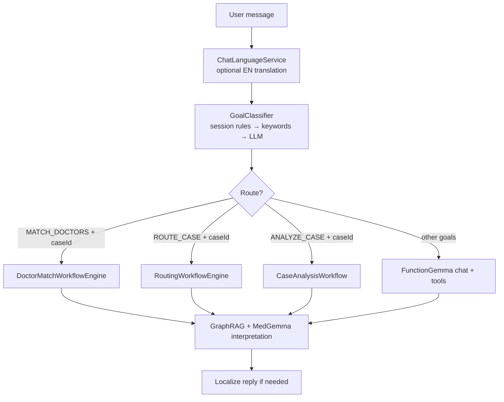

# Harness Architecture

**Last updated:** 2026-05-31  
**Audience:** Developers and operators working on AI Chat, GraphRAG matching, and LLM orchestration.

## What is the harness?

In MedExpertMatch, the **harness** is everything around the LLM that turns a user message into a reliable, observable
medical workflow:

- Goal identification and routing
- Context assembly (case bundles, session memory)
- Tool execution and verification
- Retries, policy gate review, and progress events
- Safety policy (no PHI in logs, medical disclaimers)

The **model proposes**; the **harness constrains and executes**. See also
[Harness & Agent Patterns](HARNESS_AND_AGENT_USAGE.md) for terminology shared with coding-agent discussions.

## High-level flow



## Goal classification (M57 hybrid)

`GoalClassifier` (`llm/chat/GoalClassifier.java`) runs **before** tool-calling or workflow engines.

| Layer | Purpose | Examples |
|-------|---------|----------|
| **1. Session continuation** | Reuse `ConversationGoalContext` (goal + caseId, 30 min TTL) | «детализируй случай» → `ANALYZE_CASE`; «найди еще докторов» → `MATCH_DOCTORS` |
| **2. Keyword fast path** | English + Russian medical phrases | `detail the clinical case`, `suggest specialist`, `route to facility` |
| **3. LLM fallback** | Ambiguous messages with session context | `goal-classification.st` + `goal-classification-user.st` via **MedGemma** (`LlmClientType.CHAT`) |
| **4. Post-override** | Safety net when LLM returns `GENERAL_QUESTION` but session has a case | Detail/more-doctors heuristics |
| **5. inheritSessionCaseId** | Fill missing caseId from session | `ANALYZE_CASE`, `ROUTE_CASE`, `SEARCH_EVIDENCE`, routable match follow-ups |

**Goal types** (`GoalType` enum):

| Goal | Harness route | Notes |
|------|---------------|-------|
| `MATCH_DOCTORS` | `DoctorMatchWorkflowEngine` | Requires 24-char case ID |
| `ROUTE_CASE` | `RoutingWorkflowEngine` | Facility routing |
| `ANALYZE_CASE` | `MedicalAgentCaseAnalysisWorkflowService` | When `analyze-case-harness-enabled: true` |
| `TRIAGE_INTAKE`, `SEARCH_EVIDENCE`, `GENERAL_QUESTION` | FunctionGemma Auto chat | Tool-calling path |
| `GENERATE_RECOMMENDATIONS` | Chat / recommendations workflow | Context-dependent |

Prompts: `src/main/resources/prompts/goal-classification.st`, `goal-classification-user.st`.

Regression eval set: `src/test/resources/eval/goal-classifier-cases.jsonl` (20+ scenarios).

## Workflow engines

### Doctor match (`DoctorMatchWorkflowEngine`)

State machine (logged as `HARNESS_STATE` via SSE):

```
TASK_CREATED → PLANNING → CONTEXT_BUILT → TOOLS_EXECUTED ⇄ VERIFYING → POLICY_GATE → DONE
```

The **verify retry loop** (`max-iterations`, default 2) re-runs tools when structural checks fail (e.g. minimum
match count). **Policy gate** runs once after verify passes; rejection returns a safe fallback — it does **not** loop back
today (empty response, PHI patterns, disclaimer).

Steps inside the loop:

1. LLM case analysis (`MedicalAgentLlmSupportService.analyzeCaseWithMedGemma`)
2. `match_doctors_to_case` (GraphRAG hybrid scoring)
3. `AgentResponseVerifier` — structural validation; retry on failure if `retry-on-verify-fail: true`

After verify passes:

4. LLM result interpretation
5. `MedicalAgentPolicyGateService` — final policy/safety gate → `DONE` or safe fallback

Follow-up «find more doctors» sets `excludePreviouslyMatched: true` in harness request metadata and broadens the candidate
pool when prior doctors are excluded.

### Routing (`RoutingWorkflowEngine`)

Same state pattern for facility routing (`ROUTE_CASE` + case ID).

### Case analysis (`MedicalAgentCaseAnalysisWorkflowService`)

Enabled when `medexpertmatch.llm.harness.analyze-case-harness-enabled: true` (default).

Routes `ANALYZE_CASE` + case ID directly to the case analysis workflow instead of relying on FunctionGemma to choose
`analyze_case` vs `analyze_case_text`.

## Chat integration

`ChatAssistantServiceImpl` is the AI Chat entry point:

| Path | Trigger | Agent panel label |
|------|---------|-------------------|
| Harness match | `goal.isRoutableToEngine() && hasCaseId` | `doctor-match-harness` |
| Harness analyze | `goal.isAnalyzableViaHarness()` | `case-analysis-harness` |
| LLM chat | All other goals | `auto` (+ FunctionGemma) |

**Multilingual support (M57):** non-English user text is translated to English for classification and processing;
assistant replies are translated back via `ChatLanguageService` (`medgemma1.5:4b`). Original user text is stored in chat
history.

**History injection:** recent messages are included in the user prompt when the session has an active case ID or the goal
is a follow-up.

## Context bundles

`CaseContextBundleService` builds PHI-safe summaries per `CaseContextIntent`:

| Intent | Used for |
|--------|----------|
| `MATCH` | Doctor matching |
| `ANALYZE` | Case analysis |
| `ROUTE` | Facility routing |
| `EVIDENCE` | Literature / guidelines |
| `CHAT_AUTO` | General Auto orchestrator |

Injected into chat prompts via `ChatCasePromptSupport`.

## Session and memory

| Component | Role |
|-----------|------|
| `ConversationGoalContext` | Caffeine + DB persistence of `lastGoal` / `lastCaseId` per chat session |
| `SessionMemoryAdvisor` | Spring AI session events for orchestrator turns |
| `OrchestrationContextHolder` | Thread-local session ID for goal classification |

## Tool scope and safety

| Component | Role |
|-----------|------|
| `ChatToolContextHolder` | Active profile + goal type for tool allow/deny |
| `ToolScopeEnforcingResolver` | Enforces per-agent tool scope |
| `MedicalAgentPolicyGateService` | Optional post-reply review (`policy-gate-chat-enabled`) |
| `LlmResponseSanitizer` | Strip CoT / PHI from stored or logged LLM output |

Auto orchestrator instructions: `chat-agent-orchestrator-instructions.st` — direct tool calls for match/analyze/route;
no `Task` delegation for single-domain requests.

## Configuration

`application.yml` → `medexpertmatch.llm.harness.*` (`HarnessProperties`):

| Property | Default | Description |
|----------|---------|-------------|
| `policy-gate-enabled` | `true` | Harness workflow policy gate |
| `policy-gate-chat-enabled` | `true` | Chat reply policy gate |
| `max-iterations` | `2` | Verify/retry loop cap |
| `retry-on-verify-fail` | `true` | Ralph-style retry on verify failure |
| `doctor-match-min-matches` | `1` | Minimum matches for verify pass |
| `routing-match-min-matches` | `0` | Minimum facility matches |
| `human-checkpoint-enabled` | `false` | `NEEDS_HUMAN` checkpoint UI |
| `chain-analysis-to-match` | `false` | Event chain: analysis → match |
| `chain-match-to-recommend` | `false` | Event chain: match → recommend |
| `zero-result-fallback-enabled` | `false` | LLM fallback when GraphRAG returns 0 matches |
| `analyze-case-harness-enabled` | `true` | Route `ANALYZE_CASE` to analysis workflow |

Environment override example:

```bash
MEDEXPERTMATCH_LLM_HARNESS_ANALYZE_CASE_ENABLED=true
MEDEXPERTMATCH_LLM_HARNESS_ZERO_RESULT_FALLBACK_ENABLED=false
```

## Observability

### SSE events (AI Chat)

| Event | Meaning |
|-------|---------|
| `HARNESS_GOAL` | Goal identified, routing to engine |
| `HARNESS_PROGRESS` | JSON: engine name, state, detail |
| `HARNESS_STATE` | Workflow state transition |
| `agent` | Agent start/done (`doctor-match-harness`, `case-analysis-harness`, `auto`) |
| `pipeline_stage` | Multi-agent pipeline stages |

### Metrics and admin UI

- Metrics: `harness.verify.failure`, `harness.policy_gate.failure` (see [chat-ops-runbook](chat-ops-runbook.md))
- Admin: `/admin/harness-runs`, `/admin/harness-chains`
- Eval script: `scripts/run-eval-harness.sh`

### Logs

```text
Goal classified: ANALYZE_CASE (caseId=6a23f052...)
Routing to case analysis harness: caseId=6a23f052...
HARNESS_PROGRESS {"engine": "CaseAnalysis", "state": "DONE", ...}
```

## Key source files

| Area | Path |
|------|------|
| Goal classifier | `llm/chat/GoalClassifier.java`, `GoalIntentPatterns.java` |
| Chat routing | `llm/service/impl/ChatAssistantServiceImpl.java` |
| Doctor match engine | `llm/harness/DoctorMatchWorkflowEngine.java` |
| Routing engine | `llm/harness/RoutingWorkflowEngine.java` |
| Case analysis | `llm/service/impl/MedicalAgentCaseAnalysisWorkflowServiceImpl.java` |
| Verify / policy gate | `llm/harness/impl/AgentResponseVerifierImpl.java`, `MedicalAgentPolicyGateServiceImpl.java` |
| Config | `llm/config/HarnessProperties.java`, `HarnessConfiguration.java` |

## Presentation

Browser slide deck (Reveal.js): [Harness — how it works](presentations/medexpertmatch-harness.md) — eight high-level
steps with the harness metaphor image. View via `mkdocs serve` → **Presentations**.

## Related documentation

- [FunctionGemma Tool Calling](FUNCTIONGEMMA.md) — tool-calling model used in Auto chat path
- [Find Specialist Flow](FIND_SPECIALIST_FLOW.md) — end-to-end UX and API flow
- [Medical Agent Tools](MEDICAL_AGENT_TOOLS.md) — `@Tool` method reference
- [AI Provider Configuration](AI_PROVIDER_CONFIGURATION.md) — `CHAT_*` vs `TOOL_CALLING_*`
- [chat-ops-runbook](chat-ops-runbook.md) — operations and metrics
- Plan: `.agents/plans/M57-goal-classifier-hybrid-session-routing.md`

## Further reading (plans)

| Plan | Topic |
|------|-------|
| M57 | Hybrid goal classifier + multilingual chat |
| M58 | Optional FunctionGemma fine-tuning for tool disambiguation |
| M29–M34 (archive) | Harness engineering, eval, production readiness |
