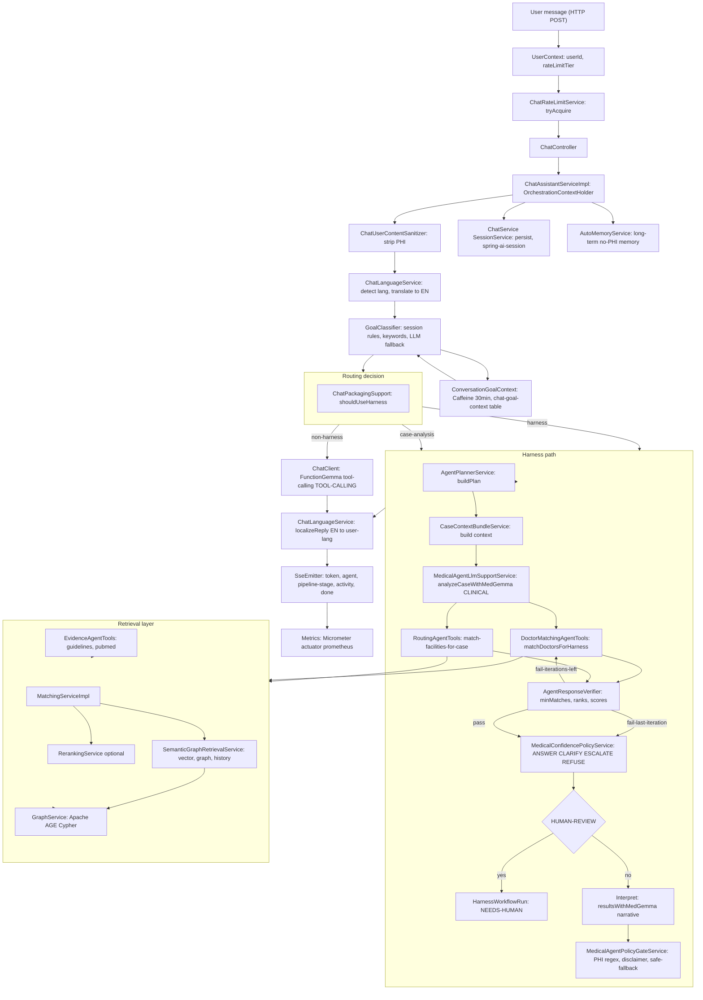

# Harness Engineering Ideas and Agent Usage in MedExpertMatch

**Purpose:** Relate common ideas from AI coding-agent discussions (model versus harness, tools, policy, repository
conventions) to how MedExpertMatch is built and how agents are expected to work in this repository.

**Audience:** Developers and coding agents (for example Cursor) that change or extend the codebase.

---

## 1. Core ideas (short)

| Idea | Meaning |
|------|---------|
| **Model** | The LLM that proposes text, plans, or structured actions. |
| **Harness** | Everything around the model: prompts, context assembly, tool definitions, execution, retries, logging policy, and safety rules. The harness turns model output into reliable behavior in your system. |
| **Agent loop** | Repeated cycle: send state and tools to the model, receive a proposed action, execute in the harness, feed results back. |
| **Policy** | What is allowed to run, what data may leave the system, and how failures are handled. Distinct from raw model capability. |

Stronger models help, but **reliability and safety are largely harness problems**: clear tools, bounded execution, good
context, and observable failures.

---

## 2. Two kinds of agents in this project

### 2.1 Coding agents (development time)

> This section was removed in M83 — see [M83: depth for HARNESS_AND_AGENT_USAGE §2.2](../.agents/plans/M83-harness-section-2-2-depth.md) for context. Coding agents are documented in
> the root [AGENTS.md](../AGENTS.md), the `.agents/skills/` index, and the [Harness Architecture](HARNESS.md) doc. The terminology in §1 applies equally to both kinds of agents.

### 2.2 Medical LLM orchestration (runtime)

The application runs **Spring AI** orchestration: a chain of services, prompt templates (`.st` files), graph retrievers, evidence tools, and policy gates wrap a clinical LLM (MedGemma) plus a small utility LLM and a tool-calling model (FunctionGemma) into a deterministic medical workflow. That stack is the **product harness** for chat-driven specialist matching, case analysis, and routing.

**The model proposes; the harness constrains and executes.** Reliability and safety live in the harness layer: language normalization, goal classification with multi-layer fallbacks, a state-machine workflow engine, a context bundle that whitelists fields before they reach the LLM, a verifier that rejects malformed tool output, a confidence-policy router (ANSWER/CLARIFY/ESCALATE/REFUSE), a no-PHI reply gate with a medical disclaimer, and a final localizer that translates the English reply back to the user's language.

#### 2.2.1 High-level flow

#### 2.2.2 Layer-by-layer deep description

The harness is a **ten-layer pipeline**. Each layer is a service or service group that owns one concern; the same input (`ChatMessage`) is enriched and re-emitted at every layer.

1. **HTTP ingress and rate limiting.** `ChatController` (`chat/rest/ChatController.java`) accepts `POST /api/v1/chats/{chatId}/messages` (sync) and `POST /api/v1/chats/{chatId}/messages/stream` (SSE, `MediaType.TEXT_EVENT_STREAM_VALUE`). Both paths read `UserContext.currentUserId()` and `UserContext.currentRateLimitTier()`. The SSE path first calls `ChatRateLimitService.tryAcquire(userId, tier, RateLimitScope.CHAT_SSE)` and throws `RateLimitExceededException` if denied — back-pressure is applied before any LLM work starts.

2. **Orchestration entry and session binding.** `ChatAssistantServiceImpl.processMessage(...)` / `streamMessage(...)` (lives in the `llm` module; the `chat` module only owns the controller + service interface) is the single place that touches `GoalClassifier`, the workflow engines, the chat client, the policy gate and the SSE event pipeline. Per turn it sets `OrchestrationContextHolder.setSessionId(userId + "-" + chatId)` and clears it in a `finally`. Every downstream component reads the session id from this thread-local for log correlation, SSE event correlation, and metrics labels.

3. **PHI sanitization on user input.** `ChatUserContentSanitizer.sanitize(content)` strips PHI patterns (SSN, "social security", etc.) from pasted Find Specialist "Abstract:" blocks *before* language detection or LLM calls. This is the only way user text ever enters the rest of the harness.

4. **Language normalization.** `ChatLanguageServiceImpl.prepareTurn(text)` detects the language via `ChatLanguageDetector.detectLanguageTag(text)`. If `requiresEnglishProcessing(languageTag)` is true, it calls the **utility** LLM with `chatTranslateToEnglishPromptTemplate` and stores a `ChatLanguageTurn(originalText, processingText, languageTag, translated)`. The original `originalText` is what gets persisted to chat history; the translated `processingText` is what the LLM and harness see. Both translate calls are wrapped in `LlmUsageContextRunner` + `llmCallLimiter.execute(LlmClientType.UTILITY, …)` and tagged `LlmOperation.TRANSLATE` (instrumentation, rate-limiting, and cost attribution are layered this way).

5. **Goal classification (hybrid 5-stage).** `GoalClassifier` (in `llm/chat/`) maps the user message to a `GoalType` enum (`MATCH_DOCTORS, ANALYZE_CASE, ROUTE_CASE, TRIAGE_INTAKE, SEARCH_EVIDENCE, GENERATE_RECOMMENDATIONS, GENERAL_QUESTION`). The five layers are:
    - **Layer 1 — Session continuation.** `detectSessionContinuation(...)` reads `ConversationGoalContext.Entry` from the current session (Caffeine `expireAfterWrite(30m)` + JDBC `chat_goal_context` table), checks for "case switch" patterns (`different|other|another|separate case`), and reuses the last case ID for follow-up shapes (`requestsMoreDoctors`, `looksLikeCaseDetailRequest`, `looksLikeElaborationFollowUp`).
    - **Layer 2 — Keywords.** `classifyByKeywords(...)` runs regexes from `GoalIntentPatterns` (English + Russian) — `MATCH_DOCTORS_KEYWORDS`, `ANALYZE_CASE_KEYWORDS`, `ROUTE_CASE_KEYWORDS`, `TRIAGE_KEYWORDS`, `EVIDENCE_KEYWORDS`, `CASE_DETAIL_REQUEST`, `CASE_DETAIL_REQUEST_RU`.
    - **Layer 3 — LLM fallback.** `classifyByLlm(...)` renders `goal-classification.st` (system) + `goal-classification-user.st` (user) with `userMessage, lastGoal, lastCaseId, recentHistory` and calls the **utility** LLM (`utilityChatModel`, separate from MedGemma). The response is JSON-parsed via `LlmResponseSanitizer.extractJson` for keys `goalType, summary, useSessionCase`. On exception the classifier falls back to `MATCH_DOCTORS` with the extracted case ID, else `general()`.
    - **Layer 4 — Post-override.** If the LLM returned `GENERAL_QUESTION` but the session has a case, reclassify to `ANALYZE_CASE` (case-detail) or `MATCH_DOCTORS` (more doctors) or the last goal.
    - **Layer 5 — Case-id inheritance.** For `ANALYZE_CASE, SEARCH_EVIDENCE, GENERATE_RECOMMENDATIONS, ROUTE_CASE` (and conditional `MATCH_DOCTORS`), pull the case ID from the session entry.

   When the resulting goal is `isRoutableToEngine() && hasCaseId()`, `GoalClassifier` publishes a `GoalIdentifiedEvent(sessionId, goal, caseId, Instant.now())` via `ApplicationEventPublisher`. `GoalIdentifiedEventPublisher` consumes this to start harness chains.

6. **Routing decision.** `ChatPackagingSupport.shouldUseHarness(goal, mode, harness.analyzeCaseHarnessEnabled)` decides between three paths:
    - **Harness path** — `goal == MATCH_DOCTORS|ROUTE_CASE` AND `mode == EXPERT_MATCH` AND harness is enabled. Calls `MedicalAgentDoctorMatchingWorkflowService` or `MedicalAgentRoutingWorkflowService` facade.
    - **Case-analysis harness path** — `goal.isAnalyzableViaHarness()` AND `mode == EXPERT_MATCH` AND `analyze-case-harness-enabled`. Calls `MedicalAgentCaseAnalysisWorkflowService.analyzeCase(...)`.
    - **Non-harness chat path** — `mode == QUICK` or any general question. Calls `chatClient.prompt().stream()` with the FunctionGemma tool-calling model (`LlmClientType.TOOL_CALLING`).

   `recordRoutingDecision(goal, chatMode)` pushes `llm.routing.decisions.total{tier,goal_type}` to Prometheus and logs `Goal classified: …`.

7. **Harness state machine (doctor match / routing).** `DoctorMatchWorkflowEngine` and `RoutingWorkflowEngine` (both in `llm/harness/`) share the same state machine `DoctorMatchWorkflowState`: `TASK_CREATED → PLANNING → CONTEXT_BUILT → TOOLS_EXECUTED ⇄ VERIFYING → POLICY_GATE → NEEDS_HUMAN / DONE / FAILED`. Each transition writes a `HARNESS_STATE` log line via `logStreamService.sendLog(sessionId, "INFO", "HARNESS_STATE", state.name()+": "+detail)`. Concretely, per iteration:
    - **`AgentPlannerService.buildPlan(sessionId, caseId, HarnessWorkflowType)`** emits a `PlanReadyEvent`. The plan is the workflow's step list (e.g. for `DOCTOR_MATCH`: analyze case → match doctors → verify → interpret).
    - **`CaseContextBundleServiceImpl.build(caseId, CaseContextIntent.MATCH|ROUTE|…)`** emits a `ContextReadyEvent`. The bundle is **PHI-safe** by construction — only `caseId, urgency, requiredSpecialty, caseType` are core; `patientAge, icd10Count` are optional. Before this bundle reaches the LLM it is shaped by `HarnessContextSummarizer` (M68) into a compact JSON per `HarnessContextKind` (`DOCTOR_MATCHES` → `{match_count, top_matches:[{rank, doctor_id, name, score, specialty}]}`; `EVIDENCE` → `{evidence_count, top_citations:[PMID:... - title]}`; `ROUTING` → `{facility_count, top_facilities}`; `GENERIC` → whitelist fields). Fields that are never dropped: `case_id, verify_status, policy_gate_status, harness_state, checkpoint, harnessFailureReason, harnessFailureDetail`.
    - **Tool execution** runs in a loop of up to `HarnessIterationPolicy.maxIterations` (default 2). Doctor match calls `DoctorMatchingAgentTools.matchDoctorsForHarness(caseId, maxResults, null, excludedDoctorIds, broadenSearch)`; routing calls `RoutingAgentTools.match_facilities_for_case(...)`. Both delegate to `MatchingService.matchDoctorsToCase / matchFacilitiesForCase`, which combines `SemanticGraphRetrievalService` (vector + graph + history) and optional `RerankingService` (toggled via config). On the first verification failure, `broadenSearch` is flipped to `true` for the next iteration.
    - **`AgentResponseVerifier.verify(VerificationRequest)`** runs `DoctorMatchVerificationRules` / `FacilityMatchVerificationRules` — e.g. ≥ `minMatches`, valid ranks, valid scores. On failure it returns `VerificationResult.fail(violations, HarnessFailureReason.TOOL_OUTPUT_INVALID)` and the engine loops back; metric `harness.verify.failure{reason}` is recorded.
    - **`MedicalConfidencePolicyService.decide(input)`** (M61) maps the post-verify state to one of `ANSWER / CLARIFY / ESCALATE / REFUSE`. Rules are in `src/main/resources/policy/medical-confidence-policy.yml` (imported via `spring.config.import`) and bound to `MedicalConfidencePolicyProperties`. Engine still shows matches for `CLARIFY` if `shouldIncludeMatchesInResponse(...)` and `verification.passed()`.
    - **`HumanAdjudicationSupport.shouldPauseForAdjudication(...)`** (M65) may pause via `HarnessCheckpointSupport.pause(...)`. A `HarnessWorkflowRun` row is persisted in `NEEDS_HUMAN` state with a `resumeToken`; `WorkflowCheckpointController` exposes `/api/v1/workflows/{runId}/checkpoint` for the human approval flow; `DoctorMatchCheckpointResumer.resumeAfterCheckpoint(...)` continues when the human approves.
    - **`MedicalAgentLlmSupportService.interpretResultsWithMedGemma(jsonResponse, caseAnalysisJson, patientAge)`** (LlmOperation.MATCH_INTERPRET) renders a narrative over the match JSON. `enforceAuthoritativePatientAge` rewrites any age the LLM might invent to the case's authoritative value. If MedGemma returns a null `finish_reason`, the call is retried once; on second failure the path returns a structured `formatInterpretationFallback(...)` text.
    - **`MedicalAgentPolicyGateService.review(responseText, metadata)`** runs once after verify passes (it does **not** loop): (1) metadata check — `verificationPassed=false` or zero match count ⇒ reject; (2) empty response ⇒ reject; (3) PHI regex (`ssn`, `social security`, `\b\d{3}-\d{2}-\d{4}\b`) ⇒ reject; (4) ensure the medical disclaimer ("not a substitute for professional medical advice…") is present, otherwise append. On rejection returns `SAFE_FALLBACK` ("No validated clinical response is available…"); metric `harness.policy_gate.failure{reason}`.

8. **Case analysis workflow (shorter path).** `MedicalAgentCaseAnalysisWorkflowServiceImpl.analyzeCase(caseId, request)` skips the verify/policy-gate state machine and chains: `analyzeCaseWithMedGemma(caseId)` → derive condition/specialty/pubmedQuery from the `MedicalCase` (ICD-10 → diagnosis → chief-complaint fallback) → `evidenceAgentTools.search_clinical_guidelines(condition, specialty, 3)` and `evidenceAgentTools.query_pubmed(effectivePubmedQuery, 3)` (both LLM-driven, `LlmOperation.CASE_ANALYSIS` / `CASE_INTERPRET`) → format combined "=== Clinical guidelines ===" + "=== PubMed ===" text → `interpretCaseAnalysisWithMedGemma(toolResults, caseAnalysis, patientAge, userFocus)`. Publishes a `CaseAnalysisCompletedEvent` and is `@Cacheable("caseAnalysis", key="#caseId")` so repeat questions about the same case are instant.

9. **Non-harness chat path (FunctionGemma tool-calling).** For `QUICK` mode and general questions, `ChatAssistantServiceImpl.invokeSync(ctx)` builds system + user prompt from `chatAgentSystemPromptTemplate` (which embeds the agent's skill bodies and the orchestrator instructions for `AUTO` profile), picks a `RoutingTier` (LIGHT/STANDARD/FULL per M64), and calls `chatClient.prompt().stream()`. The `medicalAgentChatClient` is wired with `@Tool` methods from `CaseAnalysisAgentTools`, `DoctorMatchingAgentTools`, `RoutingAgentTools`, `EvidenceAgentTools`, `ClinicalAdvisorAgentTools`, `GraphAnalyticsAgentTools`, `ContextBuilderAgentTools`, `DateTimeAgentTools`, and `AutoMemoryTools` (long-term no-PHI memory). 24-char-hex case-ID tools validate via `AgentToolCaseIdValidator`. `ToolScopeEnforcingResolver` (per `ChatToolContextHolder` thread-local) denies out-of-scope tool calls with a `DeniedToolCallback`.

10. **Output, observability, and persistence.** After the response is generated, `ChatLanguageServiceImpl.localizeReply(turn, englishReply)` translates the English reply back to the user's `targetLanguage` via `chatTranslateFromEnglishPromptTemplate` (utility LLM, `LlmOperation.TRANSLATE`). The localized reply is what the user sees; the English version is what gets persisted to chat history. The assistant message is saved via `ChatService`, appended to the Spring AI `SessionService` (`spring_ai_session_repository` table), and the `SessionMemoryAdvisor` (turn-safe: `TurnCountTrigger` + `TokenCountTrigger` + `TurnWindowCompactionStrategy` wrapped by `ObservingCompactionStrategy`) manages compaction without ever calling an LLM or sending PHI to a tokenizer (uses JTokkit). SSE events are emitted on the `SseEmitter` (timeout 120 s for chat, 300 s for harness):

    | Event | Producer | Payload |
    |-------|----------|---------|
    | `token` | streamed `chatClient` chunks or single `reply` token | `Map.of("t", chunkOrReply)` |
    | `agent` | `sendAgentEvent(...)` | `{type: agent_start|agent_done, agentId, orchestrator}` |
    | `pipeline_stage` | `sendPipelineStageEvents(...)` drains `PipelineProgressCollector` | `{stage, agent, status, timestampMs}` (`PLANNING → CONTEXT_BUILD → EXECUTION → POLICY_GATE`) |
    | `activity` (sub-types) | `ChatStreamActivityPublisherImpl` listens to `LlmCallCompletedEvent`, `ToolCallLoggedEvent`, `AgentTodoUpdateEvent` | `type: reasoning \| llm_call \| llm_turn_summary \| tool_call \| todo_update`. `llm_call` includes `message, operation, clientType, model, promptTokens, completionTokens, cacheReadTokens, latencyMs, cacheHit`. |
    | `done` | end of stream | `{id, content, chatMode, routingTier, relativeCostHint, layers=[Chat,Harness,Policy,Data], matchExplainability?}` |

    Micrometer timers feed `/actuator/prometheus`: `llm.tokens.total{client_type,tier,goal_type,direction}`, `llm.call.latency{client_type,operation}`, `llm.cache.hits.total{cache_source}`, `llm.routing.decisions.total{tier,goal_type}`, `llm.harness.invocations.total{goal_type}`, `llm.calls.total{client_type,tier,goal_type}`, `harness.verify.failure{reason}`, `harness.policy_gate.failure{reason}`. `LlmCallLimiter` (per-`LlmClientType` semaphore, `acquire-timeout-seconds=120`) is the back-pressure mechanism for outbound LLM calls; `LlmCallLimiterTimeoutException` is thrown on saturation.

#### 2.2.3 LLM endpoints, by `LlmClientType`

| `LlmClientType` | ChatModel bean | Default model | Where it is used in the harness |
|-----------------|----------------|----------------|----------------------------------|
| `CLINICAL` | `clinicalChatModel` → `caseAnalysisChatClient` | `medgemma:1.5-4b` (overridable via `spring.ai.custom.chat.model`) | `analyzeCaseWithMedGemma`, `interpretResultsWithMedGemma`, `interpretCaseAnalysisWithMedGemma`, `summarizeRoutingResults`, `summarizeNetworkAnalyticsResults`, `EvidenceAgentTools.search_clinical_guidelines` |
| `UTILITY` | `utilityChatModel` | small utility model (per `application.yml`, `medexpertmatch.llm.utility.*`) | `ChatLanguageServiceImpl.translateToEnglish / translateFromEnglish`, `GoalClassifier.classifyByLlm` |
| `TOOL_CALLING` | `toolCallingChatModel` (`spring.ai.custom.tool-calling.model`) | FunctionGemma (`functiongemma:270m`) | `medicalAgentChatClient` non-harness path; `RoutingAgentTools.match_facilities_for_case` when called via tool-calling |
| `EMBEDDING` | `primaryEmbeddingModel` (not a chat model) | OpenAI-compatible embedding model | `embedding` module + `SemanticGraphRetrievalService` |
| `RERANKING` | `rerankingChatModel` (nullable) | configured rerank model | `RerankingService` (optional rerank layer) |

#### 2.2.4 Skills (runtime prompts)

These are **runtime prompt documents** loaded from `src/main/resources/skills/*/SKILL.md` and registered in the chat `ChatAgentProfile` enum. They are distinct from the development-only `.agents/skills/` consumed by coding agents. At runtime the `SkillsTool` bean (`@Bean("skillsTool")` in `MedicalAgentConfiguration`) loads them JAR-safely from `classpath:skills` and optionally layers on `agent.skills.extra-directory` (filesystem volume). For non-`AUTO` profiles, `ChatAssistantServiceImpl.buildAgentInstructions(profile)` calls `promptSupportService.loadSkill(skill)` and `promptSupportService.buildPrompt(skillBodies, …)` to compose the system prompt.

| Skill | Documented tools | Notes |
|-------|-------------------|-------|
| `case-analyzer` | `analyze_case_text`, `extract_icd10_codes`, `classify_urgency`, `determine_required_specialty` | 5-step workflow; medical disclaimer |
| `clinical-advisor` | `differential_diagnosis`, `risk_assessment`, advisory | |
| `clinical-guideline` | guideline grounding; GRADE strength | |
| `doctor-matcher` | `query_candidate_doctors`, `score_doctor_match`, `match_doctors_from_text`, `match_doctors_to_case` | 40/30/30 scoring weights (vector / graph / historical) |
| `evidence-retriever` | `search_clinical_guidelines`, `query_pubmed`, `search_grade_evidence` | |
| `network-analyzer` | `graph_query_top_experts`, `aggregate_metrics` (DOCTOR / CONDITION / FACILITY) | |
| `recommendation-engine` | `generate_recommendations(caseId, type, includeEvidence)` (DIAGNOSTIC / TREATMENT / FOLLOW_UP) | |
| `routing-planner` | `graph_query_candidate_centers`, `semantic_graph_retrieval_route_score`, `match_facilities_for_case` | 30/30/20/20 scoring weights (complexity / outcomes / capacity / proximity) |
| `triage` | CRITICAL/HIGH/MEDIUM/LOW tiers; hands off to `routing-planner` | |

#### 2.2.5 Configuration that wires it all together

`MedicalAgentConfiguration` (in `llm/config/`) declares the chat clients, the session service, the `SessionMemoryAdvisor`, the `SkillsTool`, the `SkillsLoader`, the `ChatToolContextHolder` advisor chain, the `ToolScopeEnforcingResolver`, and the `LlmCallLimiter` beans. `core/config/PromptTemplateConfig.java` registers every external `.st` prompt as a `@Bean PromptTemplate` (qualified by name, injected by constructor). `LlmClientType` beans (`clinicalChatModel`, `utilityChatModel`, `toolCallingChatModel`, `rerankingChatModel`, `primaryEmbeddingModel`) are declared in `AiConfigStartupValidator`-validated Spring AI configuration — startup fails fast with explicit "Check CHAT_BASE_URL / OLLAMA_BASE_URL" guidance if any required model is unreachable.

---

## 3. How MedExpertMatch maps the harness

| Harness concern | In this repository |
|-----------------|-------------------|
| **Orchestration** | `MedicalAgentService`, workflow services under `llm/service/impl/`, coordination with `MedicalAgentTools`. |
| **Tools** | `MedicalAgentTools`: Spring `@Tool` methods wired to repositories, retrieval, graph, evidence, and related services. |
| **Prompts** | External templates in `src/main/resources/prompts/`; `PromptTemplate` beans (see `PromptTemplateConfig` pattern). |
| **Skills (documentation for behavior)** | `src/main/resources/skills/*/SKILL.md` (for example `case-analyzer`, `doctor-matcher`, `evidence-retriever`). Optional runtime loading may be enabled via configuration; skills describe intent and boundaries for medical workflows. |
| **Graph access** | All Cypher goes through `GraphService` with embedded parameters; agents and developers must not bypass it with raw JDBC to the graph. |
| **Data and transactions** | Business rules and `@Transactional` at the service layer; repositories stay single-entity focused. |
| **Policy (medical and privacy)** | No PHI in logs; anonymized test data; fail-fast error handling; medical disclaimers in LLM-facing flows as required by project rules. |

---

## 4. Repository conventions as agent affordances

Industry discussion often stresses **`AGENTS.md`**, clear module boundaries, and naming so that **both humans and agents**
can search and change code safely.

MedExpertMatch encodes that in:

- **Root `AGENTS.md`** Build commands (`mvn` phases), test containers, Spring Modulith expectations, GraphService usage,
  prompt rules, and HIPAA-related constraints.
- **Spring Modulith** Packages with `package-info.java` and explicit allowed dependencies reduce accidental cross-module
  coupling when many edits are automated.
- **Predictable layout** Domain-driven packages (`doctor`, `medicalcase`, `retrieval`, `llm`, and so on) align with how
  tools and retrieval should route.

Treating **`AGENTS.md` as the contract** for coding agents matches the idea of keeping instructions **accurate and
minimal**: prefer pointers to code and commands over duplicated prose that drifts.

---

## 5. Practices that align with harness thinking

1. **Prefer the harness you already have** Extend `MedicalAgentTools` and domain services instead of ad-hoc LLM calls from
   controllers.
2. **Keep prompts in `.st` files** So prompt changes stay reviewable and separate from Java control flow.
3. **Preserve boundaries** New features should respect module dependencies declared in `package-info.java`.
4. **Tests as specification** Integration tests (`*IT`) and `BaseIntegrationTest` patterns document expected behavior for
   humans and for agents that run `mvn test` / `mvn verify`.
5. **Security and safety** Distinguish **what the infrastructure allows** (transactions, GraphService, no PHI in logs) from
   **what the model should recommend** (clinical disclaimers, human-in-the-loop for real care decisions).

---

## 6. Related documentation

- [Harness Architecture](HARNESS.md) — detailed harness design: `GoalClassifier`, workflow engines, config, SSE events.
- [FunctionGemma Tool Calling](FUNCTIONGEMMA.md) — tool-calling model role, configuration, and optional fine-tuning.
- [AGENTS.md](../AGENTS.md) (repository root) Development guide for builds, tests, and conventions.
- [02-architecture.md](pipeline/02-architecture.md) System architecture.
- [Find Specialist Flow](FIND_SPECIALIST_FLOW.md) End-to-end specialist matching UX and API.
- [IMPLEMENTATION_PLAN.md](IMPLEMENTATION_PLAN.md) Phased delivery context (including agent skills implementation).

---

**Note:** This document describes **patterns and alignment** with common agent/harness terminology. It is not a transcript
or endorsement of any external product. For MedExpertMatch-specific requirements, the root `AGENTS.md` and
`.cursorrules` remain authoritative.
