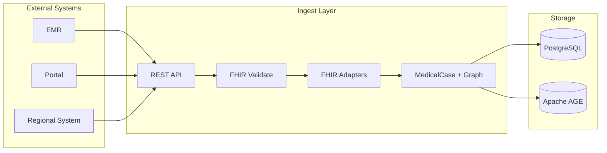

# Integration Plan: External Systems and Data Ingest

**Last Updated:** 2026-02-03  
**Status:** Planned

## Overview

This document describes the integration plan for connecting MedExpertMatch with external systems (EMR, portals, regional
health systems) and the data ingest flows. **FHIR compatibility is expected** for healthcare interoperability.

## Integration Goals

- Accept clinical data from EMR systems, patient portals, and regional health networks
- Ingest data via FHIR-compliant APIs and convert to internal domain models
- Support both real-time (consult requests, case submission) and batch (bulk load) ingest
- Maintain data quality, validation, and anonymization at ingest boundaries

## FHIR Compatibility

MedExpertMatch is designed for **FHIR compatibility** (FHIR R4/R5) to align with healthcare interoperability standards.

### Expected FHIR Resources

| FHIR Resource      | Use in MedExpertMatch                                                 |
|--------------------|-----------------------------------------------------------------------|
| **Bundle**         | Container for case submission; parsed and mapped to `MedicalCase`     |
| **Patient**        | Demographics (anonymized); referenced by Condition, Encounter         |
| **Condition**      | Diagnoses, ICD-10/SNOMED codes; mapped to case conditions             |
| **Observation**    | Labs, vitals, clinical findings; included in case context             |
| **Encounter**      | Visit context, facility, timing; mapped to case metadata              |
| **ServiceRequest** | Consult requests; mapped to `MedicalCase` with type `CONSULT_REQUEST` |
| **Practitioner**   | Doctor profiles (optional external source)                            |
| **Organization**   | Facilities (optional external source)                                 |

### FHIR Version and Validation

- **Target**: [HL7 FHIR R5](https://www.hl7.org/fhir/) (R4 supported for compatibility)
- **Validation**: Validate structure and required elements before conversion
- **References**: Resolve in-Bundle references (e.g., Condition.subject → Patient)

### Internal Mapping

- **FHIR Bundle** → `MedicalCase` (with embedding and graph sync)
- **FHIR Condition** → `MedicalCase.icd10Codes`, condition narrative
- **FHIR Encounter** → `MedicalCase` metadata (facility, period, type)
- **FHIR ServiceRequest** → `MedicalCase` with type `CONSULT_REQUEST`

Existing adapters (e.g., `FhirBundleAdapter`, `FhirPatientAdapter`, `FhirConditionAdapter`, `FhirEncounterAdapter`)
perform this mapping. The integration plan extends and standardizes their use at the API boundary.

## External System Integration

### 1. EMR Systems

**Scenario:** Hospital EMR sends a FHIR Bundle when a physician documents a case and requests a specialist.

| Aspect       | Plan                                                                        |
|--------------|-----------------------------------------------------------------------------|
| **Protocol** | REST over HTTPS; FHIR API style                                             |
| **Trigger**  | Physician action ("Find specialist") or automated on case save              |
| **Payload**  | `POST` FHIR Bundle (Patient, Condition, Observations, Encounter)            |
| **Response** | `MedicalCase` created; `caseId` returned for subsequent match/analyze calls |
| **Auth**     | OAuth2 / API key / mTLS as per deployment                                   |

**Endpoints (expected):**

- `POST /api/v1/ingestion/cases` (or equivalent) – accept FHIR Bundle, return `caseId`
- `POST /api/v1/agent/match/{caseId}` – match specialists (existing)
- `POST /api/v1/agent/match-from-text` – match from free text (existing)

### 2. Patient Portals / Second Opinion

**Scenario:** Portal produces a FHIR Bundle from uploaded records and submits for second opinion.

| Aspect        | Plan                                                                     |
|---------------|--------------------------------------------------------------------------|
| **Payload**   | FHIR Bundle with type/second-opinion context; same resource types as EMR |
| **Case type** | `MedicalCase` with type `SECOND_OPINION`                                 |
| **Flow**      | Ingest → create case → call match API → return ranked specialists        |

### 3. Regional / Multi-Site Routing

**Scenario:** Local hospitals send FHIR Bundles for complex cases to a central MedExpertMatch instance for routing.

| Aspect       | Plan                                                                   |
|--------------|------------------------------------------------------------------------|
| **Payload**  | FHIR Bundle (case context, severity, required resources)               |
| **Flow**     | Ingest → create/update case → `POST /api/v1/agent/route-case/{caseId}` |
| **Response** | Ranked facilities and suggested lead specialists                       |

### 4. Consultation Queue (Internal or External)

**Scenario:** Consult requests created as FHIR ServiceRequest/Encounter and mirrored as open cases.

| Aspect        | Plan                                                                           |
|---------------|--------------------------------------------------------------------------------|
| **Payload**   | ServiceRequest + Encounter (and related resources) or equivalent Bundle        |
| **Case type** | `MedicalCase` with type `CONSULT_REQUEST`                                      |
| **Flow**      | Ingest → create case → prioritize via `POST /api/v1/agent/prioritize-consults` |

## Data Ingest Flows

### Ingest Pipeline (High-Level)

### Steps

1. **Receive** – REST endpoint accepts FHIR Bundle (or single resource where applicable).
2. **Validate** – Check FHIR structure, required elements, and references; reject invalid payloads with clear errors.
3. **Convert** – FHIR adapters map Bundle/resources to `MedicalCase` (and related entities).
4. **Persist** – Save to PostgreSQL; generate/update embedding; sync graph (Doctor–Case–Condition, etc.).
5. **Respond** – Return `caseId` and optional link to match/route/prioritize APIs.

### Batch Ingest

- **Use case:** Bulk load of historical cases or periodic sync from external systems.
- **Mechanism:** Same FHIR validation and adapters; batch endpoint or repeated single-case ingest with rate limiting and
  idempotency (e.g., by external ID).
- **Ordering:** Define clear sequence (e.g., Facilities/Organizations → Practitioners → Cases) if dependencies exist.

## Security and Compliance

- **Transport:** TLS for all external connections.
- **Auth:** Integrate with organization IdP/OAuth2 or API keys; no PHI in logs.
- **Anonymization:** Apply at ingest where required; internal IDs used for matching and analytics.
- **Audit:** Log ingest events (success/failure, source, resource type) without storing PHI.

## Implementation Notes

- **Existing components:** `ingestion` module, `FhirBundleAdapter`, `FhirPatientAdapter`, `FhirConditionAdapter`,
  `FhirEncounterAdapter`, `MedicalCaseRepository`, graph sync.
- **To align with this plan:** Expose and document FHIR-based ingest endpoints; add validation layer; document supported
  FHIR profiles and extensions; add batch ingest option if required.

## References

- [HL7 FHIR R5](https://www.hl7.org/fhir/)
- [Use Cases](USE_CASES.md) – EMR, portal, queue, and routing flows
- [Architecture](ARCHITECTURE.md) – FHIR adapters and ingestion module
- [PRD – FHIR Integration](PRD.md) – FR-8.x, NFR-4.3, NFR-5.1
- [Synthetic Data Generator](SYNTHETIC_DATA_GENERATOR.md) – FHIR R5 test data
