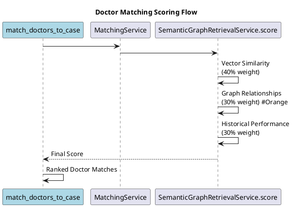
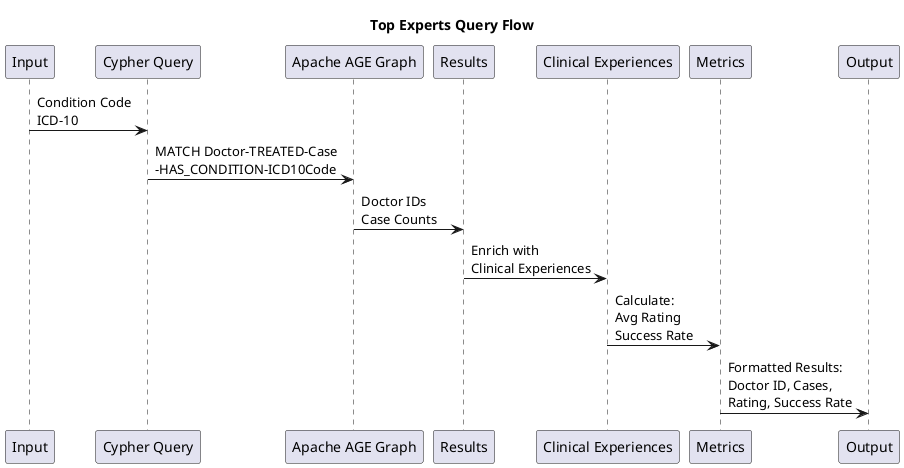
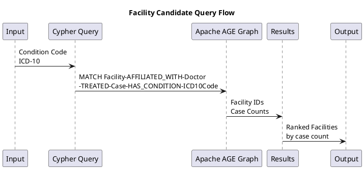

# Medical Agent System: Skills, Tools, and Implementation

**Last Updated:** 2026-02-03  
**Status:** All tools implemented

## Agent Skills Architecture

The agent system is built around 7 core medical-specific Agent Skills stored in `src/main/resources/skills/{skill-name}/SKILL.md`
files. These skills provide domain knowledge, tool invocation guidance, and output format specifications for the LLM
agents.

### Skill Integration Pattern

1. **Markdown Skill Definitions**: Each skill is defined in a Markdown file that provides instructions to the LLM
2. **Java Tool Integration**: Skills connect to Java `@Tool` methods that execute actual operations
3. **Service Layer Orchestration**: Tools call various services (repositories, external APIs) to perform tasks
4. **Response Flow**: Results flow back through the tool → skill → agent chain to generate responses

## Agent Skills and Their Purposes

### 1. Case Analyzer

**Purpose**: Analyze medical cases, extract clinical entities, ICD-10 codes, classify urgency and complexity levels.

**Key Functions**:

- Analyze case text to extract structured clinical information
- Extract ICD-10 diagnosis codes from case descriptions
- Classify case urgency levels (CRITICAL, HIGH, MEDIUM, LOW)
- Determine required medical specialties for cases

**Use Cases**:

- Initial case intake and categorization
- Preprocessing for specialist matching
- Emergency triage classification

### 2. Doctor Matcher

**Purpose**: Match doctors to medical cases using sophisticated scoring that combines multiple signals including vector
similarity, graph relationships, and historical performance.

**Key Functions**:

- Find candidate doctors based on specialty and filters
- Score doctor-case matches using Semantic Graph Retrieval
- Rank and prioritize doctor matches based on comprehensive scoring

**Scoring Components**:

- Vector Similarity (40% weight) - Semantic similarity between case and doctor experience
- Graph Relationships (30% weight) - Relationship-based scoring using Apache AGE graph
- Historical Performance (30% weight) - Past outcomes and ratings

**Use Cases**:

- Finding specialists for specific medical cases
- Second opinion matching
- Telehealth provider selection

### 3. Evidence Retriever

**Purpose**: Search clinical guidelines, PubMed literature, and evidence summaries to support evidence-based medicine.

**Key Functions**:

- Retrieve clinical practice guidelines
- Search PubMed medical literature database
- Access GRADE evidence quality assessments

**Use Cases**:

- Supporting clinical recommendations with evidence
- Researching treatment protocols
- Providing literature citations for medical decisions

### 4. Recommendation Engine

**Purpose**: Generate clinical recommendations, diagnostic workup plans, and treatment options based on case analysis
and evidence.

**Key Functions**:

- Generate clinical recommendations (diagnostic, treatment, or follow-up)
- Suggest diagnostic workup procedures
- Recommend evidence-based treatment options

**Use Cases**:

- Generating treatment plans for cases
- Creating diagnostic pathways
- Supporting clinical decision-making

### 5. Clinical Advisor

**Purpose**: Provide differential diagnosis, risk assessment, and clinical advisory services for enhanced decision
support.

**Key Functions**:

- Generate differential diagnosis lists based on symptoms
- Assess patient risk factors and complications
- Provide clinical decision support recommendations

**Use Cases**:

- Diagnostic reasoning support
- Risk stratification for patients
- Clinical decision pathway guidance

### 6. Network Analyzer

**Purpose**: Analyze medical expertise networks, discover experts through graph relationships, and aggregate performance
metrics.

**Key Functions**:

- Query top experts for specific medical conditions
- Aggregate performance metrics for doctors, conditions, or facilities
- Discover experts through network relationships
- Analyze expertise networks and collaboration patterns

**Use Cases**:

- Identifying leading specialists in specific areas
- Performance benchmarking and analytics
- Expertise network mapping and analysis

### 7. Routing Planner

**Purpose**: Optimize facility routing, score multiple facilities, and plan geographic routing for medical cases.

**Key Functions**:

- Query candidate facilities suitable for case routing
- Score facility-case routing matches using multiple factors
- Optimize routing based on case requirements and facility capabilities

**Scoring Components**:

- Complexity Match (30% weight) - Match between case complexity and facility capabilities
- Historical Outcomes (30% weight) - Past outcomes for similar cases at facility
- Capacity (20% weight) - Facility capacity and current occupancy
- Geographic Proximity (20% weight) - Distance and accessibility

**Use Cases**:

- Regional referral network optimization
- Facility capacity planning
- Geographic routing for patient care

## Where Agents Are Used in the Application

### API Layer Integration

Agents are accessible through dedicated API endpoints under `/api/v1/agent`:

**Specialist Matching** (`POST /api/v1/agent/match/{caseId}`)

- Skills: case-analyzer, doctor-matcher
- Purpose: Match specialists to medical cases

**Queue Prioritization** (`POST /api/v1/agent/prioritize-consults`)

- Skills: case-analyzer
- Purpose: Prioritize consultation queue based on case urgency

**Network Analytics** (`POST /api/v1/agent/network-analytics`)

- Skills: network-analyzer
- Purpose: Analyze expertise networks and expert performance

**Case Analysis** (`POST /api/v1/agent/analyze-case/{caseId}`)

- Skills: case-analyzer, evidence-retriever, recommendation-engine
- Purpose: Comprehensive case analysis with recommendations

**Expert Recommendations** (`POST /api/v1/agent/recommendations/{matchId}`)

- Skills: doctor-matcher
- Purpose: Provide detailed recommendations for matched experts

**Regional Routing** (`POST /api/v1/agent/route-case/{caseId}`)

- Skills: case-analyzer, routing-planner
- Purpose: Route cases to optimal facilities

### Service Layer Integration

Agents integrate with core services through the `MedicalAgentService`:

- **SemanticGraphRetrievalService**: Powers doctor matching and facility routing using hybrid retrieval
- **GraphService**: Enables graph-based queries for expertise discovery and network analysis
- **CaseAnalysisService**: Processes medical cases using MedGemma-powered analysis
- **PubMedService**: Retrieves medical literature for evidence-based recommendations
- **MatchingService**: Orchestrates matching logic across multiple signals

### Database Integration

Agents leverage multiple data sources:

1. **Relational Data (PostgreSQL)**: Doctor profiles, medical cases, clinical experiences
2. **Vector Data (PgVector)**: Semantic similarity matching using medical case embeddings
3. **Graph Data (Apache AGE)**: Relationship-based queries for expertise discovery

## Configuration

Agent skills are configurable through the application configuration:

```yaml
medexpertmatch:
  skills:
    enabled: true
    directory: skills
```

## Technical Implementation

### MedicalAgentTools Component

The `MedicalAgentTools` class serves as the bridge between agent skills and system services:

- Contains 18 `@Tool` annotated methods covering all 7 agent skills (case-analyzer 5, doctor-matcher 3,
  evidence-retriever 2, recommendation-engine 1, clinical-advisor 2, network-analyzer 2, routing-planner 3)
- Injects all necessary services and repositories
- Implements comprehensive error handling and logging
- Uses MedGemma chat client for LLM-based operations
- Integrates with real-time log streaming for monitoring

### Agent Orchestration Flow

```
User Request → REST API Endpoint → MedicalAgentService
    ↓
ChatClient (MedGemma) + SkillsTool
    ↓
Agent selects skill(s) based on intent
    ↓
Skill instructions loaded from src/main/resources/skills/{skill}/SKILL.md
    ↓
Agent invokes Java @Tool methods
    ↓
Tools call services/repositories
    ↓
Results flow back → Agent formats response → REST API returns JSON
```

### Medical Safety Features

All agents implement medical safety measures:

- Medical disclaimers in all LLM-generated content
- HIPAA-compliant data handling
- Anonymized patient data usage
- Professional medical advice warnings
- Evidence-based recommendation frameworks
- Human-in-the-loop validation requirements

## Overview

`MedicalAgentTools` is a Spring AI `@Component` that provides Java methods annotated with `@Tool` for LLM agents to
invoke. These tools enable the medical agent to interact with the database, query graphs, retrieve evidence, and
generate clinical recommendations.

**Graph Integration**: Several tools use Apache AGE **graph** for relationship-based discovery:

- **Find Specialist Flow**: `match_doctors_to_case` uses `SemanticGraphRetrievalService` which includes graph
  relationship scoring (30% weight)
- **Network Analytics**: `graph_query_top_experts` and `aggregate_metrics` use graph queries for expertise discovery
- **Regional Routing**: `graph_query_candidate_centers` uses graph queries for facility discovery

## Implementation Status

All tools have been fully implemented and tested. Integration tests are available in `MedicalAgentToolsIT.java`.

## Tool Categories

### 1. Case Analyzer Tools

Tools for analyzing medical cases and extracting structured information.

#### `analyze_case`

- **Status**: Implemented
- **Purpose**: Analyzes a medical case by ID and extracts key clinical information (chief complaint, symptoms,
  diagnosis, urgency, required specialty)
- **Service**: `CaseAnalysisService`

#### `analyze_case_text`

- **Status**: Implemented
- **Purpose**: Analyzes unstructured case text and extracts structured information
- **Service**: `CaseAnalysisService`

#### `extract_icd10_codes`

- **Status**: Implemented
- **Purpose**: Extracts ICD-10 codes from case text
- **Service**: `CaseAnalysisService`

#### `classify_urgency`

- **Status**: Implemented
- **Purpose**: Classifies case urgency level (LOW, MEDIUM, HIGH, CRITICAL)
- **Service**: `CaseAnalysisService`

#### `determine_required_specialty`

- **Status**: Implemented
- **Purpose**: Determines required medical specialty for a case
- **Service**: `CaseAnalysisService`

### 2. Doctor Matcher Tools

Tools for finding and scoring doctor-case matches. **These tools are used in the Find Specialist Flow.**

#### `query_candidate_doctors`

- **Status**: Implemented
- **Purpose**: Queries candidate doctors based on specialty and filters
- **Repository**: `DoctorRepository`

#### `score_doctor_match`

- **Status**: Implemented
- **Purpose**: Scores a doctor-case match using Semantic Graph Retrieval (Semantic Graph Retrieval)
- **Service**: `SemanticGraphRetrievalService`
- **Graph Usage**: Uses Apache AGE graph for relationship scoring (30% of final score)
    - Direct relationships: Doctors who treated this case
    - Condition expertise: Doctors who treat matching ICD-10 codes
    - Specialization match: Doctors with required specialties
    - Similar cases: Doctors who treated cases with same conditions

#### `match_doctors_to_case`

- **Status**: Implemented
- **Purpose**: Comprehensive doctor matching with scoring and ranking
- **Service**: `MatchingService`, `SemanticGraphRetrievalService`
- **Graph Usage**: This is the primary tool used in Find Specialist Flow. It uses
  `SemanticGraphRetrievalService.score()` which includes:
    - **Vector similarity (40%)**: PgVector embeddings comparison
    - **Graph relationships (30%)**: Apache AGE graph traversal via `calculateGraphRelationshipScore()`
    - **Historical performance (30%)**: Past outcomes and ratings

**Scoring Flow:**



- **See**: [Find Specialist Flow - Apache AGE Graph Usage](FIND_SPECIALIST_FLOW.md#apache-age-graph-usage) for detailed
  implementation

### 3. Evidence Retriever Tools

Tools for retrieving clinical evidence and literature.

#### `search_clinical_guidelines`

- **Status**: Implemented
- **Purpose**: Searches clinical practice guidelines (LLM-based implementation)
- **Implementation**: Uses MedGemma chat client to generate guidelines
- **Future**: Can be migrated to external API integration (NICE, AHA, ACC)

#### `query_pubmed`

- **Status**: Implemented
- **Purpose**: Queries PubMed medical literature database
- **Service**: `PubMedService` (NCBI E-utilities API)
- **Features**:
    - Searches PubMed via `esearch.fcgi`
    - Fetches article details via `efetch.fcgi`
    - Parses XML responses
    - Returns formatted articles with titles, abstracts, authors, citations

### 4. Recommendation Engine Tools

Tools for generating clinical recommendations.

#### `generate_recommendations`

- **Status**: Implemented
- **Purpose**: Generates clinical recommendations (diagnostic, treatment, or follow-up)
- **Types**: DIAGNOSTIC, TREATMENT, FOLLOW_UP
- **Features**:
    - Optional evidence integration (guidelines + PubMed)
    - Uses MedGemma for medical reasoning
    - Includes medical disclaimers

### 5. Clinical Advisor Tools

Tools for clinical decision support.

#### `differential_diagnosis`

- **Status**: Implemented
- **Purpose**: Generates differential diagnosis list based on symptoms and clinical findings
- **Features**:
    - Uses MedGemma for medical reasoning
    - Returns ranked diagnoses with probabilities
    - Includes supporting clinical features

#### `risk_assessment`

- **Status**: Implemented
- **Purpose**: Assesses patient risk factors and complications
- **Types**: COMPLICATION, MORTALITY, READMISSION
- **Features**:
    - Uses MedGemma for medical reasoning
    - Integrates historical data from `ClinicalExperienceRepository`
    - Returns risk level, factors, and mitigation strategies

### 6. Network Analyzer Tools

Tools for network analytics and expertise discovery.

#### `graph_query_top_experts`

- **Status**: Implemented
- **Purpose**: Queries Apache AGE graph to find top experts for a condition
- **Service**: `GraphService`, `ClinicalExperienceRepository`
- **Features**:
    - Cypher queries on Apache AGE graph
    - Enriches with clinical experience data (ratings, outcomes)
    - Returns doctors with case counts and metrics

**Query Flow:**



#### `aggregate_metrics`

- **Status**: Implemented
- **Purpose**: Aggregates performance metrics for doctors, conditions, or facilities
- **Entity Types**: DOCTOR, CONDITION, FACILITY
- **Metric Types**: PERFORMANCE, OUTCOMES, VOLUME
- **Features**:
    - Aggregates across all entities or specific entity ID
    - Uses graph queries for condition-based metrics
    - Returns formatted metrics with distributions

### 7. Routing Planner Tools

Tools for facility routing and regional planning.

#### `graph_query_candidate_centers`

- **Status**: Implemented
- **Purpose**: Queries graph for candidate facilities/centers for a condition
- **Service**: `GraphService`
- **Features**:
    - Cypher queries on Apache AGE graph
    - Finds facilities connected to cases with matching ICD-10 code
    - Returns facility IDs with case counts

**Query Flow:**



#### `semantic_graph_retrieval_route_score`

- **Status**: Implemented
- **Purpose**: Scores facility-case routing match using Semantic Graph Retrieval
- **Service**: `SemanticGraphRetrievalService.semanticGraphRetrievalRouteScore()`
- **Features**:
    - Combines complexity match, historical outcomes, capacity, geography
    - Returns `RouteScoreResult` with component scores and rationale

#### `match_facilities_for_case`

- **Status**: Implemented
- **Purpose**: Match facilities for case routing with scoring and ranking; returns list of facility matches sorted by
  route score
- **Service**: `SemanticGraphRetrievalService`, `MatchingService`
- **Features**:
    - Optional min score, preferred facility types, required capabilities, max distance
    - Returns `List<FacilityMatch>` sorted by route score

## Dependencies

### Repositories

- `MedicalCaseRepository` - Case data access
- `DoctorRepository` - Doctor data access
- `FacilityRepository` - Facility data access
- `ClinicalExperienceRepository` - Historical performance data

### Services

- `CaseAnalysisService` - Case analysis and entity extraction
- `MatchingService` - Doctor matching logic
- `SemanticGraphRetrievalService` - Semantic Graph Retrieval scoring
- `GraphService` - Apache AGE graph queries
- `PubMedService` - PubMed API integration
- `LogStreamService` - Real-time log streaming

### LLM Clients

- `ChatClient` (MedGemma) - Medical reasoning via `@Qualifier("caseAnalysisChatClient")`

## Error Handling

All tools implement comprehensive error handling:

- Input validation (null checks, empty string checks)
- Entity existence validation (case, doctor, facility)
- Graph unavailability handling (graceful degradation)
- External API failure handling (PubMed)
- User-friendly error messages
- Logging via `LogStreamService`

## Testing

Comprehensive integration tests are available in `MedicalAgentToolsIT.java`:

- Tests for all 18 tools
- Error handling tests
- Edge case tests
- Uses `BaseIntegrationTest` with Testcontainers
- Mocks LLM services via `TestAIConfig`

## Medical Disclaimers

All LLM-generated content includes medical disclaimers:

- For informational and educational purposes only
- Not a substitute for professional medical advice
- Always seek qualified health providers
- Never disregard professional medical advice

## Future Enhancements

### Evidence Retriever

- Migrate `search_clinical_guidelines` to external API integration (NICE, AHA, ACC)
- Add caching for guideline searches
- Add GRADE evidence summaries

### Network Analyzer

- Add time-range filtering for metrics
- Add visualization data export
- Add trend analysis

### Routing Planner

- Add geographic distance calculations
- Add real-time capacity updates
- Add multi-facility routing optimization

## References

- [Spring AI Tool Calling](https://docs.spring.io/spring-ai/reference/api/tools.html)
- [Apache AGE Graph Queries](https://age.apache.org/age-manual/master/intro/querying.html)
- [NCBI E-utilities API](https://www.ncbi.nlm.nih.gov/books/NBK25497/)
- [PubMed API Documentation](https://www.ncbi.nlm.nih.gov/books/NBK25499/)

---

## Conclusion

The MedExpertMatch agent system provides a comprehensive framework for automating medical expert matching and clinical
decision support. With seven specialized agents covering different aspects of medical case processing, the system
enables sophisticated automated matching, evidence-based recommendations, and network analytics while maintaining
appropriate medical safety standards.


