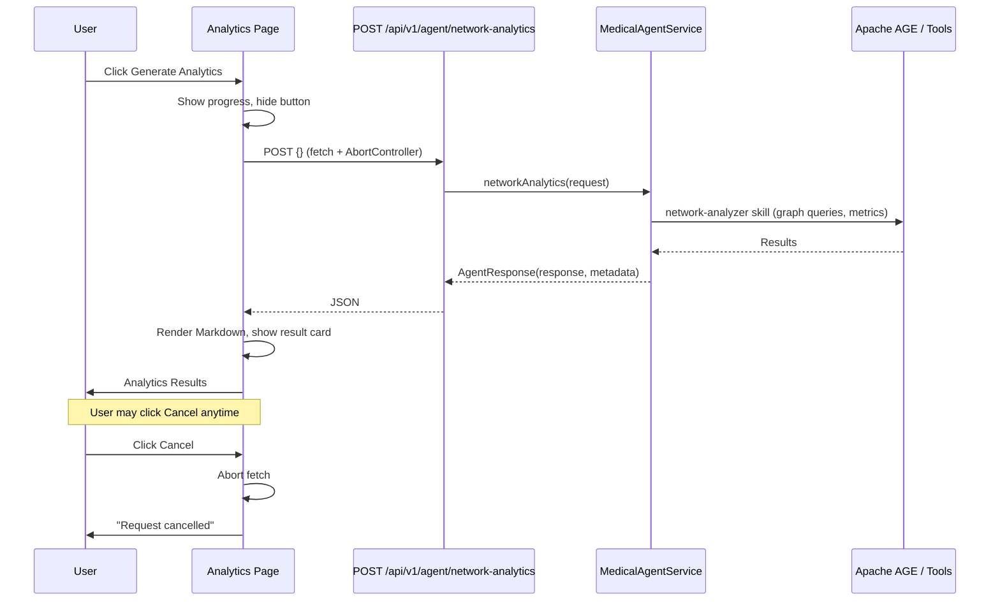
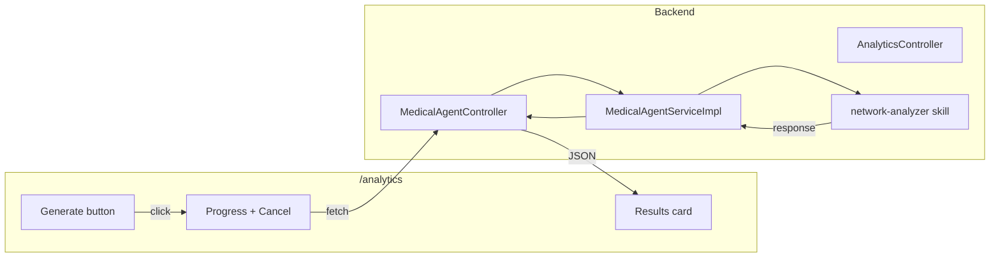

# Network Analytics

## Purpose

Network Analytics (Use Case 4) lets CMOs and analytics teams discover top experts and analyze expertise networks. The
system queries the expertise graph (Apache AGE), runs aggregate metrics, and returns a readable report. The UI shows
progress, allows cancel, and renders results as Markdown.

## Benefits

- **Data-driven expertise mapping** – See who actually treats which conditions and how experts connect to cases and
  specialties.
- **Transparent long-running jobs** – Users are told the job may take one to several minutes and can cancel at any time.
- **Readable results** – Output is rendered as Markdown (headings, lists, code) for quick scanning.
- **Single action** – One click to generate; no form to fill.

## How It Works

### User flow

1. User opens **Network Analytics** (`/analytics`).
2. User clicks **Generate Analytics**.
3. The page shows a spinner and **Cancel**; the request runs in the background.
4. On completion, **Analytics Results** shows the report (Markdown). On cancel, a "Request cancelled" message appears.

### Sequence diagram

### Component flow

### API

| Item     | Value                                                  |
|----------|--------------------------------------------------------|
| Endpoint | `POST /api/v1/agent/network-analytics`                 |
| Request  | Optional JSON body (e.g. `{}`)                         |
| Response | `AgentResponse`: `response` (string), `metadata` (map) |

## Related

- [Use Cases](USE_CASES.md) – Use Case 4: Network Analytics
- [Medical Agent Tools](MEDICAL_AGENT_TOOLS.md) – network-analyzer tools
- [Architecture](ARCHITECTURE.md) – API and pages
