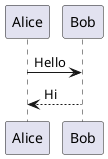

# PlantUML Usage in MedExpertMatch Documentation

**Last Updated:** 2026-01-27

## Overview

MedExpertMatch documentation supports PlantUML diagrams via the `plantuml-markdown` extension.

## Usage

```markdown


```

## Configuration

PlantUML is configured in `mkdocs.yml` to use the online PlantUML server:

```yaml
- plantuml_markdown:
    server: https://www.plantuml.com/plantuml
    cachedir: .plantuml-cache
    format: svg
```

## Related Documentation

- [MkDocs Setup](MKDOCS_SETUP.md)

---

*Last updated: 2026-01-27*
