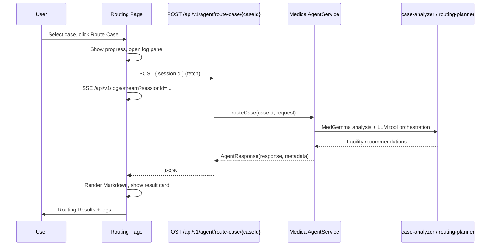
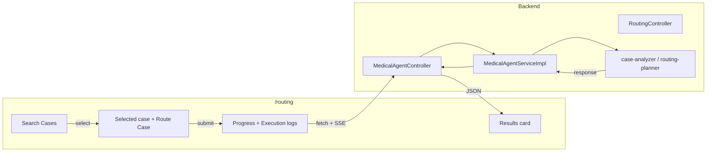

# Regional Routing

## Purpose

Regional Routing (Use Case 6) lets regional health authorities and multi-hospital networks route medical cases to the
best facilities. The system analyzes the case with MedGemma, uses the case-analyzer and routing-planner skills to query
the expertise graph and score candidate facilities, then returns a readable recommendation. The UI lets users search
and select a case, shows progress and execution logs, and renders results as Markdown.

## Benefits

- **Optimal facility routing** – Combines case complexity, historical outcomes, center capacity, and geography via
  Semantic Graph Retrieval to recommend where to send a case.
- **Case search** – Users search existing cases by chief complaint, case ID, specialty, or urgency and select one to
  route; no need to re-enter case details.
- **Transparent long-running jobs** – Progress indicator and execution log panel stream backend logs; users see what
  is happening and can cancel if needed.
- **Readable results** – Output is rendered as Markdown (headings, lists, code) for quick scanning.

## How It Works

### User flow

1. User opens **Regional Routing** (`/routing`).
2. User clicks **Search Existing Cases**, applies filters (query, case ID, specialty, urgency), and clicks **Search**.
3. User selects a case from the results; the page shows the selected case and enables **Route Case**.
4. User clicks **Route Case**. The page shows a spinner and the **Execution logs** panel; the request runs in the
   background.
5. On completion, **Routing Results** shows the recommendation (Markdown). Execution logs show the steps performed.

### Sequence diagram

### Component flow

### API

| Item     | Value                                                      |
|----------|------------------------------------------------------------|
| Endpoint | `POST /api/v1/agent/route-case/{caseId}`                   |
| Request  | Optional JSON body (e.g. `{ "sessionId": "routing-123" }`) |
| Response | `AgentResponse`: `response` (string), `metadata` (map)     |

The `sessionId` in the request body is used to stream execution logs to the client via Server-Sent Events
(`GET /api/v1/logs/stream?sessionId=...`).

## Related

- [Use Cases](USE_CASES.md) – Use Case 6: Cross-Organization / Regional Routing
- [Medical Agent Tools](MEDICAL_AGENT_TOOLS.md) – case-analyzer and routing-planner tools
- [Architecture](ARCHITECTURE.md) – API and pages
