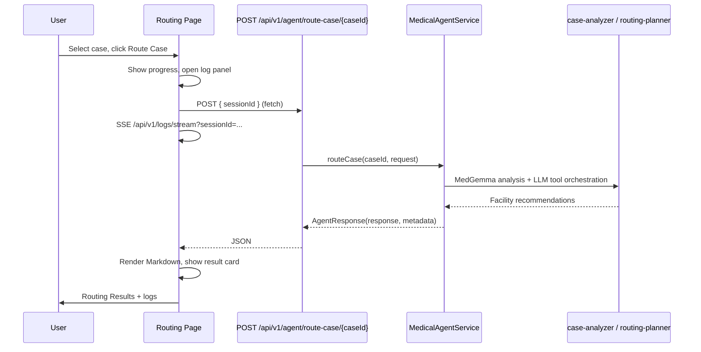
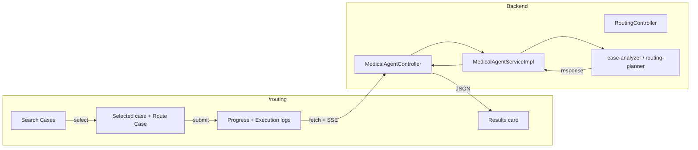

# Regional Routing

**Last Updated:** 2026-06-13

## Purpose

Regional Routing (Use Case 6) lets regional health authorities and multi-hospital networks route medical cases to the
best facilities. The system analyzes the case with MedGemma, uses the case-analyzer and routing-planner skills to query
the expertise graph and score candidate facilities, then returns a readable recommendation. The UI lets users search
and select a case, shows progress and execution logs, and renders results as Markdown.

## Benefits

- **Optimal facility routing** – Combines case complexity, historical outcomes, center capacity, and geography via
  Semantic Graph Retrieval to recommend where to send a case.
- **Case search** – Users search existing cases by chief complaint, case ID, specialty, or urgency and select one to
  route; no need to re-enter case details.
- **Transparent long-running jobs** – Progress indicator and execution log panel stream backend logs; users see what
  is happening and can cancel if needed.
- **Readable results** – Output is rendered as Markdown (headings, lists, code) for quick scanning.

## How It Works

### User flow

1. User opens **Regional Routing** (`/routing`).
2. User clicks **Search Existing Cases**, applies filters (query, case ID, specialty, urgency), and clicks **Search**.
3. User selects a case from the results; the page shows the selected case and enables **Route Case**.
4. User clicks **Route Case**. The page shows a spinner and the **Execution logs** panel; the request runs in the
   background.
5. On completion, **Routing Results** shows the recommendation (Markdown). Execution logs show the steps performed.

### Sequence diagram


```mermaid
sequenceDiagram
    participant User
    participant UI as Routing Page
    participant API as POST /api/v1/agent/route-case/{caseId}
    participant Agent as MedicalAgentService
    participant Tools as case-analyzer / routing-planner

    User->>UI: Select case, click Route Case
    UI->>UI: Show progress, open log panel
    UI->>API: POST { sessionId } (fetch)
    UI->>UI: SSE /api/v1/logs/stream?sessionId=...
    API->>Agent: routeCase(caseId, request)
    Agent->>Tools: MedGemma analysis + LLM tool orchestration
    Tools-->>Agent: Facility recommendations
    Agent-->>API: AgentResponse(response, metadata)
    API-->>UI: JSON
    UI->>UI: Render Markdown, show result card
    UI->>User: Routing Results + logs
```

### Component flow


```mermaid
graph LR
    subgraph UI["/routing"]
        A[Search Cases]
        B[Selected case + Route Case]
        C[Progress + Execution logs]
        D[Results card]
    end
    subgraph Backend
        E[RoutingController]
        F[MedicalAgentController]
        G[MedicalAgentServiceImpl]
        H[case-analyzer / routing-planner]
    end
    A -->|select| B
    B -->|submit| C
    C -->|fetch + SSE| F
    F --> G
    G --> H
    H -->|response| G
    G --> F
    F -->|JSON| D
```

### API

| Item     | Value                                                      |
|----------|------------------------------------------------------------|
| Endpoint | `POST /api/v1/agent/route-case/{caseId}`                   |
| Request  | Optional JSON body (e.g. `{ "sessionId": "routing-123" }`) |
| Response | `AgentResponse`: `response` (string), `metadata` (map)     |

The `sessionId` in the request body is used to stream execution logs to the client via Server-Sent Events
(`GET /api/v1/logs/stream?sessionId=...`).

## Related

- [Use Cases](use-cases.md) – Use Case 6: Cross-Organization / Regional Routing
- [Medical Agent Tools](MEDICAL_AGENT_TOOLS.md) – case-analyzer and routing-planner tools
- [Architecture](pipeline/02-architecture.md) – API and pages

## Geographic Position (How It Works)

The routing pipeline uses a 4-component weighted score for each facility (defaults from `RetrievalScoringProperties`):

| Component | Weight | Source |
|-----------|--------|--------|
| Complexity match | 30% | Facility capabilities vs case requirements |
| Historical outcomes | 30% | Aggregated doctor success rates at facility |
| Capacity | 20% | `1.0 - occupancy/capacity` |
| Geographic proximity | 20% | Haversine distance via `GeoDistance.java` |

### Geo Score Tiers

Geo score is computed as a cascade (see `SemanticGraphRetrievalServiceImpl.calculateGeographicScore()`):

```
Case + Facility have coords → Haversine distance → max(0, 1.0 - km/500)
  (0km = 1.0, 250km = 0.5, 500km+ = 0.0)

Facility has city+state → 0.75  (fallback — uniform for all facilities)
Facility has country    → 0.60
Nothing                 → 0.30
```

### Known Gap (M99)

**Case coordinates are not populated.** The `MedicalCase.locationLatitude`/`locationLongitude` fields exist in the schema and scoring pipeline but are never set by synthetic data generators or case intake. All synthetic cases have `null` coordinates, so geo scoring falls through to the uniform city/state fallback (0.75 for all facilities).

The `maxDistanceKm` filter parameter on `match_facilities_for_case()` throws an `IllegalArgumentException` when case coords are null — see `MatchingServiceImpl.validateGeographicFilteringSupport()`.

**Fix planned:** M99 will populate case coordinates during synthetic data generation and make the filter degrade gracefully instead of throwing.
