# UI Flows and Form Mockups

**Last Updated:** 2026-02-03  
**Version:** 1.0  
**Status:** Design Phase

## Document Purpose

This document provides detailed UI flows and visual mockups for all MedExpertMatch user interfaces. All mockups are
created using PlantUML format, which can be rendered using PlantUML tools or integrated into documentation systems.

## UI Pages Overview

MedExpertMatch includes the following main UI pages:

1. **Home Page** (`/`) - Dashboard and navigation
2. **Find Specialist** (`/match`) - Specialist matching interface
3. **Consultation Queue** (`/queue`) - Queue prioritization and management
4. **Network Analytics** (`/analytics`) - Expertise network analysis
5. **Case Analysis** (`/analyze/{caseId}`) - AI-powered case analysis
6. **Regional Routing** (`/routing`) - Multi-facility routing
7. **Doctor Profile** (`/doctors/{doctorId}`) - Doctor details and history
8. **Synthetic Data** (`/admin/synthetic-data`) - Admin synthetic data generation (Administrator only)
9. **Graph Visualization** (`/admin/graph-visualization`) - Admin graph view (Administrator only)

## Page 1: Home Page (`/`)

### Purpose

Main dashboard providing navigation to all features and overview of system status.

### UI Flow


### Form Mockup


## Page 2: Find Specialist (`/match`)

### Purpose

Interface for finding and matching specialists to medical cases (Use Case 1: Specialist Matching).

### UI Flow


### Form Mockup



```plantuml
@startsalt
{+
  {* Find Specialist | }
  ==
  Case Selection:
  [Select Existing Case ▼] [OR] [Create New Case]
  ==
  Case Details:
  Type: ( ) Inpatient  ( ) Second Opinion  (•) Consult Request
  Chief Complaint: [________________________________]
  Symptoms: [________________________________]
            [________________________________]
  Urgency: [CRITICAL ▼]
  Specialty: [Cardiology ▼]
  Notes: [________________________________]
  ==
  [Find Specialists]
  ==
  Results:
  ┌─────────────────────────────────────────┐
  │ Dr. Jane Smith, MD | Cardiology        │
  │ Match: 95/100 ████████████████         │
  │ "Expert in acute MI cases..."          │
  │ Available: Now | Cases: 45 (98% success)│
  │ [Request Consultation] [View Profile]   │
  └─────────────────────────────────────────┘
  ┌─────────────────────────────────────────┐
  │ Dr. John Doe, MD | Cardiology          │
  │ Match: 87/100 █████████████             │
  │ "Strong experience with..."             │
  │ Available: 2 hours | Cases: 32 (94%)   │
  │ [Request Consultation] [View Profile]   │
  └─────────────────────────────────────────┘
  ┌─────────────────────────────────────────┐
  │ Dr. Sarah Johnson, MD | Cardiology      │
  │ Match: 82/100 ████████████             │
  │ "Board-certified cardiologist..."       │
  │ Available: Tomorrow | Cases: 28 (92%)  │
  │ [Request Consultation] [View Profile]   │
  └─────────────────────────────────────────┘
}
@endsalt
```

## Page 3: Consultation Queue (`/queue`)

### Purpose

Prioritize and manage consultation requests (Use Case 3: Queue Prioritization).

### UI Flow


### Form Mockup



```plantuml
@startsalt
{+
  {* Consultation Queue | }
  ==
  Toolbar:
  [Refresh Queue] [Filter ▼] [Sort: Priority Score ▼] [Bulk Actions ▼]
  ==
  Queue Table:
  ┌───┬──────────┬──────────┬──────────────┬─────────┬──────┬─────────────┬──────────────┬─────────┐
  │☑ │ Case ID  │ Patient  │ Complaint    │ Urgency │Score │ Requested   │ Doctor       │ Actions │
  ├───┼──────────┼──────────┼──────────────┼─────────┼──────┼─────────────┼──────────────┼─────────┤
  │☑ │ CASE-001 │ A***     │ Acute MI     │ CRITICAL│ 95   │ 2026-01-27  │ Dr. Smith    │ [Assign]│
  │   │          │          │              │         │      │ 10:30       │              │ [View]  │
  ├───┼──────────┼──────────┼──────────────┼─────────┼──────┼─────────────┼──────────────┼─────────┤
  │☐ │ CASE-002 │ B***     │ Chest Pain   │ HIGH    │ 82   │ 2026-01-27  │ Dr. Jones    │ [Assign]│
  │   │          │          │              │         │      │ 09:15       │              │ [View]  │
  ├───┼──────────┼──────────┼──────────────┼─────────┼──────┼─────────────┼──────────────┼─────────┤
  │☐ │ CASE-003 │ C***     │ Follow-up    │ MEDIUM  │ 65   │ 2026-01-27  │ Dr. Brown    │ [Assign]│
  │   │          │          │              │         │      │ 08:00       │              │ [View]  │
  ├───┼──────────┼──────────┼──────────────┼─────────┼──────┼─────────────┼──────────────┼─────────┤
  │☐ │ CASE-004 │ D***     │ Routine      │ LOW     │ 45   │ 2026-01-26  │ Dr. Wilson   │ [Assign]│
  │   │          │          │              │         │      │ 16:30       │              │ [View]  │
  └───┴──────────┴──────────┴──────────────┴─────────┴──────┴─────────────┴──────────────┴─────────┘
  ==
  [← Previous] [1] [2] [3] [Next →] Showing 1-20 of 42 cases
}
@endsalt
```

## Page 4: Network Analytics (`/analytics`)

### Purpose

Analyze network expertise and identify top specialists (Use Case 4: Network Analytics).

### UI Flow


### Form Mockup



```plantuml
@startsalt
{+
  {* Network Analytics | }
  ==
  Query Form:
  ICD-10 Code: [I21.9________________]
  Time Period: [Past 2 Years ▼]
  Metrics:
  ☑ Case Volume  ☑ Success Rate  ☑ Complexity Score  ☑ Complication Rate
  ==
  [Analyze]
  ==
  Top Experts:
  ┌────────────────────────────────────────────────────────────┐
  │ Rank │ Doctor Name      │ Specialty │ Cases │ Success │    │
  ├──────┼──────────────────┼───────────┼───────┼─────────┼────┤
  │  1   │ Dr. Jane Smith  │ Cardiology│  245  │  98.5%  │[View]│
  │  2   │ Dr. John Doe    │ Cardiology│  189  │  97.2%  │[View]│
  │  3   │ Dr. Sarah J.    │ Cardiology│  156  │  96.8%  │[View]│
  └────────────────────────────────────────────────────────────┘
  ==
  Charts: [Bar Chart] [Line Chart] [Pie Chart]
  ==
  Top Facilities:
  - General Hospital - 450 cases
  - Medical Center - 320 cases
  - Regional Hospital - 280 cases
}
@endsalt
```

## Page 5: Case Analysis (`/analyze/{caseId}`)

### Purpose

AI-powered case analysis with differential diagnosis and recommendations (Use Case 5: Decision Support).

### UI Flow


### Form Mockup



```plantuml
@startsalt
{+
  {* Case Analysis - CASE-001 | }
  ==
  Case Information:
  Case ID: CASE-001 | Patient: A*** | Urgency: CRITICAL
  Chief Complaint: Acute chest pain
  ICD-10: I21.9, R06.02
  ==
  AI Analysis Results:
  Summary: [65-year-old male presenting with acute onset...]
  ==
  Differential Diagnosis:
  1. Acute Myocardial Infarction - 85% probability
  2. Unstable Angina - 12% probability
  3. Aortic Dissection - 3% probability
  ==
  Clinical Evidence:
  • ACC/AHA Guidelines for STEMI...
  • Recent studies on PCI outcomes...
  • High-quality evidence for...
  ==
  Recommendations:
  Diagnostic: 1. Immediate ECG  2. Cardiac enzymes  3. Chest X-ray
  Treatment: 1. Primary PCI (preferred)  2. Thrombolytic  3. Medical mgmt
  Monitoring: 1. Continuous monitoring  2. Serial ECGs  3. Follow-up imaging
  ==
  Suggested Experts:
  • Dr. Jane Smith - Cardiology - 95% match [Request Consultation]
  • Dr. John Doe - Interventional Cardiology - 92% match [Request Consultation]
  ==
  [Save Analysis] [Export PDF] [Share] [Request Second Opinion]
}
@endsalt
```

## Page 6: Regional Routing (`/routing`)

### Purpose

Route complex cases to appropriate facilities and specialists (Use Case 6: Regional Routing).

### UI Flow


### Form Mockup



```plantuml
@startsalt
{+
  {* Regional Routing | }
  ==
  Case Selection:
  [Select Case: CASE-001 ▼]
  Details: Complex cardiac case requiring PCI...
  ==
  Routing Criteria:
  Complexity: High | Resources: PCI, ICU | Geographic: Within 30 miles | Urgency: CRITICAL
  ==
  [Find Optimal Routes]
  ==
  Routing Options:
  ┌────────────────────────────────────────────────────────────┐
  │ ⭐ Facility 1 - Recommended                                │
  │ General Hospital | 15 miles away                           │
  │ Capability Score: 95/100 ████████████████                 │
  │ Lead Specialist: Dr. Jane Smith                            │
  │ Resources: PCI Lab, ICU, ECMO                              │
  │ Availability: Available Now                                │
  │ [Route to Facility]                                        │
  └────────────────────────────────────────────────────────────┘
  ┌────────────────────────────────────────────────────────────┐
  │ Facility 2                                                 │
  │ Medical Center | 25 miles away                             │
  │ Capability Score: 87/100 █████████████                    │
  │ Lead Specialist: Dr. John Doe                              │
  │ Resources: PCI Lab, ICU                                    │
  │ Availability: Available in 1 hour                           │
  │ [Route to Facility]                                        │
  └────────────────────────────────────────────────────────────┘
  ┌────────────────────────────────────────────────────────────┐
  │ Facility 3                                                 │
  │ Regional Hospital | 40 miles away                          │
  │ Capability Score: 78/100 ████████████                     │
  │ Lead Specialist: Dr. Sarah Johnson                         │
  │ Resources: PCI Lab                                          │
  │ Availability: Available in 2 hours                         │
  │ [Route to Facility]                                        │
  └────────────────────────────────────────────────────────────┘
}
@endsalt
```

## Page 7: Doctor Profile (`/doctors/{doctorId}`)

### Purpose

Display detailed doctor profile, experience, and case history.

### UI Flow


### Form Mockup



```plantuml
@startsalt
{+
  {* Doctor Profile - Dr. Jane Smith | }
  ==
  [Photo] Dr. Jane Smith, MD, FACC
  Specialty: Cardiology | Facility: General Hospital
  [Request Consultation]
  ==
  Credentials:
  Board Certifications:
  • American Board of Cardiology
  • Interventional Cardiology
  Education:
  • MD, Harvard Medical School
  • Residency, Johns Hopkins
  • Fellowship, Mayo Clinic
  ==
  Statistics:
  Total Cases: 245 | Success Rate: 98.5% | Complexity: High
  Patient Outcomes: Excellent | Years Experience: 15
  ==
  Recent Cases:
  ┌──────────┬──────────┬─────────┬────────────┐
  │ Case ID  │ Condition│ Outcome │ Date       │
  ├──────────┼──────────┼─────────┼────────────┤
  │ CASE-245 │ I21.9    │ Success │ 2026-01-26 │
  │ CASE-244 │ I21.9    │ Success │ 2026-01-25 │
  │ CASE-243 │ I20.9    │ Success │ 2026-01-24 │
  └──────────┴──────────┴─────────┴────────────┘
  ==
  Top Specializations:
  1. Acute Myocardial Infarction (I21.9) - 89 cases
  2. Unstable Angina (I20.0) - 45 cases
  3. Heart Failure (I50.9) - 32 cases
}
@endsalt
```

## Page 8: Synthetic Data (`/admin/synthetic-data`)

### Purpose

Admin interface for generating synthetic test data for demos. Visible only when Administrator is selected in the user
selector (`?user=admin`).

### UI Flow


### Form Mockup



```plantuml
@startsalt
{+
  {* Synthetic Data (Admin) | }
  ==
  Generation Form:
  Data Size:
  ( ) Tiny - 5 doctors, 5 cases
  ( ) Small - 50 doctors, 100 cases
  (•) Medium - 500 doctors, 1000 cases
  ( ) Large - 2000 doctors, 4000 cases
  ( ) Huge - 50000 doctors, 100000 cases
  ==
  Options:
  ☑ Clear existing data
  ☑ Generate embeddings
  ☑ Build graph relationships
  ==
  Domain Focus:
  (•) General (all specialties)
  ( ) Cardiology
  ( ) Oncology
  ( ) Neurology
  ( ) Emergency Medicine
  ==
  [Generate Data] [Generate Data Only] [Generate Embeddings] [Build Graph] [Clear All Data]
  ==
  Progress:
  [████████████░░░░░░░░] 60%
  Status: Generating doctors... (300/500)
  ==
  Log:
  ✓ Created 300 doctors
  ✓ Created 150 medical cases
  ⏳ Generating descriptions...
  ⏳ Generating embeddings...
  ⏳ Building graph relationships...
  ==
  Completion Summary:
  ✓ Generated 500 doctors
  ✓ Generated 1000 medical cases
  ✓ Created 2500 clinical experiences
  ✓ Generated embeddings for all entities
  ✓ Built graph relationships
  Total time: 2m 34s
}
@endsalt
```

## Common UI Components

### Navigation Menu

```plantuml
@startsalt
{+
  Navigation Menu:
  [Home] [Find Specialist] [Queue] [Analytics] [Analysis] [Routing] [Admin]
  ==
  User Menu: [User Name ▼]
  • Profile
  • Settings
  • Logout
}
@endsalt
```



### Success Message Component

```plantuml
@startsalt
{+
  ┌────────────────────────────────────────────┐
  │ ✓ Consultation request sent successfully!   │
  │ [View Details]                    [×]       │
  └────────────────────────────────────────────┘
  Auto-dismisses after 5 seconds
  Can be manually dismissed
}
@endsalt
```



### Error Message Component

```plantuml
@startsalt
{+
  ┌────────────────────────────────────────────┐
  │ ⚠ Failed to load case data.                │
  │ Please try again.                           │
  │ [Need help?]                      [×]       │
  └────────────────────────────────────────────┘
  Dismissible
  Links to help/documentation
}
@endsalt
```



## User Flow Diagrams

### Complete User Journey: Specialist Matching


### Complete User Journey: Queue Prioritization

```plantuml
@startuml Queue Prioritization User Journey
skinparam backgroundColor #FFFFFF

start

:Coordinator navigates to "Consultation Queue";
:System automatically loads and prioritizes queue;
:Coordinator reviews prioritized list;

if (Filter/Sort needed?) then (yes)
  :Applies filters or sorts;
  :Views filtered results;
endif

if (Refresh priority?) then (yes)
  :Clicks "Refresh Queue";
  :System re-prioritizes;
  :Updates display;
endif

if (Assign case?) then (yes)
  :Selects case(s);
  :Clicks "Assign Doctor";
  :Selects doctor from modal;
  :Confirms assignment;
  :System updates queue;
  :Shows success message;
  stop
else (no)
  :Continues reviewing queue;
endif

@enduml
```

## Responsive Design Considerations

### Mobile View

```plantuml
@startsalt
{+
  {* ☰ MedExpertMatch | 👤 }
  ==
  Mobile Layout:
  ┌─────────────────────────┐
  │ [Card: Active Cases: 42]│
  │ [Card: Pending: 18]     │
  │ [Card: Doctors: 156]   │
  └─────────────────────────┘
  ==
  Quick Actions:
  [Find Specialist]
  [View Queue]
  ==
  Navigation Drawer (☰):
  • Home
  • Find Specialist
  • Queue
  • Analytics
  • Analysis
  • Routing
  ==
  Mobile-first design
  Touch-optimized interactions
  Simplified navigation
}
@endsalt
```

## Accessibility Features

```plantuml
@startuml Accessibility Features
skinparam componentStyle rectangle
skinparam backgroundColor #F5F5F5

component "Accessibility Features" as Accessibility {
  [Keyboard Navigation] as Keyboard
  [Screen Reader Support] as ScreenReader
  [ARIA Labels] as ARIA
  [High Contrast Mode] as Contrast
  [Focus Indicators] as Focus
  [Alt Text for Images] as AltText
  [Color Contrast: WCAG AA] as ColorContrast
}

@enduml
```

## UI/UX Guidelines

### Color Scheme

```plantuml
@startsalt
{+
  Color Palette:
  Primary:   [Medical Blue #0066CC]
  Success:   [Green #28A745]
  Warning:   [Orange #FFA500]
  Error:     [Red #DC3545]
  Info:       [Blue #17A2B8]
  Background: [Light Gray #F5F5F5]
}
@endsalt
```

### Typography

```plantuml
@startsalt
{+
  Typography:
  Headings: Sans-serif, bold
  Body:     Sans-serif, regular
  Code:     Monospace
  Sizes:    Responsive scaling
}
@endsalt
```

### Spacing

```plantuml
@startsalt
{+
  Spacing Guidelines:
  Padding:  16px standard
  Margins:  24px between sections
  Grid:     12-column responsive grid
}
@endsalt
```

---

*Last updated: 2026-01-27*
