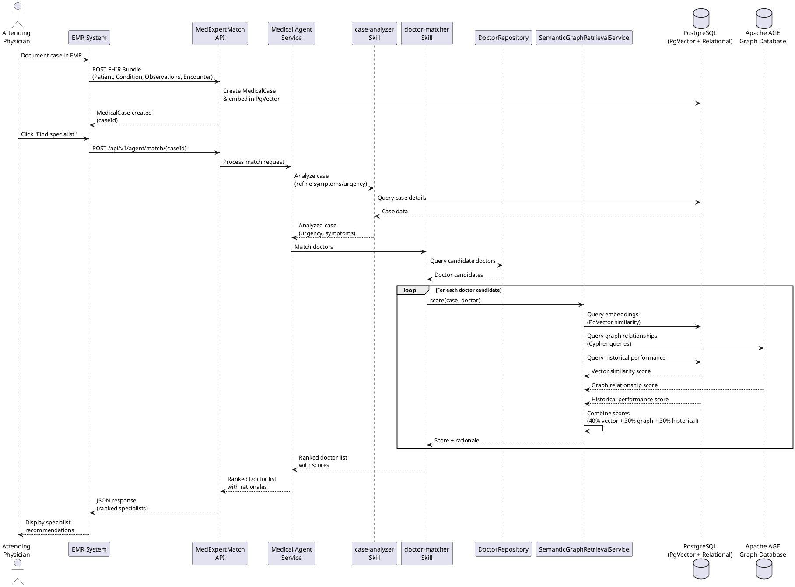
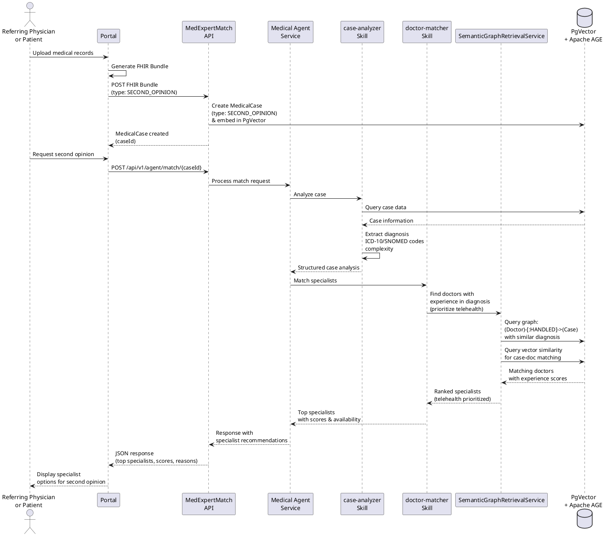
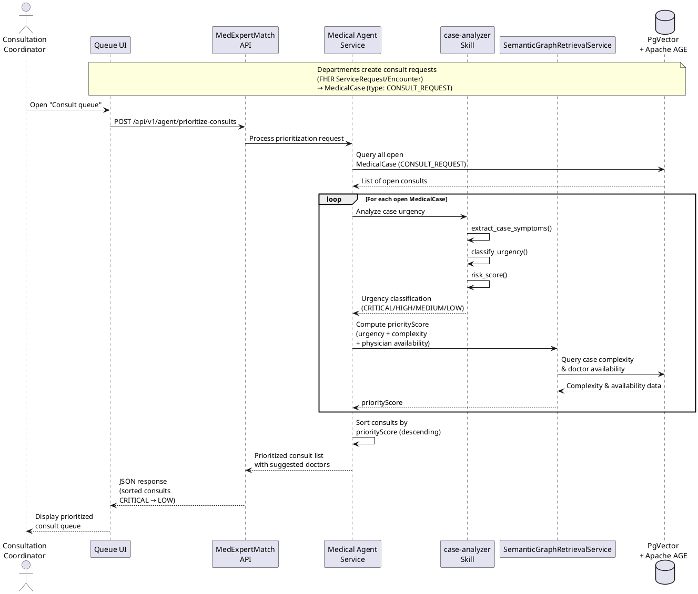
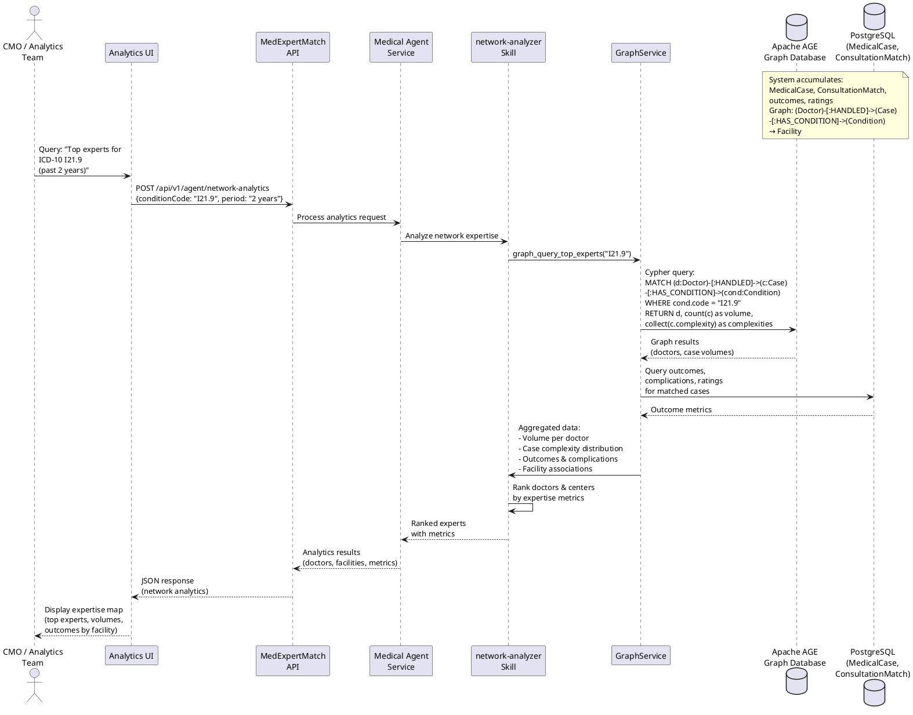
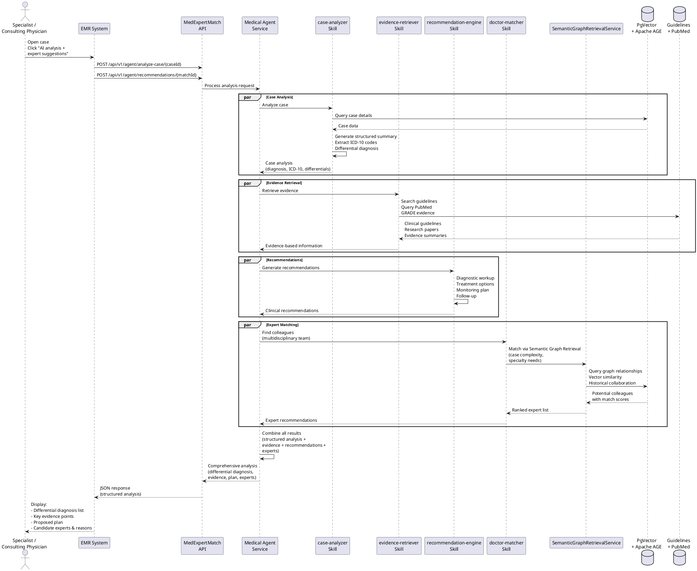
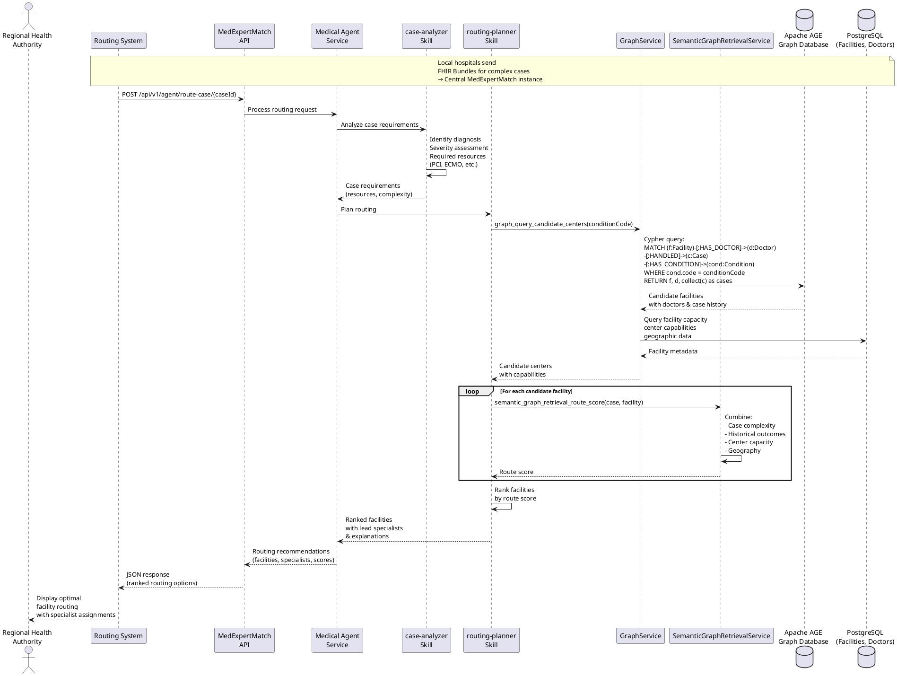
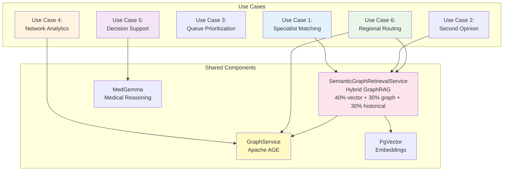

# MedExpertMatch Use Cases

**Last Updated:** 2026-01-20

## Overview

This document describes the core use cases for MedExpertMatch, an AI-powered medical expert recommendation system. Each
use case addresses real clinical workflows and demonstrates how the system improves patient care through intelligent
specialist matching.

## 1. Specialist Matching for Complex Inpatient Cases

**Actor:** Attending physician / case manager in a hospital

**User Story:**  
"As an attending physician, I want to quickly find the best specialist in our network for a complex case so that I can
get a timely, high-quality consultation."

**Flow (High-Level):**

1. Physician documents the case in the EMR; a FHIR Bundle (Patient, Condition, Observations, Encounter) is sent to
   MedExpertMatch → `MedicalCase` is created and embedded (PgVector)
    - **Alternative**: Physician can also enter case information directly via text input (
      `POST /api/v1/agent/match-from-text`), which supports handwritten text (after OCR/transcription) and direct text
      input without requiring pre-created cases
2. Physician clicks "Find specialist" → EMR calls `POST /api/v1/agent/match/{caseId}` or
   `POST /api/v1/agent/match-from-text`
3. Agent:
    - Uses `case-analyzer` skill to refine symptoms/urgency
    - Uses `doctor-matcher` skill + Java tools:
        - Queries candidates from `DoctorRepository`
        - Calls `SemanticGraphRetrievalService.score(case, doctor)` which combines:
            - **Vector similarity (40%)**: PgVector embeddings comparison
            - **Graph relationships (30%)**: Apache AGE graph traversal (doctor-case relationships, condition expertise,
              specialization matching)
            - **Historical performance (30%)**: Past outcomes, ratings, success rates
4. Agent returns a ranked list of `Doctor` with scores and rationales

**Sequence Diagram:**

**Problem Solved:**

- Reduces delay to specialist consultation and potentially shortens length of stay
- Replaces ad-hoc "who do I know?" with a consistent data-driven matching process

**References:**

- [Optimizing Specialist Consultation to Reduce Hospital Length of Stay](https://www.cureus.com/articles/386705-optimizing-specialist-consultation-to-reduce-hospital-length-of-stay.pdf)
- [Azure AI with Apache AGE Overview](https://learn.microsoft.com/en-us/azure/postgresql/azure-ai/generative-ai-age-overview)
- [Apache AGE Overview](https://age.apache.org/overview/)

**Feature:** [Find Specialist Flow](FIND_SPECIALIST_FLOW.md)

---

## 2. Online Second Opinion / Telehealth

**Actor:** Referring physician or patient via portal

**User Story:**  
"As a doctor or patient, I want to get a second opinion from the most appropriate specialist in the network so I can
confirm or adjust the treatment plan."

**Flow:**

1. User uploads medical records; the portal produces a FHIR Bundle and sends it to MedExpertMatch → `MedicalCase` with
   type `SECOND_OPINION` is created
2. Portal calls `POST /api/v1/agent/match/{caseId}`
3. Agent:
    - `case-analyzer`: extracts main diagnosis, ICD-10/SNOMED codes, complexity
    - `doctor-matcher` + Semantic Graph Retrieval:
        - Prefers doctors with strong experience in that diagnosis
        - Optionally prioritizes telehealth-enabled doctors
4. Response: top specialists with scores, availability, and reasons

**Sequence Diagram:**

**Problem Solved:**

- Cuts turnaround time for second opinions from days to minutes
- Increases probability that the case goes to the right sub-specialist, not just a generic "oncologist" / "cardiologist"

**References:**

- [Virtual Second Opinions](https://my.clevelandclinic.org/online-services/virtual-second-opinions)
- [How Second Medical Opinion Works](https://www.myusadr.com/how-it-works-second-medical-opinion/)

**Feature:** [Find Specialist Flow](FIND_SPECIALIST_FLOW.md)

---

## 3. Prioritizing the Consultation Queue

**Actor:** Consultation coordinator / department head

**User Story:**  
"As a consultation coordinator, I want all consult requests prioritized by clinical urgency so specialists see the
sickest patients first."

**Flow:**

1. Departments create consult requests (FHIR ServiceRequest / Encounter) that are mirrored as `MedicalCase` with type
   `CONSULT_REQUEST`
2. Coordinator opens "Consult queue"; UI calls `POST /api/v1/agent/prioritize-consults`
3. Agent:
    - For each open `MedicalCase`, uses `case-analyzer` tools:
        - `extract_case_symptoms`, `classify_urgency`, maybe `risk_score`
    - Semantic Graph Retrieval computes `priorityScore` based on urgency, complexity, and physician availability
4. Agent returns a list of consults sorted by `priorityScore` (CRITICAL / HIGH / MEDIUM / LOW) and optionally suggested
   doctors

**Sequence Diagram:**

**Problem Solved:**

- Prevents urgent consults from being buried in FIFO queues
- Reduces time-to-specialist for high-risk patients and unnecessary delays in care

**References:**

- [Consultation Management](https://jhmhp.amegroups.org/article/view/6270/html)
- [Impact of Consultation Timing on Length of Stay](https://bmjopen.bmj.com/content/6/5/e011654)

**Feature:** [Consultation Queue](CONSULTATION_QUEUE.md)

---

## 4. Network Analytics: "Who is Actually Expert in What"

**Actor:** Chief medical officer / quality & analytics team

**User Story:**  
"As a medical director, I want to see which specialists and facilities truly handle complex cases in specific domains so
I can plan routing and capability development."

**Flow:**

1. MedExpertMatch accumulates:
    - `MedicalCase`, `ConsultationMatch`, outcomes, ratings
2. Apache AGE stores a graph:
    - `(Doctor)-[:HANDLED]->(Case)-[:HAS_CONDITION]->(Condition)` and links to `Facility`
3. Analyst asks: "Show top experts for ICD-10 I21.9 in the past 2 years"
    - UI → `POST /api/v1/agent/network-analytics`
4. Agent skill `network-analyzer`:
    - Calls Java tool `graph_query_top_experts(conditionCode)` (Cypher on AGE) - **Implemented**
    - Calls Java tool `aggregate_metrics(entityType, entityId, metricType)` - **Implemented**
    - Aggregates volume, case complexity, outcomes, complications
    - Returns ranked doctors and centers with metrics

**Sequence Diagram:**

**Problem Solved:**

- Makes real expertise visible instead of implicit, anecdotal knowledge
- Supports data-driven routing policies and mentorship/learning programs

**References:**

- [Network Analytics in Healthcare](https://pmc.ncbi.nlm.nih.gov/articles/PMC12408653/)
- [Apache AGE Graph Queries](https://blog.csdn.net/weixin_43985633/article/details/146182865)

**Feature:** [Network Analytics](NETWORK_ANALYTICS.md)

---

## 5. Human-in-the-Loop Decision Support + Expert Matching

**Actor:** Specialist / consulting physician

**User Story:**  
"As a specialist, I want a structured analysis of the case, differential diagnosis, evidence-based recommendations and a
list of colleagues to discuss with, so I can make a better decision."

**Flow:**

1. Specialist opens a case in EMR and clicks "AI analysis + expert suggestions" → calls:
    - `POST /api/v1/agent/analyze-case/{caseId}`
    - `POST /api/v1/agent/recommendations/{matchId}`
2. Agent:
    - `case-analyzer`: structured summary, differential diagnosis, ICD-10
    - `evidence-retriever`: guidelines (`search_clinical_guidelines`) - **Implemented**, research papers (
      `query_pubmed`) - **Implemented**
    - `recommendation-engine`: diagnostic workup, treatment options, monitoring, follow-up (
      `generate_recommendations`) - **Implemented**
    - `clinical-advisor`: differential diagnosis (`differential_diagnosis`) - **Implemented**, risk assessment (
      `risk_assessment`) - **Implemented**
    - `doctor-matcher`: potential colleagues or multidisciplinary team members via Semantic Graph Retrieval
3. UI shows:
    - Differential diagnosis list
    - Key evidence points
    - Proposed plan + candidate experts and reasons

**Sequence Diagram:**

**Problem Solved:**

- Gives the physician a powerful but transparent AI copilot and expert-network navigator, improving accuracy when
  human + AI are combined

**References:**

- [Spring AI Agent Skills](https://spring.io/blog/2026/01/13/spring-ai-generic-agent-skills/)
- [Human-AI Collaboration in Medicine](https://www.nature.com/articles/s41467-025-64769-1)
- [AI Decision Support](https://www.pnas.org/doi/10.1073/pnas.2426153122)

**Feature:** [Find Specialist Flow](FIND_SPECIALIST_FLOW.md), [Evidence Retrieval](EVIDENCE_RETRIEVAL.md)

---

## 6. Cross-Organization / Regional Routing

**Actor:** Regional health authority / multi-hospital network

**User Story:**  
"As a regional operator, I want complex cases routed to the most capable centers and specialists so patient outcomes
improve and resources are used effectively."

**Flow:**

1. Local hospitals send FHIR Bundles for complex cases into a central MedExpertMatch instance
2. Operator/system calls `POST /api/v1/agent/route-case/{caseId}`
3. Agent:
    - `case-analyzer`: identifies diagnosis, severity, required resources (e.g., PCI, ECMO)
    - `routing-planner` skill:
        - Calls `graph_query_candidate_centers(conditionCode)` (AGE graph of Facilities, Doctors, Cases) - **Implemented
          **
        - Calls Semantic Graph Retrieval (`semantic_graph_retrieval_route_score`) to combine case complexity, outcomes,
          center capacity, geography - **Implemented**
4. Returns ranked facilities with proposed lead specialists and explanation

**Sequence Diagram:**

**Problem Solved:**

- Reduces "mismatch" between case complexity and facility level, a known issue in hierarchical health systems
- Makes referrals and transfers transparent, consistent, and measurable

**References:**

- [Regional Healthcare Routing](https://pmc.ncbi.nlm.nih.gov/articles/PMC12408653/)
- [Apache AGE Overview](https://age.apache.org/overview/)

**Feature:** [Regional Routing](ROUTING.md)

---

## Use Case Summary

| Use Case             | Actor                       | Key Endpoint                               | Primary Skills                                                           | Problem Solved                | Feature                                                                                      |
|----------------------|-----------------------------|--------------------------------------------|--------------------------------------------------------------------------|-------------------------------|----------------------------------------------------------------------------------------------|
| Specialist Matching  | Attending Physician         | `POST /api/v1/agent/match/{caseId}`        | case-analyzer, doctor-matcher                                            | Reduces consultation delay    | [Find Specialist Flow](FIND_SPECIALIST_FLOW.md)                                              |
| Second Opinion       | Referring Physician/Patient | `POST /api/v1/agent/match/{caseId}`        | case-analyzer, doctor-matcher                                            | Faster second opinions        | [Find Specialist Flow](FIND_SPECIALIST_FLOW.md)                                              |
| Queue Prioritization | Consultation Coordinator    | `POST /api/v1/agent/prioritize-consults`   | case-analyzer                                                            | Urgent cases seen first       | [Consultation Queue](CONSULTATION_QUEUE.md)                                                  |
| Network Analytics    | CMO/Analytics Team          | `POST /api/v1/agent/network-analytics`     | network-analyzer                                                         | Data-driven expertise mapping | [Network Analytics](NETWORK_ANALYTICS.md)                                                    |
| Decision Support     | Specialist                  | `POST /api/v1/agent/analyze-case/{caseId}` | case-analyzer, evidence-retriever, recommendation-engine, doctor-matcher | AI copilot for specialists    | [Find Specialist Flow](FIND_SPECIALIST_FLOW.md), [Evidence Retrieval](EVIDENCE_RETRIEVAL.md) |
| Regional Routing     | Regional Operator           | `POST /api/v1/agent/route-case/{caseId}`   | case-analyzer, routing-planner                                           | Optimal facility routing      | [Regional Routing](ROUTING.md)                                                               |

**Use Case Architecture Overview:**

---

## Technical Components

Each use case leverages the following core services:

- **MatchingService**: Core matching logic combining multiple signals
- **SemanticGraphRetrievalService**: Semantic Graph Retrieval scoring (embeddings + graph + historical data)
- **GraphService**: Apache AGE graph queries for relationship traversal
- **CaseAnalysisService**: MedGemma-powered case analysis and entity extraction
- **FHIR Adapters**: Convert FHIR Bundles to internal `MedicalCase` entities

---

*Last updated: 2026-01-27*
