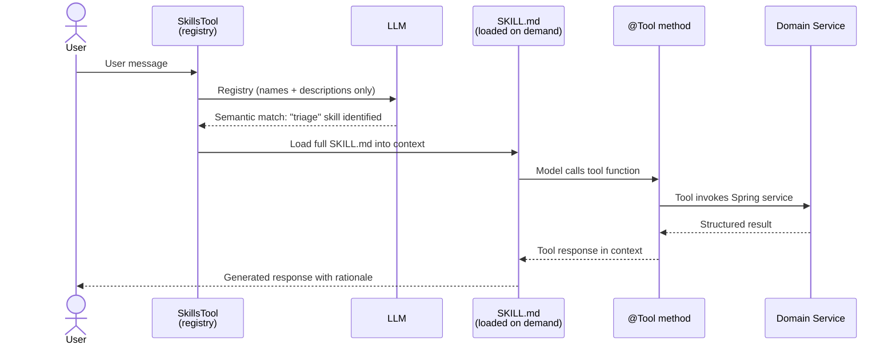
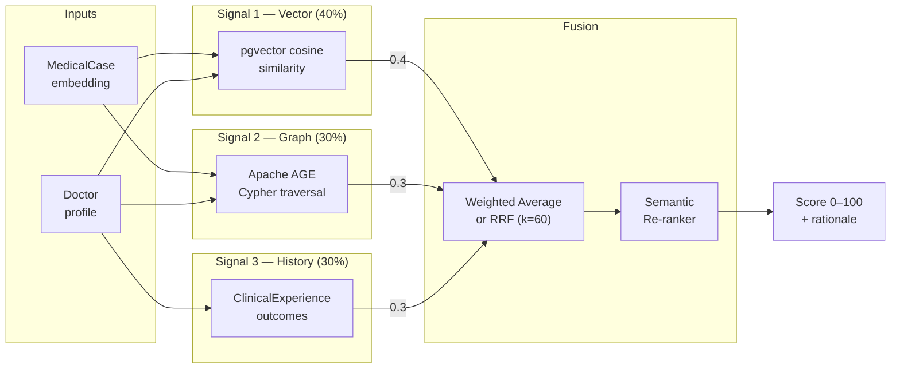
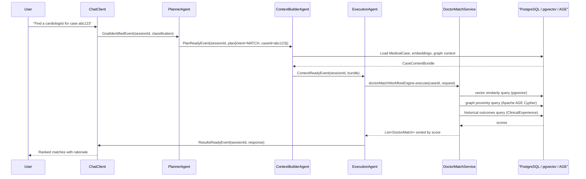
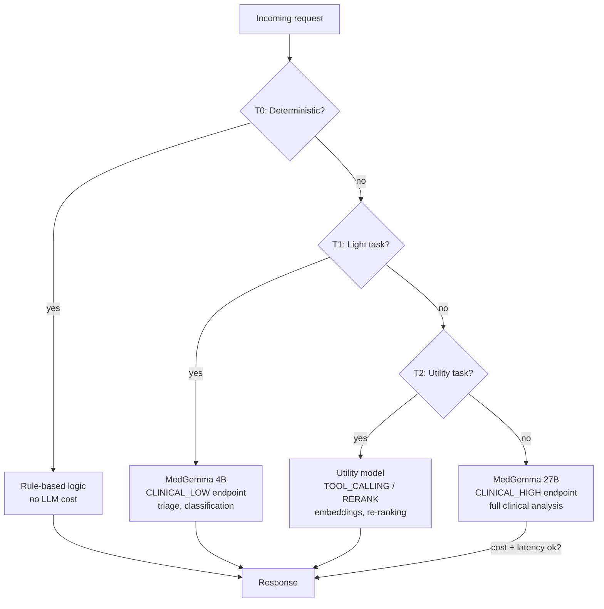

# Spring AI Agentic Patterns: Agent Skills for Clinical Decision Support

Medical AI systems have requirements that most general-purpose chatbot tutorials ignore. Hallucination in a consumer app is an annoyance; in a clinical workflow it is a patient-safety issue. Knowledge must be versioned, auditable, and updateable without a production deployment. And because the medical LLM landscape is evolving fast — MedGemma today, something better tomorrow — the stack must stay vendor-agnostic.

This post shows how [med-expert-match-ce](https://github.com/berdachuk/med-expert-match-ce), a Spring Boot 4 specialist-matching system, addresses these concerns using **Agent Skills** from the [`spring-ai-agent-utils`](https://github.com/spring-ai-community/spring-ai-agent-utils) library. Nine domain-specific skills cover the full clinical pipeline: triage, case analysis, doctor matching, evidence retrieval, routing, and network analytics — none of them hardcoded into Java.

> **⚠️ Not a Production-Ready System** — This is a research and educational project demonstrating AI agentic patterns. It is **not** certified for clinical use, not HIPAA-compliant, and not intended for real patient care. All outputs must be reviewed by qualified medical professionals before any clinical decision is made.

---

## The Problem: Why Medical AI Needs Modular Skill Architecture

General-purpose LLM applications stuff everything into one massive prompt. This works for demos but breaks down in healthcare for three reasons:

1. **Domain knowledge changes** — Clinical guidelines, drug interactions, and diagnostic criteria evolve. Updating a hardcoded prompt means redeploying code.
2. **Token cost scales poorly** — A 50-skill system that loads all skills on every request wastes context window and budget on skills that aren't relevant to the current turn.
3. **Provenance matters** — When an LLM recommends a specialist, you need to know which guideline or evidence source grounded that decision — not just the final output.

Spring AI's **Agent Skills** pattern addresses these by treating skills as first-class, versioned artifacts that are discovered and loaded *only when needed*.

---

## Skills vs. Tools vs. Medical Workflows

A common point of confusion is conflating three distinct concepts:

| Concept | Definition | Example in med-expert-match-ce |
|---|---|---|
| **Skill** | A reusable instruction package: Markdown file with YAML frontmatter, optional scripts, and assets. Loaded progressively — only when semantically matched by the LLM. | `triage/SKILL.md` with urgency classification instructions |
| **Tool** | A mechanism the model can *call* at runtime. Exposes external capabilities like file reading, script execution, or database queries. | `SkillsTool` registry, `AutoMemoryTools`, `ShellTools` |
| **Medical Workflow** | The domain task — the business logic that combines skills and tools to accomplish a clinical objective. | Matching a patient case to optimal specialists using three-signal scoring |

**The critical boundary**: A skill contains *instructions* (what to do); a tool provides *execution* (how to do it); a workflow orchestrates both to achieve a domain outcome.

---

## How Skills Work: Architecture and Execution Flow

Spring AI describes the skill lifecycle in three stages: **discovery**, **activation**, and **execution**. The flow is:



1. **Discovery** — At startup, `SkillsTool` scans `src/main/resources/skills/` directories and extracts only `name` and `description` from each `SKILL.md` frontmatter. This lightweight registry is sent to the LLM.
2. **Activation** — When a user message semantically matches a skill, the model invokes `Skill("skill-name")`. Only then is the full `SKILL.md` content loaded into the context window.
3. **Execution** — Inside the skill's instructions, the model decides which `@Tool` methods to call. Tools execute in the local environment (no sandbox by default) and return results into the skill's context.

> **Important**: Scripts referenced by a skill execute directly in the local environment without sandboxing. This is fine for read-only operations but requires careful scoping for anything that modifies state.

---

## The Medical Example: med-expert-match-ce

`med-expert-match-ce` is a Spring Modulith monolith — 18 modules with compile-time-enforced boundaries — that uses Agent Skills for specialist matching in a clinical setting.

### End-to-End Example: Triage a New Case

**Input** (user message):
```
New case: 58-year-old male, acute chest pain radiating
to the left arm, diaphoresis, elevated troponin.
Assess urgency.
```

**Skill activated**: `triage`

**Skill instructions** (`triage/SKILL.md` excerpt):
```markdown
## Urgency Levels
- **CRITICAL** — life-threatening; immediate attention required
- **HIGH** — urgent; attention required within hours

## Output
Return structured JSON with urgencyLevel, rationale, redFlags, recommendedAction.
```

**Tool invoked**: None (triage is pure LLM classification based on instructions)

**Output**:
```json
{
  "urgencyLevel": "CRITICAL",
  "rationale": "Classic ACS presentation — immediate cardiology consult required",
  "redFlags": ["chest pain", "radiation to arm", "diaphoresis", "elevated troponin"],
  "recommendedAction": "Emergency cardiology consult"
}
```

This demonstrates **progressive disclosure**: the LLM saw only the lightweight registry at startup, paid token cost for only the `triage` skill when needed, and produced a structured clinical response.

---

## System Overview

`med-expert-match-ce` is structured as a strict **Spring Modulith** monolith — 18 modules with compile-time-enforced boundaries. The LLM layer sits in the `llm` module and depends on 11 others.

```mermaid
graph TB
    subgraph "Web Layer"
        UI[Thymeleaf SSR]
        REST[REST Controllers]
    end

    subgraph "LLM Module"
        CA[ChatClient + SkillsTool]
        PA[PlannerAgent]
        CBA[ContextBuilderAgent]
        EA[ExecutionAgent]
        LCA[LlmUsageCaptureAdvisor]
        AM[AutoMemoryTools]
        SM[SessionMemoryAdvisor]
    end

    subgraph "Retrieval Module"
        DR[DoctorMatchService]
        SR[SemanticGraphRetrievalService]
        RR[RerankingService]
    end

    subgraph "Domain Modules"
        MC[medicalcase]
        DOC[doctor]
        CE[clinicalexperience]
        FAC[facility]
        EV[evidence / PubMed]
    end

    subgraph "Infrastructure"
        PG[(PostgreSQL 17)]
        VEC[(pgvector 1536-dim)]
        AGE[(Apache AGE graph)]
    end

    UI --> CA
    REST --> CA
    CA --> PA
    PA -->|PlanReadyEvent| CBA
    CBA -->|ContextReadyEvent| EA
    EA --> DR
    DR --> SR
    SR --> VEC
    SR --> AGE
    SR --> CE
    DR --> RR
    CA --> LCA
    CA --> SM
    CA --> AM
    DR --> MC
    DR --> DOC
    DR --> FAC
    PG --> VEC
    PG --> AGE
```



The event-driven sub-pipeline (`PlannerAgent → ContextBuilderAgent → ExecutionAgent`) is activated by the Spring profile `event-driven`. On the default profile, the `ChatClient` calls workflow engines directly.

---

## Domain Model

Three records anchor the matching domain.

### MedicalCase

```java
// medicalcase/domain/MedicalCase.java
public record MedicalCase(
    String id,                          // CHAR(24) hex ID
    Integer patientAge,                 // anonymised
    String chiefComplaint,
    String symptoms,
    String currentDiagnosis,
    List<String> icd10Codes,            // ICD-10 classification
    List<String> snomedCodes,           // SNOMED-CT codes
    UrgencyLevel urgencyLevel,          // CRITICAL / HIGH / MEDIUM / LOW
    String requiredSpecialty,
    CaseType caseType,                  // INPATIENT / SECOND_OPINION / CONSULT_REQUEST
    String additionalNotes,
    String abstractText,                // embedding source
    BigDecimal locationLatitude,
    BigDecimal locationLongitude
) {}
```

### Doctor

```java
// doctor/domain/Doctor.java
public record Doctor(
    String id,
    String name,
    List<String> specialtyIds,          // array-ref, no FK
    List<String> icd10CodeRanges,       // competency breadth
    Boolean telehealthCapable,
    String availabilityStatus,
    BigDecimal locationLatitude,
    BigDecimal locationLongitude
) {}
```

### ClinicalExperience

`ClinicalExperience` stores per-doctor-per-case outcomes — the historical signal in the three-signal scorer.

```java
// clinicalexperience/domain/ClinicalExperience.java
public record ClinicalExperience(
    String id,
    String doctorId,
    String caseId,
    String outcome,          // RESOLVED, IMPROVED, REFERRED, ...
    Integer complexityLevel,
    String facilityId,
    Instant recordedAt
) {}
```

Array-based references (`List<String>` instead of foreign keys) are an architectural decision (ADR D-013). PostgreSQL GIN indexes on `TEXT[]` columns make containment queries fast without JOIN overhead.

---

## The Three-Signal Scorer

Doctor-to-case matching blends three independent signals into a single score in the 0–100 range.



The weights are configurable in `application.yml`; optional Reciprocal Rank Fusion (`k=60`) can replace the weighted average for re-ranking large candidate sets.

---

## The Nine Medical Skills

```
src/main/resources/skills/
├── case-analyzer/       SKILL.md
├── clinical-advisor/    SKILL.md
├── clinical-guideline/  SKILL.md
├── doctor-matcher/      SKILL.md
├── evidence-retriever/  SKILL.md
├── network-analyzer/    SKILL.md
├── recommendation-engine/ SKILL.md
├── routing-planner/     SKILL.md
└── triage/              SKILL.md
```

| Skill | Triggered when | Purpose | Backed by |
|---|---|---|---|
| `triage` | New case enters the system | Classify case urgency (CRITICAL/HIGH/MEDIUM/LOW) and identify red flags for queue routing | LLM urgency classifier |
| `case-analyzer` | "Find Specialist" or chat intake | Extract ICD-10/SNOMED codes, chief complaint, and symptoms from unstructured case text | Clinical LLM → ICD-10/SNOMED extraction |
| `doctor-matcher` | Case analysis complete | Score and rank doctors against a case using vector similarity, graph proximity, and historical outcomes | Three-signal pipeline (vector + graph + history) |
| `evidence-retriever` | Case needs supporting literature | Fetch relevant PubMed articles and local RAG context to ground recommendations in evidence | PubMed E-utilities + local pgvector search |
| `clinical-advisor` | Differential diagnosis requested | Provide risk assessment and historical outcome context for potential diagnoses | ClinicalExperience history + risk LLM |
| `recommendation-engine` | Matches found, synthesis needed | Generate treatment plan suggestions and referral rationale with evidence grounding | Clinical LLM → treatment plan + referral rationale |
| `routing-planner` | "Where should this patient go?" | Score facilities by complexity capability, historical outcomes, bed capacity, and geographic proximity | Facility scorer: complexity × outcomes × capacity × proximity |
| `network-analyzer` | Expertise-network analytics | Query the doctor-facility-specialty graph to find hidden referral patterns and sub-specialty clusters | Apache AGE Cypher graph queries |
| `clinical-guideline` | Guideline grounding needed | Retrieve and apply relevant CPG (Clinical Practice Guidelines) and GRADE evidence quality ratings | CPG + GRADE citation logic |

### `doctor-matcher` skill (full example)

```markdown
---
name: doctor-matcher
description: Match doctors to medical cases using multiple signals
             including vector similarity, graph relationships,
             and historical performance
---

# Doctor Matcher

## When to Use This Skill
- User needs to find specialists for a medical case
- You need to score and rank doctor-case matches
- You need to prioritize doctors based on historical performance

## Available Tools

### querycandidatedoctors
Finds candidate doctors based on case requirements and filters.

Parameters:
- `caseId` — the medical case ID (required)
- `specialty` — required medical specialty (optional)
- `requireTelehealth` — filter to telehealth-capable doctors (optional)
- `maxResults` — maximum number of results, default 10

Returns a list of candidate doctors matching the criteria.

### matchdoctorstocase
Runs the full three-signal match-and-score pipeline for a case.

Parameters:
- `caseId` — the medical case ID
- `maxResults` — default 10
- `minScore` — score threshold (optional)
- `preferredSpecialties` — preferred specialty list (optional)
- `requireTelehealth` — boolean (optional)

Returns doctor matches sorted by score (1 = best match),
with per-signal breakdown and rationale.

## Output Format
For every match provide:
- **Doctor** — name, specialty, certifications, availability
- **Score** — overall 0–100 with component breakdown (vector / graph / history)
- **Rank** — position in results (1 = best match)
- **Rationale** — why this doctor was selected

## Workflow
1. Analyse the case — identify required specialty, urgency, complexity
2. Call `querycandidatedoctors` to get the filtered candidate pool
3. Call `matchdoctorstocase` to score and rank the pool
4. Apply thresholds or preference filters as needed
5. Return ranked results with full rationale

## Medical Disclaimer
All matches are for research and educational purposes only.
Results must be reviewed by qualified medical professionals
before any clinical decision is made.
```

---

## Event-Driven Agent Pipeline

When the `event-driven` Spring profile is active, the `llm` module decomposes every user request into a three-stage pipeline mediated by Spring `ApplicationEvent`s. This decouples intent recognition, context assembly, and execution — each stage can be profiled, retried, and tested independently.



Each agent is a plain Spring `@Component` with an `@EventListener` method:

```java
// llm/agent/ContextBuilderAgent.java
@Slf4j
@Component
@Profile("event-driven")
@RequiredArgsConstructor
public class ContextBuilderAgent {

    private final ApplicationEventPublisher eventPublisher;
    private final CaseContextBundleService   caseContextBundleService;
    private final PipelineMetricsService     pipelineMetrics;
    private final PipelineProgressCollector  pipelineProgressCollector;

    @EventListener
    public void onPlanReady(PlanReadyEvent event) {
        long start = System.currentTimeMillis();
        log.info("ContextBuilderAgent: plan ready session={} steps={}",
            event.sessionId(), event.plan().steps().size());

        pipelineProgressCollector.addStage(event.sessionId(), CONTEXT_BUILD, "ContextBuilder");

        String          caseId  = findCaseId(event.plan());
        CaseContextIntent intent = resolveIntent(event.plan());

        CaseContextBundle bundle = caseContextBundleService.build(caseId, intent);

        pipelineMetrics.recordContextBuild(event.sessionId(),
            System.currentTimeMillis() - start);

        eventPublisher.publishEvent(
            new ContextReadyEvent(event.sessionId(), bundle, Instant.now()));
    }
}
```

---

## Three-Signal Matching — Implementation

The `DoctorMatchServiceImpl` orchestrates the three signals, guards against semantically empty cases, and applies optional re-ranking.

```java
// retrieval/service/impl/DoctorMatchServiceImpl.java
@Service
@RequiredArgsConstructor
@Transactional(readOnly = true)
public class DoctorMatchServiceImpl implements DoctorMatchService {

    private final MedicalCaseRepository         medicalCaseRepository;
    private final SemanticGraphRetrievalService  semanticGraphRetrievalService;
    private final RerankingService               rerankingService;

    @Override
    public List<DoctorMatch> matchDoctorsForCase(
            String caseId, MatchOptions options) {

        String normalizedId = caseId.trim().toLowerCase();

        MedicalCase medicalCase = medicalCaseRepository
            .findById(normalizedId)
            .orElseThrow(() -> new IllegalArgumentException(
                "Medical case not found: " + caseId));

        // Guard: reject cases that contain only ObjectId placeholders
        if (hasInsufficientMedicalData(medicalCase)) {
            log.warn("Case {} has insufficient clinical data for matching", caseId);
            return List.of();
        }

        List<Doctor> candidates = findCandidateDoctors(medicalCase, options);

        List<DoctorMatch> unsorted = candidates.stream()
            .filter(d -> !options.excludedDoctorIds().contains(d.id()))
            .map(doctor -> {
                ScoreResult score =
                    semanticGraphRetrievalService.score(medicalCase, doctor);
                return new DoctorMatch(
                    doctor,
                    score.overallScore(),
                    0,           // rank assigned after sort
                    score.rationale());
            })
            .filter(m -> options.minScore() == null
                         || m.matchScore() >= options.minScore())
            .collect(toList());

        List<DoctorMatch> sorted = unsorted.stream()
            .sorted(comparingDouble(DoctorMatch::matchScore).reversed())
            .collect(toList());

        // Optional semantic re-ranking (disabled by default via feature flag)
        return rerankingService.rerank(normalizedId, sorted, options.maxResults());
    }

    /**
     * A case has insufficient data if all three clinical fields are blank
     * or contain only 24-character hex ObjectId strings.
     */
    private boolean hasInsufficientMedicalData(MedicalCase c) {
        return !isRealMedicalTerm(c.chiefComplaint())
            && !isRealMedicalTerm(c.currentDiagnosis())
            && (c.icd10Codes() == null
                || c.icd10Codes().stream().noneMatch(this::isRealMedicalTerm));
    }

    private boolean isRealMedicalTerm(String value) {
        if (value == null || value.isBlank()) return false;
        // Reject bare ObjectId hex strings (24 hex chars)
        if (value.trim().matches("[0-9a-fA-F]{24}")) return false;
        return value.trim().chars().anyMatch(Character::isLetter);
    }
}
```

---

## LLM Telemetry Advisor

Every LLM call — regardless of which skill triggered it — passes through `LlmUsageCaptureAdvisor`. The advisor intercepts both blocking and streaming calls, records latency and token counts, and publishes a `LlmCallSnapshot` to the Prometheus-backed `LlmUsageTelemetryService`.

```java
// llm/advisor/LlmUsageCaptureAdvisor.java
public class LlmUsageCaptureAdvisor implements CallAdvisor, StreamAdvisor {

    private final LlmUsageTelemetryService telemetryService;

    @Override
    public String getName() { return "llmUsageCaptureAdvisor"; }

    @Override
    public int getOrder() { return Ordered.LOWEST_PRECEDENCE; }

    // --- Blocking call ---
    @Override
    public ChatClientResponse adviseCall(
            ChatClientRequest request, CallAdvisorChain chain) {
        long start = System.nanoTime();
        ChatClientResponse response = chain.nextCall(request);
        record(request, response, start);
        return response;
    }

    // --- Streaming call ---
    @Override
    public Flux<ChatClientResponse> adviseStream(
            ChatClientRequest request, StreamAdvisorChain chain) {
        long start = System.nanoTime();
        AtomicReference<ChatClientResponse> last = new AtomicReference<>();
        return chain.nextStream(request)
            .doOnNext(last::set)
            .doOnComplete(() -> record(request, last.get(), start));
    }

    private void record(
            ChatClientRequest request,
            ChatClientResponse response,
            long startNanos) {
        if (response == null) return;
        long latencyMs = Math.max(0L, (System.nanoTime() - startNanos) / 1_000_000L);
        LlmCallSnapshot snapshot = LlmCallSnapshot.fromProvider(
            response, request,
            LlmUsageContextHolder.getOrDefault(), latencyMs);
        telemetryService.record(snapshot);
    }
}
```

Six role-separated endpoints — `CLINICAL_HIGH`, `CLINICAL_LOW`, `UTILITY`, `TOOL_CALLING`, `EMBEDDING`, `RERANK` — are each tracked individually. This enables per-role cost accounting and quality monitoring in Grafana.

---

## Four-Tier LLM Inference Pipeline

Not every request needs MedGemma 27B. The routing layer assigns each sub-task to the cheapest tier capable of producing sufficient quality.



The tier assignment is declared in `LlmTierConfiguration` and resolved by a `LlmTierRoutingService` at request time. Per-tier Prometheus counters track cost, latency, and quality signals from the evaluation flywheel.

---

## Session Memory and AutoMemory

Two complementary memory mechanisms preserve context across turns and sessions.

### Sliding-window session memory

```java
// Compact after 15 turns; hard limit 30 events; JDBC-persisted
SessionMemoryAdvisor memoryAdvisor = new SessionMemoryAdvisor(
    jdbcSessionStore,
    new SlidingWindowCompactionStrategy(15, 30));
```

### AutoMemory — durable cross-session facts

Durable facts (patient preferences, doctor notes, recurring case patterns) are stored as Markdown files under `~/.medexpertmatch/auto-memory/`. Explicit `AutoMemoryTools` give the agent full control over what gets persisted and when — deliberate recall rather than implicit injection.

```
~/.medexpertmatch/auto-memory/
├── doctor-prefs-abc123.md     # "Dr. Smith prefers cardiology referrals via telehealth"
├── case-patterns-2026-06.md   # recurring chief-complaint patterns this month
└── session-notes-xyz.md       # cross-session continuity notes
```

The explicit-tools approach (ADR D-011) was chosen over `AutoMemoryToolsAdvisor` to maintain agent control over what constitutes a "durable fact" — important in a medical context where stale or incorrect remembered facts could affect downstream recommendations.

---

## Module Boundaries (Spring Modulith)

The `llm` module's allowed dependencies are declared in `package-info.java`:

```java
// llm/package-info.java
@org.springframework.modulith.ApplicationModule(
    allowedDependencies = {
        "core",
        "doctor",
        "medicalcase",
        "clinicalexperience",
        "medicalcoding",
        "facility",
        "graph",
        "embedding",
        "retrieval",
        "caseanalysis",
        "evidence"
    }
)
package com.berdachuk.medexpertmatch.llm;
```

Spring Modulith enforces these boundaries at compile time via `@ApplicationModuleTest`. Any attempt to call across a non-declared boundary fails the build — guaranteeing that the LLM orchestration layer never reaches directly into, say, the `ingestion` module's internals.

---

## Prompt Templates as External Resources

Following ADR D-004, no prompt string is hardcoded in Java. Every `.st` (StringTemplate) file lives in `src/main/resources/prompts/` and is wired via `PromptTemplate.builder()`:

```java
// core/config/PromptTemplateConfig.java
@Configuration
public class PromptTemplateConfig {

    @Bean
    public PromptTemplate caseAnalysisPrompt(ResourceLoader resourceLoader) {
        return PromptTemplate.builder()
            .renderer(StTemplateRenderer.builder().build())
            .resource(resourceLoader.getResource(
                "classpath:prompts/case-analysis.st"))
            .build();
    }

    @Bean
    public PromptTemplate doctorMatchRationalePrompt(ResourceLoader resourceLoader) {
        return PromptTemplate.builder()
            .renderer(StTemplateRenderer.builder().build())
            .resource(resourceLoader.getResource(
                "classpath:prompts/doctor-match-rationale.st"))
            .build();
    }
}
```

Updating clinical reasoning instructions becomes a one-file change — no recompilation, no schema migration, no deployment if templates are loaded from a mounted volume.

---

## Configuring the Agent with Skills

### 1. Maven dependency

```xml
<!-- pom.xml -->
<dependency>
    <groupId>org.spring-ai-community</groupId>
    <artifactId>spring-ai-agent-utils</artifactId>
    <version>0.9.0</version>
</dependency>
```

Spring AI BOM: `2.0.0`. Spring Boot: `4.1.0`.

### 2. ChatClient bean

```java
// llm/config/MedicalAgentConfiguration.java
@Configuration
@RequiredArgsConstructor
public class MedicalAgentConfiguration {

    private final ResourceLoader resourceLoader;

    @Bean
    public ChatClient medicalAgentChatClient(
            ChatClient.Builder builder,
            LlmUsageCaptureAdvisor usageAdvisor,
            SessionMemoryAdvisor memoryAdvisor,
            AutoMemoryTools autoMemoryTools) {

        return builder
            // Skills loaded from classpath JAR — no file-system dependency
            .defaultToolCallbacks(
                SkillsTool.builder()
                    .addSkillsResource(
                        resourceLoader.getResource("classpath:skills"))
                    .build())
            // Durable cross-session memory stored at ~/.medexpertmatch/auto-memory/
            .defaultTools(autoMemoryTools)
            .defaultAdvisors(
                usageAdvisor,           // LLM telemetry + Prometheus
                memoryAdvisor)          // sliding-window JDBC session memory
            .build();
    }
}
```

`SkillsTool.builder().addSkillsResource(...)` accepts any Spring `Resource` — classpath, file system, or a custom `ResourceLoader`. Loading from classpath keeps the production JAR self-contained.

---

## Evaluation: Testing and Quality Assurance

A production clinical AI system requires rigorous evaluation. The current project addresses this through:

### Accuracy Checks
- **Synthetic test cases** with known ICD-10/SNOMED codes verify extraction accuracy
- **Benchmark datasets** compare three-signal scores against expert physician rankings

### Domain Review
- Every `SKILL.md` change requires a PR reviewed by both a software engineer and a clinical domain expert
- Skill descriptions and output formats are validated against current clinical guidelines

### Prompt and Version Control
- All skill instructions are versioned in Git alongside the code
- Git tags align application releases with skill releases for auditability
- Changes to skills trigger regression tests in the CI pipeline

### Failure Handling
- Cases with insufficient clinical data (missing chief complaint, diagnosis, or codes) return empty results rather than hallucinated matches
- `hasInsufficientMedicalData()` guards against bare ObjectId placeholder strings being treated as valid medical terms
- Telemetry tracks per-role failure rates for quality monitoring

---

## Key Design Decisions

| ADR | Decision | Rationale |
|---|---|---|
| D-001 | Java records for domain entities | Immutable, RowMapper-friendly, less mutation bugs |
| D-004 | External `.st` prompt templates | Iterate on clinical reasoning without recompilation |
| D-006 | OpenAI-compatible providers only | Single integration surface; swap models without code changes |
| D-007 | Six role-separated LLM endpoints | Per-role cost tracking, quality monitoring, independent scaling |
| D-009 | Graph ops only through `GraphService` | Prevents Cypher injection; single point for graph schema changes |
| D-011 | AutoMemory via explicit tools | Agent controls what is remembered — critical in clinical contexts |
| D-012 | Four-tier inference pipeline | Use heavy models only when lighter tiers are insufficient |
| D-013 | Array-based references, no FKs | Fast GIN containment queries on read-heavy medical data |

---

## Safe Use in Healthcare

> **🔴 Do NOT Use This System For:**
> - **Autonomous diagnosis** — No AI system should generate a diagnosis without clinician review
> - **Treatment prescribing** — Medication decisions require licensed physician judgment
> - **Unsupervised triage** — All urgency classifications must be confirmed by qualified staff
> - **Autonomous referral routing** — Specialist assignments need physician approval

### Appropriate Uses (Lower Risk)

| Use Case | Risk Level | Requirement |
|---|---|---|
| Clinical documentation assistance | Low | Clinician reviews all output |
| Protocol and guideline retrieval | Low | Verify against current authoritative sources |
| Educational scenarios | Low | Clearly labeled as training/research |
| Literature search assistance | Medium | Clinician validates relevance and applicability |
| Differential diagnosis consideration | High | Must be advisory only, not sole basis for decisions |

### What the Reference Implementation Does NOT Provide

The Spring AI `spring-ai-agent-utils` library provides **no built-in**:
- Sandboxing for script execution
- Human-in-the-loop approval gates
- Audit logging of skill invocations
- Version diffing or rollback for skills
- Clinical safety certifications

For any workflow that could influence diagnosis, prescribing, or treatment, you must implement these safeguards as application-level concerns outside the skill system itself.

---

## Getting Started

**Step 1 — Add the dependency**

```xml
<dependency>
    <groupId>org.spring-ai-community</groupId>
    <artifactId>spring-ai-agent-utils</artifactId>
    <version>0.9.0</version>
</dependency>
```

**Step 2 — Create a skill**

```bash
mkdir -p src/main/resources/skills/triage
```

```markdown
# src/main/resources/skills/triage/SKILL.md
---
name: triage
description: Assess urgency level for new medical cases and classify
  as CRITICAL, HIGH, MEDIUM, or LOW.
---

## Instructions
Extract chief complaint, check for life-threatening red flags,
return urgencyLevel + rationale as JSON.
```

**Step 3 — Register `SkillsTool`**

```java
ChatClient client = ChatClient.builder(chatModel)
    .defaultToolCallbacks(
        SkillsTool.builder()
            .addSkillsResource(
                resourceLoader.getResource("classpath:skills"))
            .build())
    .build();
```

**Step 4 — Call the agent**

```java
String result = client.prompt()
    .user("""
        New case: 58-year-old male, acute chest pain radiating
        to the left arm, diaphoresis, elevated troponin.
        Assess urgency.
        """)
    .call()
    .content();

// LLM activates skill "triage" automatically.
// Returns:
// {
//   "urgencyLevel": "CRITICAL",
//   "rationale": "Classic ACS presentation — immediate cardiology consult required",
//   "redFlags": ["chest pain", "radiation to arm", "diaphoresis", "elevated troponin"]
// }
```

---

## Resources

- **Repository:** [berdachuk/med-expert-match-ce](https://github.com/berdachuk/med-expert-match-ce)
- **Spring AI Agent Utils:** [spring-ai-community/spring-ai-agent-utils](https://github.com/spring-ai-community/spring-ai-agent-utils)
- **Spring Blog post:** [Spring AI Agentic Patterns (Part 1): Agent Skills](https://spring.io/blog/2026/01/13/spring-ai-generic-agent-skills)
- **Spring AI Reference:** [docs.spring.io/spring-ai](https://docs.spring.io/spring-ai/reference/2.0/)
- **Apache AGE:** [age.apache.org](https://age.apache.org)
- **pgvector:** [github.com/pgvector/pgvector](https://github.com/pgvector/pgvector)