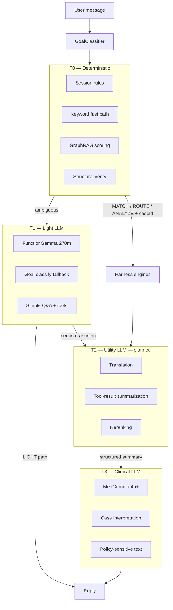
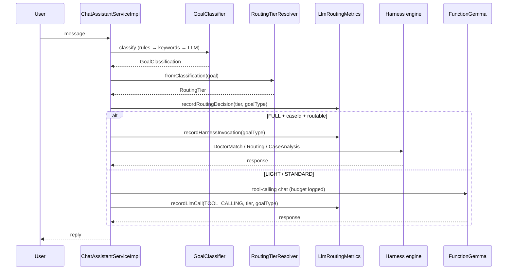

# M64: Cost-Quality Tier Routing — Architecture Decision

**Date:** 2026-06-07  
**Status:** Accepted (Phase 0–1 implemented; Phases 2–6 planned)  
**Plan:** `.agents/plans/M64-cost-quality-routing.md`  
**Related:** [Harness Architecture](../HARNESS.md), [FunctionGemma](../FUNCTIONGEMMA.md), [AI Provider Configuration](../AI_PROVIDER_CONFIGURATION.md)

---

## Summary

MedExpertMatch adopts a **multi-tier LLM inference pipeline**: expensive models handle clinical reasoning on
high-stakes workflows; cheaper, faster models handle tool selection, translation, summarization, and routine Q&A.
Routing is **goal-aware** (via `GoalClassifier` → `RoutingTier`) and **observable** (Prometheus counters per tier and
goal type).

**Core principle:** *The expensive model thinks; the cheap model moves data.*

---

## Context

### The cost problem

In agentic AI systems, **input tokens dominate spend**. Empirical data from production coding-agent sessions shows
roughly **25:1 read-to-write token ratio**: most budget goes to passing raw context (files, logs, tool output, diffs)
into an expensive model — not to generating answers.

MedExpertMatch has the same structural pattern:

| Coding-agent I/O | MedExpertMatch analogue |
|------------------|-------------------------|
| Full-file reads | Case bundles, GraphRAG candidate lists, PubMed hit lists |
| CLI / test output | `@Tool` JSON payloads, verify-loop feedback |
| Git diff / status | Structured match/routing payloads |
| Retry loops | Harness verify retries, repeated tool-calling turns |

Running every user turn through **MedGemma + full GraphRAG harness** is clinically justified for match/route/analyze
workflows — but wasteful for “What is ICD-10?” or simple evidence browse requests.

### What already existed (pre-M64)

The project already had partial model separation:

| Role | Bean / config | Typical model | Used for |
|------|---------------|---------------|----------|
| Clinical (T3) | `clinicalChatModel` | MedGemma 4b | Harness analyze/interpret, case analysis |
| Utility (T2) | `utilityChatModel` | Qwen3.5 4b | Goal classify fallback, translation, summarization |
| Tool calling (T1) | `toolCallingChatModel` | FunctionGemma 270m | Auto chat orchestrator, `@Tool` selection |
| Reranking | `rerankingChatModel` | Qwen3.5 4b (default) | Semantic rerank of retrieval candidates |
| Embeddings | `primaryEmbeddingModel` | nomic-embed-text:v1.5 | Vector search |

Additionally:

- **Harness fast path** — `GoalClassifier` uses session rules → keywords → LLM fallback before any workflow engine.
- **Split brain** — MATCH/ROUTE/ANALYZE + case ID bypass FunctionGemma and go to deterministic harness engines.
- **`LlmClientType` + `LlmCallLimiter`** — concurrency limits per client type.
- **`LLM_RESPONSES_CACHE`** — caches repeated analyze/interpret calls.

Gaps before M64:

1. No explicit **cost tier** abstraction tied to `GoalType`.
2. No **token budget** config per tier.
3. No **Prometheus visibility** for routing decisions vs harness invocations vs LLM calls.
4. Before M67, MedGemma was also used for **I/O-heavy auxiliary tasks** (translation, goal classify fallback, reranking); utility/rerank now default to Qwen3.5.
5. Full tool/GraphRAG payloads passed to MedGemma without **structured compression**.

### Lessons from token optimization elsewhere

Production token-saving pipelines (delegation of reading, draft-and-refine, output compression) share one rule:

> **Token optimization without semantic guarantees breaks the system.**

Examples: compressing short success signals (e.g. `git push` confirmation) caused retry loops and hung sessions.
Fix: **command-aware routing** — whitelist critical signals; compress only long noise.

MedExpertMatch applies the same rule: never drop verify status, policy-gate results, case IDs, or medical disclaimers
during context shaping.

---

## Decision

Implement a **four-layer cost-quality pipeline**:



### Routing tiers (M64)

Three operational tiers map 1:1 to `GoalType` for chat routing and token budgets:

| Tier | `GoalType` values | Execution path | Default max tokens |
|------|-------------------|----------------|-------------------|
| **LIGHT** | `GENERAL_QUESTION` | FunctionGemma Auto chat | 2048 |
| **STANDARD** | `SEARCH_EVIDENCE`, `TRIAGE_INTAKE`, `GENERATE_RECOMMENDATIONS` | Tools + retrieval slice | 4096 |
| **FULL** | `MATCH_DOCTORS`, `ROUTE_CASE`, `ANALYZE_CASE` | Harness engines + GraphRAG + MedGemma | 6000 |

Tier assignment is **pure logic** in `RoutingTierResolver` — no extra LLM call.

### Model roles (target end state)

| Layer | Model tier | Examples (local) | Responsibility |
|-------|------------|------------------|----------------|
| T0 | None | — | Rules, keywords, GraphRAG math, verify structure |
| T1 | Light | FunctionGemma 270m, fine-tuned variant (M60) | Tool selection, simple chat, evidence browse |
| T2 | Utility | qwen3-1.5b, flash-class API model | Translation, summarization, reranking, structured extraction |
| T3 | Clinical | MedGemma 4b+ | Case analysis, match interpretation, patient-facing clinical text |

**Hard rule:** T3 (MedGemma) must not receive raw PubMed lists, full doctor candidate dumps, or verbose tool JSON.
It receives **structured summaries** produced by T2 or deterministic code.

### Medical safety constraints

These are non-negotiable regardless of tier:

1. **Policy gate** (`MedicalAgentPolicyGateService`) runs on all patient-facing clinical output.
2. **PHI** never logged; all outputs sanitized via `LlmResponseSanitizer`.
3. **Clinical interpretation** stays on T3 — cheap models handle auxiliary/structured tasks only.
4. **OpenAI-compatible providers only** — no provider switch in code; routing via config/env vars.
5. **Eval gates** before downgrading classify/translate/rerank to a cheaper model.

---

## Architecture

### Request flow (implemented)



### Component map

| Component | Package / path | Responsibility |
|-----------|----------------|----------------|
| `RoutingTier` | `llm/routing/RoutingTier.java` | Enum: LIGHT, STANDARD, FULL |
| `RoutingTierResolver` | `llm/routing/RoutingTierResolver.java` | `GoalType` → `RoutingTier` |
| `LlmTierProperties` | `llm/config/LlmTierProperties.java` | Per-tier `max-tokens` from config |
| `LlmRoutingMetrics` | `llm/monitoring/LlmRoutingMetrics.java` | Tier/goal/harness/chat Prometheus counters |
| `LlmCallMetrics` | `core/monitoring/LlmCallMetrics.java` | Per-`LlmClientType` call counter via limiter |
| `ChatAssistantServiceImpl` | `llm/service/impl/` | Records tier after classify; harness vs chat path |
| `LlmCallLimiter` | `core/util/LlmCallLimiter.java` | Concurrency + optional call metrics |
| `GoalClassifier` | `llm/chat/GoalClassifier.java` | Pre-routing goal identification (unchanged contract) |

### Configuration

```yaml
# application.yml — medexpertmatch.llm.tier.*
medexpertmatch:
  llm:
    tier:
      light:
        max-tokens: ${MEDEXPERTMATCH_LLM_TIER_LIGHT_MAX_TOKENS:2048}
      standard:
        max-tokens: ${MEDEXPERTMATCH_LLM_TIER_STANDARD_MAX_TOKENS:4096}
      full:
        max-tokens: ${MEDEXPERTMATCH_LLM_TIER_FULL_MAX_TOKENS:6000}
```

Existing model endpoints remain separate (`spring.ai.custom.chat`, `.tool-calling`, `.reranking`, `.embedding`).
Future **utility model** will add `spring.ai.custom.utility.*` and `LlmClientType.UTILITY`.

### Observability

Prometheus endpoints (`/actuator/prometheus`):

| Metric | Tags | Meaning |
|--------|------|---------|
| `llm.routing.decisions.total` | `tier`, `goal_type` | Tier assigned after goal classification |
| `llm.harness.invocations.total` | `goal_type` | Full harness workflow started |
| `llm.calls.total` | `client_type`, `tier`, `goal_type` | Chat-path LLM invocation |
| `llm.calls.by_client.total` | `client_type` | Any LLM call through `LlmCallLimiter` |
| `llm.tokens.total` | `client_type`, `tier`, `goal_type`, `direction` | Token usage (wired via M71 `LlmUsageTelemetryService`) |

Use these to build Grafana panels: % LIGHT vs FULL, harness invocations per day, cost proxy by tier.

### Context compression contract (planned — Phase 3)

Before MedGemma sees harness output, a **ContextSummarizer** produces structured records — not prose:

```json
{
  "case_id": "6a23f05200155d711484cf64",
  "top_matches": [
    {"doctor_id": "...", "score": 0.87, "specialty": "Cardiology"}
  ],
  "evidence_count": 12,
  "verify_status": "PASSED"
}
```

**Never compress (whitelist):**

- `verify_status`, policy-gate rejection, `case_id`
- Error/failure markers
- Medical disclaimer flags

Prefer **deterministic code** over LLM summarization where structure is known (doctor list → top-N JSON).

### Draft-and-refine (planned — Phase 4)

For long ANALYZE/MATCH replies:

1. T1/T2 produces **outline + anchors** (headings, bullets, tool facts).
2. T3 (MedGemma) performs **clinical polish only** — instruct: modify incorrect parts, do not rewrite from scratch.
3. Policy gate validates final text.

Expected: −20–40% output tokens with quality held by eval set.

---

## Alternatives considered

| Alternative | Why rejected |
|-------------|--------------|
| Single model for everything | MedGemma poor at tool calling; FunctionGemma poor at clinical reasoning — already split |
| Always use cheapest model | Unacceptable clinical quality regression on match/analyze |
| LLM-only context compression | High risk of dropping verify/policy signals; prefer code-first shaping |
| Aggressive session compaction only | Reduces history tokens but not harness/tool payload cost |
| Per-user billing tiers | Out of scope (M64 non-goal); routing is technical, not commercial |
| Ollama native / non-OpenAI providers | Project constraint: OpenAI-compatible APIs only |

---

## Consequences

### Positive

- **40–60% token cost reduction** realistic once Phases 2–4 complete (Phase 0–1 enables measurement).
- Clear **separation of concerns** between execution (T1) and reasoning (T3).
- **Observable** routing — can prove GENERAL_QUESTION never hits harness.
- Aligns with industry direction: multi-tier inference pipelines in production agents.

### Negative / trade-offs

- More moving parts — model availability, eval gates, fallback chains.
- Utility model (T2) adds another endpoint to operate locally.
- Context summarization must be tested against verify-loop and policy-gate regressions.
- Token budget config exists but **enforcement per ChatClient call** is not yet wired (Phase 2).

### Risks and mitigations

| Risk | Mitigation |
|------|------------|
| Cheap model degrades goal classification | Eval set `goal-classifier-cases.jsonl`; fallback to MedGemma |
| Summarization drops critical fields | Whitelist + structural verify catches missing matches |
| Retry loops from lost success signals | Execution state + no re-invoke without explicit failure |
| Fine-tuned FunctionGemma regression | M60 live eval gates before Light tier promotion |

---

## Implementation roadmap

| Phase | Scope | Status |
|-------|-------|--------|
| **0** | Baseline metrics, cost model doc | **Done** — `docs/eval/cost-model.md` |
| **1** | `RoutingTier`, resolver, config, Prometheus | **Done** |
| **2** | Utility + clinical endpoint beans; translate/classify/rerank migration; enforce `max-tokens` | **Done (M67)** |
| **3** | ContextSummarizer (code-first, then LLM); harness payload shaping | **Done (M68)** |
| **4** | Draft-and-refine for long T3 outputs | Planned |
| **5** | Cache key extension; M60 fine-tuned FunctionGemma on Light tier | Planned |
| **6** | Retry-aware execution state in `OrchestrationContextHolder` | Planned |

---

## Testing strategy

- **Unit:** `RoutingTierResolverTest`, `LlmTierPropertiesTest`, `LlmRoutingMetricsTest`, `ChatAssistantServiceImplTest`
  (tier metrics, harness guard).
- **Integration:** Existing harness ITs unchanged; add tier metric assertions where feasible.
- **Eval gates (before Phase 2+):**
  - `src/test/resources/eval/goal-classifier-cases.jsonl`
  - Tool-selection live eval (M60)
  - A/B quality score for draft-and-refine vs baseline

TDD mandatory per project rules: test → verify requirement → implement → `mvn verify`.

---

## References

- Plan: `.agents/plans/M64-cost-quality-routing.md`
- Harness tiers (operator view): [HARNESS.md — Cost-quality tiers](../HARNESS.md#cost-quality-tiers-m64)
- FunctionGemma role: [FUNCTIONGEMMA.md](../FUNCTIONGEMMA.md)
- Goal routing: [HARNESS.md — Goal classification](../HARNESS.md#goal-classification)
- Fine-tuned tool model profile: `application.yml (local-finetuned profile)`
- Related milestones: M57 (goal classifier), M67 (clinical/utility endpoints), M60 (FunctionGemma fine-tune, deferred), M61 (policy tiers), M62 (eval flywheel)
- External inspiration: multi-tier agent token economics (read delegation, draft-and-refine, semantic routing)

---

## Decision log

| Date | Change |
|------|--------|
| 2026-06-07 | ADR accepted; Phase 0–1 implemented (routing, config, metrics) |
| 2026-06-07 | Phase 2 scoped as **M67** (clinical + utility endpoint separation); roadmap reprioritized |
| 2026-06-07 | M67 complete — Phase 2 closed |
| 2026-06-08 | M68 Phase 3 — HarnessContextSummarizer implemented and archived |
| TBD | Phase 4 — draft-and-refine |
