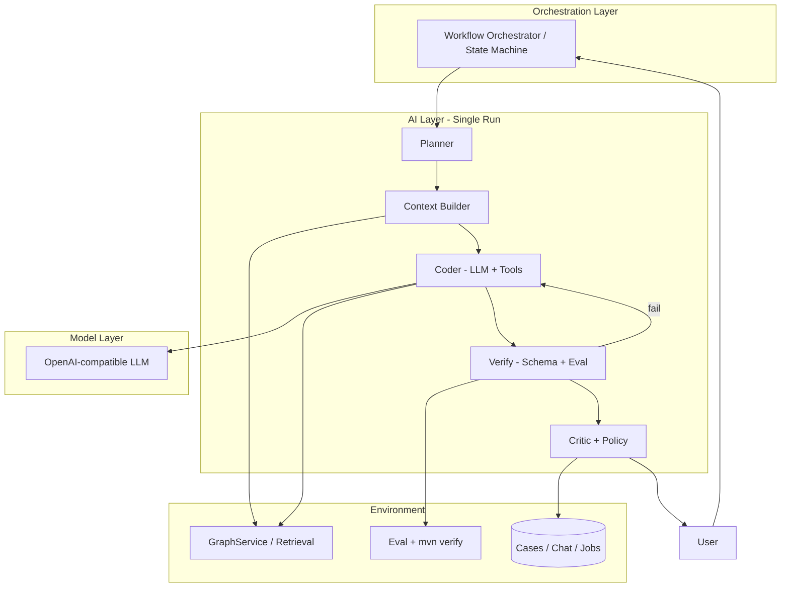

# MedExpertMatch: Harness Engineering Improvements Proposition

**Last updated:** 2026-05-31  
**Audience:** Engineering leads, LLM module owners, platform/ops  
**Status:** Strategic proposition — harness orchestration milestones archived; next: [human checkpoint and events plan](../.agents/plans/M31-harness-human-checkpoint-and-events.md)

---

## Executive summary

A reliable medical AI product is not “a better model” alone. It is **LLM + harness**: the infrastructure, loops, validation, tooling, memory, and orchestration that turn probabilistic outputs into repeatable clinical-adjacent workflows.

MedExpertMatch already has substantial harness investment (workflow services, specialized chat agents, GraphRAG tools, A2A/chat governance milestones). This document translates **harness engineering** patterns into a concrete improvement backlog for MedExpertMatch—distinct from **context engineering** (prompts, RAG, skills content).

**Core thesis:** Most production value and most lines of code should live in the harness. When the model fails, treat the trace as a **harness backlog item**, not as “the model was dumb.”

---

## 1. What harness engineering is (and why it beats model chasing)

### Definition

**Harness engineering** is the systematic design of wrappers around an LLM so it behaves as a dependable agent—not as smart autocomplete.

```
Coding / medical agent  ≈  LLM  +  Harness
```

In mature agent products, **90%+ of engineering effort** typically goes to:

| Harness responsibility | Examples in MedExpertMatch |
|------------------------|----------------------------|
| Task formulation | Workflow steps, `.st` prompts, skill routing (`ChatAgentProfile`) |
| Verification | `mvn verify`, eval datasets (planned), tool parameter sanitizers |
| Iteration loops | Tool call → retrieval → second LLM pass in matching workflows |
| State & memory | Chat sessions, `OrchestrationContextHolder`, job status enums |
| Environment integration | REST/A2A, Flyway, GraphService, CI scripts under `scripts/` |

The idea that “most of Claude Code is harness, not model” applies here: demo-quality medical matching comes from **architecture and process**, not from swapping the base model alone.

### Harness vs context engineering

| Question | Owner | MedExpertMatch examples |
|----------|--------|-------------------------|
| *What should the model know, and how do we pack it?* | **Context engineering** | GraphRAG retrieval, embeddings, `src/main/resources/skills/`, prompt `.st` files |
| *What process ensures a correct outcome step by step, even when the model errs?* | **Harness engineering** | Workflow services, tool guards, verify/fix loops, multi-agent routing |

Both are required. MedExpertMatch is relatively strong on context (RAG, skills, prompts) and should deliberately strengthen **process harness** next.

---

## 2. Three layers of AI architecture (mapped to MedExpertMatch)

Inspired by agentic architecture literature (e.g. Addy Osmani, Martin Fowler): three layers stack on top of the raw model.

### Layer 1 — Model layer

- OpenAI-compatible chat/completion APIs (project constraint: no Ollama).
- “Raw reasoning” with no business process attached.

### Layer 2 — AI layer (single session / single workflow run)

What happens around **one** user chat turn or **one** workflow invocation:

| Component | Purpose | Current / gap in MedExpertMatch |
|-----------|---------|----------------------------------|
| Rules & roles | System prompts, disclaimers, agent personas | `chat-agent-system.st`, `src/main/resources/agents/*.md` |
| Skills & tools | Callable capabilities | Split tool beans (`DoctorMatchingAgentTools`, etc.), `NormalizingToolCallbackResolver` |
| Hooks | Pre/post processing, guardrails | `LlmResponseSanitizer`, `MatchToolParameterSanitizer`, `AgentToolCaseIdValidator` |
| Sub-roles in one run | Planner / Coder / Critic modes | **Partial** — fixed pipelines in workflow impls; chat has profiles but not explicit critic pass |
| State | Plan, artefacts, step index | Chat DB; workflow session via context holder; **no persisted plan artefact per task** |

**Intuition:** Model = brain; AI layer = personality and habits; orchestration = software development process at scale.

### Layer 3 — Orchestration layer (multi-session / multi-agent)

- Multiple specialized agents, event-driven handoffs, sagas/state machines.
- MedExpertMatch: `MedicalAgentService` facade + per-domain workflow services; `ChatAgentProfile` for chat routing; A2A milestones for federation and governance.

**Gap:** Orchestration is largely **scripted pipelines** (see `docs/improvements-plan-agentic-patterns.md`) rather than dynamic state machines with explicit events (`PLAN_READY`, `TESTS_FAILED`, etc.).

---

## 3. Mindset: every LLM failure is a harness signal

When traces show recurring failures, convert them into harness work:

| Symptom | Harness response (generic) | MedExpertMatch-oriented response |
|---------|---------------------------|----------------------------------|
| Wrong tool name / malformed JSON args | Structured tool schema + normalizer | Extend `AgentToolNameNormalizer`, sanitizer tests |
| `caseId` confusion or hallucinated IDs | Validation + extraction | `CaseIdExtractor`, `ChatCasePromptSupport`, `AgentToolCaseIdValidator` |
| Match calls with bad graph parameters | Pre-flight sanitization | `MatchToolParameterSanitizer` |
| Answers not grounded in retrieval | Verification loop | Mandatory tool-before-answer step in workflow; eval scorer |
| PHI in logs | Policy hook | `LlmResponseSanitizer`, chat governance audit patterns |
| “Forgot” clinical disclaimer | Critic checklist | Post-generation compliance pass on medical prompts |

Maintain a **harness improvement backlog** alongside the product backlog—classified by failure type, not by “model version.”

---

## 4. Harness patterns and loops (detailed)

### 4.1 Iteration Loop — primary coding-style iteration

| Domain | Iteration loop analogue today | Proposed enhancement |

| **Repo development** (Cursor / CI) | Manual: agent runs `mvn verify` | Document iteration loop in `.agents/skills/testing`; optional CI job that posts structured failures back to agent context |

Implement iteration loop as a **state machine in code**, not as "engineer copies build log into chat."

Log each failed iteration:

- Task type, plan, patch/tool calls, commands, structured errors.
- Classify: import/contract misunderstanding, scope violation, flaky test, retrieval miss, policy breach.

For frequent classes, add harness elements (new critic rule, planner prerequisite, new tool).

**MedExpertMatch application**

- Structured workflow telemetry (no PHI): `MatchJobStatus` / analyse job enums + reason codes.
- Wire chat admin observability to **harness failure taxonomy**, not only HTTP 5xx.

### 4.6 Multi-agent workflow (orchestration layer)

Event-driven pipeline with orchestrator state:

```
TASK_CREATED → PLAN_READY → CONTEXT_BUILT → TOOLS_EXECUTED → 
VERIFY_FAILED | VERIFY_PASSED → NEEDS_HUMAN → DONE
```

Specialized sessions/agents:

| Agent role | MedExpertMatch mapping |
|------------|------------------------|
| Planner / Architect | Routing planner, case analyzer (plan steps) |
| Researcher / Context builder | Evidence scout + retrieval services |
| Implementation | Domain workflow impls (not code-gen today) |
| Tester | Eval module + `mvn verify` for dev harness |
| Refactor / cleanup | N/A for runtime; relevant for dev agents |
| User-facing | Chat assistant / A2A surface |

Orchestrator routes by state: no plan → planner; plan approved → tool execution; tools done → critic/eval.

### 4.7 Human-in-the-loop checkpoints

Mandatory human review when:

- Planner output changes clinical routing or match thresholds.
- Large tool chains or low confidence scores.
- Harness cannot classify error.
- Regulatory-sensitive outputs (disclaimers present but evidence weak).

Policies: auto-continue for low-risk read-only queries; require approval for match/routing commits affecting production case records.

---

## 5. Current MedExpertMatch harness baseline

### Strengths (already invested)

- **Workflow facade** — `MedicalAgentService` with dedicated workflow services per domain.
- **Specialized chat agents** — `ChatAgentProfile`, runtime skills under `src/main/resources/skills/`, agent descriptors under `src/main/resources/agents/`.
- **Tool hardening (in progress)** — Normalized tool names, parameter sanitization, case ID validation, split tool classes per agent domain.
- **Safety** — `LlmResponseSanitizer`, anonymized cases, OpenAPI/A2A governance milestones.
- **GraphRAG context** — Retrieval and graph tools wired into matching and analysis.
- **Development harness** — `.agents/skills/`, TDD rules in `AGENTS.md`, verification scripts in `scripts/`.

### Gaps (harness-oriented)

| Gap | Impact | Related docs / milestones |
|-----|--------|---------------------------|
| Fixed pipelines, limited dynamic tool routing | Cannot adapt steps to case complexity | `docs/improvements-plan-agentic-patterns.md` |
| No automated eval loop on prompt changes | Quality regressions undetected | Eval module proposal (same doc) |
| No explicit Planner/Critic artefacts in chat/workflows | Hard to debug “why this answer” | This proposition §4.2 |
| Iteration loop not formalized for agents | Errors require manual retry | §4.1 |
| Context bundling not a first-class agent step | Prompt bloat, inconsistent grounding | §4.3 |
| Harness failure taxonomy not unified | Ops sees errors, not improvement signals | Chat admin observability |

---

## 6. Prioritized improvement roadmap for MedExpertMatch

Ordered by leverage and fit with existing modules. Effort is indicative (engineering days, not calendar).

### Phase A — AI layer hardening (single session)

| # | Initiative | Description | Effort |
|---|------------|-------------|--------|
| A1 | **Structured verify step** | After tool execution, run JSON schema + business rules (min matches, required fields) before final LLM narrative | 3–5d |
| A2 | **Context Builder tool** | `buildCaseContextBundle` used by all workflows and chat profiles | 4–6d |
| A3 | **Explicit Critic pass** | Second LLM call or rule engine: disclaimer, PHI scan, evidence linkage | 2–4d |
| A4 | **Planner artefact** | Persist plan + acceptance criteria per chat/workflow session (DB or export bundle) | 3–5d |
| A5 | **Tool scope by profile** | Enforce allowed tools per `ChatAgentProfile` / A2A agent card | 2–3d |

### Phase B — Iteration Loop for quality

| D1 | **Iteration Loop in `.agents/skills/testing`** | Standard: patch → `mvn test` → structured error feedback | 1d doc + templates |
| D2 | **Planner/Coder/Critic for Cursor** | Milestone plans as Planner output; PR checklist as Critic | 2d doc |
| D3 | **Harness backlog template** | Link trace IDs to harness tickets | 0.5d |

---

## 7. Architecture sketch (target state)



---

## 8. Success metrics

| Metric | Target |
|--------|--------|
| Eval pass rate on `medical-eval-v1` | ≥ baseline + 5% after each prompt change |
| Tool call failure rate (malformed args) | Down 50% after sanitization/normalization |
| Mean steps to successful match workflow | Stable or down with explicit planner |
| PHI/policy violations in stored chat | Zero (detected pre-persist) |
| Time to diagnose bad answer | ↓ via plan + tool trace artefacts |

---

## 9. References and related repository docs

| Resource | Relevance |
|----------|-----------|
| `docs/improvements-plan-agentic-patterns.md` | Eval module, session memory, orchestration context |
| `.agents/plans/M08-agentic-patterns-improvements.md` | Completed agentic milestone |
| `.agents/plans/M13-ai-chat-tab-and-specialized-agents.md` | Chat profiles and specialized agents |
| `.agents/plans/M14-ai-chat-agent-routing.md` | `ChatAgentProfile` routing |
| `src/main/java/.../llm/AGENTS.md` | Module constraints and conventions |
| `AGENTS.md` (root) | TDD, module map, global boundaries |
| Harness pattern catalogs (external) | e.g. `harn` repos, Addy Osmani / Martin Fowler agentic posts |

---

## 10. Recommended next steps

**Implementation plan:** Harness engineering milestones through eval and chain UI are complete. Next: [Harness Production Readiness](../.agents/plans/M34-harness-production-readiness.md).

1. **Review Phase A** with LLM module owners.  
2. **Wire eval CI** — builds on existing `llm/evaluation/`.  
3. **Doctor-match state machine pilot** after verify/policy gate/bundle land.  
4. **Track harness backlog** using `.agents/templates/harness-backlog-item.md`.

---

*This proposition complements context/RAG work. Investment in harness process typically outperforms repeated model upgrades for reliability in regulated, tool-heavy domains like medical expert matching.*
