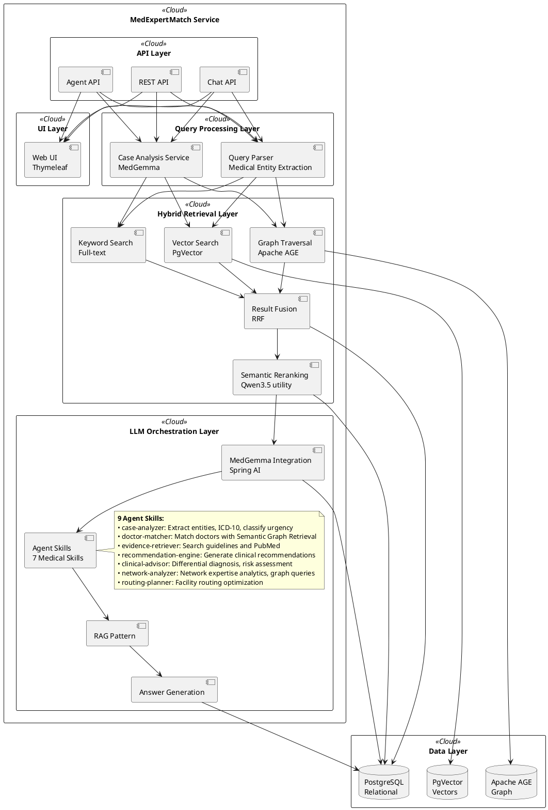
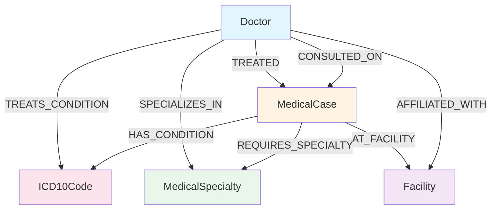

# MedExpertMatch Architecture

**Last Updated:** 2026-05-19  
**Version:** 1.4  
**Status:** MVP complete with agentic improvements and DocuRAG improvements (see [improvements-from-docu-rag](../improvements-from-docu-rag.md))

## Overview

MedExpertMatch uses a modular, domain-driven architecture designed for medical use cases. The system follows modern
software engineering principles with clear separation of concerns.

## High-Level Architecture



## Module Structure

MedExpertMatch uses a modular structure organized by domain:

### Core Modules

**core** - Shared infrastructure and utilities

- Configuration (`SpringAIConfig`, `MedicalAgentConfiguration`, `PromptTemplateConfig`)
- Exception handling (`MedExpertMatchException`, `RetrievalException`)
- Monitoring (`MedGemmaToolCallingMonitor`)
- Utilities (`IdGenerator`)
- SQL injection utilities (`InjectSql`, `SqlInjectBeanPostProcessor`)

**doctor** - Doctor/expert data management

- Domain: `Doctor`, `MedicalSpecialty`
- Repository: `DoctorRepository` with JDBC implementation
- Repository: `MedicalSpecialtyRepository` with JDBC implementation
    - Methods: `findById()`, `findByName()`, `findAll()`, `insert()`, `update()`, `deleteAll()`
- REST: `DoctorController` (web UI)

**medicalcase** - Medical case data management

- Domain: `MedicalCase`, `CaseType`, `UrgencyLevel`
- Repository: `MedicalCaseRepository` with JDBC implementation

**medicalcoding** - ICD-10 codes and medical coding

- Domain: `ICD10Code`
- Repository: `ICD10CodeRepository` with JDBC implementation
    - Methods: `findById()`, `findByCode()`, `findByCodes()`, `findByCategory()`, `findByParentCode()`, `findAll()`,
      `insert()`, `update()`, `deleteAll()`

**clinicalexperience** - Clinical experience data

- Domain: `ClinicalExperience`
- Repository: `ClinicalExperienceRepository` with JDBC implementation

**facility** - Medical facility data

- Domain: `Facility`

### Processing Modules

**caseanalysis** - Medical case analysis using MedGemma

- Domain: `CaseAnalysisResult`
- Service: `CaseAnalysisService` (uses MedGemma for case analysis)

**embedding** - Vector embedding generation and management

- Service: `EmbeddingService` (generates embeddings; uses `EmbeddingModel` or, when configured, `EmbeddingEndpointPool`)
- Optional **multi-endpoint pool** (`medexpertmatch.embedding.multi-endpoint`): multiple OpenAI-compatible embedding
  URLs with worker threads, batching, and temporary skip on failure
- Supports single and batch embedding generation

**retrieval** - Hybrid GraphRAG retrieval (vector + graph + keyword + reranking)

- Domain: `DoctorMatch`, `FacilityMatch`, `MatchOptions`, `RoutingOptions`, `ScoreResult`, `RouteScoreResult`,
  `PriorityScore`, `ConsultationMatch`, `MatchOutcome`, `DoctorOutcomeAffinity`, `MatchSignalBreakdown`
- Service: `MatchingService`, `SemanticGraphRetrievalService`, `RerankingService`, `MatchExplainabilityService`,
  `MatchOutcomeService`, `MatchOutcomeCalibrationService`
- **Scoring Components**:
    - Vector similarity (configurable weight) — pgvector cosine distance on case embeddings
    - Graph relationships (configurable weight) — Apache AGE graph traversal
    - Historical performance (configurable weight) — ClinicalExperience outcomes, ratings, success rates
    - **Reciprocal Rank Fusion** (configurable via `fusion-strategy`) — k=60, alternative to weighted average
- **Re-ranking**: Semantic re-ranking via `RerankingService` (disabled by default)

**llm** - LLM orchestration, Agent Skills integration, harness, session memory, durable memory, evaluation

- Configuration: `MedicalAgentConfiguration` (ChatClient with SkillsTool, AutoMemoryTools, SessionMemoryAdvisor)
- **9 agent tool classes**: `CaseAnalysisAgentTools` (5 tools), `ClinicalAdvisorAgentTools` (3), `DoctorMatchingAgentTools` (4),
  `EvidenceAgentTools` (3), `GraphAnalyticsAgentTools` (2), `RoutingAgentTools` (3), `ContextBuilderAgentTools` (1),
  `DateTimeAgentTools` (1), `AutoMemoryTools` (5) — **27 tools total**
- Agent infrastructure: `OrchestrationContextHolder` (ThreadLocal session ID propagation)
- Evaluation: `EvaluationService` (4-metric: exact match, normalized, semantic similarity, semantic pass), 7 eval families (adjudication, goal-classifier, policy-confidence, scoring-weight, tool-selection, context-summarizer, match-outcomes)
- Rest: `MedicalAgentController` (agent API), `EvaluationController`, A2A protocol controllers, harness controllers
- Architecture note: `llm` is an intentional orchestration-heavy module and is allowed to depend on multiple domain
  modules to coordinate end-to-end medical workflows.

**graph** - Graph relationship management using Apache AGE

- Service: `GraphService` (Cypher queries), `GraphQueryService`, `MedicalGraphBuilderService`
- Repository: `GraphRepository`
- Automatically builds graph after synthetic data generation

### Domain / Edge Modules

**chat** - Conversational chat agent orchestration and retention

- Domain: `Chat`, `ChatMessage`
- Repository: `ChatRepository`, `ChatMessageRepository`, `ChatGoalContextRepositoryImpl`
- Service: `ChatService`, `ChatAssistantService`, `ChatRetentionService`, `ChatExportService`, `ChatRateLimitService`
- REST: `ChatController` (REST API)

**evidence** - PubMed clinical evidence retrieval

- Domain: `PubMedArticle`
- Service: `PubMedService`
- REST: `EvidenceController`

**system** - System health indicators

- Health indicators: `AgeGraphHealthIndicator`, `EmbeddingPoolHealthIndicator`, `EvidenceHealthIndicator`,
  `GraphQualityHealthIndicator`, `PgVectorHealthIndicator`, `RerankingHealthIndicator`
- REST: `ComprehensiveHealthIndicator`

### Integration Modules

**ingestion** - Data ingestion (medical cases, doctor profiles, synthetic data generation)

- Adapters: FHIR R5 adapters (`FhirBundleAdapter`, `FhirPatientAdapter`, `FhirConditionAdapter`, `FhirEncounterAdapter`,
  `FhirObservationAdapter`)
- Service: `SyntheticDataGenerator`, `SyntheticDataBootstrapService`, `SyntheticDataPostProcessingService`,
  generators (Doctor, MedicalCase, Facility, ClinicalExperience, Embedding)
- Synthetic data tracking: `SyntheticDataGenerationRunRepository`, `EstimateAdjustmentService` (M77)
- REST: `SyntheticDataController`, `SyntheticDataAdminController`

**documents** - Document ingestion and search (PDF, JSONL, JSON, CSV)

- Repository: `SourceDocumentRepository` (JDBC CRUD with SHA-256 dedup)
- Domain: `SourceDocumentEntity`, `DocumentSearchResult`, `DocumentSearchFilters`
- Service: `DocumentIngestServiceImpl`, `DocumentCatalogServiceImpl`, `DocumentSearchServiceImpl`,
  `DocumentEmbeddingPipeline`, `EmbeddingBackfillScheduler`
- Extractors: `PdfTextExtractor` (PDFBox 3.0.7), `StructuredFileParser`, `ContentHasher`
- Allowed dependencies: core, embedding, chunking

**chunking** - Adaptive text chunking strategies

- Interface: `Chunker` (configurable size, overlap, min chars)
- Domain: `DocumentChunk`
- Strategies: `AdaptiveChunker` (meta-chunker), `SemanticChunker` (sentence-boundary), `RecursiveCharacterChunker`
- Factory: `ChunkerFactory` (strategy registry)
- Repository: `ChunkRepository` (JDBC CRUD)
- Allowed dependencies: core

**web** - Web UI with Thymeleaf SSR

- 16 page templates + 4 fragments (layout, header, footer, chat-sidebar)
- Controllers: `HomeController`, `MatchController`, `QueueController`, `AnalyticsController`, `CaseAnalysisController`,
  `RoutingController`, `DoctorController`, `ChatWebController`, `DocumentsWebController`, `SyntheticDataWebController`,
  `AdminDashboardWebController`, `GraphVisualizationWebController`, `ChatExportsWebController`,
  `HarnessChainsWebController`, `HarnessRunsWebController`, `SessionTokensWebController`
- Architecture note: `web` is a composition layer coordinating UI flows; it does not own core domain logic.

## Graph Structure



## Agent Skills

9 medical-specific Agent Skills:

1. **case-analyzer**: Analyze cases, extract entities, ICD-10 codes, classify urgency and complexity
2. **doctor-matcher**: Match doctors to cases, scoring and ranking using multiple signals
3. **evidence-retriever**: Search guidelines, PubMed, GRADE evidence summaries
4. **recommendation-engine**: Generate clinical recommendations, diagnostic workup, treatment options
5. **clinical-advisor**: Differential diagnosis, risk assessment
6. **network-analyzer**: Network expertise analytics, graph-based expert discovery, aggregate metrics
7. **routing-planner**: Facility routing optimization, multi-facility scoring, geographic routing
8. **clinical-guideline**: Search and retrieve condition-specific clinical guidelines
9. **triage**: Assess urgency and acuity, recommend care level (critical/urgent/routine)

### Agent Skills Architecture

Agent Skills are Markdown files stored in `src/main/resources/skills/{skill-name}/SKILL.md` that provide:

- Domain knowledge and instructions for the LLM
- Tool invocation guidance
- Output format specifications

Skills integrate with Java `@Tool` methods that execute:

- Database queries (via repositories)
- Service calls (SemanticGraphRetrievalService, GraphService, CaseAnalysisService)
- External API calls (PubMed, guidelines)

The `MedicalAgentService` orchestrates skills:

1. Receives requests via REST API
2. Selects appropriate skills based on intent
3. Invokes skills with context
4. Skills invoke Java tools
5. Tools call services/repositories
6. Results flow back through the chain

## Technology Stack

- **Backend**: Spring Boot 4.1.0, Java 21
- **Database**: PostgreSQL 17, PgVector 0.1.6 (client), Apache AGE 1.6.0
- **AI Framework**: Spring AI 2.0.0 GA
- **Session**: Spring AI Session JDBC 0.3.0 (conversation history compaction)
- **Medical AI**: MedGemma 1.5 4B, MedGemma 27B
- **Testing**: JUnit 5, Testcontainers 2.0.5, WireMock 3.9.2, Playwright 1.60.0

## UI Layer

### Thymeleaf Server-Side Rendering

The initial UI is implemented using Thymeleaf for server-side rendering:

- **Templates**: `src/main/resources/templates/*.html`
- **Fragments**: `src/main/resources/templates/fragments/*.html` (layout, header, footer)
- **Static Resources**: `src/main/resources/static/` (CSS, JavaScript, images)
- **Controllers**: Use `@Controller` annotation (not `@RestController`) for Thymeleaf views
- **Pattern**: Controllers return template names (e.g., `return "index"`) and use `Model` to pass data
- **Development**: Templates automatically reload with Spring Boot DevTools
- **Reference**: See `src/main/java/com/berdachuk/medexpertmatch/web/` controllers and `src/main/resources/templates/`
  for implementation patterns

### UI Pages

The system includes 16 main UI pages:

1. **Home Page** (`/`) - Dashboard with navigation and system overview
2. **Find Specialist** (`/match`) - Specialist matching interface (Use Cases 1 & 2)
3. **Consultation Queue** (`/queue`) - Queue prioritization and management (Use Case 3)
4. **Network Analytics** (`/analytics`) - Expertise network analysis (Use Case 4)
5. **Case Analysis** (`/analyze/{caseId}`) - AI-powered case analysis (Use Case 5)
6. **Regional Routing** (`/routing`) - Multi-facility routing (Use Case 6)
7. **AI Chat** (`/chat`) - Conversational AI agent (Expert match harness)
8. **Documents** (`/documents`) - Document search and catalog
9. **Doctor Profile** (`/doctors/{doctorId}`) - Doctor details and history
10. **Admin Dashboard** (`/admin`) - System overview and navigation
11. **Synthetic Data** (`/admin/synthetic-data`) - Data generation management
12. **Graph Visualization** (`/admin/graph-visualization`) - Apache AGE graph view
13. **Chat Exports** (`/admin/chat-exports`) - Chat transcript export
14. **Harness Chains** (`/admin/harness-chains`) - Agent workflow chain traces
15. **Harness Runs** (`/admin/harness-runs`) - Workflow run history
16. **Session Tokens** (`/admin/session-tokens`) - API session token management

**Role-based simulated security:** The header includes a user selector (Regular User, Administrator). Synthetic Data and
Graph Visualization menu items and pages are visible only when Administrator is selected (`?user=admin`). Non-admin
direct access to `/admin/synthetic-data` and `/admin/graph-visualization` redirects to home.
See [Simulated Security](#role-based-simulated-security) below.

**Wireframe Mockups**: All UI pages have detailed wireframe mockups using PlantUML Salt format.
See [UI Flows and Mockups](../UI_FLOWS_AND_MOCKUPS.md) for visual layouts, user flows, and UI/UX guidelines.

### Role-based Simulated Security

The UI uses simulated roles for demo and development (no real authentication):

- **User selector:** Header dropdown with sample users (Regular User, Administrator). Selection is stored in
  localStorage (`medexpertmatch-selected-user`) and synced with the URL (`?user=admin` for Administrator).
- **isAdmin:** `SimulatedUserControllerAdvice` adds `@ModelAttribute("isAdmin")` for all Thymeleaf views; `isAdmin` is
  true when request has `?user=admin`.
- **Admin-only menu:** Synthetic Data and Graph Visualization links render only when `isAdmin` is true.
- **Admin page access:** `SyntheticDataWebController` and `GraphVisualizationWebController` redirect to `/` when `user`
  is not `admin`.
- **Implementation:** `src/main/resources/static/js/main.js` (user list, getCurrentUser, setCurrentUser,
  initializeUserSelector), `src/main/resources/templates/fragments/header.html` (inline sync script, dropdown,
  conditional links), `core.config.SimulatedUserControllerAdvice`.

### Benefits

- Server-side rendering, no separate frontend build process
- Integrated with Spring Boot backend
- Fast development iteration with template hot-reload
- Consistent with backend architecture
- Visual wireframes guide implementation

## API Layer

### Agent API Endpoints

All agent endpoints follow a consistent pattern under `/api/v1/agent`:

`POST /api/v1/agent/match/{caseId}` - Specialist matching (case-analyzer, doctor-matcher)

- **Use Cases**: Use Case 1 (Specialist Matching), Use Case 2 (Second Opinion)
- **Skills**: case-analyzer, doctor-matcher
- **UI Page**: `/match`

`POST /api/v1/agent/prioritize-consults` - Queue prioritization (case-analyzer)

- **Use Case**: Use Case 3 (Queue Prioritization)
- **Skills**: case-analyzer
- **UI Page**: `/queue`

`POST /api/v1/agent/network-analytics` - Network analytics (network-analyzer)

- **Use Case**: Use Case 4 (Network Analytics)
- **Skills**: network-analyzer
- **UI Page**: `/analytics`

`POST /api/v1/agent/analyze-case/{caseId}` - Case analysis (case-analyzer, evidence-retriever, recommendation-engine)

- **Use Case**: Use Case 5 (Decision Support)
- **Skills**: case-analyzer, evidence-retriever, recommendation-engine
- **UI Page**: `/analyze/{caseId}`

`POST /api/v1/agent/recommendations/{matchId}` - Expert recommendations (doctor-matcher)

- **Use Case**: Use Case 5 (Decision Support)
- **Skills**: doctor-matcher
- **UI Page**: `/analyze/{caseId}`

`POST /api/v1/agent/route-case/{caseId}` - Regional routing (case-analyzer, routing-planner)

- **Use Case**: Use Case 6 (Regional Routing)
- **Skills**: case-analyzer, routing-planner, clinical-guideline, triage
- **UI Page**: `/routing`

**Reference**: See [use-cases.md](../use-cases.md) for detailed sequence diagrams and workflows for each endpoint.

### Schema-Guided Reasoning (SGR)

**Schema-Guided Reasoning** (SGR) is a pattern for structuring LLM outputs using Pydantic schemas to constrain and guide
generation. MedExpertMatch may use Semantic Graph Retrieval patterns if they improve results.

### Schema-Guided Reasoning Patterns

Based on [Schema-Guided Reasoning patterns](https://abdullin.com/schema-guided-reasoning/patterns), the following
patterns may be applied:

#### 1. Cascade Pattern

Enforces predefined reasoning steps. For example, in case analysis:

1. First summarize case details
2. Then extract ICD-10 codes and urgency
3. Finally recommend specialty requirements

#### 2. Routing Pattern

Forces LLM to explicitly choose a reasoning path. For example, in triage:

- Choose between "critical", "urgent", "routine" paths
- Each path has specific required details

#### 3. Cycle Pattern

Forces repetition of reasoning steps. For example, in risk assessment:

- Generate multiple risk factors (2-4 factors)
- Each factor with explanation and severity

### Implementation Considerations

- **When to Use**: Schema-Guided Reasoning patterns may be used if they improve LLM output quality, consistency, or
  structure
- **Integration**: Can be integrated with Spring AI's structured output capabilities
- **Evaluation**: Patterns will be evaluated against baseline performance to determine if they provide improvements
- **Reference**: See [Semantic Graph Retrieval Patterns](https://abdullin.com/schema-guided-reasoning/patterns) for
  detailed examples

## Agent Orchestration Flow

```
User Request -> REST API Endpoint -> MedicalAgentService
    |
    v
ChatClient (FunctionGemma) + SkillsTool + AutoMemoryTools
    |
    v
SessionMemoryAdvisor (compacts after 15 turns, max 30 events)
    |
    v
Agent selects skill(s) based on intent
    |
    v
Skill instructions loaded from src/main/resources/skills/{skill}/SKILL.md
    |
    v
Agent invokes Java @Tool methods (MedicalAgentTools, AutoMemoryTools)
    |
    v
Tools call services/repositories
    |
    v
Results flow back -> Agent formats response -> REST API returns JSON
```

**Session Memory**: `SessionMemoryAdvisor` configured on `medicalAgentChatClient` compacts conversation history when turn count exceeds 15, keeping at most 30 events via `SlidingWindowCompactionStrategy`. Events persist in `AI_SESSION_EVENT` table.

**AutoMemory**: `AutoMemoryTools` enables the LLM to self-curate durable facts across sessions via `automemory_append`, `automemory_read`, and `automemory_index`. Facts persist as Markdown files under `${user.home}/.medexpertmatch/automemory/`.

**OrchestrationContextHolder**: ThreadLocal context holder propagates session IDs to `@Tool` methods independently of `LogStreamService`, enabling `SessionMemoryAdvisor` and `AutoMemoryTools` to associate actions with sessions.

## Architecture Highlights

- **Infrastructure**: Modern database, vector search, graph traversal, and LLM integration
- **Domain Models**: Medical-specific entities (Doctor, MedicalCase, ClinicalExperience, ICD10Code, MedicalSpecialty,
  Facility)
- **Services**: Retrieval, fusion, reranking with medical-specific logic (MatchingService,
  SemanticGraphRetrievalService, GraphService, MedicalGraphBuilderService, CaseAnalysisService, EmbeddingService)
- **Repositories**: Efficient data access patterns with batch loading and vector embedding support
- **Agent Skills**: 9 medical-specific skills and 9 separate tool classes (27 tools total) for modular knowledge management
- **Session Memory**: `SessionMemoryAdvisor` with JDBC persistence compacts conversation history after 15 turns (sliding window, max 30 events)
- **AutoMemory**: Cross-session durable memory via `AutoMemoryTools` (filesystem-backed Markdown, survives DB resets)
- **OrchestrationContextHolder**: ThreadLocal session ID propagation decoupled from logging infrastructure
- **Evaluation Module**: 4-metric LLM output quality measurement with JDBC persistence, dataset seeding from classpath `.jsonl`, CLI mode (`@Profile("eval-cli")`), semantic similarity via EmbeddingService
- **Hybrid Retrieval**: Vector + Graph + Historical with configurable weighted average or RRF fusion (k=60)
- **Re-ranking**: Semantic re-ranking via `RerankingService` (disabled by default, uses existing `rerankingChatModel`)
- **Document Ingestion**: New `documents/` module (PDF, JSONL, JSON, CSV parsing with SHA-256 dedup) and `chunking/` module (ADAPTIVE, SEMANTIC, RECURSIVE_CHARACTER strategies)
- **Broswer Auto-Launch**: `LocalHomeBrowserLauncher` auto-opens browser on `local` profile startup
- **Vector Embeddings**: Automatic embedding generation for medical cases using Spring AI EmbeddingModel
- **PgVector Integration**: PostgreSQL pgvector extension with HNSW indexing for fast similarity search
- **FHIR Compatibility**: Supports healthcare interoperability standards (FHIR R5)
- **UI Layer**: Thymeleaf-based server-side rendering with 8 main pages and wireframe mockups
- **Use Cases**: Supports 6 core use cases covering inpatient, outpatient, telehealth, analytics, decision support, and
  regional routing
- **Schema-Guided Reasoning**: May use Semantic Graph Retrieval patterns (Cascade, Routing, Cycle) if they improve LLM
  output quality
- **Privacy-First**: HIPAA-compliant data handling, anonymized patient data, local deployment capability

## Related Documentation

- [03-design.md](03-design.md) — Schema, domain records, service/repository APIs, implementation patterns
- [use-cases.md](../use-cases.md) — Detailed use case workflows with sequence diagrams
- [01-requirements.md](01-requirements.md) — Complete product requirements and specifications
- [UI Flows and Mockups](../UI_FLOWS_AND_MOCKUPS.md) — User interface wireframes, flows, and UI/UX guidelines
- [Vision](../VISION.md) — Project vision and long-term goals

---

*Last updated: 2026-05-19*
