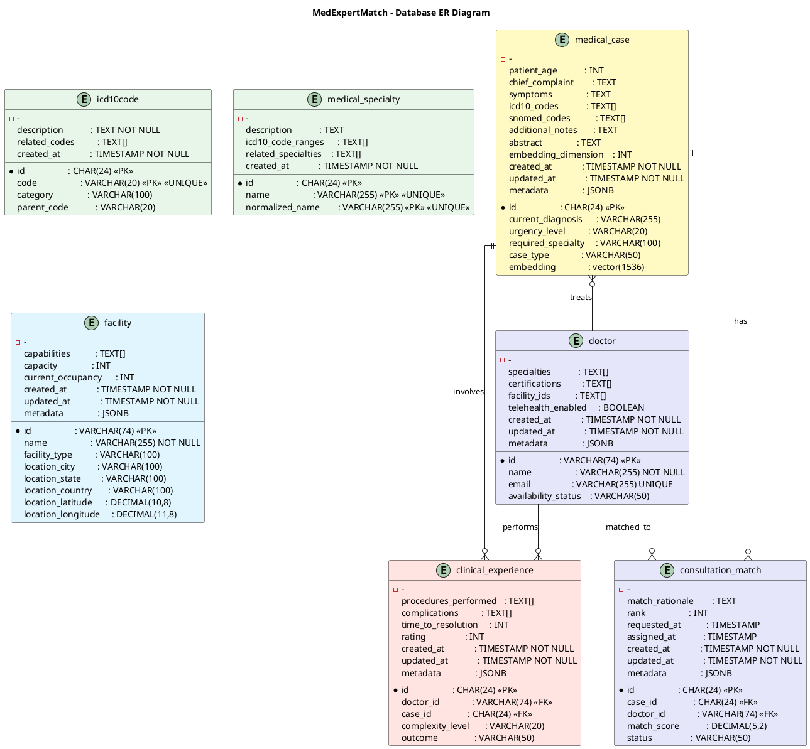

# MedExpertMatch Design (SDD)

**Last Updated:** 2026-06-16
**Version:** 1.0
**Status:** Extracted from 02-architecture.md + DEVELOPMENT_GUIDE.md

## Data Model

### Core Entities

**Doctor** — Specialist profile

- External system ID (VARCHAR 74), name, email, specialties array (TEXT[]), certifications (TEXT[]), facility IDs (TEXT[]), telehealth enabled, availability status

**MedicalCase** — Anonymized patient case

- Internal ID (CHAR 24), patient age, chief complaint, symptoms, current diagnosis, ICD-10 codes (TEXT[]), SNOMED codes (TEXT[]), urgency level, required specialty, case type, abstract text, GPS coordinates, 1536-dim vector embedding

**ClinicalExperience** — Doctor-case outcome record

- Internal ID (CHAR 24), doctor ID → case ID link, procedures performed, complexity level, outcome, complications, time to resolution, rating

**Facility** — Hospital/clinic

- External system ID, name, type, location (city/state/country/GPS), capabilities (TEXT[]), capacity, current occupancy

**ICD10Code** — Diagnostic code reference

- Internal ID, code, description, category, parent code (hierarchical), related codes (TEXT[])

**MedicalSpecialty** — Specialty taxonomy

- Internal ID, name, ICD-10 code ranges (TEXT[]), related specialties (TEXT[])

**Procedure** — Medical procedure reference

- Internal ID, code, name, category

### Edge / Integration Entities

| Entity | Module | Purpose |
|--------|--------|---------|
| ConsultationMatch | retrieval | Match result with score, ranking, rationale, status |
| MatchOutcome | retrieval | Labeled outcome for flywheel calibration |
| DoctorOutcomeAffinity | retrieval | Weighted affinity per doctor per outcome label |
| MatchSignalBreakdown | retrieval | Per-signal score breakdown (vector/graph/historical) |
| PubMedArticle | evidence | External clinical evidence record |
| Chat, ChatMessage | chat | Conversational session persistence |
| SourceDocumentEntity | documents | Ingested document with SHA-256 content hash |
| DocumentChunk | chunking | Text chunk with embedding and strategy metadata |
| DocumentSearchResult | documents | Search result wrapper |
| CaseAnalysisResult | caseanalysis | LLM analysis output |
| ApiSessionToken | core | API authentication token |
| AuditLog | core | PHI-safe access audit trail |
| SyntheticDataGenerationRun | ingestion | Run tracking with timings (M77) |
| Evaluation entities | llm | Dataset/case/run/result records |
| Harness entities | llm | Workflow runs, chain events, plans, adjudication logs |

## Database ER Diagram



**Database Schema Description:**

The database schema has grown from the original 9 core tables to 29 tables covering domain entities, chat, evaluation, harness, documents, ingestion tracking, and audit. Key tables include:

- **doctors** (external system IDs: VARCHAR(74)): Primary entity for doctor/expert information. Supports UUID strings,
  19-digit numeric strings, or other external system formats. Includes medical specialties (TEXT[] array), board
  certifications (TEXT[] array), facility IDs (TEXT[] array), telehealth enabled flag, and availability status. Indexed
  on email, specialties (GIN), telehealth_enabled, and availability_status.

- **medical_cases** (internal IDs: CHAR(24)): Patient medical case with vector embeddings for semantic similarity
  search. Includes patient age, chief complaint, symptoms, diagnosis, ICD-10 codes (TEXT[] array, NOT foreign keys),
  SNOMED codes (TEXT[] array), urgency level, required specialty (TEXT, NOT foreign key), case type, abstract for
  semantic search, and 1536-dimensional vector embedding for PgVector similarity search. Maintains strict HIPAA
  compliance with anonymized patient data. Indexed on urgency_level, case_type, required_specialty, icd10_codes (GIN),
  and embedding (HNSW).

- **clinical_experiences** (internal IDs: CHAR(24)): Junction table tracking doctor-case associations with outcomes,
  procedures performed, complexity levels, ratings, and time to resolution. Links to doctors via doctor_id (VARCHAR(74)
  external ID) and medical_cases via case_id (CHAR(24) internal ID). Foreign keys with CASCADE delete. Used for
  historical performance scoring in Semantic Graph Retrieval.

- **icd10_codes** (internal IDs: CHAR(24)): Reference table for ICD-10 medical codes with hierarchical structure. No
  foreign key relationships - parent_code and related_codes are stored as TEXT fields (not FKs). Used as standalone
  reference data for diagnostic classification and graph relationships only. Indexed on code, category, and parent_code.

- **medical_specialties** (internal IDs: CHAR(24)): Reference table for medical specialties with ICD-10 code ranges. No
  foreign key relationships - icd10_code_ranges and related_specialties are stored as TEXT arrays (not FKs). Used as
  standalone reference data only. Specialties stored as TEXT in medical_cases.required_specialty.

- **facilities** (external system IDs: VARCHAR(74)): Medical facility/hospital information. Supports UUID strings,
  19-digit numeric strings, or other external system formats. Includes name, facility_type, location (city, state,
  country, GPS coordinates), capabilities (TEXT[] array), capacity, and current occupancy. Indexed on name,
  facility_type, location_city, and capabilities (GIN). Used for graph relationships only - facility IDs stored as
  TEXT[] array in doctors table.

- **consultation_matches** (internal IDs: CHAR(24)): Stores consultation matching results. Links to medical_cases via
  case_id (CHAR(24) internal ID) and doctors via doctor_id (VARCHAR(74) external ID). Includes match score (0-100),
  ranking, match rationale, timestamps, and status (PENDING, ACCEPTED, REJECTED, COMPLETED). Foreign keys with CASCADE
  delete.

## Service Layer

### Core Services

**MatchingService**: Core matching logic combining multiple signals (vector, graph, historical data)

- Matches doctors to medical cases
- Matches facilities for regional routing
- Orchestrates matching logic across multiple services

**SemanticGraphRetrievalService**: Semantic Graph Retrieval scoring combining embeddings, graph relationships, and
historical performance

- Scores doctor-case matches using multiple signals:
    - Vector similarity (40% weight) - Uses pgvector cosine distance to compare case embeddings
    - Graph relationships (30% weight) - Apache AGE graph traversal
    - Historical performance (30% weight) - Clinical experience outcomes
- Scores facility-case routing matches
- Computes priority scores for consultation queues

**EmbeddingService**: Vector embedding generation and management

- Generates embeddings using Spring AI `EmbeddingModel`
- Supports single and batch embedding generation
- Normalizes embeddings to 1536 dimensions (MedGemma/OpenAI standard)
- Formats embeddings for PostgreSQL pgvector storage

**GraphService**: Apache AGE graph queries for relationship traversal and analytics

- Executes Cypher queries on Apache AGE graph

**MedicalGraphBuilderService**: Populates Apache AGE graph with vertices and edges

- Creates vertices from database entities (doctors, cases, ICD-10 codes, specialties, facilities)
- Creates relationships in batches (TREATED, SPECIALIZES_IN, HAS_CONDITION, etc.)
- Automatically called after synthetic data generation
- Uses MERGE operations for idempotency (safe to re-run)
- Queries top experts for conditions
- Queries candidate facilities for routing
- Queries doctor-case relationships

**CaseAnalysisService**: MedGemma-powered case analysis and entity extraction

- Uses dedicated `caseAnalysisChatClient` (always uses MedGemma)
- Analyzes medical cases
- Extracts entities, ICD-10 codes
- Classifies urgency and complexity

**MedicalAgentService**: LLM orchestration with Agent Skills integration

- Uses `toolCallingChatModel` (FunctionGemma) for tool invocations
- Orchestrates agent skills and Java tools
- Handles agent API requests

**FHIR Adapters**: Convert FHIR Bundles to internal `MedicalCase` entities

- `FhirBundleAdapter`: Convert FHIR Bundle → MedicalCase
- `FhirPatientAdapter`: Extract patient data (anonymized)
- `FhirConditionAdapter`: Extract conditions, ICD-10 codes
- `FhirEncounterAdapter`: Extract encounter data
- `FhirObservationAdapter`: Extract observation data

**TestDataGenerator**: Synthetic test data generation

- Generates doctors, medical cases, and clinical experiences
- Generates medical case descriptions using LLM (separate step before embeddings)
- Automatically generates vector embeddings for medical cases (uses stored descriptions)
- Progress logging and error handling for description and embedding generation
- Supports multiple data sizes (tiny, small, medium, large, huge)

### Service Responsibilities

#### SemanticGraphRetrievalService (Semantic Graph Retrieval)

**Responsibilities:**

- Score doctor-case matches using multiple signals
- Score facility-case routing matches
- Compute priority scores for consultation queues
- Combines vector similarity, graph relationships, and historical performance

**Note:** SGR has two meanings in this context:

1. **Semantic Graph Retrieval** (this service) - Combines vector embeddings, graph relationships, and historical
   performance
2. **Schema-Guided Reasoning (SGR)** - A pattern for structuring LLM outputs using schemas (see [02-architecture.md](02-architecture.md#schema-guided-reasoning-sgr))

#### GraphService

- Execute Cypher queries on Apache AGE graph
- Check if graph exists
- Handle errors gracefully (returns empty results if graph unavailable)

#### MedicalGraphBuilderService

- Build complete graph from database data
- Create vertices (doctors, medical cases, ICD-10 codes, specialties, facilities)
- Create relationships in batches (1000 per batch for performance)
- Create graph indexes for query performance (GIN indexes on properties JSONB columns)
- Automatically called by `SyntheticDataGenerator` after data generation completes
- Uses MERGE operations for idempotency (safe to rebuild graph)
- Query top experts for conditions
- Query candidate facilities for routing
- Query doctor-case relationships

#### MatchingService

- Orchestrate matching logic across multiple services
- Match doctors to medical cases
- Match facilities for regional routing

#### FHIR Adapters

- `FhirBundleAdapter`: Convert FHIR Bundle → MedicalCase
- `FhirPatientAdapter`: Extract patient data (anonymized)
- `FhirConditionAdapter`: Extract conditions, ICD-10 codes
- `FhirEncounterAdapter`: Extract encounter data

## Apache AGE Cypher Query Patterns

All graph operations must go through the `GraphService` interface.

### Using GraphService

```java
@Autowired
private GraphService graphService;

Map<String, Object> params = new HashMap<>();
params.put("doctorId", "123");
params.put("name", "Dr. Smith");
params.put("email", "dr.smith@example.com");

List<Map<String, Object>> results = graphService.executeCypher(
        "MERGE (d:Doctor {id: $doctorId, name: $name, email: $email})",
        params
);
```

### MERGE Clause — Critical Pattern

**CRITICAL**: When using `MERGE` with embedded parameters, include ALL properties in the MERGE clause itself.

✅ **Valid Pattern:**

```java
String cypher = "MERGE (d:Doctor {id: $doctorId, name: $name, email: $email})";
```

❌ **Invalid Pattern (will fail with BadSqlGrammarException):**

```java
// This pattern fails when parameters are embedded as strings
String cypher = "MERGE (d:Doctor {id: $doctorId}) SET d.name = $name, d.email = $email";
```

**Reason**: Apache AGE 1.6.0's parser does not properly handle `MERGE ... SET` pattern when parameters are embedded as
strings. While `MERGE ... SET` works with literal values in test files, it fails when using the parameter embedding
mechanism.

### Vertex Creation Examples

**Single Property:**

```java
String cypher = "MERGE (s:MedicalSpecialty {id: $specialtyId, name: $name})";
Map<String, Object> params = new HashMap<>();
params.put("specialtyId", specialtyId);
params.put("name", name);
graphService.executeCypher(cypher, params);
```

**Multiple Properties:**

```java
String cypher = "MERGE (d:Doctor {id: $doctorId, name: $name, email: $email})";
Map<String, Object> params = new HashMap<>();
params.put("doctorId", doctorId);
params.put("name", name != null ? name : "");
params.put("email", email != null ? email : "");
graphService.executeCypher(cypher, params);
```

**Complex Vertex:**

```java
String cypher = """
        MERGE (c:MedicalCase {
            id: $caseId,
            chiefComplaint: $chiefComplaint,
            urgencyLevel: $urgencyLevel
        })
        """;
```

### Relationship Creation Examples

**Simple Relationship:**

```java
String cypher = """
        MATCH (d:Doctor {id: $doctorId})
        MATCH (c:MedicalCase {id: $caseId})
        MERGE (d)-[:TREATED]->(c)
        """;
Map<String, Object> params = new HashMap<>();
params.put("doctorId", doctorId);
params.put("caseId", caseId);
graphService.executeCypher(cypher, params);
```

**Relationship with Properties:**

```java
String cypher = """
        MATCH (d:Doctor {id: $doctorId})
        MATCH (c:MedicalCase {id: $caseId})
        MERGE (d)-[r:TREATED {created: $created, outcome: $outcome}]->(c)
        """;
```

### Parameter Handling

- **Null Values**: Always provide default values for nullable parameters
  ```java
  params.put("name", name != null ? name : "");
  ```

- **String Escaping**: Parameters are automatically escaped by `GraphService`
    - Single quotes are escaped: `'` → `\'`
    - Backslashes are escaped: `\` → `\\`
    - Newlines/tabs are escaped: `\n`, `\t`

- **Parameter Map**: Always use `Map<String, Object>` for parameters
  ```java
  Map<String, Object> params = new HashMap<>();
  ```

### Query Format Guidelines

**Single-Line Queries** (preferred for simple operations):

```java
String cypher = "MERGE (d:Doctor {id: $doctorId, name: $name, email: $email})";
```

**Multi-Line Queries** (for complex queries with MATCH clauses):

```java
String cypher = """
        MATCH (d:Doctor {id: $doctorId})
        MATCH (c:MedicalCase {id: $caseId})
        MERGE (d)-[:TREATED]->(c)
        """;
```

### Error Handling

The `GraphService` handles errors gracefully:

- **Graph Not Exists**: Automatically creates graph if it doesn't exist (handles `3F000` SQL state)
- **Transaction Aborted**: Returns empty results when transaction is aborted (`25P02` SQL state)
- **Apache AGE Compatibility**: Catches `BadSqlGrammarException` and returns empty results
- **Logging**: All failures are logged with WARN level, including the query string

### Implementation Details

- **Service Location**: `com.berdachuk.medexpertmatch.graph.service.impl.GraphServiceImpl`
- **Graph Name**: Uses constant `GRAPH_NAME = "medexpertmatch"` (configurable via `medexpertmatch.graph.name` property)
- **Connection Handling**: Automatically executes `LOAD 'age'` on each connection
- **Dollar-Quoted Strings**: Uses PostgreSQL dollar-quoted strings (`$$`) to safely embed Cypher queries
- **Function Call**: Executes `ag_catalog.cypher(graph_name, query_string)` function

### Best Practices

1. **Always Use GraphService**: Never execute Cypher queries directly via JDBC
2. **Idempotent Operations**: Use `MERGE` for all vertex/edge creation
3. **Null Handling**: Always provide default values for nullable parameters
4. **Error Recovery**: Graph operations gracefully degrade - failures return empty results
5. **Testing**: Test graph operations with real Apache AGE in Testcontainers

## Implementation Patterns

### ID Normalization Pattern

Case IDs are normalized to lowercase for case-insensitive lookups:

- `MedicalCaseRepository`: Normalizes case IDs in `insert()`, `findById()`, and batch operations
- `ClinicalExperienceRepository`: Normalizes case IDs in `insert()` and `update()` for foreign key references
- Prevents foreign key constraint violations and ensures consistent data storage

### Graph Query Pattern

Apache AGE queries use parameter embedding:

- Parameters embedded directly in Cypher query string using `$paramName` syntax
- `GraphServiceImpl.embedParameters()` handles null values, string escaping, number formatting
- MERGE operations include all properties in MERGE clause (not SET after MERGE)
- Transaction isolation: `REQUIRES_NEW` propagation prevents graph failures from rolling back parent transactions

### Batch Loading Pattern

Repositories provide batch loading methods to prevent N+1 queries:

- `ClinicalExperienceRepository.findByDoctorIds()`: Returns `Map<String, List<ClinicalExperience>>`
- `ClinicalExperienceRepository.findByCaseIds()`: Returns `Map<String, List<ClinicalExperience>>`
- Service layer orchestrates batch loading before mapping to entities

### Prompt Template Pattern

LLM prompts stored in external `.st` (StringTemplate) files:

- Templates in `src/main/resources/prompts/`
- `PromptTemplateConfig` defines `@Bean` methods with `@Qualifier` annotations
- Services inject `PromptTemplate` via constructor with `@Qualifier`

### Array-Based References Pattern

Uses TEXT[] arrays instead of foreign keys for reference relationships (ICD-10 codes, specialties, facilities).

**Design Rationale:**

This read-heavy medical matching system uses TEXT[] arrays (with GIN indexes) instead of foreign key constraints for the
following reasons:

**Performance Advantages:**

- **Fast read queries**: GIN indexes optimize array containment queries (e.g., `icd10_codes @> ARRAY['I21.9']`)
- **No JOIN overhead**: Direct array lookups without junction table joins
- **Low write overhead**: No FK constraint checking on INSERT/UPDATE
- **Compact storage**: One row per entity, no junction tables required

**Simplicity Benefits:**

- **Simple application code**: No junction table management required
- **Flexible**: Can reference codes/specialties from any source without constraint validation
- **Clear data model**: Arrays provide intuitive multi-value semantics (one doctor can have multiple specialties)

**Data Validation Strategy:**

- **Validation at ingestion**: Reference data validated during synthetic data generation or FHIR import
- **Idempotent operations**: GIN array operations are safe for concurrent writes
- **Application-level integrity**: Business logic ensures code/specialty existence

**Trade-offs:**

- No database-enforced referential integrity
- No automatic CASCADE delete (manual cleanup required)
- Application must handle validation of reference existence

**When This Pattern is Appropriate:**

- Read-heavy workloads with frequent containment queries
- Reference data is relatively static (ICD-10 codes, specialties)
- Performance is critical over strict referential integrity
- Graph layer (Apache AGE) handles semantic relationships

**Alternative Considered:**

Foreign keys with junction tables would provide referential integrity and CASCADE delete, but would require JOIN
operations through junction tables for common queries, increasing storage overhead and query complexity. For this
medical matching use case, the TEXT[] array approach provides better read performance with acceptable data integrity
trade-offs.

## Code Quality Standards

### Comment Style

- **Maximum 3 lines**: Code comments must not exceed 3 lines
- **Concise**: Comments explain "why" not "what"
- **JavaDoc**: Class-level JavaDoc should be concise (max 3 lines for description)

### Design Principles

- **Interface-Based Design**: All services and repositories use interfaces
- **Repository Pattern**: Single entity focus, batch loading for related data
- **Service Layer**: Business logic orchestration, transaction management
- **Domain-Driven Design**: Clear domain boundaries, ubiquitous language

## Related Documentation

- [02-architecture.md](02-architecture.md) — System context, Modulith modules, stack, design decisions
- [01-requirements.md](01-requirements.md) — Source of truth: what to build
- [04-testing.md](04-testing.md) — Test plan
- [05-deployment.md](05-deployment.md) — Ops guide

---

*Last updated: 2026-06-16*
