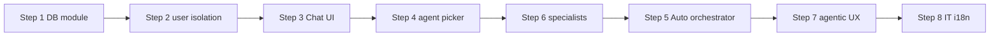

# M13: AI Chat Tab, Per-User Sessions & Specialized Agents

M08 delivered agentic foundations (session memory, skills, TodoWrite, AskUserQuestion). The web UI still exposes **workflow pages** (match, analyze, queue, routing, analytics) with SSE **execution traces**, but **no conversational chat surface**.

M13 adds a dedicated **AI Chat** navbar tab with multi-session history, per-user isolation, an **agent picker** beside the message input, and a default **Auto** orchestrator that routes to narrow specialist agents using TaskTool + TodoWrite patterns (M08 Step 6).

**Reference implementation:** `aist-expertmatch` (`C:\Users\Siarhei_Berdachuk\projects-epm-esp\aist-expertmatch`) — PostgreSQL-backed chat sessions, sidebar session list, conversation history, header-based user context, REST + optional SSE. Gaps there (no agent picker, no Auto router in UI) are explicit goals for M13.

## Scope

| # | Deliverable | Branch | Status | Effort |
|---|---|---|---|---|
| 1 | Chat domain module (DB + repos + services) | `feat/chat-domain-module` | ✅ Done | 4h |
| 2 | Per-user session isolation | `feat/chat-user-isolation` | ✅ Done | 2h |
| 3 | AI Chat tab (Thymeleaf + sidebar UX) | `feat/chat-ui-tab` | ✅ Done | 4h |
| 4 | Agent picker in message input | `feat/chat-agent-picker` | ✅ Done | 2h |
| 5 | Auto orchestrator agent | `feat/chat-auto-orchestrator` | ✅ Done | 4h |
| 6 | Narrow specialist agents (6) | `feat/chat-specialist-agents` | ✅ Done | 4h |
| 7 | Wire AskUserQuestion + TodoWrite + SSE trace | `feat/chat-agentic-ux` | ✅ Done | 3h |
| 8 | Integration tests + i18n (EN/RU) | `feat/chat-it-i18n` | ✅ Done | 2h |

**Phase A + M14 complete: ~25h**

> **Next milestone:** `plans/M15-a2a-streaming-hardening.md`

---

## Requirements (from product)

1. **Separate AI Chat tab** in the main navbar (`/chat`), distinct from workflow pages (match, analyze, etc.).
2. **Chat history sidebar** — list previous conversations; user can **select** or **delete** a conversation (default conversation protected, mirroring aist-expertmatch).
3. **Each conversation has its own message history** — persisted in PostgreSQL, ordered by sequence number; reload on session switch.
4. **Per-user isolation** — chats and messages scoped to the authenticated/simulated user; other users must not see or access them (ownership checks on every API call).
5. **Agent picker** to the **left of the message input** — user selects a specialized AI agent with defined skills before sending.
6. **Default agent: Auto** — universal orchestrator that:
   - Answers directly when possible.
   - **Delegates** to specialist agents when the question exceeds its scope (TaskTool / M08 Step 6).
   - Builds an **optimal plan** and decomposes it into tasks using TodoWrite and agentic best practices.
7. **Six narrow specialist agents** — derived from existing modules/skills (see below); each handles a small, well-defined task set.

---

## Reference: aist-expertmatch patterns to reuse

| Pattern | Reference path | Adapt for MedExpertMatch |
|---|---|---|
| Chat sidebar fragment | `templates/fragments/chat-sidebar.html` | New `fragments/chat-sidebar.html` + `static/js/chat.js` |
| Chat CRUD REST | `chat/rest/ChatController.java` | New `chat/` module: `/api/v1/chats` |
| Message persistence | `conversation_history` table + `ConversationHistoryRepository` | Flyway V3 migration + external `.sql` |
| Per-user context | `HeaderBasedUserContext` (`X-User-Id`) | Extend `SimulatedUserControllerAdvice` / `main.js` to send user id on chat API calls |
| Token-aware history | `ConversationHistoryManager` | Reuse Spring AI `SessionMemoryAdvisor` **per chatId** + optional summarization |
| New chat / delete | `POST /chats/new`, `DELETE /api/v1/chats/{id}` | Same REST contract |
| Auto-rename chat | First message renames session | Copy behavior from `WebController.processQuery()` |
| SSE streaming (API) | `QueryStreamController` | Optional Phase 2: stream assistant tokens + tool steps |

**Not copied as-is:** aist-expertmatch has no agent picker and no default Auto router in the UI — those are M13-specific.

---

## Current MedExpertMatch assets to reuse

| Asset | Location | M13 usage |
|---|---|---|
| Navbar + layout | `templates/fragments/header.html`, `layout.html` | Add **AI Chat** nav item |
| Simulated users | `static/js/main.js`, `SimulatedUserControllerAdvice` | Scope chats by `user.id` |
| Agent client | `MedicalAgentConfiguration`, `medicalAgentChatClient` | Backend for chat turns |
| Runtime skills (9) | `src/main/resources/skills/*/SKILL.md` | Map specialist agents → skill subsets |
| Session memory | `SessionMemoryAdvisor`, `AI_SESSION` table | Bind `sessionId = {userId}-{chatId}`; populate `user_id` |
| AskUserQuestion | `AgentQuestionController`, `AgentQuestionService` | Inline clarification in chat UI |
| TodoWrite | `AgentTodoController`, `AgentTodoTrackingService` | Show plan steps in chat panel |
| Execution trace | `LogStreamController` SSE | Collapsible trace under assistant messages |
| Job WebSocket | `/topic/jobs/{jobId}` | Long-running agent tasks in chat |

---

## Step 1: Chat domain module

**Goal:** Persist conversations and messages outside in-memory job stores.

**Flyway V3 (`V3__chat_sessions.sql`):**

```sql
-- medexpertmatch.chat (or public.chat per V2 convention)
-- id CHAR(24), user_id VARCHAR(255), name, agent_id VARCHAR(50) DEFAULT 'auto',
-- is_default BOOLEAN, message_count, last_activity_at, created_at, metadata JSONB

-- medexpertmatch.chat_message
-- id, chat_id FK CASCADE, role (user|assistant|system), content TEXT,
-- sequence_number, tokens_used, metadata JSONB
-- UNIQUE (chat_id, sequence_number)
```

**Module:** `chat/` (Spring Modulith) — `Chat`, `ChatMessage` records; `ChatRepository`, `ChatMessageRepository`; `ChatService` (create, list by user, delete, rename, append message, paginated history).

**Verification:** `ChatServiceIT`, `ChatRepositoryIT`

---

## Step 2: Per-user session isolation

**Goal:** Enforce ownership on every chat operation.

**Changes:**
- `UserContext` interface + `SimulatedUserContext` (reads user id from header `X-User-Id` or session attribute; fallback blocked in prod).
- All `ChatService` / REST methods: `chat.userId == currentUserId()` or 403.
- Partial unique index: one default chat per user.
- Session id for Spring AI memory: `{userId}-{chatId}` passed via `OrchestrationContextHolder` + `SESSION_ID_CONTEXT_KEY`.
- Wire `AI_SESSION.user_id` when creating JDBC sessions.

**Verification:** `ChatOwnershipIT` — user A cannot read/delete user B's chat.

---

## Step 3: AI Chat tab (UI)

**Goal:** Dedicated conversational page with session sidebar.

**Changes:**
- `ChatWebController` — `GET /chat?chatId=` renders `templates/chat.html`.
- Navbar link in `header.html` (`currentPage=chat`, i18n keys `nav.chat`).
- Layout (Bootstrap 5, match existing theme):
  - **Left:** session sidebar (New Chat, list, delete ×).
  - **Center:** scrollable message bubbles (user / assistant), markdown rendering (reuse marked.js pattern from other pages).
  - **Bottom:** message input row (agent picker + textarea + Send).
  - **Optional:** collapsible execution trace (SSE `sessionId` = chat session id).
- `static/js/chat.js` — REST calls: `GET/POST/DELETE /api/v1/chats`, `GET /api/v1/chats/{id}/history`, `POST /api/v1/chats/{id}/messages`.

**Verification:** `ChatWebControllerIT` (MockMvc — page loads, sidebar lists sessions).

---

## Step 4: Agent picker in message input

**Goal:** User selects which agent handles the next turn(s).

**UI:**
- Dropdown **left of** textarea; options:

| Value | Label (EN) | Label (RU) |
|---|---|---|
| `auto` | Auto | Авто |
| `triage-intake` | Triage & Intake | Тriage и приём |
| `case-analyzer` | Case Analyzer | Анализ случая |
| `evidence-scout` | Evidence Scout | Поиск доказательств |
| `specialist-matcher` | Specialist Matcher | Подбор специалиста |
| `routing-planner` | Routing Planner | Маршрутизация |
| `network-analyst` | Network Analyst | Сеть экспертов |

- Selected `agent_id` stored on `chat` row (sticky per conversation); changeable mid-chat with confirmation.
- i18n: `chat.agent.auto`, `chat.agent.triage-intake`, etc.

**Verification:** `ChatAgentPickerTest` (unit — picker values map to backend enum).

---

## Step 5: Auto orchestrator agent

**Goal:** Default agent that plans, delegates, and synthesizes answers.

**Behavior:**
1. On user message with `agent_id=auto`:
   - Classify intent (lightweight prompt or keyword + optional LLM routing — pattern from aist-expertmatch `QueryClassificationService`).
   - If single-domain: delegate to matching specialist subagent (TaskTool, M08 Step 6).
   - If multi-domain: **TodoWrite** plan → execute steps via TaskTool → merge results into one assistant reply.
2. System prompt emphasizes: no PHI in memory/logs; cite evidence when clinical; escalate to AskUserQuestion when intake fields missing.
3. Persist `agent_id=auto` on chat; store delegation metadata in message `metadata` JSONB (which subagents invoked).

**Depends on:** M08 Step 6 (`TaskTool` + `src/main/resources/agents/`). Can ship Step 3–4 UI first with Auto calling existing workflow services, then upgrade to TaskTool.

**Verification:** `AutoOrchestratorRoutingTest` — multi-step question produces TodoWrite plan and invokes ≥2 subagents.

---

## Step 6: Narrow specialist agents

**Goal:** Six focused agents, each with minimal tool/skill surface (principle of least privilege).

Define under `src/main/resources/agents/` (Markdown + YAML frontmatter) **and** register in agent picker:

| Agent ID | Narrow scope | Skills / tools | Existing module |
|---|---|---|---|
| `triage-intake` | Urgency, missing fields, case type | `triage`, AskUserQuestion | `medicalcase`, M08 Step 5 |
| `case-analyzer` | Entity extraction, ICD-10 hints, complexity | `case-analyzer`, `clinical-advisor` | `caseanalysis`, `medicalcoding` |
| `evidence-scout` | PubMed, guidelines, GRADE summaries | `evidence-retriever`, `clinical-guideline` | `evidence` |
| `specialist-matcher` | Doctor ranking for a case | `doctor-matcher`, `recommendation-engine` | `retrieval`, `graph` |
| `routing-planner` | Facility / geographic routing | `routing-planner` | `facility`, routing workflow |
| `network-analyst` | Expertise network metrics | `network-analyzer` | `graph`, analytics workflow |

Each agent:
- Own system prompt (external `.st` file).
- Restricted `tools:` list in frontmatter (no Task nesting).
- Optional per-agent `model:` (fast model for triage; MedGemma for clinical).

**Verification:** `SpecialistAgentScopeTest` — each agent exposes only expected tools/skills.

---

## Step 7: Agentic UX wiring

**Goal:** Surface M08 patterns inside the chat UI.

| Feature | Integration |
|---|---|
| Clarifying questions | Poll `GET /api/v1/agent/questions/pending?sessionId={userId}-{chatId}`; render inline; POST answer |
| Plan tracking | Poll `GET /api/v1/agent/todos/latest`; show step list above input |
| Execution trace | SSE `/api/v1/logs/stream?sessionId=...` per message turn |
| Long jobs | WebSocket `/topic/jobs/{jobId}` or existing async job poll |

**Verification:** `ChatAgenticUxIT` — AskUserQuestion unblock flow in chat context.

---

## Step 8: Integration tests & i18n

- `ChatWebControllerIT`, `ChatControllerIT`, `ChatOwnershipIT`, `ChatAgenticUxIT`
- Messages: `messages.properties`, `messages_ru.properties` — nav, agent labels, empty state, delete confirm
- WCAG: keyboard send (Enter), focus management on new message

**Verification:** `mvn verify -Dtest="*Chat*"`

---

## Execution order



Steps 1–4 deliver a usable chat with manual agent selection. Steps 5–6 add Auto routing and TaskTool subagents (aligns with M08 Step 6). Step 7 connects AskUserQuestion/TodoWrite/SSE.

---

## Relationship to M08

| M08 step | M13 dependency |
|---|---|
| Step 5 AskUserQuestion | Step 7 — clarification in chat |
| Step 4 TodoWrite | Step 5 Auto + Step 7 plan UI |
| Step 6 TaskTool subagents | Step 5 Auto + Step 6 specialists |
| Step 7 A2A | Future — external clients call same specialist agents |

**Recommendation:** Complete M08 Step 6 (TaskTool) in parallel with M13 Steps 5–6, or implement M13 Steps 1–4 first for early UI value.

---

## Compliance (AGENTS.md)

- No PHI in chat logs, SSE streams, or AutoMemory; anonymize case text in UI where possible.
- Per-user isolation is mandatory before any production auth rollout.
- `ShellTools` remains disabled for all chat agents.
- OpenAI-compatible providers only.

## References

- aist-expertmatch: `docs/CONVERSATION_HISTORY_MANAGEMENT.md`, `docs/API_ENDPOINTS.md`
- MedExpertMatch: `web/AGENTS.md`, `llm/AGENTS.md`, `plans/M08-agentic-patterns-improvements.md`
